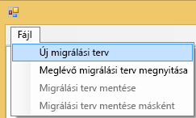
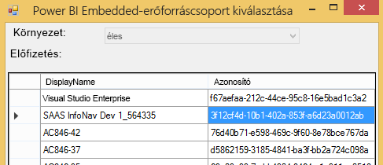
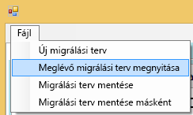
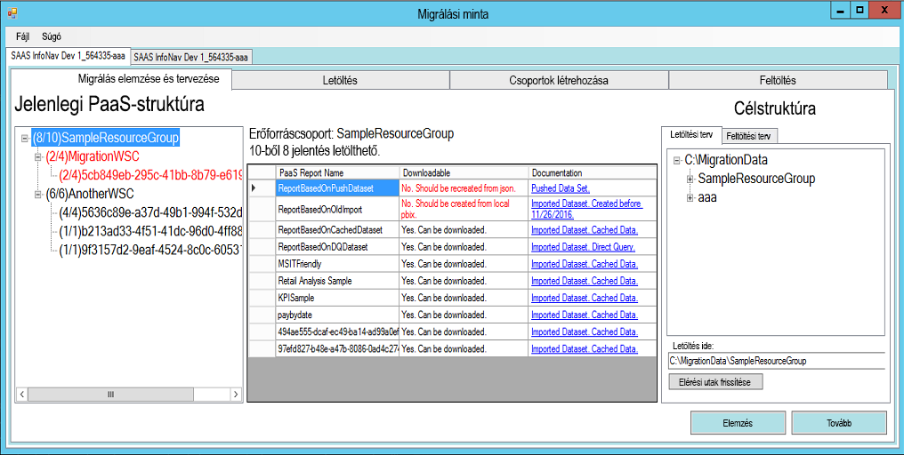
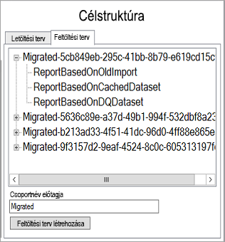
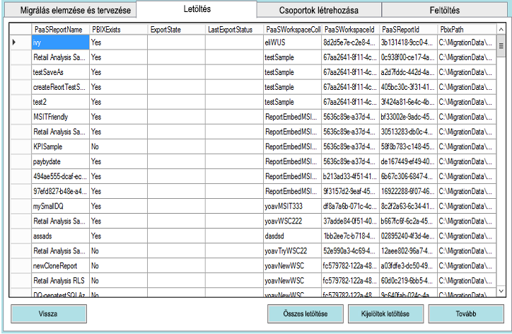
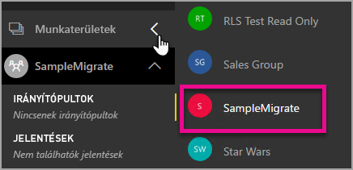
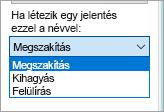
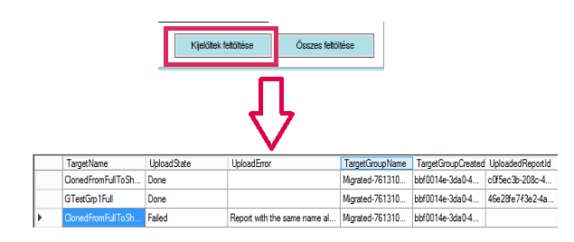

# <a name="power-bi-embedded-migration-tool"></a>Power BI Embedded migrálási eszköz

Ezzel a migrálási eszközzel jelentések másolhatók a Power BI Embedded Azure-szolgáltatásból (PaaS) a Power BI szolgáltatásba (SaaS).

A tartalmak migrálása a munkaterület-csoportokból a Power BI szolgáltatásba az aktuális megoldással párhuzamosan végezhető, így nem okoz állásidőt.

## <a name="limitations"></a>Korlátozások

* A leküldéses adatkészletek nem tölthetőek le, így újra létre kell őket hozni a Power BI szolgáltatásban a Power BI REST API-k használatával.
* A 2016. november 26. előtt importált PBIX-fájlok nem lesznek letölthetők.

## <a name="download"></a>Letöltés

A mintául szolgáló migrálási eszköz a [GitHubról](https://github.com/Microsoft/powerbi-migration-sample) tölthető le. Letöltheti az adattár tömörített ZIP-fájlját, vagy helyben klónozhatja. A letöltést követően a *powerbi-migration-sample.sln* a Visual Studióban nyitható meg a migrálási eszköz összeállításához és futtatásához.

## <a name="migration-plans"></a>Migrálási tervek

A migrálási terv lényegében csak metaadatokat tartalmaz, amelyek katalogizálják a Power BI Embeddedben lévő tartalmakat, valamint a Power BI szolgáltatásban való közzétételükre vonatkozó beállításokat.

### <a name="start-with-a-new-migration-plan"></a>Kezdés egy új migrálási tervvel

A migrálási terv a Power BI Embeddedben elérhető és onnan a Power BI szolgáltatásba átemelni kívánt tartalmak metaadataiból áll. A rendszer a migrálási tervet XML-fájlként tárolja.

Első lépésként érdemes létrehoznia egy új migrálási tervet. Új migrálási tervet a következő módon hozhat létre:

1. Válassza a **Fájl** > **Új migrálási terv** lehetőséget.

    

2. A **Power BI Embedded-erőforráscsoport kiválasztása** párbeszédpanelen a Környezet legördülő menüben érdemes kiválasztani az éles környezetet.

3. A rendszer felszólítja, hogy jelentkezzen be. A bejelentkezéshez az Azure-előfizetését kell használnia.

   > [!IMPORTANT]
   > Ez **nem** az Office 365 azon szervezeti fiókja, amellyel a Power BI-ba jelentkezik be.

4. Válassza azt az Azure-előfizetést, amely a Power BI Embedded-munkaterületcsoportokat tárolja.

    
5. Az előfizetések listája alatt válassza ki a munkaterület-csoportokat tartalmazó **Erőforráscsoportot**, majd a **Kiválasztás** lehetőséget.

    

6. Kattintson az **Elemzés** gombra. Ez megjeleníti az Azure-előfizetésében lévő elemek listáját, amelyből kiindulva nekiláthat a tervezésnek.

    

   > [!NOTE]
   > Az elemzési folyamat néhány percig is eltarthat a munkaterület-csoportok számától és az egyes csoportokban lévő tartalmak mennyiségétől függően.

7. Az **Elemzés** befejeztével a rendszer megkéri, hogy mentse el a migrálási tervet.

Ezen a ponton a migrálási terv már össze lett kapcsolva az Azure-előfizetéssel. A migrálási terv használatának folyamatával kapcsolatban olvassa át a lentebbi fejezeteket, amelyek a migrálás elemzésével és tervezésével, a letöltéssel, a csoportok létrehozásával és a feltöltéssel foglalkoznak.

### <a name="save-your-migration-plan"></a>A migrálási terv mentése

A migrálási terv elmenthető, hogy később is használni tudja. Ekkor a rendszer létrehoz egy XML-fájlt, amely a migrálási tervvel kapcsolatos összes információt tartalmazza.

A migrálási terv mentéséhez tegye a következőket.

1. Válassza a **Fájl** > **Migrálási terv mentése** lehetőséget.

    

2. Nevezze el a fájlt vagy használja az automatikusan létrehozott nevet, és kattintson a **Mentés** gombra.

### <a name="open-an-existing-migration-plan"></a>Meglévő migrálási terv megnyitása

A mentett migrálási terveket megnyithatja, és folytathatja a migrálás kidolgozását.

Meglévő migrálási terv megnyitásához tegye a következőket.

1. Válassza a **Fájl** > **Meglévő migrálási terv megnyitása** lehetőséget.

    

2. Válassza ki a migrálási fájlt, és kattintson a **Megnyitás** gombra.

## <a name="step-1-analyze--plan-migration"></a>1\. lépés: Migrálás elemzése és tervezése

A **Migrálás elemzése és tervezése** lapon áttekintheti az Azure-előfizetés erőforráscsoportjának aktuális tartalmát.



Példaként tekintsük meg a *SampleResourceGroup* erőforráscsoportot.

### <a name="paas-topology"></a>PaaS-topológia

Ez az *Erőforráscsoport > Munkaterület-csoport > Munkaterületek* listája. Az erőforráscsoport és a munkaterület-csoportok a rövid neveikkel jelennek meg. A munkaterületeknél egy GUID látható.

A lista elemeihez egy szín és egy (#/#) formátumú szám is tartozik. Ez a letölthető jelentések számát adja meg.
A fekete szín azt jelzi, hogy mindegyik jelentés letölthető.

A piros szín azt jelzi, hogy egyes jelentések nem tölthetőek le. A bal oldali szám a letölthető jelentések teljes számát adja meg. A jobb oldali szám a csoportban lévő jelentések teljes számát adja meg.

A PaaS-topológia valamely elemének kiválasztásával a jelentések megjelennek a Jelentések szakaszban.

### <a name="reports"></a>Jelentések

A Jelentések szakasz az elérhető jelentéseket sorolja fel, és jelzi, hogy melyik letölthető és melyik nem.


### <a name="target-structure"></a>Célstruktúra

A **Célstruktúrában** adhatja meg, hogy az eszköz hová töltse le és hogyan töltse fel az elemeket.

#### <a name="download-plan"></a>Letöltési terv

A rendszer automatikusan létrehozza az elérési útvonalat. Ezt igény szerint módosíthatja. Amennyiben módosítja az útvonalat, mindenképp kattintson az **Elérési útvonalak frissítése** gombra.

> [!NOTE]
> Ez nem hajtja végre automatikusan a letöltést, csupán a jelentések letöltési helyének struktúráját határozza meg.

#### <a name="upload-plan"></a>Feltöltési terv

Itt adhatja meg a Power BI szolgáltatásban létrehozandó munkaterületekhez használt előtagot. Az előtagot a munkaterület korábban az Azure-ban használt GUID azonosítója követi majd.



> [!NOTE]
> Ez nem hozza ténylegesen létre a csoportokat a Power BI szolgáltatásban, csupán a csoportok elnevezési struktúráját adja meg.

Amennyiben módosítja az előtagot, mindenképp válassza ki a **Feltöltési terv létrehozása** lehetőséget.

Amennyiben szeretné, jobb gombbal az egyes csoportokra kattintva közvetlenül a Feltöltési tervben is átnevezheti a csoportokat.


> [!NOTE]
> A *csoportok* neve nem tartalmazhat szóközt és érvénytelen karaktereket.

## <a name="step-2-download"></a>2\. lépés: Letöltés

A **Letöltés** lapon a jelentések listája és a társított metaadatok láthatók. Az exportálás állapota is látható az exportálás előző állapotával egyetemben.



Itt két lehetősége van.

* Jelöljön ki egyes jelentéseket, és kattintson a **Kijelöltek letöltése** gombra.
* Kattintson **Az összes letöltése** gombra.


Sikeres letöltés esetén a *Kész* állapot látható, amely azt jelzi, hogy a PBIX-fájl létezik.

A letöltés befejeztével lépjen a **Csoportok létrehozása** lapra.

## <a name="step-3-create-groups"></a>3\. lépés: Csoportok létrehozása

Miután letöltötte az elérhető jelentéseket, átléphet a **Csoportok létrehozása** lapra. Ez a lap hozza létre a munkaterületeket a Power BI szolgáltatásban az összeállított migrálási terv alapján. A munkaterületek a **Migrálás elemzése és tervezése** szakasz **Feltöltés** lapján megadott név alatt jönnek létre.


A munkaterületek létrehozásához kattintson a **Kijelölt csoportok létrehozása** vagy **Az összes hiányzó csoport létrehozása** gombra.

Bármelyik gombra kattint is, a rendszer megkéri majd, hogy jelentkezzen be. *Abban a Power BI szolgáltatásban lévő fiókját kell használnia, amelyikben a munkaterületeket létre kívánja hozni.*


Ez létrehozza a munkaterületet a Power BI szolgáltatásban, de nem tölti fel a jelentéseket a munkaterületbe.

A munkaterület létrejöttének ellenőrzéséhez jelentkezzen be a Power BI-ba, és bizonyosodjon meg róla, hogy a munkaterület létezik. Láthatja majd, hogy a munkaterület üres.



A munkaterület létrehozását követően továbbléphet a **Feltöltés** lapra.

## <a name="step-4-upload"></a>4\. lépés: Feltöltés

A **Feltöltés** lapon töltheti fel a jelentéseket a Power BI szolgáltatásba. Itt a Letöltés lapon letöltött jelentések listája látható, valamint a célcsoport neve a migrálási tervnek megfelelően.


Feltöltheti csak a kijelölt jelentéseket, vagy az összes jelentést. A feltöltési állapotot is alaphelyzetbe állíthatja az elemek ismételt feltöltéséhez.

Emellett azt is kiválaszthatja, mi a teendő abban az esetben, ha létezik egy jelentés ugyanazzal a névvel. A **Megszakítás**, a **Mellőzés** és a **Felülírás** lehetőségek közül választhat.





### <a name="duplicate-report-names"></a>Ismétlődő jelentésnevek

Ha már létezik egy jelentés ugyanazzal a névvel, de tudja, hogy az egy másik jelentés, meg kell változtatnia a jelentés **TargetName** értékét. A nevet a migrálási terv XML-fájljának manuális szerkesztésével módosíthatja.

A módosítás végrehajtásához be kell zárnia a migrálási eszközt, majd újra meg kell nyitnia az eszközt és az áttelepítési tervet.

A fenti példában az egyik klónozott jelentés nem jelezte, hogy létezik egy jelentés ugyanazon a néven. Ha megtekintjük a migrálási terv XML-fájlját, a következőt fogjuk látni.

```xml
<ReportMigrationData>
    <PaaSWorkspaceCollectionName>SampleWorkspaceCollection</PaaSWorkspaceCollectionName>
    <PaaSWorkspaceId>4c04147b-d8fc-478b-8dcb-bcf687149823</PaaSWorkspaceId>
    <PaaSReportId>525a8328-b8cc-4f0d-b2cb-c3a9b4ba2efe</PaaSReportId>
    <PaaSReportLastImportTime>1/3/2017 2:10:19 PM</PaaSReportLastImportTime>
    <PaaSReportName>cloned</PaaSReportName>
    <IsPushDataset>false</IsPushDataset>
    <IsBoundToOldDataset>false</IsBoundToOldDataset>
    <PbixPath>C:\MigrationData\SampleResourceGroup\SampleWorkspaceCollection\4c04147b-d8fc-478b-8dcb-bcf687149823\cloned-525a8328-b8cc-4f0d-b2cb-c3a9b4ba2efe.pbix</PbixPath>
    <ExportState>Done</ExportState>
    <LastExportStatus>OK</LastExportStatus>
    <SaaSTargetGroupName>SampleMigrate</SaaSTargetGroupName>
    <SaaSTargetGroupId>6da6f072-0135-4e6c-bc92-0886d8aeb79d</SaaSTargetGroupId>
    <SaaSTargetReportName>cloned</SaaSTargetReportName>
    <SaaSImportState>Failed</SaaSImportState>
    <SaaSImportError>Report with the same name already exists</SaaSImportError>
</ReportMigrationData>
```

A hibás elemnél megváltoztathatjuk a SaaSTargetReportName nevét.

```xml
<SaaSTargetReportName>cloned2</SaaSTargetReportName>
```

Ezután újra megnyithatjuk a tervet a migrálási eszközben, és feltölthetjük a meghiúsult jelentést.

A Power BI-ba visszatérve láthatjuk, hogy a jelentések és az adathalmazok fel lettek töltve a munkaterületre.


<a name="upload-local-file"></a>

### <a name="upload-a-local-pbix-file"></a>Helyi PBIX-fájl feltöltése

Feltöltheti egy Power BI Desktop-fájl helyi verzióját is. Ehhez be kell zárnia az eszközt, szerkesztenie kell az XML-fájlt, és be kell illesztenie a helyi PBIX-fájl teljes elérési útját a **PbixPath** tulajdonságba.

```xml
<PbixPath>[Full Path to PBIX file]</PbixPath>
```

Az XML-fájl szerkesztése után nyissa meg újra a tervet a migrálási eszközben, és töltse fel a jelentést.

<a name="directquery-reports"></a>

### <a name="directquery-reports"></a>DirectQuery-jelentések

Frissítenie kell ahhoz, hogy a rendszer frissítse a DirectQuery-jelentések kapcsolati sztringjét. Ezt megteheti a *powerbi.com* webhelyen, vagy lekérdezheti a kapcsolati sztringet programozott módon a Power BI Embeddedből (PaaS). Egy vonatkozó példáért lásd: [DirectQuery kapcsolati sztring kinyerése PaaS-jelentésből](migrate-code-snippets.md#extract-directquery-connection-string-from-paas-report).

Ezután frissítheti az adatkészlet kapcsolati sztringjét a Power BI szolgáltatásban (SaaS), és beállíthatja az adatforrás hitelesítő adatait. Tekintse meg a következő példákat, hogy lássa, hogyan teheti ezt meg.

* [DirectQuery kapcsolati sztring frissítése az SaaS-munkaterületen](migrate-code-snippets.md#update-directquery-connection-string-is-saas-workspace)
* [DirectQuery hitelesítő adatok beállítása az SaaS-munkaterületen](migrate-code-snippets.md#set-directquery-credentials-in-saas-workspace)

## <a name="embedding"></a>Beágyazás

Most, hogy migrálta a jelentéseket a Power BI Embedded Azure-szolgáltatásból a Power BI szolgáltatásba, frissítheti az alkalmazást, és elkezdheti beágyazni a jelentéseket a munkaterületbe.

További információkért lásd: [Power BI Embedded-munkaterületcsoport tartalmainak migrálása a Power BI-ba](migrate-from-powerbi-embedded.md).

## <a name="next-steps"></a>Következő lépések

[Beágyazás a Power BI szolgáltatással](embedding.md)  
[Power BI Embedded-munkaterületcsoport tartalmainak migrálása a Power BI-ba](migrate-from-powerbi-embedded.md)  
[Power BI Premium – pontosan mi is ez?](../../admin/service-premium-what-is.md)  
[JavaScript API Git-adattár](https://github.com/Microsoft/PowerBI-JavaScript)  
[Power BI C# Git-adattár](https://github.com/Microsoft/PowerBI-CSharp)  
[JavaScript beágyazási minta](https://microsoft.github.io/PowerBI-JavaScript/demo/)  
[Power BI Premium-tanulmány](https://aka.ms/pbipremiumwhitepaper)  

További kérdései vannak? [Kérdezze meg a Power BI közösségét](https://community.powerbi.com/)