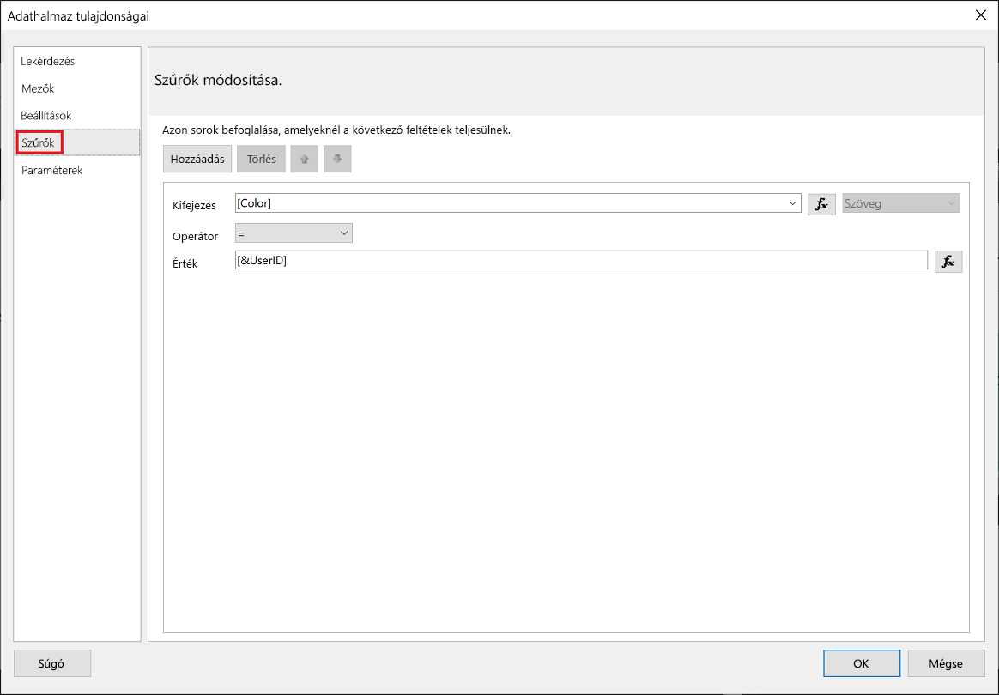
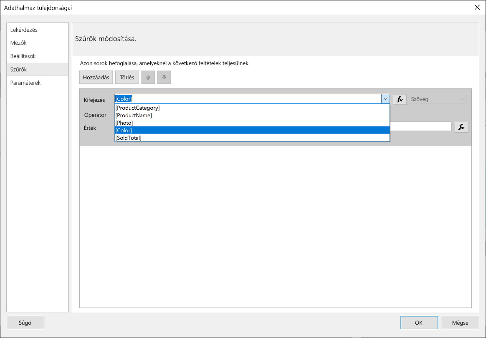
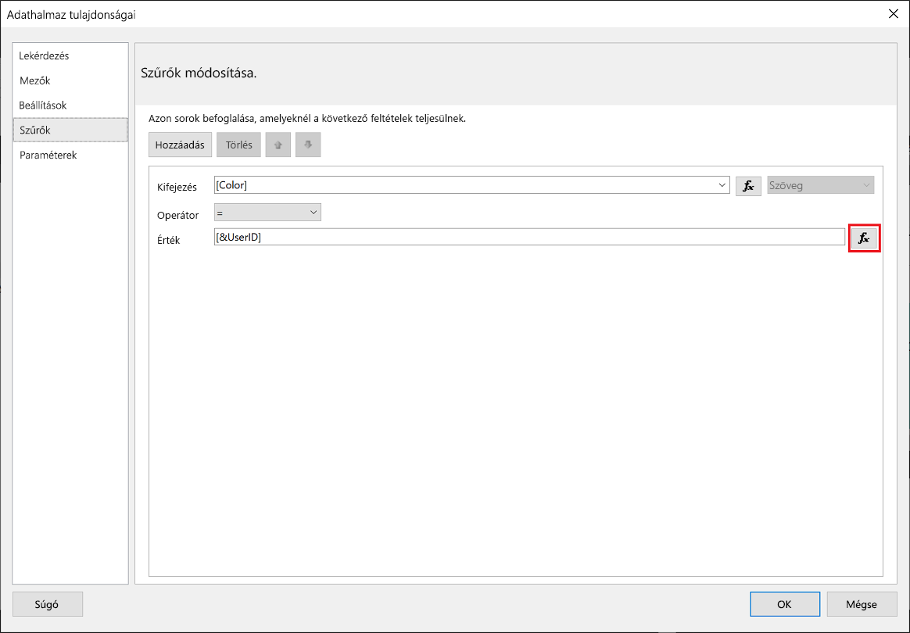
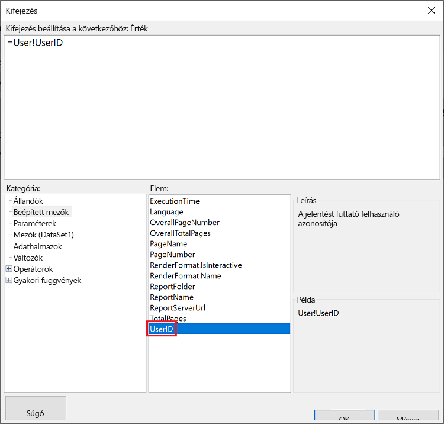
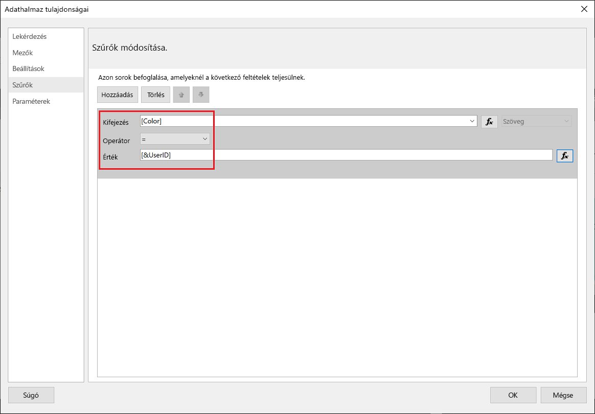
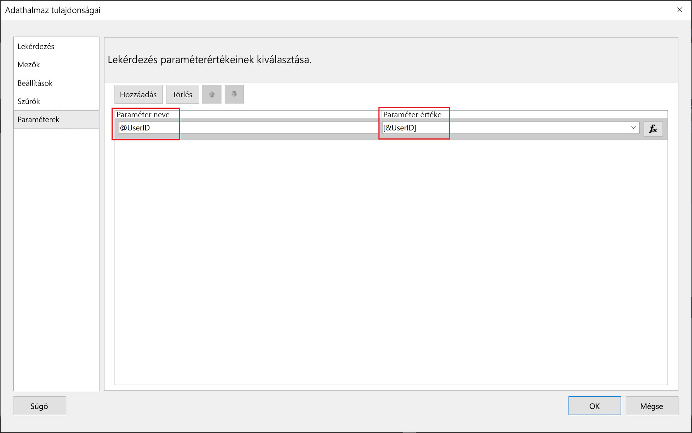

# <a name="implementing-row-level-security-in-embedded-paginated-reports-preview"></a>Sorszintű biztonság implementálása beágyazott lapszámozott jelentésekben (előzetes verzió)

Lapszámozott jelentés beágyazásakor megadhatja, hogy mely adatok legyenek megjelenítve. Ezáltal a megjelenő adatok felhasználónként testre szabhatók. Például egy globális értékesítési eredményeket tartalmazó, lapszámozott Power BI-jelentés beágyazható úgy, hogy csak egy adott régióra vonatkozó értékesítési eredmények legyenek elérhetők.

Ezzel a funkcióval biztonságos módon megjeleníthető az adatok egy része úgy, hogy a többi adat nem kerül veszélybe. Ez a megoldás hasonlít a [sorszintű biztonság (RLS)](embedded-row-level-security.md) funkcióhoz, amely biztonságos lehetőséget biztosít a (nem lapszámozott) Power BI-jelentésekben, irányítópultokon, csempéken és adatkészletekben található adatok megjelenítésére.  

> [!NOTE]
> Ez a funkció lapszámozott jelentések beágyazásához használható az ügyfelek számára.

## <a name="configuring-a-parameter-to-filter-the-dataset"></a>Egy paraméter konfigurálása az adatkészlet szűréséhez

Amikor sorszintű biztonságot alkalmazunk egy lapszámozott Power BI-jelentésnél, hozzá kell rendelni egy [paramétert](../../paginated-reports/report-builder-parameters.md) a **UserID** attribútumhoz. Ez a paraméter korlátozza az adatkészletből lekért adatok körét a jelentés beágyazását megelőzően.

Miután hozzárendelte a paramétert a **UserID** attribútumhoz, a [Reports GenerateTokenForCreateInGroup](https://docs.microsoft.com/rest/api/power-bi/embedtoken/reports_generatetokenforcreateingroup) API segítségével kérheti le a beágyazási tokent.

## <a name="use-userid-as-a-filter-at-report-or-query-level"></a>A UserID attribútum használata szűrőként a jelentés vagy a lekérdezés szintjén

A **UserID** attribútum használható *szűrőként* vagy egy, az adatforrás felé irányuló *lekérdezésben* a [Power BI Jelentéskészítőben](../../paginated-reports/report-builder-power-bi.md).

### <a name="using-the-filter"></a>A szűrő használata

1. A bal oldali panelen, az **Adatkészlet tulajdonságai** ablakban válassza a **Szűrő** lehetőséget.

    

2. A **Kifejezés** legördülő menüben válassza ki az adatok szűréséhez használni kívánt paramétert.

     

3. Kattintson az **Érték** funkciógombra. 

    

4. A **Kifejezés** ablakban a **Kategória** listából válassza a **Beépített mezők** lehetőséget.

    

5. Az **Elem** listában válassza a **UserID** attribútumot, majd kattintson az **OK** gombra.

    

6. Az **Adatkészlet tulajdonságai** ablakban ellenőrizze, hogy a *kiválasztott paraméter = UserID* kifejezés szerepel-e ott, majd kattintson az **OK** gombra.

    

### <a name="using-a-query"></a>Lekérdezés használata

1. A bal oldali panelen, az **Adatkészlet tulajdonságai** ablakban válassza a **Paraméterek** lehetőséget, majd kattintson a **Hozzáadás** gombra.

    

2. A **Paraméter neve** mezőbe írja be a **\@UserID** kifejezést, a **Paraméter értéke** mezőben pedig adja hozzá a **[&UserID]** értéket.

     

3. A bal oldali panelen válassza a **Lekérdezés** lehetőséget, a lekérdezéshez adja hozzá a **UserID** paramétert a lekérdezés részeként, majd kattintson az **OK** gombra.
    > [!NOTE]
    > Az alábbi képernyőképen a Color (Szín) paramétert használjuk példaként (whereFinalTable.Color = @UserID). Szükség esetén összetettebb lekérdezések is létrehozhatók.

    

## <a name="passing-the-configured-parameter-using-the-embed-token"></a>A konfigurált paraméter átadása a beágyazási token használatával

Amikor beágyazunk egy lapszámozott jelentést az ügyfelek számára, a [Reports GenerateTokenForCreateInGroup](https://docs.microsoft.com/rest/api/power-bi/embedtoken/reports_generatetokenforcreateingroup) API segítségével kérhetjük le a beágyazási tokent. Ez a token a lapszámozott jelentésből lekért adatok egy részének szűrésére is használható.

Ha csak az adatok egy részét szeretné megjeleníteni, rendelje hozzá a `username` mezőhöz a megjeleníteni kívánt információkat. Ha például egy Color (Szín) paraméterrel rendelkező, lapszámozott jelentésben beírjuk a *green* (zöld) értéket a `username` mezőbe, a beágyazási token úgy korlátozza a beágyazott adatokat, hogy csak az olyan adatok jelenjenek meg, amelyeknél a Color (Szín) oszlopban a *green* (zöld) érték szerepel.

```JSON
{
    "accessLevel": "View",
    "reportId": "cfafbeb1-8037-4d0c-896e-a46fb27ff229",
    "identities": [
            {
                    // Replace the 'username' with a paginated report parameter
                    "username":     "...",
                    "reports: [
                        "cfafbeb1-8037-4d0c-896e-a46fb27ff229"
                    ]
            }
    ]
}
```
