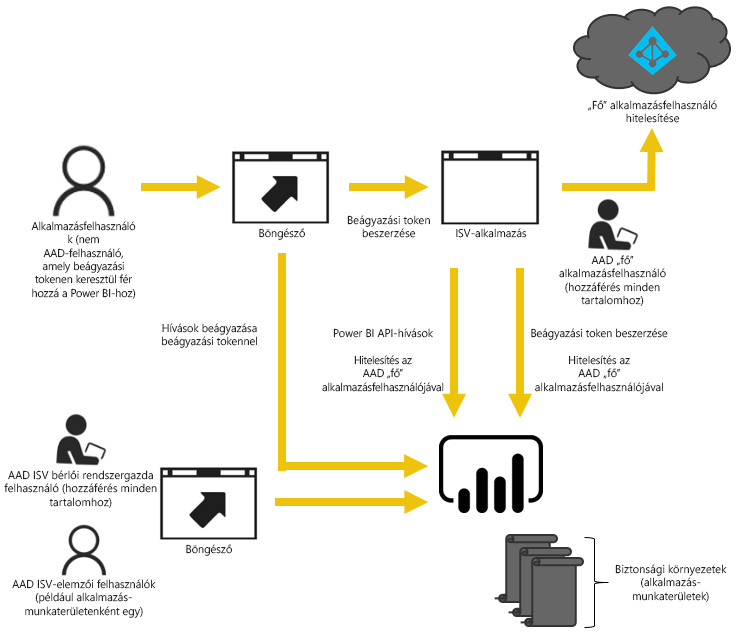

# Beágyazott analitika a Power BI-jal

A Power BI szolgáltatás (SaaS) és a Power BI Embedded szolgáltatás az Azure-ban (PaaS) API-kkal is rendelkezik az irányítópultok és jelentések beágyazásához. Ez a szolgáltatás azt jelenti, hogy a tartalmak beágyazásakor hozzáférhet a képességek készletéhez, valamint a Power BI legújabb funkcióihoz – például irányítópultokhoz, átjárókhoz és alkalmazás-munkaterületekhez.

A [beágyazást előkészítő eszközzel](https://aka.ms/embedsetup) gyorsan megteheti az első lépéseket és letölthet egy mintaalkalmazást.

Válassza ki az Ön számára megfelelő megoldást:

* Amennyiben [a cég számára végzi a beágyazást](embedding.md#embedding-for-your-organization), kibővítheti a Power BI szolgáltatást. Futtassa a [Beágyazás a cég számára](https://aka.ms/embedsetup/UserOwnsData) megoldást.
* Amennyiben az [ügyfelei számára végez beágyazást](embedding.md#embedding-for-your-customers), irányítópultokat és jelentéseket ágyazhat be olyan felhasználók számára, akik nem rendelkeznek Power BI-fiókkal. Futtassa a [Beágyazás az ügyfelek számára](https://aka.ms/embedsetup/AppOwnsData) megoldást.

## API-k használata

A Power BI-tartalmak beágyazása során két fő forgatókönyv képzelhető el. Egyrészt a cégen belüli felhasználók számára történő beágyazás (a felhasználóknak rendelkezniük kell Power BI-licenccel), másrészt Power BI-licencet nem kívánó beágyazás más felhasználók és ügyfelek számára. A Power BI REST API mindkét forgatókönyvet támogatja.

Power BI-licenccel nem rendelkezők számára ugyanazt az API-t használva ágyazhat be irányítópultokat és jelentéseket egyéni alkalmazásokba függetlenül attól, hogy azt a cége vagy az ügyfele számára készíti. Az ügyfelek így megtekinthetik az alkalmazás által kezelt adatokat. A cégen belüli Power BI-felhasználók ezen kívül *saját adataikat* is megtekinthetik közvetlenül a Power BI-ban vagy a beágyazott alkalmazásban. A beágyazáshoz teljes körűen igénybe veheti a JavaScript és a REST API-k lehetőségeit.

Ha látni kívánja, hogyan működik a beágyazás tekintse meg a [JavaScript beágyazását szemléltető példát](https://microsoft.github.io/PowerBI-JavaScript/demo/).

## Beágyazás a cég számára

Amennyiben **a cég számára végzi a beágyazást**, kibővítheti a Power BI szolgáltatást. A vállalati beágyazáshoz az alkalmazás felhasználóinak be kell jelentkezniük a Power BI szolgáltatásba, amikor meg szeretnék tekinteni a tartalmaikat. A bejelentkező vállalati felhasználóknak csak azokhoz az irányítópultokhoz és jelentésekhez lesz hozzáférésük, amelyeknek ők a tulajdonosai, vagy amelyeket a Power BI szolgáltatásban megosztottak velük.

*Példák a cégen belüli beágyazásra: belső alkalmazások, például [SharePoint Online](https://powerbi.microsoft.com/blog/integrate-power-bi-reports-in-sharepoint-online/), [Microsoft Teams-integráció](https://powerbi.microsoft.com/blog/power-bi-teams-up-with-microsoft-teams/) (ehhez rendszergazdai jogosultsággal kell rendelkeznie), és [Microsoft Dynamics](https://docs.microsoft.com/dynamics365/customer-engagement/basics/add-edit-power-bi-visualizations-dashboard).*

Amennyiben a vállalata számára végez beágyazást, tekintse át a következőket:

* [Jelentés integrálása egy alkalmazásba](embed-sample-for-your-organization.md)

Amikor Power BI-felhasználók számára végez beágyazást, az önkiszolgáló lehetőségek (pl. a szerkesztés, mentés stb.) a [JavaScript API-n](https://github.com/Microsoft/PowerBI-JavaScript) keresztül érhetők el.

A [Beágyazáshoz szükséges telepítési eszközzel](https://aka.ms/embedsetup/UserOwnsData) elvégezheti a beágyazást a szervezet számára, hogy munkához láthasson, és letölthessen egy mintaalkalmazást, amely bemutatja, hogyan kell integrálni egy jelentést a szervezet számára.

## Beágyazás ügyfelek számára

Amennyiben az **ügyfelei számára végez beágyazást**, irányítópultokat és jelentéseket ágyazhat be olyan felhasználók számára, akik nem rendelkeznek Power BI-fiókkal. Az ügyfelek számára való beágyazást a **Power BI Embedded** végzi.

A [Power BI Embeddeddel](azure-pbie-what-is-power-bi-embedded.md) egy **Microsoft Azure**-szolgáltatás, amellyel független szoftverszállítók (ISV-k) és a fejlesztők lenyűgöző vizualizációkat, jelentéseket és irányítópultokat adhatnak gyorsan alkalmazásaikhoz egy kapacitásalapú, óránkénti díjjal számlázott modellel.

A Power BI Embedded mind az ISV-k, mind a fejlesztők, mind a ügyfelek számára előnyös. Egy ISV például ingyenesen létrehozhat vizualizációkat a Power BI Desktoppal. Az ISV-k gyorsabban piacra vihetik az alkalmazásaikat a vizuális elemzési fejlesztések minimalizálásával, és kitűnhetnek versenytársaik közül az innovatív adatkörnyezeteikkel. Az ISV-k úgy is dönthetnek, hogy a beágyazott analitikákkal termelt értékért prémiumot számolnak fel.

A Power BI Embedded használatával az ügyfeleinek nem szükséges ismerniük a Power BI működését. Két különböző módszer használatával hozhat létre beágyazott alkalmazást. Az egyik lehetőség a Power BI Pro-fiók használata. A másik lehetőség a szolgáltatásnév használata. 

Ez a Power BI Pro-fiók szolgál fő fiókként az alkalmazás számára (tehát ez a fő fiók tulajdonképpen egy proxyfiók). A Power BI Pro-fiók lehetővé teszi beágyazási tokenek létrehozását, amelyek hozzáférést biztosítanak a Power BI szolgáltatás olyan irányítópultjaihoz és jelentéseihez, amelyeket az alkalmazás kezel, és a tulajdonosa az alkalmazás.

A [Szolgáltatásnév](embed-service-principal.md) **csak az alkalmazásra vonatkozó** tokennel képes Power BI-tartalmat beágyazni az alkalmazásokba. A szolgáltatásnevek lehetővé teszi beágyazási tokenek létrehozását, amelyek hozzáférést biztosítanak a Power BI szolgáltatás olyan irányítópultjaihoz és jelentéseihez, amelyeket az alkalmazás kezel, és a tulajdonosa az alkalmazás.

A Power BI Embeddedet használó fejlesztők az alkalmazás alapvető működésének szentelhetik az idejüket, és nem kell vizualizációk és elemzések fejlesztésével foglalkozniuk. A fejlesztők gyorsan megfelelhetnek az ügyfelek jelentésekkel és irányítópultokkal kapcsolatos igényeinek, és könnyen, teljes mértékben dokumentált API-kkal és SDK-kal ágyazhatnak be tartalmakat. A könnyen navigálható, alkalmazáson belüli adatfeltárás engedélyezésével az ISV-k ügyfelei gyors és magabiztos és döntéseket hozhatnak bármilyen eszközről.

> [!IMPORTANT]
> Bár a beágyazás maga igényli a Power BI szolgáltatás meglétét, az ügyfeleknek nem kell rendelkezniük Power BI-előfizetéssel. Nem kell bejelentkezniük a Power BI szolgáltatásba a beágyazott tartalmak megtekintéséhez az alkalmazásban.

Amikor készen áll az éles környezetbe való áthelyezésre, az alkalmazás-munkaterülethez hozzá kell rendelni egy dedikált kapacitást. A Power BI Embedded a Microsoft Azure-on belül elérhetővé tesz az alkalmazásban felhasználható [dedikált kapacitást](azure-pbie-create-capacity.md).

A beágyazással kapcsolatos részletekért lásd: [Power BI-tartalmak beágyazása](embed-sample-for-customers.md).

## Következő lépések

Most már elkezdhet Power BI-tartalmat beágyazni az alkalmazásba vagy az ügyfelek számára.

> [!div class="nextstepaction"]
> [Beágyazás a cég számára](embed-sample-for-your-organization.md)

> [!div class="nextstepaction"]
> [Mi az a Power BI Embedded?](azure-pbie-what-is-power-bi-embedded.md)

> [!div class="nextstepaction"]
>[Beágyazás az ügyfelek számára](embed-sample-for-customers.md)

További kérdései vannak? [Forduljon a Power BI közösségéhez](http://community.powerbi.com/)
