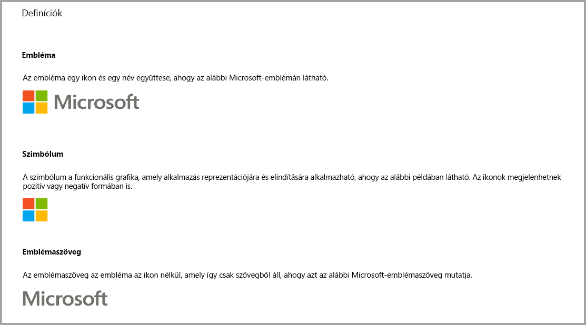
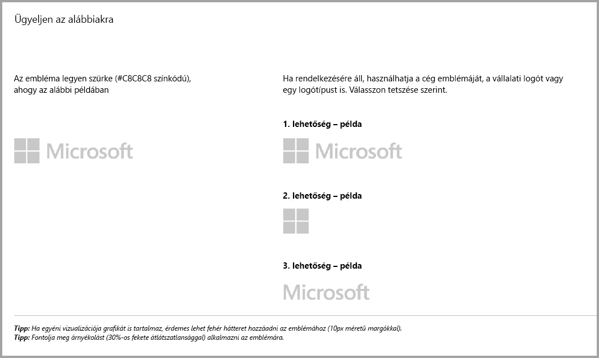
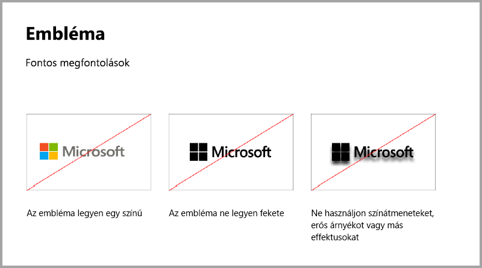
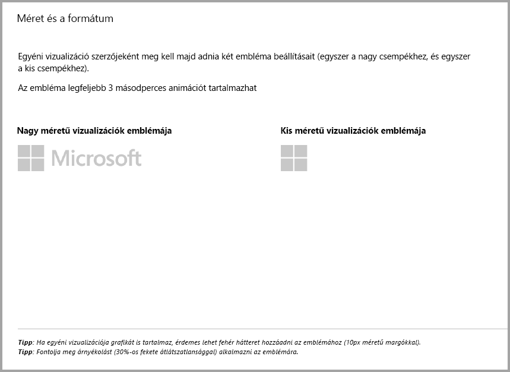
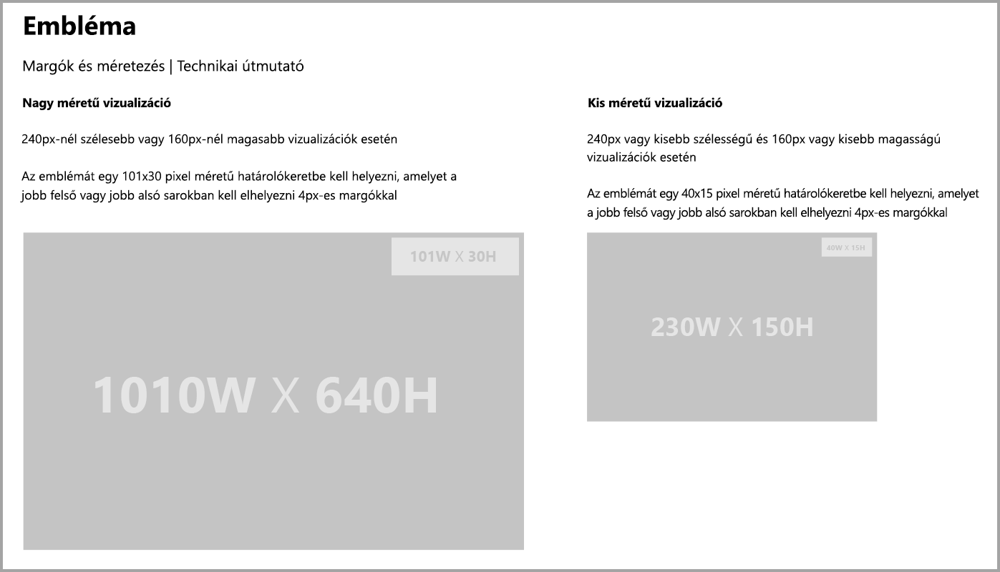
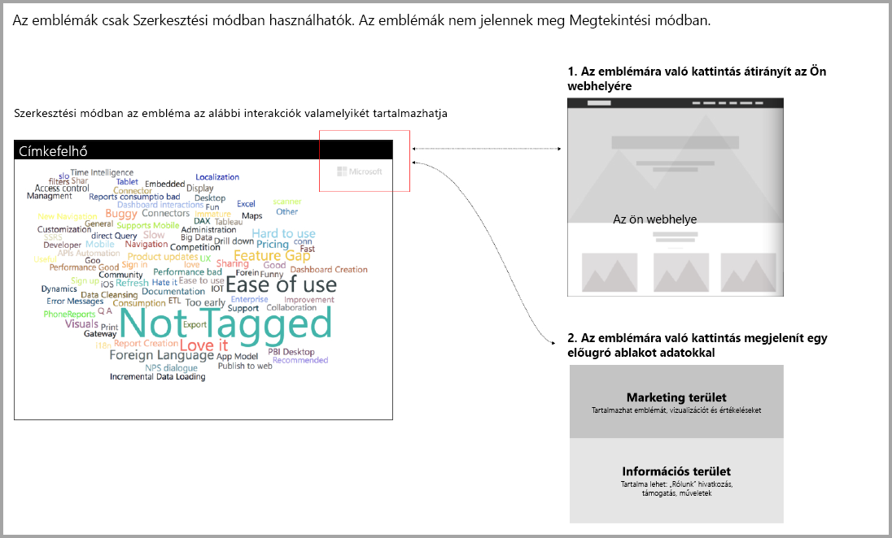

# Útmutató Power BI-vizualizációkhoz
Mielőtt [közzétenné](https://docs.microsoft.com/power-bi/developer/office-store) a vizualizációt az AppSource-on, hogy azt mások is felfedezhessék és használhassák, ügyeljen rá, hogy az útmutatók használatával magas színvonalú felhasználói élményt alakítson ki. 

## Helyi menü
A helyi menü egy jobb gombbal történő kattintással előhozható menü, amely akkor jelenik meg, amikor a felhasználó a vizualizáció fölé viszi a kurzort.
A Power BI minden vizualizációnál engedélyezni kell a helyi menüt, hogy egységes felhasználói élményt nyújthasson. [Ebben a cikkben](https://github.com/Microsoft/PowerBI-visuals/blob/gh-pages/tutorials/building-bar-chart/adding-context-menu-to-the-bar.md) talál információt arról, hogyan adható hozzá helyi menü.

## Embléma-irányelvek
> [!NOTE]
> Az ebben a cikkben szereplő embléma szó bármely kereskedelmi vállalati ikonra vonatkozik az alábbi képeken szereplő leírásoknak megfelelően. 

Ez a szakasz az emblémák Power BI-vizualizációkhoz való hozzáadásának részleteit ismerteti. Az emblémák nem kötelezőek. Ha szerepelnek, akkor követniük kell ezeket az irányelveket. 

> [!IMPORTANT]
> Az emblémák *csak Szerkesztési módban* használhatók. Az emblémák *nem* jelennek meg Megtekintési módban.

A tájékoztató ikonoknak, ha vannak, olvasási módban meg kell felelniük az emblémák színére, méretére és helyére vonatkozó fenti szabályoknak.

## Útmutató további vásárlásos Power BI-vizualizációkhoz

Mostanáig a piactér (AppSource) csak ingyenes Power BI-vizualizációkat fogadott el. Ez a szabályzat megváltozott (2018. decemberben), így az AppSource-ra már a „További vásárlásra lehet szükség” címkéjű vizualizációk is beküldhetők. 

A „További vásárlásra lehet szükség” típusú vizualizációk az Office áruházában található, alkalmazáson belüli vásárlást (IAP-t) lehetővé tevő bővítményekhez hasonlóak. Ilyen vizualizációkat a fejlesztők is beküldhetnek minősítésre, miután az AppSource csapata jóváhagyta azokat, illetve meggyőződtek arról, hogy megfelelnek a minősítési feltételeknek. A követelményekről a [Minősített Power BI-vizualizációk](../power-bi-custom-visuals-certified.md) című cikkben talál további információt.

> [!NOTE]
> A vizualizáció minősítéséhez az nem kapcsolódhat külső szolgáltatásokhoz és erőforrásokhoz.

>[!IMPORTANT]  
> Ha a vizualizációt az ingyenesről „További vásárlásra lehet szükség” szintűre frissíti, a felhasználók ugyanazon szintű funkciókkal fognak rendelkezni, mint a frissítés előtt. A meglévő ingyenes funkciók mellett felvehet választható, speciális fizetett funkciókat. Javasoljuk, hogy a speciális funkciókkal rendelkező IAP-vizualizációkat új vizualizációkként vegye fel, és ne a meglévő ingyeneseket frissítse.

## Mi változott a beküldési folyamatban?

A fejlesztők az Értékesítői információ-központról tölthetik fel az IAP-vizualizációikat az AppSource-ba, ahogyan az ingyenes vizualizációkkal is tették. A fejlesztőknek az alábbi jegyzetet kell feltüntetniük az irányítópult értékesítői megjegyzései között, így jelezve, hogy a vizualizáció IAP-funkciókkal rendelkezik: „Alkalmazáson belüli vásárlást tartalmazó vizualizáció”. A fejlesztőknek emellett licenckulcsot vagy tokent kell szolgáltatniuk, amellyel az ellenőrző csapat ellenőrizheti az IAP-funkciókat. A vizualizáció ellenőrzése és jóváhagyása után az AppSource jelzi az IAP-vizualizáció díjszabási beállításainál, hogy ahhoz további vásárlásra lehet szükség.

## Mik az IAP-funkciókkal rendelkező Power BI-vizualizációk?

Az IAP-vizualizációk *ingyenes funkciókat* kínáló, *ingyenes* vizualizációk. Ezen kívül speciális funkciókkal is rendelkeznek, amelyek használatához további díjat kell fizetni. A fejlesztőknek a vizualizáció leírásában értesíteniük kell a felhasználókat arról, hogy mely funkciók használatához van szükség további vásárlásra. A Microsoft jelenleg nem nyújt natív API-kat az alkalmazások és bővítmények vásárlásának támogatásához.

A fejlesztők bármilyen külső fizetési rendszert használhatnak az ilyen vásárlásokhoz. További információt [üzletszabályzatunkban](https://docs.microsoft.com/office/dev/store/validation-policies#2-apps-or-add-ins-can-display-certain-ads) talál.

> [!NOTE]
> Az ingyenes funkciókkal vagy vizualizációkkal a vízjelek nem használhatóak. A vízjelek csak az érvényes licenc nélkül használt, fizetős funkciókkal használhatók. Azt javasoljuk, hogy egy előugró ablakot jelenítsen meg, amely a licenccel kapcsolatos adatokat tartalmazza, ha a speciális, fizetős funkciókat érvényes licenc nélkül használják.  

## Ajánlott eljárások

### Vizualizáció kezdőlapja

A kezdőlapon tudathatja a felhasználókkal, hogy hogyan használhatják a vizualizációt, és hol vásárolhatnak licencet. Ne használjon automatikusan induló videókat. Csak olyan anyagot adjon hozzá, amely hozzájárul a felhasználói élményhez, például licencvásárlással vagy az IAP-funkció használatával kapcsolatos információk vagy hivatkozások.

### Licenckulcs és token

Az egyszerűbb használat érdekében a licenckulccsal vagy tokenekkel kapcsolatos mezőket a formázási panel tetején helyezze el.

## Gyakori kérdések

A vizualizációkkal kapcsolatban a [Gyakori kérdések a vizualizációkon belüli további vásárlásokról](https://docs.microsoft.com/power-bi/power-bi-custom-visuals-faq#visuals-with-additional-purchases) weblapon talál további információt.

## Következő lépések

Megtudhatja, hogyan teheti közzé egyéni vizualizációit az [AppSource-ban](office-store.md), amelyeket aztán mások is felfedezhetnek és használhatnak.
