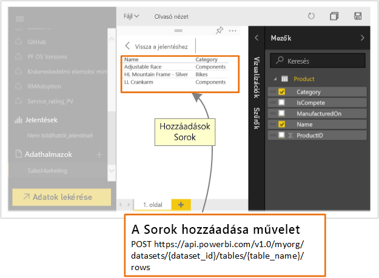

# Mire használhatják a fejlesztők a Power BI API-t?

A Power BI REST API-val Power BI-jelentéseket, irányítópultokat és csempéket beágyazó alkalmazásokat hozhat létre.

A Power BI REST API-val kezelési feladatokat is végezhet olyan Power BI-objektumokon, mint a jelentések, az adatkészletet és a munkaterületek.

Íme néhány, a Power BI API-k használatával elvégezhető feladat.

| **További információ** | **Hivatkozás erre az információra** |
|----------------------------------------------------------------------------------|------------------------------------------------------------------------------------|
| Irányítópultok, jelentések és csempék beágyazása Power BI- és nem Power BI-felhasználók részére. | [Power BI-irányítópultok, -jelentések és -csempék beágyazása ](embedding-content.md) |
| Kezelési feladatok végrehajtása Power BI-objektumokon. | [A Power BI REST API-jainak leírása](https://docs.microsoft.com/rest/api/power-bi/) |
| Kulcsfontosságú adatok küldése Power BI-irányítópultokra a meglévő üzleti munkafolyamatok kiterjesztésével. | [Adatok küldése az irányítópultokra ](walkthrough-push-data.md) |
| Hitelesítés a Power BI-ban. | [Hitelesítés a Power BI-ban ](get-azuread-access-token.md) |

> [!NOTE]
> A Power BI API-k továbbra is csoportokként hivatkoznak a munkaterületekre. Minden csoportokra való hivatkozás munkaterületek használatát jelöli.

## API-fejlesztői eszközök

| Eszköz(ök) | Leírás |  |  |
|-------------------------|---------------------------------------------------------------------------------------------------------------------------------------------------|---|---|
| [Demókörnyezeti eszközök](https://microsoft.github.io/PowerBI-JavaScript/demo) | A Power BI JavaScript API-jainak használatát bemutató minták használata. Ez az eszköz lehetőséget ad a Power BI Embedded különböző mintáinak gyors kipróbálására. |  |  |
| [Power BI JavaScript wiki](https://github.com/Microsoft/powerbi-javascript/wiki) | További információ a Power BI JavaScript API-jairól. |  |  |
| [Postman](https://www.getpostman.com/) | Kérelmek futtatása, tesztelés, hibakeresés, monitorozás, automatizált tesztek futtatása és egyéb lehetőségek. |

## Adatok leküldése a Power BI szolgáltatásba

A Power BI API lehetővé teszi az [adatok leküldését az adatkészletekbe](walkthrough-push-data.md). A funkció segítéségével sorokat adhat hozzá az adatkészletekben lévő táblákhoz. Az irányítópultok csempéi vagy a jelentésekben lévő vizualizációk ezután tükrözik az új adatokat.

## GitHub-adattárak

* [Power BI fejlesztői minták](https://github.com/Microsoft/PowerBI-Developer-Samples)
* [.NET SDK](https://github.com/Microsoft/PowerBI-CSharp)
* [JavaScript API](https://github.com/Microsoft/PowerBI-JavaScript)

## Következő lépések

* [Adatok küldése adatkészletekbe](walkthrough-push-data.md)
* [Egyéni Power BI-vizualizáció fejlesztése](visuals/custom-visual-develop-tutorial.md)
* [A Power BI REST API-jainak leírása](rest-api-reference.md)
* [Power BI REST API-k](https://docs.microsoft.com/rest/api/power-bi/)

További kérdései vannak? [Kérdezze meg a Power BI közösségét](https://community.powerbi.com/)
