# Vizualizációk a Power BI-ban

Power BI-jelentések létrehozása vagy szerkesztése során számos különböző vizualizációtípust használhat. Ezeknek a vizualizációknak az ikonjai a **Vizualizációk** panelen jelennek meg. Ezek a vizualizációk azonnal elérhetők a [Power BI Desktop](https://powerbi.microsoft.com/desktop/) letöltésekor vagy a [Power BI szolgáltatás](https://app.powerbi.com) megnyitásakor.

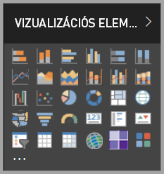

Azonban nem csupán ezek a vizualizációk állnak rendelkezésére. Ha az alsó **További lehetőségek** (...) elemet választja, elérhetővé válik a jelentésvizualizációk egy másik forrása – a *Power BI-vizualizációk*.

A fejlesztők a Power BI-vizualizációk SDK-val hozzák létre ezeket a vizualizációkat. Ezekkel a vizualizációkkal az üzleti felhasználók az üzletüknek leginkább megfelelő módon jeleníthetik meg adataikat. A jelentéskészítők importálhatják az egyéni vizualizációkat a jelentéseikbe, és azokat a többi Power BI-vizualizációhoz hasonlóan használhatják. A Power BI-vizualizációk kiemelt helyet élveznek a Power BI szolgáltatáson belül, így szűrhetők, kiemelhetők, szerkeszthetők, megoszthatók és egyéb műveletekkel használhatók.

A Power BI-vizualizációk terjesztésének három módja van:

* Egyéni vizualizációfájlok
* Szervezeti vizualizációk
* Piactér-vizualizációk

## Egyéni vizualizációfájlok

A Power BI-vizualizációk olyan csomagok, amelyek a nekik szolgáltatott adatok rendereléséhez szükséges kódot tartalmazzák. Egyéni vizualizációt bárki létrehozhat, valamint becsomagolhatja azt `.pbiviz`-fájlként, amelyet aztán egy Power BI-jelentésbe importálhat.

> [!WARNING]
> Az egyéni vizualizációk biztonsági és adatvédelmi kockázatokat tartalmazó kódot is tartalmazhatnak. Fontolja meg, hogy megbízik-e a szerzőben és az egyéni vizualizációban, mielőtt importálná azt a jelentésébe.

## Szervezeti vizualizációk

A Power BI-rendszergazdák jóváhagyhatják és telepíthetik vállalatuknál a Power BI-vizualizációkat, amelyeket a jelentéskészítők egyszerűen felfedezhetnek, módosíthatnak és használhatnak. A rendszergazdák számára is egyszerű ezeknek a vizualizációknak a kezelése (például verziófrissítés, letiltás/engedélyezés).

 [További információk a vállalati vizualizációkról](power-bi-custom-visuals-organization.md).

## Piactér-vizualizációk

A közösség tagjai mellett a Microsoft is nyilvánosan megosztotta Power BI-vizualizációit az [AppSource](https://appsource.microsoft.com/marketplace/apps?product=power-bi-visuals) piactéren. Ezeket a vizualizációkat Ön is letöltheti, és hozzáadhatja Power BI-jelentéseihez. Ezeket a Power BI-vizualizációkat a Microsoft tesztelte, és működés és minőség szempontjából is jóváhagyta.

Mi az az [AppSource](office-store.md)? Az a hely, ahol a Microsoft-szoftverekhez alkalmazásokat, beépülő modulokat és bővítményeket találhat. Az AppSource többek között az Office 365, az Azure, a Dynamics 365 és a Power BI több millió felhasználóját köti össze olyan megoldásokkal, amelyekkel minden eddiginél hatékonyabban, részletgazdagon és látványosan dolgozhatnak.

### Hitelesített vizualizációk

A Power BI-minősítéssel rendelkező vizualizációk olyan vizualizációk, amelyek a piactéren érhetők el, további szigorú minőségteszteken feleltek meg, és további forgatókönyvek, például [e-mailes előfizetések](../service-report-subscribe.md) és [PowerPointba történő exportálás](../consumer/end-user-powerpoint.md) esetén is támogatottak.
A minősített Power BI-vizualizációk listájának megtekintéséhez vagy saját vizualizáció közzétételéhez lásd a [minősített Power BI-vizualizációkat](power-bi-custom-visuals-certified.md) ismertető szakaszt.

Ön olyan webfejlesztő, aki szeretne saját vizualizációkat létrehozni, és hozzáadni azokat az AppSource-hoz? Az [Egyéni Power BI-vizualizáció fejlesztése](visuals/custom-visual-develop-tutorial.md) című cikkből megtudhatja, hogyan [tehet közzé egyéni vizualizációkat az AppSource-on](office-store.md).

### Egyéni vizualizáció importálása fájlból

1. Válassza a **Vizualizációk** panel alján található három pontot.

    

2. A legördülő listából válassza az **Importálás fájlból** lehetőséget.

    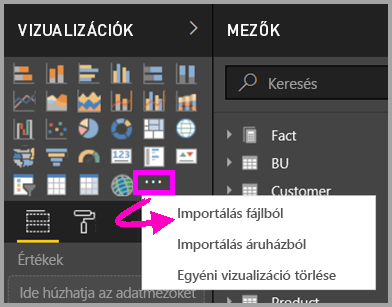

3. A **Fájl megnyitása** menüben válassza ki az importálni kívánt `.pbiviz`-fájlt, majd válassza a **Megnyitás** lehetőséget. Az egyéni vizualizáció ikonja ekkor megjelenik a **Vizualizációk** panel alján, és már használhatja is a jelentésben.

    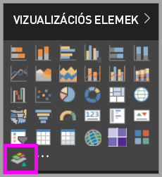

### Szervezeti vizualizációk importálása

1. Válassza a **Vizualizációk** panel alján található három pontot.

    

2. A legördülő listából válassza az **Importálás a piactérről** lehetőséget.

    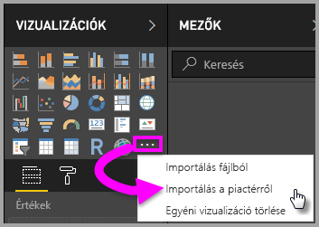

3. Válassza a **SAJÁT SZERVEZET** lehetőséget a felső lap menüjében.

    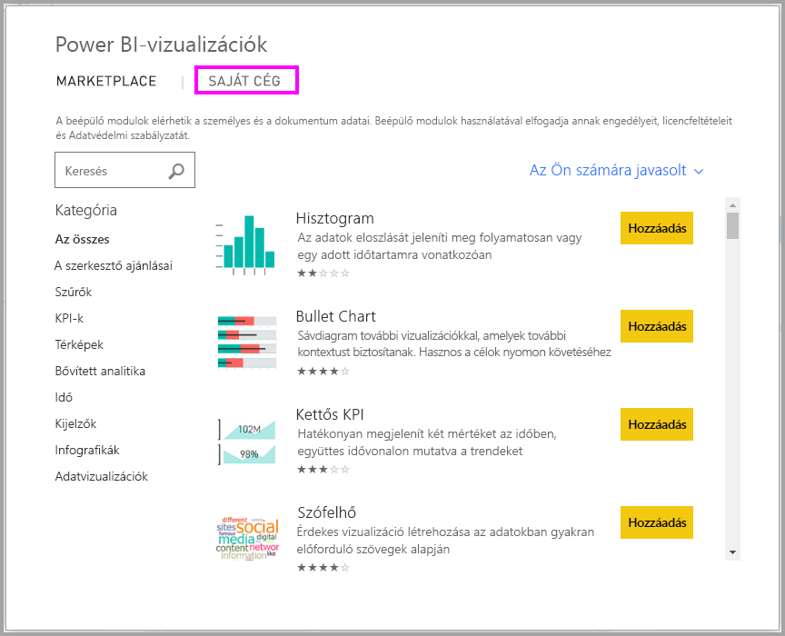

4. Tekintse át a listát, és keresse meg az importálni kívánt vizualizációt.

    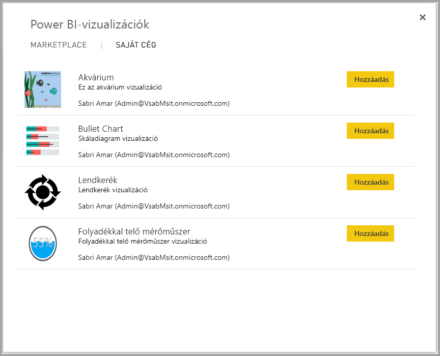

5. Az egyéni vizualizáció importálásához válassza a **Hozzáadás** parancsot. Az ikonja ekkor megjelenik a **Vizualizációk** panel alján, és már használhatja is a jelentésben.

    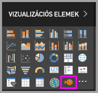

## Power BI-vizualizáció letöltése vagy importálása a Microsoft AppSource-ról

A Power BI-vizualizációk letöltésének és importálásának két módja van. Megteheti ezt a Power BI-on belülről és az [AppSource webhelyről](https://appsource.microsoft.com/).

### Power BI-vizualizációk beszerzése a Power BI-on belül

1. Válassza a **Vizualizációk** panel alján található három pontot.

    

2. A legördülő listából válassza az **Importálás a piactérről** lehetőséget.

    

3. Tekintse át a listát, és keresse meg az importálni kívánt vizualizációt.

    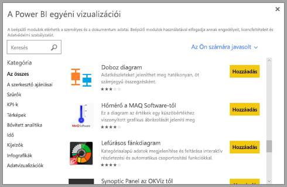

4. Az egyes vizualizációk kijelölésével további információkat tudhat meg róluk.

    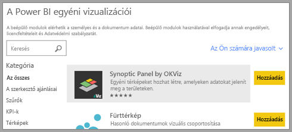

5. A részletek lapon többek között képernyőképeket, videókat és részletes leírásokat tekinthet meg.

    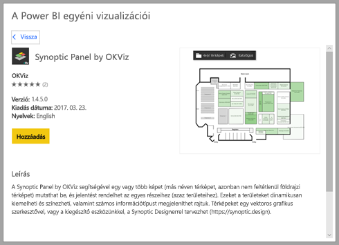

6. A képernyő alján értékelések is találhatók.

    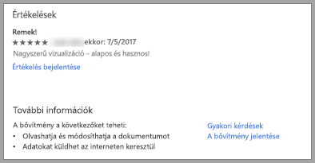

7. Az egyéni vizualizáció importálásához válassza a **Hozzáadás** parancsot. Az ikonja ekkor megjelenik a **Vizualizációk** panel alján, és már használhatja is a jelentésben.

    

### Power BI-vizualizáció letöltése és importálása a Microsoft AppSource-ról

1. A [Microsoft AppSource](https://appsource.microsoft.com) webhelyről kiindulva válassza az **Alkalmazások** lapot.

    

2. Látogasson el az [Alkalmazások találatainak oldalára](https://appsource.microsoft.com/marketplace/apps), ott megtekintheti az egyes kategóriák legnépszerűbb alkalmazásait, beleértve a *Power BI-alkalmazásokat*. Power BI-vizualizációkat keresünk, ezért szűkítse az eredményeket a navigációs panel listájában található **Power BI-vizualizációk** lehetőség kiválasztásával.

    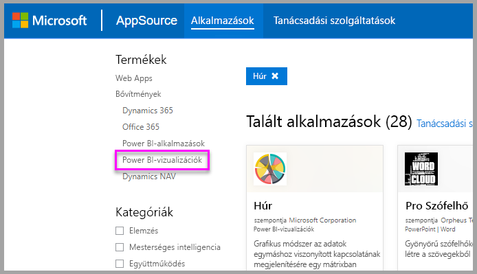

3. Az AppSource minden egyes egyéni vizualizációhoz megjelenít egy csempét.  Minden csempe tartalmaz egy pillanatképet az egyéni vizualizációról, illetve egy rövid leírást és egy letöltési hivatkozást. További részletekért kattintson a csempére.

    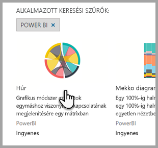

4. A részletek lapon többek között képernyőképeket, videókat és részletes leírásokat tekinthet meg. Az egyéni vizualizáció letöltéséhez kattintson a **Letöltés most** hivatkozásra, és fogadja el a használati feltételeket.

    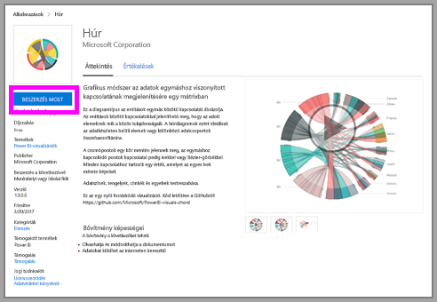

5. Kattintson az egyéni vizualizáció letöltési hivatkozására.

    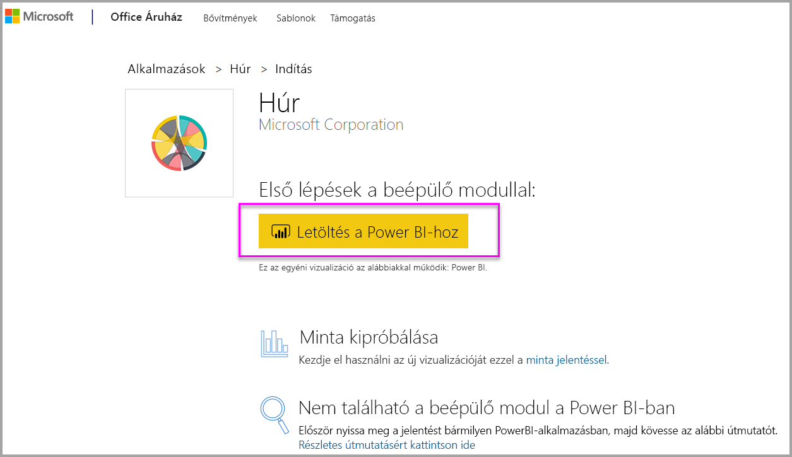

    A letöltési oldal az egyéni vizualizációnak a Power BI Desktopba és a Power BI szolgáltatásba történő importálásával kapcsolatos útmutatást is tartalmaz.

    Egy mintajelentést is letölthet, amely tartalmazza az egyéni vizualizációt, és bemutatja annak képességeit.

    

6. Mentse a `.pbiviz`-fájlt, majd nyissa meg a Power BI-t.

7. Importálja a `.pbiviz`-fájlt a jelentésbe. (Lásd a fenti [Egyéni látványelem importálása](#import-a-custom-visual-from-a-file) szakaszt.)

## Megfontolandó szempontok és korlátozások

* Az egyéni vizualizáció az importálásakor az adott jelentéshez lesz hozzáadva. Ha egy másik jelentésben is használni szeretné a vizualizációt, abba a jelentésbe is importálnia kell. Ha egy egyéni vizualizációval rendelkező jelentést a **Mentés másként** lehetőséggel ment, az új jelentéssel együtt az egyéni vizualizáció egy másolata is mentve lesz.

* Ha nem látja a **Vizualizációk** panelt, akkor nem rendelkezik a jelentés szerkesztéséhez szükséges engedélyekkel.  Csak azokhoz a jelentésekhez adhat hozzá Power BI-vizualizációkat, amelyek szerkesztésére jogosult, az Önnel csak megosztott jelentésekhez nem.

## Hibaelhárítás

A hibaelhárításról a [Power BI-vizualizációk hibaelhárítása](power-bi-custom-visuals-troubleshoot.md) című cikkből tájékozódhat.

## Gyakori kérdések

További információt és válaszokat [a Power BI-vizualizációkkal kapcsolatos gyakori kérdések](power-bi-custom-visuals-faq.md#organizational-visuals) között talál.

## Következő lépések

* [Vizualizációk Power BI-jelentésekben](../visuals/power-bi-report-visualizations.md)

További kérdései vannak? [Kérdezze meg a Power BI közösségét](https://community.powerbi.com/).
