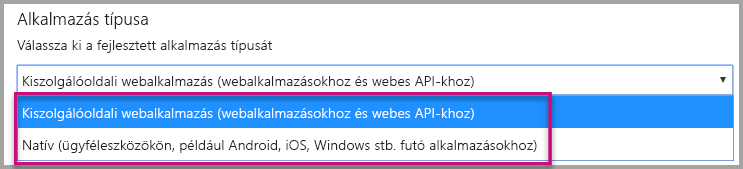
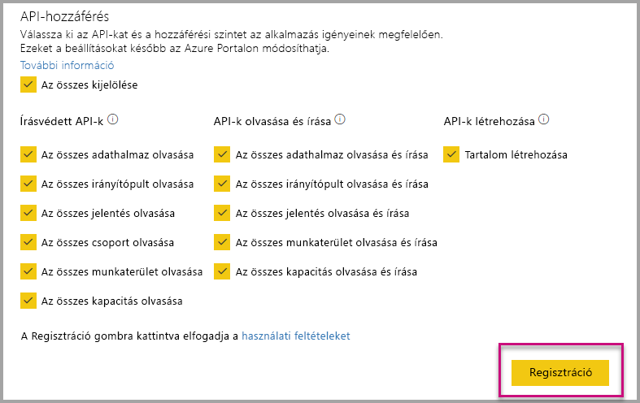
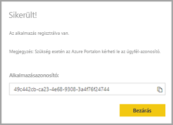
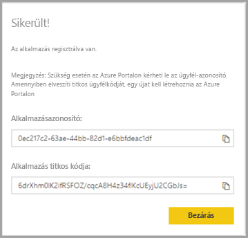
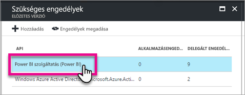

# <a name="register-an-azure-ad-application-to-use-with-power-bi"></a>Azure AD-alkalmazás regisztrálása a Power BI-ban való használathoz

Megismerheti, hogyan kell regisztrálni egy alkalmazást az Azure Active Directoryban (Azure AD) Power BI-tartalmak beágyazásához.

Az alkalmazás az Azure AD-vel regisztrálva hozzáférhet a [Power BI REST API-khoz](https://docs.microsoft.com/rest/api/power-bi/). Az alkalmazás regisztrálása után identitást hozhat létre a számára, és meghatározhatja a Power BI REST-erőforrásokhoz kötődő engedélyeket.

> [!IMPORTANT]
> A Power BI alkalmazás regisztrálása előtt szüksége van egy [Azure Active Directory-bérlőre és egy céges felhasználóra](create-an-azure-active-directory-tenant.md). Amennyiben nem a bérlő egyik felhasználójával regisztrál a Power BI-ba, nem tudja regisztrálni az alkalmazást.

Az alkalmazást két módon regisztrálhatja. Az első lehetőség a [Power BI alkalmazásregisztráló eszköz](https://dev.powerbi.com/apps/), a másik pedig az Azure Portal használata. A Power BI alkalmazásregisztráló eszköz használata kényelmesebb, mert csak néhány mező kitöltése szükséges. Amennyiben módosítani kívánja az alkalmazását, az Azure Portal használatát javasoljuk.

## <a name="register-with-the-power-bi-application-registration-tool"></a>Regisztráció a Power BI alkalmazásregisztráló eszközzel

Regisztrálja az alkalmazást az **Azure Active Directoryban**, hogy létrehozzon egy identitást az alkalmazása számára, és engedélyezze egyes Power BI REST-erőforrások használatát. Egy alkalmazás, például konzolalkalmazás vagy webhely regisztrációja során egy azonosítót kap, amelyet az alkalmazás a saját azonosítására használ azon felhasználóknál, akiktől engedélyeket kell kérnie.

Az alábbiak szerint regisztrálhatja alkalmazását a Power BI alkalmazásregisztráló eszközzel:

1. Keresse fel a [dev.powerbi.com/apps](https://dev.powerbi.com/apps) címet.

2. Válassza a **Bejelentkezés** meglévő fiókkal lehetőséget, majd kattintson a **Tovább** gombra.

3. Adja meg az **Alkalmazás nevét**.

4. Adja meg az **Alkalmazás típusát**.

    Íme a különbségek, amiért a **Natív** lehetőséget érdemes választania a **Kiszolgálóoldali webalkalmazások** helyett az alkalmazás típusaként.

    Natív:
    * Egy, az [ügyfelek számára tervezett](embed-sample-for-customers.md) alkalmazást szeretne létrehozni fő felhasználói fiók (a Power BI-ba való bejelentkezésre használt Power BI Pro-licenc) használatával a hitelesítéshez.

    Kiszolgálóoldali webalkalmazás:
    * Egy, a [szervezet számára tervezett](embed-sample-for-your-organization.md) alkalmazást szeretne létrehozni.
    * Egy, az [ügyfelek számára tervezett](embed-sample-for-customers.md) alkalmazást szeretne létrehozni szolgáltatásnévvel történő hitelesítéssel.
    * Webalkalmazások vagy webes API-k létrehozását tervezi.

    

5. Ha alkalmazástípusként a **Kiszolgálóoldali webalkalmazás** lehetőséget választotta, akkor folytassa a **Kezdőlap URL-címe** és az **Átirányítási URL-cím** értékének megadásával. Az **Átirányítási URL-cím** bármilyen érvényes URL-címmel működik, és meg kell felelnie a létrehozott alkalmazásnak. Ha a **Natív** értéket választotta, folytassa a 6. lépéssel.

6. Válassza ki azokat a Power BI API-kat, amelyekre az alkalmazásnak szüksége van. További információt a Power BI hozzáférési engedélyeiről a [Power BI engedélyeit](power-bi-permissions.md) ismertető témakörben talál. Válassza a **Regisztráció** lehetőséget.

    

    > [!Important]
    > Ha engedélyezi a szolgáltatásnevek használatát a Power BI-ban, az Azure Active Directory-engedélyek többé nem lépnek életbe. Az engedélyek kezelése a Power BI felügyeleti portálján keresztül történik.

7. Ha alkalmazástípusként a **Natív** lehetőséget választja, akkor egy **alkalmazásazonosítót** kap. Ha alkalmazástípusként a **Kiszolgálóoldali webalkalmazás** lehetőséget választja, akkor kap egy **alkalmazásazonosítót** és egy **titkos kódot az alkalmazáshoz**.

    > [!Note]
    > Az **Alkalmazásazonosító** értékét szükség esetén később is lekérheti az Azure Portalról. Amennyiben elveszíti az **alkalmazás titkos kódját**, egy újat kell létrehoznia az Azure Portalon.

| Natív | Kiszolgálóoldali webalkalmazás |
|--------|-----------------------------|
|  |  |

Ezután a regisztrált alkalmazást saját egyéni alkalmazása részeként használhatja a Power BI szolgáltatásban és a Power BI Embedded-alkalmazásában.

## <a name="register-with-the-azure-portal"></a>Regisztráció az Azure Portalon

Az alkalmazást közvetlenül az Azure Portalon is regisztrálhatja. Az alkalmazás regisztrálása a következő módon történik.

1. Fogadja el a [Microsoft Power BI API használati feltételeit](https://powerbi.microsoft.com/api-terms).

2. Jelentkezzen be az [Azure Portalon](https://portal.azure.com).

3. Az oldal jobb felső részén kattintson a fiókra, és válassza ki az Azure AD-bérlőt.

4. A bal oldali navigációs panelen lépjen a **Minden szolgáltatás** területre, és kattintson az **Alkalmazásregisztrációk**, majd az **Új regisztráció** elemre.

5. Kövesse az utasításokat az új alkalmazás létrehozásához.

   További információt az alkalmazások Azure Active Directoryban történő regisztrálásáról az [alkalmazások Azure Active Directoryban történő regisztrációját](https://docs.microsoft.com/azure/active-directory/develop/quickstart-v2-register-an-app) ismertető témakörben talál

## <a name="how-to-get-the-application-id"></a>Az alkalmazásazonosító beszerzése

Az alkalmazás regisztrálásakor kap egy [alkalmazásazonosítót](embed-sample-for-customers.md#application-id).  Az **alkalmazásazonosító** engedélyeket kér a felhasználóknak az alkalmazáshoz, hogy azonosítsák magukat.

## <a name="how-to-get-the-service-principal-object-id"></a>A szolgáltatásnév-objektum azonosítójának beszerzése

A [Power BI API-k](https://docs.microsoft.com/rest/api/power-bi/) használatakor a szolgáltatásnévre történő hivatkozáshoz a [szolgáltatásnév objektumazonosítójával](embed-service-principal.md#how-to-get-the-service-principal-object-id) határozza meg a műveleteket, például úgy, hogy a szolgáltatásnevet adminisztrátorként alkalmazza a munkaterületre.

## <a name="apply-permissions-to-your-application-within-azure-ad"></a>Engedélyek alkalmazása a saját alkalmazásra az Azure AD-ben

Adjon további engedélyeket az alkalmazásnak azokon felül, amelyeket az alkalmazásregisztrációs oldalon megadott. Ezeket a feladatokat megadhatja az Azure AD portálon keresztül vagy szoftveres úton.

Vagy a beágyazáshoz használt *fő* fiókkal, vagy egy globális rendszergazdai fiókkal kell bejelentkeznie.

### <a name="using-the-azure-ad-portal"></a>Az Azure AD Portal használata

1. Az Azure Portal [Alkalmazásregisztrációk](https://portal.azure.com/#blade/Microsoft_AAD_RegisteredApps/ApplicationsListBlade/quickStartType//sourceType/) szakaszában keresse meg azt az alkalmazást, amelyet a beágyazáshoz kíván használni.

2. Válassza az **API-engedélyek** lehetőséget a **Kezelés** területen.

3. Az **API-engedélyek** területen válassza az **Engedély hozzáadása**, majd a **Power BI szolgáltatás** lehetőséget.

    

4. Válassza ki a kívánt engedélyeket a **Delegált engedélyek** területen. Egyenként jelölje be őket, hogy menteni tudja a kijelöléseket. Ha végzett, kattintson a **Mentés** gombra.

5. Válassza a **Hozzájárulás megadása** lehetőséget.

    A **Hozzájárulás megadása** műveletre azért van szükség, hogy a *fő fióknál* ne kelljen Azure AD-hozzájárulást kérni. Amennyiben globális rendszergazdai fiókkal végzi el a műveletet, a cég összes felhasználója megkapja az engedélyeket ehhez az alkalmazáshoz. Amennyiben a *fő fiókkal*, és nem a globális rendszergazdai fiókkal hajtja végre a műveletet, csak a *fő fiók* számára adja meg az engedélyeket ehhez az alkalmazáshoz.

### <a name="applying-permissions-programmatically"></a>Engedélyek szoftveres alkalmazása

1. Be kell szereznie a bérlőn belül meglévő egyszerű szolgáltatásneveket (felhasználókat). További információt ennek menetéről a [servicePrincipal](https://docs.microsoft.com/graph/api/resources/serviceprincipal?view=graph-rest-beta) használatát ismertető témakörben talál.

    Ha azonosító {ID} megadása nélkül hívja meg a *Get servicePrincipal* API-t, a bérlőben megtalálható összes egyszerű szolgáltatást lekéri.

2. Az egyszerű szolgáltatásnevek ellenőrzéséhez használja **appId** tulajdonságként az alkalmazásazonosítót.

3. Hozzon létre egy új szolgáltatáscsomagot, amennyiben az alkalmazása nem rendelkezik azzal.

    ```json
    Post https://graph.microsoft.com/beta/servicePrincipals
    Authorization: Bearer ey..qw
    Content-Type: application/json
    {
    "accountEnabled" : true,
    "appId" : "{App_Client_ID}",
    "displayName" : "{App_DisplayName}"
    }
    ```

4. Alkalmazásengedély megadása a PowerBI API számára

   Ha egy meglévő bérlőt használ, és nem kíván a bérlő összes felhasználója részére engedélyeket kiadni, megadhatja az engedélyeket egy konkrét felhasználónak is. Ehhez a **contentType** esetén a **Principal** értéket kell megadnia.

   A **consentType** értéke megadhatja az **AllPrincipals** vagy a **Principal** értéket.

   * Az **AllPrincipals** csak a bérlői rendszergazda által használható, hogy a bérlő minden felhasználója nevébe engedélyeket adjon.
   * A **Principal** értéket választva egy konkrét felhasználó nevében lehet engedélyt adni. Ebben az esetben egy további tulajdonságot hozzá kell adni a kérelem törzsében: *principalId={User_ObjectId}* .

     Az *Engedélyek megadása* műveletre azért van szükség, hogy a fő fióknál ne kelljen Azure AD-hozzájárulást kérni, hiszen az nem interaktív bejelentkezés esetén lehetetlen volna.

     ```json
     Post https://graph.microsoft.com/beta/OAuth2PermissionGrants
     Authorization: Bearer ey..qw
     Content-Type: application/json
     {
     "clientId":"{Service_Plan_ID}",
     "consentType":"AllPrincipals",
     "resourceId":"c78a3685-1ce7-52cd-95f7-dc5aea8ec98e",
     "scope":"Dataset.ReadWrite.All Dashboard.Read.All Report.Read.All Group.Read Group.Read.All Content.Create Metadata.View_Any Dataset.Read.All Data.Alter_Any",
     "expiryTime":"2018-03-29T14:35:32.4943409+03:00",
     "startTime":"2017-03-29T14:35:32.4933413+03:00"
     }
     ```

    A *c78a3685-1ce7-52cd-95f7-dc5aea8ec98e* **resourceId** nem univerzális, hanem a bérlőtől függ. Ez az érték az Azure Active Directory- (AAD) bérlőben található „Power BI szolgáltatás” alkalmazás objectId azonosítója.

    A felhasználó ezt az értéket gyorsan beszerezheti az Azure Portalon:
    1. https://portal.azure.com/#blade/Microsoft_AAD_IAM/StartboardApplicationsMenuBlade/AllApps

    2. A keresőmezőbe írja be a „Power BI szolgáltatás” kifejezést

5. Alkalmazásengedélyek megadása az Microsoft Azure Active Directorynak (AAD-nek)

   A **consentType** értéke megadhatja az **AllPrincipals** vagy a **Principal** értéket.

   * Az **AllPrincipals** csak a bérlői rendszergazda által használható, hogy a bérlő minden felhasználója nevébe engedélyeket adjon.
   * A **Principal** értéket választva egy konkrét felhasználónak lehet engedélyt adni. Ebben az esetben egy további tulajdonságot hozzá kell adni a kérelem törzsében: *principalId={User_ObjectId}* .

   Az *Engedélyek megadása* műveletre azért van szükség, hogy a fő fióknál ne kelljen Azure AD-hozzájárulást kérni, hiszen az nem interaktív bejelentkezés esetén lehetetlen volna.

   ```json
   Post https://graph.microsoft.com/beta/OAuth2PermissionGrants
   Authorization: Bearer ey..qw
   Content-Type: application/json
   { 
   "clientId":"{Service_Plan_ID}",
   "consentType":"AllPrincipals",
   "resourceId":"61e57743-d5cf-41ba-bd1a-2b381390a3f1",
   "scope":"User.Read Directory.AccessAsUser.All",
   "expiryTime":"2018-03-29T14:35:32.4943409+03:00",
   "startTime":"2017-03-29T14:35:32.4933413+03:00"
   }
   ```

## <a name="next-steps"></a>Következő lépések

Most, hogy regisztrálta alkalmazását az Azure AD-ben, hitelesítenie kell a felhasználókat az alkalmazásban. Erről részletesebben a [felhasználók hitelesítését és a Power BI-alkalmazáshoz való Azure AD-hozzáférési token beszerzését](get-azuread-access-token.md) ismertető témakörben olvashat.

További kérdései vannak? [Kérdezze meg a Power BI közösségét](https://community.powerbi.com/)