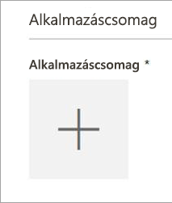
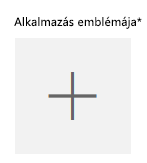
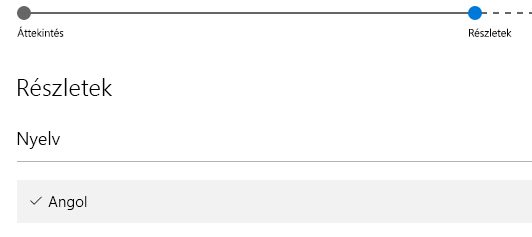

# Power BI-vizualizáció beküldése az AppSource-ba az Értékesítői irányítópult használatával

El kell küldenie egy e-mailt a **pbiviz-** és a **pbix-fájllal** a Power BI csapatának, mielőtt beküldené a vizualizációt az AppSource-ba. A Power BI csapata így feltöltheti a fájlokat a nyilvános megosztási kiszolgálóra. Ha ezt nem teszi meg, az AppSource nem tudja lekérni a fájlokat. El kell küldenie az új Power BI-vizualizációk beküldésére vonatkozó fájlokat, a meglévő Power BI-vizualizációk frissítéseit, és a visszautasított beküldések javításait.

>[!NOTE]
>[Az Értékesítői irányítópult](https://docs.microsoft.com/office/dev/store/use-the-seller-dashboard-to-submit-to-the-office-store) kivonása folyamatban van. Helyette a [Partnerközpont](https://docs.microsoft.com/partner-center/) lesz használatban. Az Értékesítői irányítópultot csak akkor használja, ha már folyamatban van egy Power BI-vizualizáció beküldése. Ha új Power BI-vizualizációt küld be az AppSource-ba, használja a [Partnerközpontot](office-store.md#submitting-to-appsource).

### Az Értékesítői irányítópult beküldési folyamata

Érvényes Office fejlesztői fiókkal kell rendelkeznie, hogy bejelentkezhessen az [Office fejlesztői központjába](https://dev.office.com/). Az Office fejlesztői fiókoknak (Live ID azonosítóval rendelkező) Microsoft-fiókoknak kell lenniük (például hotmail.com vagy outlook.com).

1. Lépjen a [fejlesztői központba](https://sellerdashboard.microsoft.com/Application/Summary).

2. Válassza az **Új alkalmazás hozzáadása** lehetőséget.

    

3. Válassza a **Power BI egyéni vizualizáció**, majd a **Tovább** lehetőséget.

4. Válassza az **Alkalmazáscsomag** területen lévő **+** lehetőséget, és válassza ki a Power BI-csapattól kapott alkalmazáscsomag XML-fájlját a fájlmegnyitási párbeszédpanelen.

    

5. A rendszer megerősítést küld, ha a Power BI-alkalmazáscsomagot érvényesnek találja.

    

6. Töltse ki az **Általános információk** adatait.

   * *Beküldés címe:* A beküldés neve a fejlesztői központban.
   * *Verzió:* A verziószámot a rendszer automatikusan kitölti a bővítmény alkalmazáscsomagja alapján.
   * *Kiadás dátuma (UTC):* Válassza ki, hogy mikor szeretné közzétenni az alkalmazást az áruházban. Ha egy jövőbeli dátumot választ, az alkalmazás az előtt nem lesz elérhető.
   * *Kategória:* Az első kategória automatikusan „Adatmegjelenítés + BI” lesz. Minden Power BI-vizualizáció címkézése így fog történni. Legfeljebb 2 további kategóriát adhat meg, hogy a felhasználók könnyen kikereshessék a vizualizációt.
   * *Tesztelést segítő jegyzetek és megjegyzések:* Megadhatja, ha utasításokkal szeretné ellátni a Microsoft tesztelőit.
   * *Alkalmazásom kriptográfiát vagy titkosítást használ, tartalmaz, támogat vagy hív meg:* Ne jelölje be.
   * *A bővítmény elérhetővé tétele az Office bővítmények katalógusában az iPaden:* Ne jelölje be.
7. Töltse fel a vizualizáció emblémáját az **Alkalmazásembléma** területen lévő **+** kiválasztásával. Ezután válassza ki az ikon fájlját a fájlmegnyitási párbeszédpanelen. A fájlnak .png, .jpg, .jpeg vagy .gif formátummal kell rendelkeznie. Pontosan 300 képpont (szélesség) × 300 képpont (magasság) méretűnek kell lennie, és nem lehet nagyobb 512 kB-nál.

    

8. Töltse ki a **Támogatási dokumentumok** adatait.

   * Támogatási dokumentum hivatkozása
   * Adatvédelmi dokumentum hivatkozása
   * Videó hivatkozása
   * Végfelhasználói licencszerződés (EULA)

       Fel kell töltenie egy EULA fájlt. Ez lehet saját EULA is, de az Office Áruház Power BI-vizualizációkra vonatkozó alapértelmezett EULA fájlját is használhatja. Az alapértelmezett EULA használatához illessze be a következő URL-címet az eladó irányítópultjának „Végfelhasználói licencszerződés” fájlfeltöltési párbeszédpaneljére: [https://visuals.azureedge.net/app-store/Power BI - Default Custom Visual EULA.pdf](https://visuals.azureedge.net/app-store/Power%20BI%20-%20Default%20Custom%20Visual%20EULA.pdf).

9. Válassza a **Tovább** lehetőséget, hogy a **Részletek** lapra lépjen.

10. Válassza a **Nyelv** lehetőséget, és válasszon egy nyelvet a listából.

    

11. Töltse ki a „Leírás” részleteit.

    * *Alkalmazás neve (ehhez a nyelvhez):* Írja be az alkalmazás címét, ahogyan az áruház oldalán kell megjelennie.
    * *Rövid leírás:* Adja meg az alkalmazás rövid leírását legfeljebb 100 karakterben, ahogyan az áruház oldalán meg fog jelenni. Ez a leírás az emblémával együtt jelenik meg a felső szintű oldalakon. A pbiviz csomagban szereplő leírást is használhatja.
    * *Hosszú leírás:* Adja meg az alkalmazás részletesebb leírását, amelyet az ügyfelek az alkalmazást részletező oldalon látnak. Ha azt szeretné, hogy a közösség hozzájárulhasson a vizualizáció továbbfejlesztéséhez, és ezért nyílt forráskódúvá szeretné tenni, itt adja meg a nyilvános adattár, például a GitHub hivatkozását.

12. Töltsön fel legalább egy képernyőképet. Ennek formátuma .png, .jpg, .jpeg vagy .gif lehet, Pontosan 1366 képpont (szélesség) × 768 képpont (magasság) méretűnek kell lennie. A fájl mérete nem lehet nagyobb 1024 kB-nál. *A hatékonyabb használat érdekében adjon hozzá szövegbuborékokat az egyes képernyőképeken látható fő jellemzők által képviselt érték kihangsúlyozásához.*

12. Ha több nyelvet szeretne hozzáadni, válassza a **Nyelv hozzáadása** lehetőséget, és ismételje meg a 10. és a 11. lépéseket. Ha több nyelvet ad meg, a felhasználók a saját nyelvükön tekinthetik meg az egyéni vizualizáció részleteit. A listában nem szereplő nyelvek esetében a vizualizáció információi alapértelmezés szerint az első kiválasztott nyelven jelennek meg.

13. Amikor végzett a nyelvek hozzáadásával, válassza a **Tovább** lehetőséget, hogy a **Hozzáférés letiltása** oldalra lépjen.

14. Ha nem szeretné, hogy bizonyos országokban vagy régiókban tartózkodó vásárlók használhassák vagy megvásárolhassák az alkalmazást, jelölje be a jelölőnégyzetet, és válasszon a listából.

15. Az **Árak** lapra való továbblépéshez válassza a **Tovább** lehetőséget.

16. Jelenleg csak az *ingyenes* vizualizációk támogatottak, és a vizualizáción belüli további vásárlások (alkalmazáson belüli vásárlások) nem engedélyezettek. Jelölje be az **Ez az alkalmazás ingyenes** jelölőnégyzetet.

    > [!NOTE]
    > Ha nem az ingyenes lehetőséget választja, vagy ha alkalmazáson belül megvásárolható tartalom van a beküldött vizualizációban, a rendszer elutasítja a beküldést.

17. Bejelölheti a **Mentés vázlatként** lehetőséget és elküldheti a vizualizációt később, vagy bejelölheti a **Küldés jóváhagyásra** jelölőnégyzetet, hogy elküldje az egyéni vizualizációt az Office Áruházba.

## A minősítés beküldésének folyamata az Értékesítői irányítópulton

Kövesse az ebben a szakaszban található utasításokat, ha az Értékesítői irányítópulton szeretne egy Power BI-vizualizációt minősítéshez beküldeni. Akkor használja ezt a módszert, ha korábban már elküldött egy Power BI-vizualizációt az AppSource-ba az Értékesítői irányítópulton.

1. Küldjön egy e-mailt a Power BI-vizualizációk támogatásáért felelő csapatnak (pbicvsupport@microsoft.com). Az e-mailben adja meg az alábbi információkat:
    * Cím: Vizualizáció minősítésére vonatkozó kérelem
    * Az emberileg olvasható forráskódot tartalmazó GitHub-adattárra mutató hivatkozás
    * [Feleljen meg a követelményeknek](power-bi-custom-visuals-certified.md#certification-requirements)
    * Sikeres kódfelülvizsgálat

2. A Microsoft Power BI-vizualizációkért felelős csapata értesíti, amint a Power BI-vizualizáció megkapja a minősítést, és elérhetővé válik a [minősített Power BI-vizualizációk](power-bi-custom-visuals-certified.md#certified-power-bi-visuals) listájában, illetve a vizualizáció elutasítása esetén megküldi az orvosolandó problémák listáját. A fejlesztő felelőssége, hogy biztosítsa a megfelelő kommunikációt a Microsoft csapatával, és szükség esetén frissítse Minősített vizualizációit.

## A beküldési állapot és a használat nyomon követése

Áttekintheti az [érvényesítési szabályzatokat](https://dev.office.com/officestore/docs/validation-policies#13-power-bi-custom-visuals).

A beküldés után az [alkalmazás irányítópultján](https://sellerdashboard.microsoft.com/Application/Summary/) tekintheti meg a beküldés állapotát.

## A vizualizáció tanúsítása

Létrehozás után igény szerint [tanúsítványt](../developer/power-bi-custom-visuals-certified.md) szerezhet be a vizualizációhoz.

## Következő lépések

[Egyéni Power BI-vizualizáció fejlesztése](visuals/custom-visual-develop-tutorial.md)  
[Vizualizációk a Power BI-ban](../visuals/power-bi-report-visualizations.md)  
[Egyéni vizualizációk a Power BI-ban](../developer/power-bi-custom-visuals.md)  
[Tanúsítvány beszerzése Power BI-vizualizációhoz](../developer/power-bi-custom-visuals-certified.md)

További kérdései vannak? [Kérdezze meg a Power BI közösségét](https://community.powerbi.com/)
