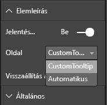

# <a name="tooltips-in-power-bi-visuals"></a>Elemleírások a Power BI-vizualizációkban

A vizualizációk mostantól ki tudják használni az elemleírások Power BI általi támogatását. A Power BI-elemleírások az alábbi műveletek kezelésére alkalmasak:

* Elemleírás megjelenítése.
* Elemleírás elrejtése.
* Elemleírás áthelyezése.

Az elemleírásokban címmel ellátott szöveges tartalom vagy érték jelenhet meg a megadott színben és átlátszósággal, a megadott koordinátákon. Az adatok az API-hoz kerülnek, a Power BI-gazdagép pedig ugyanúgy rendereli ezeket, mint a natív vizualizációk elemleírásait.

A következő kép egy sávdiagramban megjelenített elemleírás példáját mutatja be:


A fenti elemleírás egy oszlop kategóriáját és értékét mutatja meg. Kiterjeszthető úgy, hogy egyetlen elemleírásban több érték jelenjen meg.

## <a name="manage-tooltips"></a>Elemleírások kezelése

Az elemleírások kezelésére használható felület az „ITooltipService”. Ez értesíti a gazdagépet arról, hogy egy elemleírást kell megjeleníteni, eltávolítani vagy áthelyezni.

```typescript
    interface ITooltipService {
        enabled(): boolean;
        show(options: TooltipShowOptions): void;
        move(options: TooltipMoveOptions): void;
        hide(options: TooltipHideOptions): void;
    }
```

A vizualizációnak figyelnie kell a vizualizáción belüli egéreseményeket, és szükség esetén meg kell hívnia a `show()`, `move()` és `hide()` delegáltakat a `Tooltip****Options` objektumokban kitöltött megfelelő tartalommal.
A `TooltipShowOptions` és a `TooltipHideOptions` határozza meg, hogy mit kell megjeleníteni, és mit kell tenni ezen események előfordulásakor.

Mivel ezeknek a metódusoknak a hívása olyan felhasználói tevékenységhez kötődik, mint az egér mozgatása vagy az érintés, érdemes ezekhez az eseményekhez figyelőket létrehozni, amelyek viszont a `TooltipService` tagjait hívják meg.
Ez a minta egy `TooltipServiceWrapper` nevű osztályban összesít.

### <a name="the-tooltipservicewrapper-class"></a>A TooltipServiceWrapper osztály

Az osztály alapgondolata az, hogy tartalmazza a `TooltipService` egy példányát, figyeli az érintett elemeken történő D3-egéreseményeket, majd igény szerint végrehajtja a `show()` vagy a `hide()` hívását.

Az osztály ezeknek a leginkább a mögöttes D3-kódhoz hangolt és azzal együttműködő eseményeknek minden vonatkozó állapotát és logikáját tartalmazza és kezeli. A D3-interfész és -konverzió túllép ennek a cikknek a keretein.

A teljes mintakódot a [SampleBarChart vizualizáció-adattárban](https://github.com/Microsoft/PowerBI-visuals-sampleBarChart/commit/981b021612d7b333adffe9f723ab27783c76fb14) találhatja meg.

### <a name="create-tooltipservicewrapper"></a>Create TooltipServiceWrapper

A BarChart konstruktornak már van egy `TooltipServiceWrapper` tagja, amely a gazdaszámítógép `tooltipService` példányával van példányosítva a konstruktorban.

```typescript
        private tooltipServiceWrapper: ITooltipServiceWrapper;

        this.tooltipServiceWrapper = createTooltipServiceWrapper(this.host.tooltipService, options.element);
```

A `TooltipServiceWrapper` osztály tartalmazza a `tooltipService`-példányt, valamint a vizualizáció D3-gyökérelemét és az érintési paramétereket.

```typescript
    class TooltipServiceWrapper implements ITooltipServiceWrapper {
        private handleTouchTimeoutId: number;
        private visualHostTooltipService: ITooltipService;
        private rootElement: Element;
        private handleTouchDelay: number;

        constructor(tooltipService: ITooltipService, rootElement: Element, handleTouchDelay: number) {
            this.visualHostTooltipService = tooltipService;
            this.handleTouchDelay = handleTouchDelay;
            this.rootElement = rootElement;
        }
        .
        .
        .
    }
```

Az osztály egyetlen belépési pontja az eseményfigyelők regisztrálásához az `addTooltip` metódus.

### <a name="the-addtooltip-method"></a>Az addTooltip metódus

```typescript
        public addTooltip<T>(
            selection: d3.Selection<Element>,
            getTooltipInfoDelegate: (args: TooltipEventArgs<T>) => VisualTooltipDataItem[],
            getDataPointIdentity: (args: TooltipEventArgs<T>) => ISelectionId,
            reloadTooltipDataOnMouseMove?: boolean): void {

            if (!selection || !this.visualHostTooltipService.enabled()) {
                return;
            }
        ...
        ...
        }
```

* **selection: d3.Selection<Element>** : A D3-elemek, amelyeken az elemleírások kezelve vannak.

* **getTooltipInfoDelegate: (args: TooltipEventArgs<T>) => VisualTooltipDataItem[]** : Delegált az elemleírás (megjelenítendő) tartalmának kontextusonkénti feltöltéséhez.

* **getDataPointIdentity: (args: TooltipEventArgs<T>) => ISelectionId**: Delegált az adatpont-azonosító lekéréséhez – ebben a mintában nincs használva. 

* **reloadTooltipDataOnMouseMove?: boolean**: Logikai érték, amely azt jelzi, hogy mouseMove eseménykor frissíteni kell-e az elemleírás adatait – ebben a mintában nincs használva.

Mint látható, az `addTooltip` művelet nélkül kilép, ha a `tooltipService` le van tiltva, vagy nincs tényleges kijelölés.

### <a name="call-the-show-method-to-display-a-tooltip"></a>A show metódus hívása elemleírás megjelenítéséhez

Az `addTooltip` metódus ezután meghallgatja a `mouseover` D3-eseményt, ahogyan az a következő kódban látható:

```typescript
        ...
        ...
        selection.on("mouseover.tooltip", () => {
            // Ignore mouseover while handling touch events
            if (!this.canDisplayTooltip(d3.event))
                return;

            let tooltipEventArgs = this.makeTooltipEventArgs<T>(rootNode, true, false);
            if (!tooltipEventArgs)
                return;

            let tooltipInfo = getTooltipInfoDelegate(tooltipEventArgs);
            if (tooltipInfo == null)
                return;

            let selectionId = getDataPointIdentity(tooltipEventArgs);

            this.visualHostTooltipService.show({
                coordinates: tooltipEventArgs.coordinates,
                isTouchEvent: false,
                dataItems: tooltipInfo,
                identities: selectionId ? [selectionId] : [],
            });
        });
```

* **makeTooltipEventArgs**: Kinyeri a kijelölt D3-elemek kontextusát egy tooltipEventArgs-objektumba. A koordinátákat is kiszámítja.

* **getTooltipInfoDelegate**: Ez után a tooltipEventArgs alapján elkészíti az elemleírás tartalmát. Ez a BarChart osztály visszahívása, hiszen az a vizualizáció logikája. Az elemleíráson ez a szöveg jelenik meg ténylegesen.

* **getDataPointIdentity**: Ebben a mintában nincs használva.

* **this.visualHostTooltipService.show**: Az elemleírást megjelenítő hívás.  

A mintában a `mouseout` és a `mousemove` esemény további kezelése is megtalálható.

További információt a [SampleBarChart vizualizációs adattárban](https://github.com/Microsoft/PowerBI-visuals-sampleBarChart/commit/981b021612d7b333adffe9f723ab27783c76fb14) találhat.

### <a name="populate-the-tooltip-content-by-the-gettooltipdata-method"></a>Az elemleírás tartalmának feltöltése a getTooltipData metódussal

A BarChart osztály egy `getTooltipData` taggal lett felvéve, amely a következő adatokat nyeri ki egy VisualTooltipDataItem[] elembe: `category`, `value`, és `color`.

```typescript
        private static getTooltipData(value: any): VisualTooltipDataItem[] {
            return [{
                displayName: value.category,
                value: value.value.toString(),
                color: value.color,
                header: 'ToolTip Title'
            }];
        }
```

A fenti implementációban a `header` tag konstans, de összetettebb, dinamikus értékeket igénylő implementációban is használható. A `VisualTooltipDataItem[]` több elemmel is feltölthető, ezáltal az elemleírás többsoros lesz. Hasznos lehet olyan vizualizációkban, mint a halmozott sávdiagramok, ahol az elemleírás több adatpont adatait is megjelenítheti.

### <a name="call-the-addtooltip-method"></a>Az addTooltip metódus meghívása

Az utolsó lépés az `addTooltip` megtódus meghívása a tényleges adatok változása esetén. Ez a `BarChart.update()` metódusban történik. A hívás tehát a választott „sáv” elemek figyelésére történik, a fent leírtak szerint csak a `BarChart.getTooltipData()` átadásával.

```typescript
        this.tooltipServiceWrapper.addTooltip(this.barContainer.selectAll('.bar'),
            (tooltipEvent: TooltipEventArgs<number>) => BarChart.getTooltipData(tooltipEvent.data),
            (tooltipEvent: TooltipEventArgs<number>) => null);
```

## <a name="add-report-page-tooltips"></a>Jelentésoldal elemleírásainak hozzáadása

Az elemleírások jelentésoldali támogatásának hozzáadásával járó módosítások többsége a *capabilities.json* fájlban található.

Egy sémaminta a következő:

```json
{
    "tooltips": {
        "supportedTypes": {
            "default": true,
            "canvas": true
        },
        "roles": [
            "tooltips"
        ]
    }
}
```

A jelentésoldalak elemleírásai a **Formátum** panelen definiálhatók.



* `supportedTypes`: A vizualizáció által támogatott elemleírás-konfigurációkat adja meg, és ezek így jelennek meg a mezőben. 
   * `default`: Azt adja meg, hogy támogatott-e az elemleírások adatmezővel való „automatikus” kötése. 
   * `canvas`: Azt adja meg, hogy támogatottak-e a jelentésoldali elemleírások.

* `roles`: (Nem kötelező) Definiálása esetén megadja, hogy mely adatszerepkörök lesznek a kijelölt elemleírás-beállításhoz kötve a mezőben.

További információt a [jelentésoldali elemleírások használati útmutatójában](https://powerbi.microsoft.com/blog/power-bi-desktop-march-2018-feature-summary/#tooltips) találhat.

A jelentésoldali elemleírásnak az `ITooltipService.Show(options: TooltipShowOptions)` vagy az `ITooltipService.Move(options: TooltipMoveOptions)` hívása utáni végzett megjelenítéséhez a Power BI-gazdaszámítógép a selectionID tulajdonságot (a fenti `options` argumentum `identities` tulajdonsága) használja. A selectionID tulajdonságnak a kurzor alatti elemnek az elemleírás által lekérendő kijelölt adatait (kategória, sorozat stb.) kell megadnia.

A következő kód egy példa a selectionID az elemleírást megjelenítő hívásnak való küldésére:

```typescript
    this.tooltipServiceWrapper.addTooltip(this.barContainer.selectAll('.bar'),
        (tooltipEvent: TooltipEventArgs<number>) => BarChart.getTooltipData(tooltipEvent.data),
        (tooltipEvent: TooltipEventArgs<number>) => tooltipEvent.data.selectionID);
```
