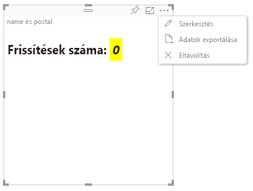

# A Power BI-vizualizációk speciális szerkesztési módja

Ha speciális felületi vezérlőkre van szüksége egy Power BI-vizualizációban, használja a Speciális szerkesztési módot. A jelentés szerkesztési módjában a **Szerkesztés** gombbal **Speciális** értékre állíthatja a szerkesztési módot. A vizualizáció az `EditMode` jelzővel állapítja meg, hogy megjelenítse-e a felületi vezérlőt.

A vizualizáció alapértelmezés szerint nem támogatja a Speciális szerkesztési módot. Eltérő viselkedés igénye esetén ezt explicit módon fel kell tüntetni a vizualizáció *capabilities.json* fájljában a `advancedEditModeSupport` tulajdonság beállításával.

Lehetséges értékek:

- `0` – NotSupported

- `1` – SupportedNoAction

- `2` – SupportedInFocus

## A Speciális szerkesztési mód megnyitása

A **Szerkesztés** gomb a következő esetekben jelenik meg:

* Az `advancedEditModeSupport` tulajdonság a *capabilities.json* fájlban `SupportedNoAction` vagy `SupportedInFocus` értékre van állítva.

* A vizualizáció jelentésszerkesztési módban van megnyitva.

Ha az `advancedEditModeSupport` tulajdonság hiányzik a *capabilities.json* fájlból, vagy `NotSupported` értékre van állítva, a **Szerkesztés** gomb eltűnik.

Amikor a **Szerkesztés** lehetőséget választja, a vizualizáció frissítési hívást kap, `Advanced` értékre állított EditMode beállítással. A *capabilities.json* fájlban beállított értékek alapján a következő műveletek mennek végbe:

* `SupportedNoAction`: Nincs szükség további lépésre a gazdagéptől.
* `SupportedInFocus`: A gazdagép fókusz módban jeleníti meg a vizualizációt.

## Kilépés a Speciális szerkesztési módból

A **Vissza a jelentéshez** gomb a következő esetekben jelenik meg:

* Az `advancedEditModeSupport` tulajdonság a *capabilities.json* fájlban `SupportedInFocus` értékre van állítva.
