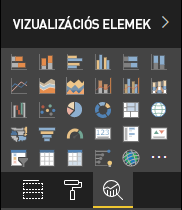

# <a name="the-analytics-pane-in-power-bi-visuals"></a>Az Elemzés panel Power BI-vizualizációkban

Az **Elemzés panel** 2018 novemberében lett bevezetve [natív vizualizációkhoz](https://docs.microsoft.com/power-bi/desktop-analytics-pane).
Ez a cikk azt ismerteti, hogy hogyan jeleníthetik meg és kezelhetik tulajdonságaikat a Power BI-vizualizációk az API 2.5.0-ás verziójával az **Elemzés panelen**.



## <a name="manage-the-analytics-pane"></a>Az Elemzés panel kezelése

Az **Elemzés** panel kezelése a tulajdonságok [**Formátum** panelen](https://docs.microsoft.com/power-bi/developer/custom-visual-develop-tutorial-format-options) végzett kezeléséhez hasonlóan, a vizualizáció *capabilities.json* fájljában definiált objektummal végezhető. 

Az **Elemzés** panel esetében az eltérések a következők:

* Az objektum definíciója alatt egy **objectCategory** mezőt is fel kell venni a 2 értékkel.

    > [!NOTE]
    > A nem kötelező `objectCategory` mező az API 2.5.0-ás verziójában lett bevezetve. A vizualizációnak az objektum által vezérelt jellemzőjét határozza meg (1 = Formázás, 2 = Elemzés). A `Formatting` olyan elemekre vonatkozik, mint a megjelenés, a színek, a tengelyek és a címkék. Az `Analytics` előrejelzésekhez, trendvonalakhoz, referenciavonalakhoz, alakzatokhoz és hasonló elemekhez használható.
    >
    > Ha az érték nincs megadva, az `objectCategory` alapértelmezett értéke „Formázás”.

* Az objektumnak rendelkeznie kell az alábbi két tulajdonsággal:
    * A `show` típusa `bool`, alapértelmezett értéke `false`.
    * A `displayName` típusa `text`. Ennek az alapértelmezettnek választott értéke lesz a példány kezdeti megjelenítendő neve.

```json
{
  "objects": {
    "YourAnalyticsPropertiesCard": {
      "displayName": "Your analytics properties card's name",
      "objectCategory": 2,
      "properties": {
        "show": {
          "type": {
            "bool": true
          }
        },
        "displayName": {
          "type": {
            "text": true
          }
        },
      ... //any other properties for your Analytics card
      }
    }
  ...
  }
}
```

Más tulajdonságok is a **Formátum** objektumoknál használt módon határozhatók meg. Az objektumok enumerálása pontosan úgy végezhető el, ahogyan a **Formátum** panelen.

## <a name="known-limitations-and-issues-of-the-analytics-pane"></a>Az Elemzés panel ismert korlátozásai és problémái

* Az **Elemzés** panel egyelőre nem támogat több példányt. Az objektumokhoz nem tartozhat más [selector](https://microsoft.github.io/PowerBI-visuals/docs/concepts/objects-and-properties/#selector), csak statikus (tehát „selector”: null), és a Power BI-vizualizációk nem rendelkezhetnek egy kártya több, felhasználó által definiált példányával.
* Az `integer` típusú tulajdonságok nem megfelelően jelennek meg. Ennek elkerülésére használható a `numeric` típus.

> [!NOTE]
> * Az **Elemzés** panelt csak olyan objektumokhoz érdemes használni, amelyek új információkat nyújtanak, vagy új megvilágításba helyezik a megjelenített információt (ilyenek például a fontos trendeket szemléltető dinamikus referenciavonalak).
> * A vizualizáció megjelenését szabályozó beállításokat (tehát a formázást) ajánlott a **Formátum** panelen tartani.
