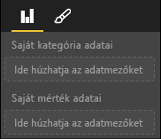

# <a name="capabilities-and-properties-of-power-bi-visuals"></a>Power BI-vizualizációk képességei és tulajdonságai 

A képességek használatával a vizualizációról közölhet információkat a gazdagéppel. A képességek modell egyik tulajdonságának megadása sem kötelező (`optional`).

A vizualizáció képességeinek gyökérobjektumai a `dataRoles`, a `dataViewMappings` és így tovább.

```json
{
    "dataRoles": [ ... ],
    "dataViewMappings": [ ... ],
    "objects":  { ... },
    "supportsHighlight": true|false,
    "advancedEditModeSupport": 0|1|2,
    "sorting": { ... }
}

```

## <a name="define-the-data-fields-that-your-visual-expects-dataroles"></a>A vizualizáció által várt adatmezők megadása: dataRoles

Az adatokhoz köthető mezők definiálására a `dataRoles` elem használható. A `dataRoles``DataViewRole`-objektumok egy tömbjét veszi alapul, amely az összes szükséges tulajdonságot meghatározza.

### <a name="properties"></a>Tulajdonságok

* **name** (név): Az adatmező belső neve (egyedinek kell lennie).
* **kind**: A mező jellege:
    * `Grouping`: Mértékmezők csoportosítására használt diszkrét értékek.
    * `Measure`: Numerikus adatértékek.
    * `GroupingOrMeasure`: Csoportosításként vagy mértékként is használható értékek.
* **displayName**: A **Tulajdonságok** panelen a felhasználó számára megjelenő név.
* **description**: A mező rövid leírása (nem kötelező).
* **requiredTypes**: Az ehhez az adatszerepkörhöz szükséges adattípusok. A nem egyező értékek a null értékre lesznek módosítva (nem kötelező).
* **preferredTypes**: Az ehhez az adatszerepkörhöz előnyben részesített adattípusok (nem kötelező).

### <a name="valid-data-types-in-requiredtypes-and-preferredtypes"></a>A requiredTypes és a preferredTypes érvényes adattípusai

* **bool**: Logikai érték
* **integer**: Egész szám
* **numeric**: Numerikus érték
* **text**: Szöveges érték
* **geography**: Földrajzi adat

### <a name="example"></a>Példa

```json
"dataRoles": [
    {
        "displayName": "My Category Data",
        "name": "myCategory",
        "kind": "Grouping",
        "requiredTypes": [
            {
                "text": true
            },
            {
                "numeric": true
            },
            {
                "integer": true
            }
        ],
        "preferredTypes": [
            {
                "text": true
            }
        ]
    },
    {
        "displayName": "My Measure Data",
        "name": "myMeasure",
        "kind": "Measure",
        "requiredTypes": [
            {
                "integer": true
            },
            {
                "numeric": true
            }
        ],
        "preferredTypes": [
            {
                "integer": true
            }
        ]
    },
    {
        "displayNameKey": "Visual_Location",
        "name": "Locations",
        "kind": "Measure",
        "displayName": "Locations",
        "requiredTypes": [
            {
                "geography": {
                    "address": true
                }
            },
            {
                "geography": {
                    "city": true
                }
            },
            {
                "geography": {
                    "continent": true
                }
            },
            {
                "geography": {
                    "country": true
                }
            },
            {
                "geography": {
                    "county": true
                }
            },
            {
                "geography": {
                    "place": true
                }
            },
            {
                "geography": {
                    "postalCode": true
                }
            },
            {
                "geography": {
                    "region": true
                }
            },
            {
                "geography": {
                    "stateOrProvince": true
                }
            }
        ]
    }
]
```

A fenti adatszerepkörök a következő képen látható mezőket hozzák létre:



## <a name="define-how-you-want-the-data-mapped-dataviewmappings"></a>Az adatleképezés kívánt módjának megadása: dataViewMappings

A DataViewMappings tulajdonság azt írja le, hogy az adatszerepkörök hogyan kapcsolódnak egymáshoz, és lehetővé teszi a rájuk vonatkozó feltételes követelmények megadását is.

A legtöbb vizualizáció egyetlen leképezést biztosít, Ön azonban több dataViewMappings elemet is megadhat. Minden érvényes leképezés egy adatnézetet állít elő. 

```json
"dataViewMappings": [
    {
        "conditions": [ ... ],
        "categorical": { ... },
        "table": { ... },
        "single": { ... },
        "matrix": { ... }
    }
]
```

További információ: [A Power BI-vizualizációkban végzett adatnézet-leképezések ismertetése](dataview-mappings.md).

## <a name="define-property-pane-options-objects"></a>A Tulajdonságok panel beállításainak meghatározása: objects

Az objektumok a vizualizációkhoz társított testreszabható tulajdonságokat írják le. Az objektumok több tulajdonsággal rendelkezhetnek, és mindegyik tulajdonsághoz tartozik egy típus. A típusok azt jelzik, hogy mi lesz a tulajdonság. 

```json
"objects": {
    "myCustomObject": {
        "displayName": "My Object Name",
        "properties": { ... }
    }
}
```

További információ: [A Power BI-vizualizációk objektumai és tulajdonságai](objects-properties.md).

## <a name="handle-partial-highlighting-supportshighlight"></a>Részleges kiemelés kezelése: supportsHighlight

Ennek az értéknek az alapértelmezett beállítása `false`, ami azt jelenti, hogy az értékek automatikusan szűrve lesznek, ha az oldalon valamit kijelölnek. Ez az automatikus szűrés a vizualizációt is frissíti, hogy az csak a kijelölt értéket jelenítse meg. Ha az összes adatot meg szeretné jeleníteni úgy, hogy csak a kijelöltek legyenek kiemelve, a `supportsHighlight` értékét kell `true`-ra állítania a *capabilities.json* fájlban.

További információ: [Adatpontok kiemelése Power BI-vizualizációkban](highlight.md).

## <a name="handle-advanced-edit-mode-advancededitmodesupport"></a>Speciális szerkesztési mód kezelése: advancedEditModeSupport

A vizualizációk deklarálhatják, hogy támogathatják a speciális szerkesztési módot. A vizualizációk alapértelmezés szerint nem támogatják a speciális szerkesztési módot, kivéve ha ez a *capabilities.json* fájlban másként van megadva.

További információ: [Speciális szerkesztési mód Power BI-vizualizációkban](advanced-edit-mode.md).

## <a name="data-sorting-options-for-visual-sorting"></a>Adatrendezési beállítások vizualizációkhoz: sorting

A vizualizációk a funkcióikkal definiálhatják rendezési viselkedésüket. A vizualizációk alapértelmezés szerint nem támogatják a rendezési sorrend módosítását, kivéve ha ez a *capabilities.json* fájlban másként van megadva.

További információ: [A Power BI-vizualizációk rendezési beállításai](sort-options.md).
