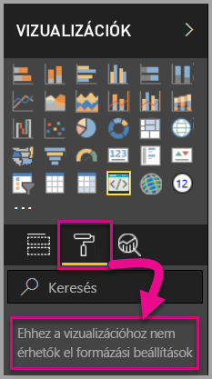
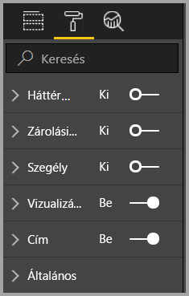
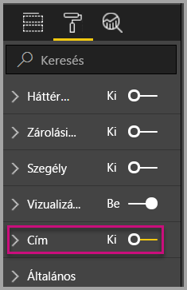
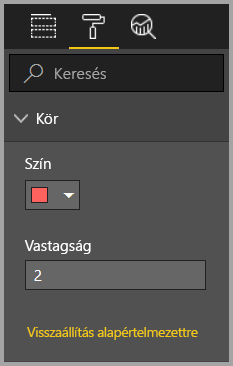
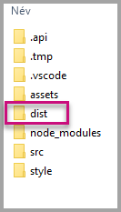
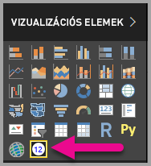

# <a name="tutorial-adding-formatting-options-to-a-power-bi-visual"></a>Oktatóanyag: Formázási beállítások hozzáadása Power BI-vizualizációhoz

Az oktatóanyag bemutatja, hogyan adhat hozzá közös tulajdonságokat a vizualizációhoz.

Az oktatóanyag a következőket ismerteti:
> [!div class="checklist"]
> * Vizualizáció tulajdonságainak hozzáadása.
> * A vizualizáció becsomagolása.
> * Egyéni vizualizáció importálása egy Power BI-jelentésbe.

## <a name="adding-formatting-options"></a>Formázási beállítások hozzáadása

1. A **Power BI-ban** válassza a **Formátum lapot**.

    Ekkor a következő üzenet jelenik meg: *Ehhez a megjelenítéshez nem érhetők el formázási beállítások.*

    

2. A **Visual Studio Code**-ban nyissa meg a *capabilities.json* fájlt.

3. A **dataViewMappings** tömb előtt adja hozzá az **objects** (objektumok) elemet (a 8. sor után).

    ```json
    "objects": {},
    ```

    

4. Mentse a **capabilities.json** fájlt.

5. A **Power BI-ban** tekintse át ismét a formázási beállításokat.

    > [!Note]
    > Ha nem változtak meg a formázási beállítások, válassza az **Egyéni vizualizáció újbóli betöltése** parancsot.

    

6. A **Cím** beállítást állítsa *Ki* értékűre. Figyelje meg, hogy a vizualizáció bal felső sarkában már nem jelenik meg a mérték neve.

    

    

### <a name="adding-custom-formatting-options"></a>Egyéni formázási beállítások hozzáadása

Egyéni tulajdonságok hozzáadásával konfigurálhatja a kör színét vagy akár a szegély vastagságát.

1. A PowerShellben állítsa le az egyéni vizualizációt.

2. A Visual Studio Code-ban keresse meg a **capabilities.json** fájlt, és illessze be a következő JSON-töredéket az **objects** objektumba.

    ```json
        {
            "circle": {
                "displayName": "Circle",
                "properties": {
                    "circleColor": {
                        "displayName": "Color",
                        "description": "The fill color of the circle.",
                        "type": {
                            "fill": {
                                "solid": {
                                    "color": true
                                }
                            }
                        }
                    },
                    "circleThickness": {
                        "displayName": "Thickness",
                        "description": "The circle thickness.",
                        "type": {
                            "numeric": true
                        }
                    }
                }
            }
        }
    ```

    A JSON-töredék írja le a kör nevű csoportot, amely két beállításból áll. Ezek neve circleColor és circleThickness.

   

3. Mentse a **capabilities.json** fájlt.

4. Az **Explorer ablaktáblán** nyissa meg az **src** mappát, és válassza ki a **settings.ts** fájlt. *Ez a fájl tartalmazza a kezdő vizualizáció beállításait*.

5. A **settings.ts** fájlban cserélje le a két osztályt a következő kódra.

    ```typescript
    export class CircleSettings {
        public circleColor: string = "white";
        public circleThickness: number = 2;
    }
    export class VisualSettings extends DataViewObjectsParser {
        public circle: CircleSettings = new CircleSettings();
    }
    ```

    

    Ez a modul definiálja a két osztályt. A **CircleSettings** osztály két tulajdonságot definiál, amelyek neve megegyezik a **capabilities.json** fájlban definiált objektumokéval (**circleColor** és **circleThickness**), valamint beállítja azok alapértelmezett értékét. A **VisualSettings** osztály örökli a **DataViewObjectParser** osztályt, és hozzáad egy **circle** nevű tulajdonságot, amelynek neve megegyezik a *capabilities.json* fájlban definiált objektuméval, és a **CircleSettings** egy példányát adja vissza.

6. Mentse a **settings.ts** fájlt.

7. Nyissa meg a **visual.ts** fájlt.

8. A **visual.ts** fájlban

    importálja a `VisualSettings`, a `VisualObjectInstanceEnumeration` és az `EnumerateVisualObjectInstancesOptions` osztályt:

    ```typescript
    import { VisualSettings } from "./settings";
    import VisualObjectInstanceEnumeration = powerbi.VisualObjectInstanceEnumeration;
    import EnumerateVisualObjectInstancesOptions = powerbi.EnumerateVisualObjectInstancesOptions;
    ```

    és a **Visual** osztályban adja hozzá a következő tulajdonságot:

    ```typescript
    private visualSettings: VisualSettings;
    ```

    A tulajdonság a **VisualSettings** objektumra mutató hivatkozást tartalmaz, és leírja a vizualizáció beállításait.

    

9. A **Visual** osztályban adja hozzá a következő metódust az **update** (frissítés) metódus előtt. Ez a metódus a formázási beállítások feltöltésére szolgál.

    ```typescript
    public enumerateObjectInstances(options: EnumerateVisualObjectInstancesOptions): VisualObjectInstanceEnumeration {
        const settings: VisualSettings = this.visualSettings || <VisualSettings>VisualSettings.getDefault();
        return VisualSettings.enumerateObjectInstances(settings, options);
    }
    ```

    Ez a metódus a formázási beállítások feltöltésére szolgál.

    

10. Az **update** (frissítés) metódusban a **radius** (sugár) változó megadása előtt adja hozzá a következő kódot.

    ```typescript
    this.visualSettings = VisualSettings.parse<VisualSettings>(dataView);

    this.visualSettings.circle.circleThickness = Math.max(0, this.visualSettings.circle.circleThickness);
    this.visualSettings.circle.circleThickness = Math.min(10, this.visualSettings.circle.circleThickness);
    ```

    Ez a kód kéri le a formázási beállításokat. Kiigazítja a **circleThickness** tulajdonságba érkező összes értéket: a negatív értékeket 0-ra, a 10-nél nagyobb értékeket pedig 10-re módosítja.

    

11. A **circle (kör) elem** esetén módosítja a **fill style** (kitöltési stílus) tulajdonsághoz továbbított értéket a következő kifejezésre.

    ```typescript
    this.visualSettings.circle.circleColor
    ```

    

12. A **circle (kör) elemnél** módosítja a **stroke-width style** tulajdonsághoz továbbított értéket a következő kifejezésre.

    ```typescript
    this.visualSettings.circle.circleThickness
    ```

    

13. Mentse a visual.ts fájlt.

14. A PowerShellben indítsa el a vizualizációt.

    ```powershell
    pbiviz start
    ```

15. A **Power BI-ban** a vizualizáció fölött lebegő eszköztáron válassza az **Átváltás automatikus újrabetöltésre** lehetőséget.

16. A **vizualizáció formázási** beállításai között bontsa ki a **Kör** elemet.

    

    Módosítsa a **szín** és a **vastagság** beállítást.

    A **vastagság** esetében adjon megy egy negatív és egy 10-nél nagyobb értéket. Figyelje meg, hogy a vizualizáció az elfogadható minimális vagy maximális értékre korrigálja azt.

## <a name="packaging-the-custom-visual"></a>Egyéni vizualizációk becsomagolása

Adja meg az egyéni vizualizációs projekt tulajdonságainak értékeit, frissítse az ikonfájlt, majd csomagolja be az egyéni vizualizációt.

1. A **PowerShellben** állítsa le az egyéni vizualizációt.

2. Nyissa meg a **pbiviz.json** fájt a **Visual Studio Code-ban**.

3. A **visual** objektumban módosítsa a **displayName** tulajdonságot a *Circle Card* értékre.

    A **Vizualizációk** ablaktáblán az ikonra mutatva láthatóvá válik a megjelenített név.

    

4. A **description** (leírás) tulajdonsághoz írja be a következő szöveget.

    *Egy formázott mérési értéket jelenít meg egy kör belsejében*

5. Töltse ki a vizualizáció **supportUrl** és **gitHubUrl** értékét.

    Például:

    ```json
    {
        "supportUrl": "https://community.powerbi.com",
        "gitHubUrl": "https://github.com/microsoft/PowerBI-visuals-circlecard"
    }
    ```

6. Adja meg a részleteket az **author** objektumban.

7. Mentse a **pbiviz.json** fájlt.

8. Az **assets** (eszközök) objektumban figyelje meg, hogy a dokumentum meghatározza az ikon elérési útját. Az ikon az a kép, amelyik a **_Vizualizációk_** ablaktáblán jelenik meg. Ennek egy *20 képpont × 20 képpont* méretű **PNG**-fájlnak kell lennie.

9. A Windows Intézőben másolja a vágólapra az icon.png fájlt, majd illessze be az Assets mappába, lecserélve az alapértelmezett fájlt.

10. A Visual Studio Code Explorer ablaktábláján bontsa ki az Assets mappát, majd válassza ki az icon.png fájlt.

11. Tekintse át az ikont.

    

12. Győződjön meg a Visual Studio Code-ban arról, hogy minden fájlt mentett.

13. Az egyéni vizualizáció becsomagolásához írja be a következő parancsot a PowerShellben.

    ```powershell
    pbiviz package
    ```

    

Ezzel a csomag a projekt **dist** mappájába kerül. A csomag tartalmaz mindent, amire szükség van az egyéni vizualizáció a Power BI szolgáltatásba vagy egy Power BI Desktop-jelentésbe történő importálásához. A becsomagolt egyéni vizualizáció ezzel használatra kész.

## <a name="importing-the-custom-visual"></a>Egyéni vizualizáció importálása

Most már megnyithatja a Power BI Desktop-jelentést, és importálhatja a Circle Card egyéni vizualizációt.

1. A **Power BI Desktopban** hozzon létre egy új jelentést bármelyik *mintaadatkészletből*

2. A **_Vizualizációk_** ablaktáblán kattintson a **három pontra**, majd válassza az **Importálás** fájlból lehetőséget.

    

3. Az **Importálás ablakban** válassza az **Importálás** elemet.

4. A Megnyitás ablakban navigáljon a projektkönyvtár **dist** mappájába.

5. Jelölje ki a **circleCard.pbiviz** fájlt, majd kattintson a **Megnyitás** gombra.

6. A vizualizáció sikeres importálása után kattintson az **OK** gombra.

7. Ellenőrizze, hogy a vizualizáció megjelent-e a **_Vizualizációk_** ablaktáblán.

    

8. Mutasson a **Circle Card** ikonra, és figyelje meg a megjelenő elemleírást.

## <a name="debugging"></a>Hibakeresés

Az egyéni vizualizációban végzett hibakereséssel kapcsolatban a [hibakeresési útmutató](https://microsoft.github.io/PowerBI-visuals/docs/how-to-guide/how-to-debug/) szolgál hasznos tanácsokkal.

## <a name="next-steps"></a>Következő lépések

Újonnan elkészített vizualizációit elérhetővé teheti mások számára, ha beküldi őket az **AppSource**-ba. Erről az eljárásról a [Power BI-vizualizációk közzététele az AppSource-ban](office-store.md) című cikk nyújt részletesebb tájékoztatást.
