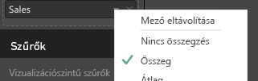
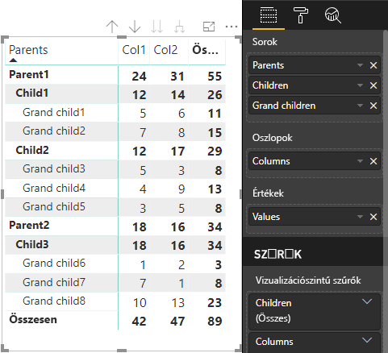

# <a name="understand-data-view-mapping-in-power-bi-visuals"></a>A Power BI-vizualizációkban végzett adatnézeti-leképezések ismertetése

Ez a cikk az adatnézet-leképezést ismerteti, valamint leírja, hogy az adatszerepkörök milyen viszonyban állnak egymással, és hogyan teszik lehetővé a rájuk vonatkozó feltételes követelmények megadását. A cikk a `dataMappings` egyes típusait is ismerteti.

Minden érvényes leképezés állít elő adatnézetet, de jelenleg vizualizációnként csak egy leképezés végrehajtását támogatjuk. Általában csak egy adatnézet áll elő. Bizonyos feltételek mellett azonban több adatleképezést is megadhat. Ilyenkor használható a következő:

```json
"dataViewMappings": [
    {
        "conditions": [ ... ],
        "categorical": { ... },
        "single": { ... },
        "table": { ... },
        "matrix": { ... }
    }
]
```

A Power BI csak akkor hoz létre leképezést az adatokhoz, ha az érvényes leképezés szerepel a `dataViewMappings` listában.

Másként fogalmazva a `categorical` esetleg definiálva van a `dataViewMappings` szakaszban, más leképezések, például a `table` vagy a `single` viszont nem. Például:

```json
"dataViewMappings": [
    {
        "categorical": { ... }
    }
]
```

A Power BI egyetlen `categorical` leképezéssel állít elő adatnézetet, a `table` és a többi leképezés pedig nincs definiálva:

```javascript
{
    "categorical": {
        "categories": [ ... ],
        "values": [ ... ]
    },
    "metadata": { ... }
}
```

## <a name="conditions"></a>Feltételek

Ez a szakasz egy adott adatleképezés feltételeit írja le. Több feltételcsoportot is megadhat, és ha az adatok megfelelnek a feltételcsoportok valamelyikének, a vizualizáció érvényesként fogadja el az adathalmazt.

Jelenleg minden mezőnél megadhatja a minimum és a maximum értéket. Ez az érték az adatszerepkörhöz köthető mezők számát jelöli. 

> [!NOTE]
> Ha a feltétel nem tartalmaz adatszerepkört, akkor tetszőleges számú mezővel rendelkezhet.

### <a name="example-1"></a>1\. példa

Több mezőt is áthúzhat az egyes adatszerepkörökbe. Ebben a példában a kategória egy adatmezőre, a mérték pedig két adatmezőre van korlátozva.

```json
"conditions": [
    { "category": { "max": 1 }, "y": { "max": 2 } },
]
```

### <a name="example-2"></a>2\. példa

Ebben a példában két feltétel egyikét kell megadnia:
* Pontosan egy kategória-adatmező és pontosan kettő mérték
* Pontosan két kategória és pontosan egy mérték.

```json
"conditions": [
    { "category": { "min": 1, "max": 1 }, "measure": { "min": 2, "max": 2 } },
    { "category": { "min": 2, "max": 2 }, "measure": { "min": 1, "max": 1 } }
]
```

## <a name="single-data-mapping"></a>Egyirányú adatleképezés

Az egyirányú adatleképezés az adatleképezés legegyszerűbb formája. Egyetlen mértékmezőt fogad el, és megadja a teljes értéket. Ha a mező numerikus, akkor az összeget adja. Ellenkező esetben az egyedi értékek számát adja.

Egyirányú adatleképezés használatához meg kell adnia a leképezni kívánt adatszerepkör nevét. Ez a leképezés csak egyetlen mértékmezővel működik. Egy újabb mező hozzárendelése esetén nem lesz adatnézet generálva, tehát ajánlott olyan feltételt is megadni, amely egyetlen mezőre korlátozza az adatokat.

> [!NOTE]
> Ez az adatleképezés más adatnézettel együtt nem használható. A célja az, hogy egyetlen numerikus értékre csökkentse az adatokat.

### <a name="example-3"></a>3\. példa

```json
{
    "dataRoles": [
        {
            "displayName": "Y",
            "name": "Y",
            "kind": "Measure"
        }
    ],
    "dataViewMappings": [
        {
            "conditions": [
                {
                    "Y": {
                        "max": 1
                    }
                }
            ],
            "single": {
                "role": "Y"
            }
        }
    ]
}
```

Az eredményül kapott adatnézet továbbra is tartalmazza a többi típust (táblázatos, kategorikus stb.), de minden leképezés csak egyetlen értéket tartalmaz. Az ajánlott eljárás az, ha csak az egyedi értékhez fér hozzá.

```JSON
{
    "dataView": [
        {
            "metadata": null,
            "categorical": null,
            "matrix": null,
            "table": null,
            "tree": null,
            "single": {
                "value": 94163140.3560001
            }
        }
    ]
}
```

Mintakód az egyszerű adatnézet-leképezés feldolgozásához

```typescript
"use strict";
import powerbi from "powerbi-visuals-api";
import DataView = powerbi.DataView;
import DataViewSingle = powerbi.DataViewSingle;
// standart imports
// ...

export class Visual implements IVisual {
    private target: HTMLElement;
    private host: IVisualHost;
    private valueText: HTMLParagraphElement;

    constructor(options: VisualConstructorOptions) {
        // constructor body
        this.target = options.element;
        this.host = options.host;
        this.valueText = document.createElement("p");
        this.target.appendChild(this.valueText);
        // ...
    }

    public update(options: VisualUpdateOptions) {
        const dataView: DataView = options.dataViews[0];
        const singleDataView: DataViewSingle = dataView.single;

        if (!singleDataView ||
            !singleDataView.value ) {
            return
        }

        this.valueText.innerText = singleDataView.value.toString();
    }
}
```

A vizualizáció ennek eredményeképp egyetlen értéket jelenít meg a Power BI-ból:


## <a name="categorical-data-mapping"></a>Kategorikus adatleképezés

A kategorikus adatleképezés használatával egy vagy két független adatcsoportot lehet beolvasni.

### <a name="example-4"></a>4\. példa

Itt az előző példában használt adatszerepkörök definíciója látható:

```json
"dataRole":[
    {
        "displayName": "Category",
        "name": "category",
        "kind": "Grouping"
    },
    {
        "displayName": "Y Axis",
        "name": "measure",
        "kind": "Measure"
    }
]
```

Ez pedig a leképezés:

```json
"dataViewMappings": {
    "categorical": {
        "categories": {
            "for": { "in": "category" }
        },
        "values": {
            "select": [
                { "bind": { "to": "measure" } }
            ]
        }
    }
}
```

A példa egyszerű. Emberi nyelven így szól: „Képezd le a `category` adatszerepkörömet úgy, hogy minden olyan mezőnél, amelyet áthúzok a `category` területre, a mező adatai a `categorical.categories`-ra legyenek leképezve. A `measure` adatszerepkörömet pedig képezd le a `categorical.values`-ra.”

* **for...in**: Ebben az adatszerepkörben minden elemet vegyen fel az adatlekérdezésbe.
* **bind...to**: Ugyanazt az eredményt adja, mint a *for...in*, azonban azt várja, hogy a DataRole feltétele egyetlen mezőre lesz korlátozva.

### <a name="example-5"></a>5\. példa

Ez a példa az előző példában szereplő első két adatszerepkört használja, továbbá definiálja a `grouping` és a `measure2` mezőt.

```json
"dataRole":[
    {
        "displayName": "Category",
        "name": "category",
        "kind": "Grouping"
    },
    {
        "displayName": "Y Axis",
        "name": "measure",
        "kind": "Measure"
    },
    {
        "displayName": "Grouping with",
        "name": "grouping",
        "kind": "Grouping"
    },
    {
        "displayName": "X Axis",
        "name": "measure2",
        "kind": "Grouping"
    }
]
```

Ez pedig a leképezés:

```json
"dataViewMappings":{
    "categorical": {
        "categories": {
            "for": { "in": "category" }
        },
        "values": {
            "group": {
                "by": "grouping",
                "select":[
                    { "bind": { "to": "measure" } },
                    { "bind": { "to": "measure2" } }
                ]
            }
        }
    }
}
```

Itt a különbség a categorical.values leképezése lesz. Ez ennyit jelent: „Képezd le a `measure` és a `measure2` adatszerepkört úgy, hogy a `grouping` adatszerepkör alapján legyenek csoportosítva.”

### <a name="example-6"></a>6\. példa

Az alábbiak az adatszerepkörök:

```json
"dataRoles": [
    {
        "displayName": "Categories",
        "name": "category",
        "kind": "Grouping"
    },
    {
        "displayName": "Measures",
        "name": "measure",
        "kind": "Measure"
    },
    {
        "displayName": "Series",
        "name": "series",
        "kind": "Measure"
    }
]
```

Ez pedig az adatnézet-leképezés:

```json
"dataViewMappings": [
    {
        "categorical": {
            "categories": {
                "for": {
                    "in": "category"
                }
            },
            "values": {
                "group": {
                    "by": "series",
                    "select": [{
                            "for": {
                                "in": "measure"
                            }
                        }
                    ]
                }
            }
        }
    }
]
```

A kategorikus adatnézet a következő módon jeleníthető meg:

| Kategorikus |  |  | | | |
|-----|-----|------|------|------|------|
| | Év | 2013 | 2014 | 2015 | 2016 |
| Ország | | |
| USA | | x | x | 650 | 350 |
| Kanada | | x | 630 | 490 | x |
| Mexikó | | 645 | x | x | x |
| Egyesült Királyság | | x | x | 831 | x |

A Power BI ezt a kategorikus adatnézetként állítja elő. Ez a kategóriák csoportja.

```JSON
{
    "categorical": {
        "categories": [
            {
                "source": {...},
                "values": [
                    "Canada",
                    "USA",
                    "UK",
                    "Mexico"
                ],
                "identity": [...],
                "identityFields": [...],
            }
        ]
    }
}
```

Minden kategória egy értékcsoportra van leképezve. Az értékek mindegyike sorozat szerint van csoportosítva, ami években van kifejezve.

Minden `values` tömb például minden évre vonatkozóan képvisel adatokat.
Emellett minden `values` tömb négy értékkel rendelkezik, Kanadához, az USA-hoz, az Egyesült Királysághoz és Mexikóhoz (ebben a sorrendben):

```JSON
{
    "values": [
        // Values for 2013 year
        {
            "source": {...},
            "values": [
                null, // Value for `Canada` category
                null, // Value for `USA` category
                null, // Value for `UK` category
                645 // Value for `Mexico` category
            ],
            "identity": [...],
        },
        // Values for 2014 year
        {
            "source": {...},
            "values": [
                630, // Value for `Canada` category
                null, // Value for `USA` category
                null, // Value for `UK` category
                null // Value for `Mexico` category
            ],
            "identity": [...],
        },
        // Values for 2015 year
        {
            "source": {...},
            "values": [
                490, // Value for `Canada` category
                650, // Value for `USA` category
                831, // Value for `UK` category
                null // Value for `Mexico` category
            ],
            "identity": [...],
        },
        // Values for 2016 year
        {
            "source": {...},
            "values": [
                null, // Value for `Canada` category
                350, // Value for `USA` category
                null, // Value for `UK` category
                null // Value for `Mexico` category
            ],
            "identity": [...],
        }
    ]
}
```

A kategorikus adatnézet-leképezés feldolgozására szolgáló kódmintát alább ismertetjük. A minta egy hierarchikus szerkezetet hoz létre `Country => Year => Value`

```typescript
"use strict";
import powerbi from "powerbi-visuals-api";
import DataView = powerbi.DataView;
import DataViewDataViewCategoricalSingle = powerbi.DataViewCategorical;
import DataViewValueColumnGroup = powerbi.DataViewValueColumnGroup;
import PrimitiveValue = powerbi.PrimitiveValue;
// standart imports
// ...

export class Visual implements IVisual {
    private target: HTMLElement;
    private host: IVisualHost;
    private categories: HTMLElement;

    constructor(options: VisualConstructorOptions) {
        // constructor body
        this.target = options.element;
        this.host = options.host;
        this.categories = document.createElement("pre");
        this.target.appendChild(this.categories);
        // ...
    }

    public update(options: VisualUpdateOptions) {
        const dataView: DataView = options.dataViews[0];
        const categoricalDataView: DataViewCategorical = dataView.categorical;

        if (!categoricalDataView ||
            !categoricalDataView.categories ||
            !categoricalDataView.categories[0] ||
            !categoricalDataView.values) {
            return;
        }

        // Categories have only one column in data buckets
        // If you want to support several columns of categories data bucket, you should iterate categoricalDataView.categories array.
        const categoryFieldIndex = 0;
        // Measure has only one column in data buckets.
        // If you want to support several columns on data bucket, you should iterate years.values array in map function
        const measureFieldIndex = 0;
        let categories: PrimitiveValue[] = categoricalDataView.categories[categoryFieldIndex].values;
        let values: DataViewValueColumnGroup[] = categoricalDataView.values.grouped();

        let data = {};
        // iterate categories/countries
        categories.map((category: PrimitiveValue, categoryIndex: number) => {
            data[category.toString()] = {};
            // iterate series/years
            values.map((years: DataViewValueColumnGroup) => {
                if (!data[category.toString()][years.name] && years.values[measureFieldIndex].values[categoryIndex]) {
                    data[category.toString()][years.name] = []
                }
                if (years.values[0].values[categoryIndex]) {
                    data[category.toString()][years.name].push(years.values[measureFieldIndex].values[categoryIndex]);
                }
            });
        });

        this.categories.innerText = JSON.stringify(data, null, 6);
        console.log(data);
    }
}
```

A vizualizáció eredménye:


## <a name="table-data-mapping"></a>Táblázatos adatleképezés

A táblázatos adatnézet egy egyszerű adatleképezés. Ez lényegében adatpontok listája, ahol a numerikus adatpontok összesíthetőek.

### <a name="example-7"></a>7\. példa

A megadott képességekkel:

```json
"dataRoles": [
    {
        "displayName": "Column",
        "name": "column",
        "kind": "Measure"
    },
    {
        "displayName": "Value",
        "name": "value",
        "kind": "Measure"
    }
]
```

```json
"dataViewMappings": [
    {
        "table": {
            "rows": {
                "select": [
                    {
                        "for": {
                            "in": "column"
                        }
                    },
                    {
                        "for": {
                            "in": "value"
                        }
                    }
                ]
            }
        }
    }
]
```

A táblázatos adatnézetet a következő módon képezheti le:  

Példaadatok:

| Ország| Év | Értékesítés |
|-----|-----|------|
| USA | 2016 | 100 |
| USA | 2015 | 50 |
| Kanada | 2015 | 200 |
| Kanada | 2015 | 50 |
| Mexikó | 2013 | 300 |
| Egyesült Királyság | 2014 | 150 |
| USA | 2015 | 75 |

Adatkötés:


A Power BI a táblázatos adatnézetként jeleníti meg az adatokat. Nem feltételezhető, hogy az adatok rendezve vannak.

```JSON
{
    "table" : {
        "columns": [...],
        "rows": [
            [
                "Canada",
                2014,
                630
            ],
            [
                "Canada",
                2015,
                490
            ],
            [
                "Mexico",
                2013,
                645
            ],
            [
                "UK",
                2014,
                831
            ],
            [
                "USA",
                2015,
                650
            ],
            [
                "USA",
                2016,
                350
            ]
        ]
    }
}
```

Összesítheti is az adatokat, ha kijelöli a kívánt mezőt, majd az összegzést választja.  



Mintakód a táblázatos adatnézet-leképezés feldolgozásához.

```typescript
"use strict";
import "./../style/visual.less";
import powerbi from "powerbi-visuals-api";
// ...
import DataViewMetadataColumn = powerbi.DataViewMetadataColumn;
import DataViewTable = powerbi.DataViewTable;
import DataViewTableRow = powerbi.DataViewTableRow;
import PrimitiveValue = powerbi.PrimitiveValue;
// other imports
// ...

export class Visual implements IVisual {
    private target: HTMLElement;
    private host: IVisualHost;
    private table: HTMLParagraphElement;

    constructor(options: VisualConstructorOptions) {
        // constructor body
        this.target = options.element;
        this.host = options.host;
        this.table = document.createElement("table");
        this.target.appendChild(this.table);
        // ...
    }

    public update(options: VisualUpdateOptions) {
        const dataView: DataView = options.dataViews[0];
        const tableDataView: DataViewTable = dataView.table;

        if (!tableDataView) {
            return
        }
        while(this.table.firstChild) {
            this.table.removeChild(this.table.firstChild);
        }

        //draw header
        const tableHeader = document.createElement("th");
        tableDataView.columns.forEach((column: DataViewMetadataColumn) => {
            const tableHeaderColumn = document.createElement("td");
            tableHeaderColumn.innerText = column.displayName
            tableHeader.appendChild(tableHeaderColumn);
        });
        this.table.appendChild(tableHeader);

        //draw rows
        tableDataView.rows.forEach((row: DataViewTableRow) => {
            const tableRow = document.createElement("tr");
            row.forEach((columnValue: PrimitiveValue) => {
                const cell = document.createElement("td");
                cell.innerText = columnValue.toString();
                tableRow.appendChild(cell);
            })
            this.table.appendChild(tableRow);
        });
    }
}
```

A vizualizációstílusok fájlja (`style/visual.less`) a következő táblázatelrendezést tartalmazza:

```less
table {
    display: flex;
    flex-direction: column;
}

tr, th {
    display: flex;
    flex: 1;
}

td {
    flex: 1;
    border: 1px solid black;
}
```


## <a name="matrix-data-mapping"></a>Mátrixos adatleképezés

A mátrixos adatleképezés hasonló a táblázatos adatleképezéshez, de a sorok hierarchikusan jelennek meg. Bármelyik adatszerepkör-érték használható oszlopfejléc értékeként.

```json
{
    "dataRoles": [
        {
            "name": "Category",
            "displayName": "Category",
            "displayNameKey": "Visual_Category",
            "kind": "Grouping"
        },
        {
            "name": "Column",
            "displayName": "Column",
            "displayNameKey": "Visual_Column",
            "kind": "Grouping"
        },
        {
            "name": "Measure",
            "displayName": "Measure",
            "displayNameKey": "Visual_Values",
            "kind": "Measure"
        }
    ],
    "dataViewMappings": [
        {
            "matrix": {
                "rows": {
                    "for": {
                        "in": "Category"
                    }
                },
                "columns": {
                    "for": {
                        "in": "Column"
                    }
                },
                "values": {
                    "select": [
                        {
                            "for": {
                                "in": "Measure"
                            }
                        }
                    ]
                }
            }
        }
    ]
}
```

A Power BI hierarchikus adatstruktúrát hoz létre. A fahierarchia gyökere tartalmazza a `Category` szerepkör **Szülőelemek** oszlopából származó adatokat, az adatszerepkör-tábla **Gyermekelemek** oszlopából származó gyermekelemekkel.

Adatkészlet:

| Szülők | Gyermekek | Unokák | Oszlopok | Értékek |
|-----|-----|------|-------|-------|
| Parent1 | Child1 | Grand child1 | Col1 | 5 |
| Parent1 | Child1 | Grand child1 | Col2 | 6 |
| Parent1 | Child1 | Grand child2 | Col1 | 7 |
| Parent1 | Child1 | Grand child2 | Col2 | 8 |
| Parent1 | Child2 | Grand child3 | Col1 | 5 |
| Parent1 | Child2 | Grand child3 | Col2 | 3 |
| Parent1 | Child2 | Grand child4 | Col1 | 4 |
| Parent1 | Child2 | Grand child4 | Col2 | 9 |
| Parent1 | Child2 | Grand child5 | Col1 | 3 |
| Parent1 | Child2 | Grand child5 | Col2 | 5 |
| Parent2 | Child3 | Grand child6 | Col1 | 1 |
| Parent2 | Child3 | Grand child6 | Col2 | 2 |
| Parent2 | Child3 | Grand child7 | Col1 | 7 |
| Parent2 | Child3 | Grand child7 | Col2 | 1 |
| Parent2 | Child3 | Grand child8 | Col1 | 10 |
| Parent2 | Child3 | Grand child8 | Col2 | 13 |

A Power BI alap mátrix vizualizációja az adatokat táblázatként jeleníti meg.



A vizualizáció az alábbi kódban leírtak alapján kap adatstruktúrát (itt csak az első két táblázatsor látható):

```json
{
    "metadata": {...},
    "matrix": {
        "rows": {
            "levels": [...],
            "root": {
                "childIdentityFields": [...],
                "children": [
                    {
                        "level": 0,
                        "levelValues": [...],
                        "value": "Parent1",
                        "identity": {...},
                        "childIdentityFields": [...],
                        "children": [
                            {
                                "level": 1,
                                "levelValues": [...],
                                "value": "Child1",
                                "identity": {...},
                                "childIdentityFields": [...],
                                "children": [
                                    {
                                        "level": 2,
                                        "levelValues": [...],
                                        "value": "Grand child1",
                                        "identity": {...},
                                        "values": {
                                            "0": {
                                                "value": 5 // value for Col1
                                            },
                                            "1": {
                                                "value": 6 // value for Col2
                                            }
                                        }
                                    },
                                    ...
                                ]
                            },
                            ...
                        ]
                    },
                    ...
                ]
            }
        },
        "columns": {
            "levels": [...],
            "root": {
                "childIdentityFields": [...],
                "children": [
                    {
                        "level": 0,
                        "levelValues": [...],
                        "value": "Col1",
                        "identity": {...}
                    },
                    {
                        "level": 0,
                        "levelValues": [...],
                        "value": "Col2",
                        "identity": {...}
                    },
                    ...
                ]
            }
        },
        "valueSources": [...]
    }
}
```

## <a name="data-reduction-algorithm"></a>Adatcsökkentési algoritmus

Az adatnézetben kapott adatok mennyiségének szabályozására adatcsökkentési algoritmust alkalmazhat.

Alapértelmezés szerint minden Power BI-vizualizációnál alkalmazva van a top adatcsökkentési algoritmus, és a *count* (darabszám) értéke 1000 adatpontra van beállítva. Ez ugyanazzal az eredménnyel jár, mint a következő tulajdonságok módosítása a *capabilities.json* fájlban:

```json
"dataReductionAlgorithm": {
    "top": {
        "count": 1000
    }
}
```

A *count* értékét tetszőleges egész számra módosíthatja, amely akár 30000 is lehet. Az R-alapú Power BI-vizualizációk akár 150 000 sort is támogatnak.

## <a name="data-reduction-algorithm-types"></a>Az adatcsökkentési algoritmusok típusai

Az adatcsökkentési algoritmusok négyféle típusa állítható be:

* `top`: Ha az adatokat az adathalmaz elejétől kapott értékekre kívánja korlátozni. Az első *count* számú érték lesz felhasználva az adathalmazból.
* `bottom`: Ha az adatokat az adathalmaz végéről kapott értékekre kívánja korlátozni. Az utolsó „count” számú érték lesz felhasználva az adathalmazból.
* `sample`: Egy egyszerű mintavételezési algoritmussal csökkenti az adatok mennyiségét, amely *count* számú elemre korlátozódik. Ez azt jelenti, hogy az első és az utolsó elem is szerepel, és az összesen *count* számú elem között egyenlők a távolságok.
Ha az adathalmaz például {0; 1; 2;... 100}, és a *count* értéke 9, a következő értékeket fogja kapni: {0; 10; 20;... 100}.
* `window`: Egyszerre az adatpontok egy *count* számú elemet tartalmazó *tartományát* tölti be. A `top` és a `window` jelenleg egyenértékű. A tartomány beállítás teljes támogatásán még dolgozunk.

## <a name="data-reduction-algorithm-usage"></a>Az adatcsökkentési algoritmus használata

Az adatcsökkentési algoritmus kategorikus, táblázatos vagy mátrix adatnézet-leképezésben használható.

Kategorikus adatleképezéshez az algoritmust beállíthatja a `categories`-ra, és/vagy a `values` csoportszakaszaira.

### <a name="example-8"></a>8\. példa

```json
"dataViewMappings": {
    "categorical": {
        "categories": {
            "for": { "in": "category" },
            "dataReductionAlgorithm": {
                "window": {
                    "count": 300
                }
            }  
        },
        "values": {
            "group": {
                "by": "series",
                "select": [{
                        "for": {
                            "in": "measure"
                        }
                    }
                ],
                "dataReductionAlgorithm": {
                    "top": {
                        "count": 100
                    }
                }  
            }
        }
    }
}
```

Az adatcsökkentési algoritmust alkalmazhatja az adatnézet-leképezési táblázat `rows` szakaszára.

### <a name="example-9"></a>9\. példa

```json
"dataViewMappings": [
    {
        "table": {
            "rows": {
                "for": {
                    "in": "values"
                },
                "dataReductionAlgorithm": {
                    "top": {
                        "count": 2000
                    }
                }
            }
        }
    }
]
```

Az adatcsökkentési algoritmust alkalmazhatja az adatnézet-leképezési mátrix `rows` és `columns` szakaszára.

## <a name="next-steps"></a>Következő lépések

Olvassa el, hogyan [adhat lehatolási támogatást Power BI-vizualizációk adatnézeti leképezéseihez](drill-down-support.md).
