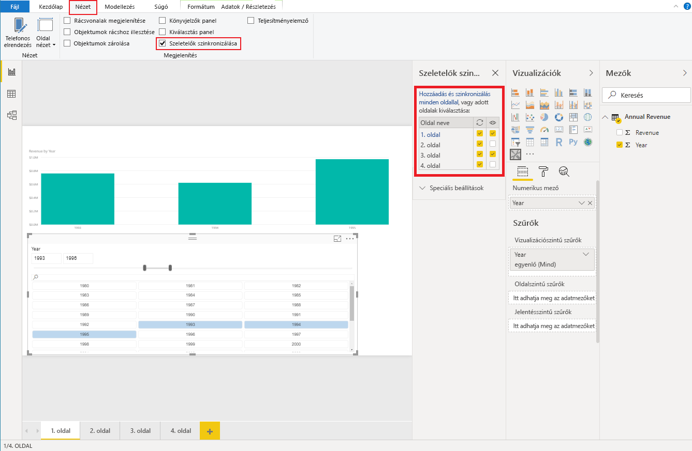

# <a name="sync-slicers-in-power-bi-visuals"></a>Szeletelők szinkronizálása Power BI-vizualizációkban

A [szeletelők szinkronizálása](https://docs.microsoft.com/power-bi/desktop-slicers) funkció támogatásához az egyéni szeletelővizualizációnak az API 1.13-as vagy újabb verzióját kell használnia.

Ezen felül a beállítást a *capabilities.json* fájlban is engedélyezni kel az alábbi kódban látható módon:

```json
{
    ...
    "supportsHighlight": true,
    "suppressDefaultTitle": true,
    "supportsSynchronizingFilterState": true,
    "sorting": {
        "default": {}
    }
}
```

A *capabilities.json* fájl módosítása után az egyéni szeletelővizualizáció kiválasztásakor megtekintheti a **Szeletelők szinkronizálása** beállításait.

> [!NOTE]
> A Szeletelők szinkronizálása funkció nem támogat egynél több mezőt. Ha a szeletelő egynél több (**Kategória** vagy **Mérték**) mezőt tartalmaz, a funkció le van tiltva.



A **Szeletelők szinkronizálása** panelen láthatja, hogy a szeletelő láthatósága és szűrése több jelentésoldalra is alkalmazható.
