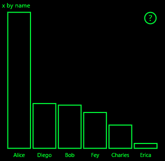

# <a name="high-contrast-mode-support-in-power-bi-visuals"></a>Kontrasztos mód támogatása Power BI-vizualizációkban

A Windows *Kontrasztos* beállításával a szövegek és alkalmazások a jobban elkülönülő színek megjelenítésének köszönhetően jobban láthatók lesznek. Ez a cikk azt ismerteti, hogyan adható hozzá a kontrasztos mód támogatása Power BI-vizualizációkhoz. További információ: [Kontrasztos mód támogatása a Power BI-ban](https://powerbi.microsoft.com/blog/power-bi-desktop-june-2018-feature-summary/#highContrast).

A kontrasztos mód támogatásának egy implementációját tekintheti meg a [PowerBI-visuals-sampleBarChart vizualizáció adattárában](https://github.com/Microsoft/PowerBI-visuals-sampleBarChart/commit/61011c82b66ca0d3321868f1d089c65101ca42e6).

## <a name="on-initialization"></a>Inicializáláskor

Az `options.host` colorPalette tagja számos tulajdonsággal rendelkezik a kontrasztos módhoz. Ezen a tulajdonságok alapján határozható meg, hogy aktív-e a kontrasztos mód, és ha igen, milyen színek használhatók.

### <a name="detect-that-power-bi-is-in-high-contrast-mode"></a>A Power BI kontrasztos módjának észlelése

Ha a `host.colorPalette.isHighContrast` értéke `true`, akkor a kontrasztos mód aktív, és a vizualizációnak ennek megfelelően kell kirajzolódnia.

### <a name="get-high-contrast-colors"></a>A kontrasztos színek lekérése

Kontrasztos módban a vizualizációnak az alábbi beállításokra kell szorítkoznia:

* Az **előtér** színével rajzol minden vonalat, ikont, szöveget, valamint az alakzatok körvonalát vagy kitöltését.
* A **háttér** színét használja háttérként, valamint a körvonalas alakzatok kitöltőszíneként.
* A **kijelölt előtér** színét használja a kijelölt vagy aktív elemek jelölésére.
* A **hivatkozások** színét csak a hivatkozások szövegéhez használja.

> [!NOTE]
> Ha másodlagos színre van szükség, akkor az előtérszín bizonyos mértékű átlátszósággal (natív Power BI-vizualizációk esetén 40%) használható. Ez ritkán használandó, hogy a vizualizáció részletei jól láthatóak maradjanak.

Az inicializálás során a következő értékeket tárolhatja:

```typescript
private isHighContrast: boolean;

private foregroundColor: string;
private backgroundColor: string;
private foregroundSelectedColor: string;
private hyperlinkColor: string;
//...

constructor(options: VisualConstructorOptions) {
    this.host = options.host;
    let colorPalette: ISandboxExtendedColorPalette = host.colorPalette;
    //...
    this.isHighContrast = colorPalette.isHighContrast;
    if (this.isHighContrast) {
        this.foregroundColor = colorPalette.foreground.value;
        this.backgroundColor = colorPalette.background.value;
        this.foregroundSelectedColor = colorPalette.foregroundSelected.value;
        this.hyperlinkColor = colorPalette.hyperlink.value;
    }
```

Azt is megteheti, hogy inicializáláskor a `host` objektumot tárolja, és frissítéskor hozzáfér a vonatkozó `colorPalette` tulajdonságokhoz.

## <a name="on-update"></a>Frissítéskor

A kontrasztos mód támogatásának egyes implementációi vizualizációnként változnak és a grafikai kivitel részleteitől függnek. A kontrasztos mód általában az alapértelmezettől kissé eltérő tervezést igényel, hogy a lényeges részletek kevesebb szín használata mellett is jól elkülönüljenek.

A Power BI natív vizualizációi az alábbi irányelveket követik:

* Minden adatpont ugyanazt a színt használja (előtér).
* Minden szöveg, tengely, vonal és egyéb az előtérszínt használja.
* A vastag alakzatok körvonalakkal vannak megrajzolva, vastag (legalább kettő képpontos) vonalakkal, és a háttérszínnel vannak kitöltve.
* A lényeges adatpontok eltérő jelölőalakzatokkal, az adatvonalak pedig különböző szaggatással vannak megkülönböztetve.
* Egy adatelem kiemelésekor az összes többi elem átlátszósága 40%-ra módosul.
* Szeletelők esetén az aktív szűrőelemek a kijelölési előtérszínt használják.

Az alábbi minta-sávdiagramon például minden sáv két képpontos előtérszínű körvonallal, a háttérszínnel kitöltve jelenik meg. Összehasonlíthatja az alapértelmezett színekkel és néhány kontrasztos témával megjelenő változatokat:





A következő szakasz a `visualTransform` függvény egy olyan részeltét mutatja be, amely a kontrasztos mód támogatása érdekében lett módosítva. Ez a frissítés során a renderelés részeként van meghívva.

### <a name="before"></a>Előtte

```typescript
for (let i = 0, len = Math.max(category.values.length, dataValue.values.length); i < len; i++) {
    let defaultColor: Fill = {
        solid: {
            color: colorPalette.getColor(category.values[i] + '').value
        }
    };

    barChartDataPoints.push({
        category: category.values[i] + '',
        value: dataValue.values[i],
        color: getCategoricalObjectValue<Fill>(category, i, 'colorSelector', 'fill', defaultColor).solid.color,
        selectionId: host.createSelectionIdBuilder()
            .withCategory(category, i)
            .createSelectionId()
    });
}
```

### <a name="after"></a>Utána

```typescript
for (let i = 0, len = Math.max(category.values.length, dataValue.values.length); i < len; i++) {
    const color: string = getColumnColorByIndex(category, i, colorPalette);

    const selectionId: ISelectionId = host.createSelectionIdBuilder()
        .withCategory(category, i)
        .createSelectionId();

    barChartDataPoints.push({
        color,
        strokeColor,
        strokeWidth,
        selectionId,
        value: dataValue.values[i],
        category: `${category.values[i]}`,
    });
}

//...

function getColumnColorByIndex(
    category: DataViewCategoryColumn,
    index: number,
    colorPalette: ISandboxExtendedColorPalette,
): string {
    if (colorPalette.isHighContrast) {
        return colorPalette.background.value;
    }

    const defaultColor: Fill = {
        solid: {
            color: colorPalette.getColor(`${category.values[index]}`).value,
        }
    };

    return getCategoricalObjectValue<Fill>(category, index, 'colorSelector', 'fill', defaultColor).solid.color;
}
```
