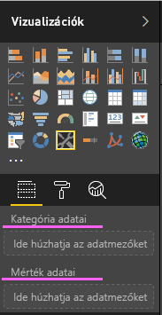
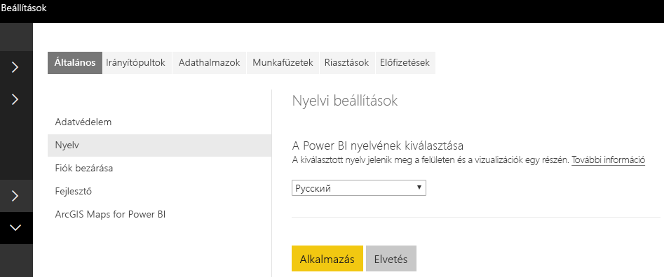

# <a name="add-the-locale-in-power-bi-for-power-bi-visuals"></a>Területi beállítások megadása a Power BI-ban a Power BI-vizualizációkhoz

A vizualizációk képesek lekérni a területi beállításokat a Power BI-ból, és ez alapján a megfelelő nyelvre honosítani a tartalmaikat.

További információk: [A Power BI által támogatott nyelvek és országok/régiók](./../../supported-languages-countries-regions.md)

Példa: területi beállítások lekérése egy oszlopdiagram-vizualizációban.


Az itt látható oszlopdiagramok mindegyikét különböző területi beállításokkal (angol, baszk és hindi) hozták létre. Ez látható az elemleírásban.

> [!NOTE]
> A vizualizáció kódjában elhelyezhető honosításkezelőt az API 1.10.0-s és újabb verziói támogatják.

## <a name="get-the-locale"></a>A területi beállítások beolvasása

A `locale` elemet a rendszer sztringként adja át a vizualizáció inicializálásakor. Ha a Power BI-ban megváltozik a területi beállítás, a rendszer az új területi beállításnak megfelelően újragenerálja a vizualizációt. A teljes mintakódot a SampleBarChart alatt találja meg a következő területi beállítással:

A BarChart konstruktornak már van egy locale tagja, amely a gazdaszámítógép locale példányával van példányosítva a konstruktorban.

```typescript
private locale: string;
...
this.locale = options.host.locale;
```

Támogatott területi beállítások:

Területi beállítás sztringje | Language
--------------|----------------------
ar-SA | العربية (arab)
bg-BG | български (bolgár)
ca-ES | català (katalán)
cs-CZ | čeština (cseh)
da-DK | dansk (dán)
de-DE | Deutsche (német)
el-GR | ελληνικά (görög)
en-US | English (angol)
es-ES | español (spanyol)
et-EE | eesti (észt)
eU-ES | Euskal (baszk)
fi-FI | suomi (finn)
fr-FR | français (francia)
gl-ES | galego (galiciai)
he-IL | עברית (héber)
hi-IN | हिन्दी (hindi)
hr-HR | hrvatski (horvát)
hu-HU | magyar (magyar)
id-ID | Bahasa Indonesia (indonéz)
it-IT | italiano (olasz)
ja-JP | 日本の (japán)
kk-KZ | Қазақ (kazah)
ko-KR | 한국의 (koreai)
lt-LT | Lietuvos (litván)
lv-LV | Latvijas (lett)
ms-MY | Bahasa Melayu (maláj)
nb-NO | norsk (norvég)
nl-NL | Nederlands (holland)
pl-PL | polski (lengyel)
pt-BR | português (portugál)
pt-PT | português (portugál)
ro-RO | românesc (román)
ru-RU | русский (orosz)
sk-SK | slovenský (szlovák)
sl-SI | slovenski (szlovén)
sr-Cyrl-RS | српски (szerb)
sr-Latn-RS | srpski (szerb)
sv-SE | svenska (svéd)
th-TH | ไทย (thai)
tr-TR | Türk (török)
uk-UA | український (ukrán)
vi-VN | tiếng Việt (vietnámi)
zh-CN | 中国 (egyszerűsített kínai)
zh-TW | 中國 (hagyományos kínai)

> [!NOTE]
> A PowerBI Desktopban a területi beállítás tulajdonság a telepített PowerBI Desktop nyelvét fogja tartalmazni.

## <a name="localizing-the-property-pane-for-power-bi-visuals"></a>A Tulajdonság panel honosítása Power BI-vizualizációkhoz

A Tulajdonság panelen található mezők az egységesebb, koherensebb felhasználói élmény érdekében honosíthatók. A honosított egyéni vizualizációk pontosan úgy működnek, mint a Power BI alapvető vizualizációi.

Például egy `pbiviz new` paranccsal létrehozott, nem honosított egyéni vizualizáció esetében a következők fognak megjelenni a Tulajdonság panelen:



a „Category Data”(Kategóriaadatok) és a „Measure Data” (Mérési adatok) elem a `displayName` értékkel van meghatározva a capabilities.json fájlban.

## <a name="how-to-localize-capabilities"></a>Funkciók honosítása

Először adjon hozzá egy megjelenítettnév-kulcsot minden olyan megjelenített névhez, amelyet honosítani szeretne. Ebben a példában:

```json
{
    "dataRoles": [
        {
            "displayName": "Category Data",
            "displayNameKey": "VisualCategoryDataNameKey1",
            "name": "category",
            "kind": "Grouping"
        },
        {
            "displayName": "Measure Data",
            "displayNameKey": "VisualMeasureDataNameKey2",
            "name": "measure",
            "kind": "Measure"
        }
    ]
}
```

Ezután adjon hozzá egy stringResources nevű könyvtárat. Ez a könyvtár fogja tartalmazni a támogatni kívánt területi beállításoknak megfelelő különböző sztringerőforrás-fájlokat. Ebben a könyvtárban minden támogatni kívánt területi beállításhoz létre kell hoznia egy JSON-fájlt. Ezek a fájlok tartalmazzák a lecserélni kívánt displayNameKey elemekhez tartozó, a területi beállításra vonatkozó adatokat, valamint a honosított sztringértékeket.

Tegyük fel, hogy a példánkban az arab és a héber nyelvet szeretnénk támogatni. A két JSON-fájlt a következőknek megfelelően kell hozzáadni:


Minden JSON-fájl egy területi beállítást definiál (a fájlnak a fenti listában szereplő támogatott területi beállítások egyikére kell vonatkoznia), és tartalmazza a kívánt megjelenítettnév-kulcsok sztringértékeit. A példában a héber sztringerőforrás-fájl a következőképpen fog megjelenni:

```json
{
    "locale": "he-IL",
    "values": {
        "VisualCategoryDataNameKey1": "קטגוריה",
        "VisualMeasureDataNameKey2": "יחידות מידה"
    }
}
```

Alább a honosításkezelő használatához szükséges összes lépést bemutatjuk.

> [!NOTE]
> A honosítás a fejlesztői vizualizációk hibakereséséhez jelenleg nincs támogatva.

## <a name="setup-environment"></a>A környezet beállítása

### <a name="desktop"></a>Asztali

Asztali használat esetén töltse le a Power BI Desktop honosított verzióját a következő címről: https://powerbi.microsoft.com.

### <a name="web-service"></a>Webszolgáltatás

Ha a szolgáltatásban a webes klienst (böngészőt) szeretné használni, módosítsa a következőknek megfelelően a nyelvi beállításokat:



## <a name="resource-file"></a>Erőforrásfájl

A stringResources mappán belül hozzon létre egy mappát a használni kívánt területi beállításnak megfelelően elnevezve, majd ebben egy resources.resjson nevű fájlt. A példánkban en-US és ru-RU.


Ezt követően adja hozzá a használni kívánt honosítási sztringeket az előző lépésben létrehozott resources.resjson fájlhoz.

```json
{
    ...
    "Role_Legend": "Обозначения",
    "Role_task": "Задача",
    "Role_StartDate": "Дата начала",
    "Role_Duration": "Длительность"
    ...
}
```

Az alábbi példában a resources.resjson fájl en-US verzióját fogja látni:

```json
{
    ...
    "Role_Legend": "Legend",
    "Role_task": "Task",
    "Role_StartDate": "Start date",
    "Role_Duration": "Duration"
    ...
}
```

Új localizationManager-példány Hozzon létre egy új localizationManager-példányt a vizualizáció kódjában az alábbinak megfelelően

```typescript
private localizationManager: ILocalizationManager;

constructor(options: VisualConstructorOptions) {
    this.localizationManager = options.host.createLocalizationManager();
}
```

## <a name="localizationmanager-usage-sample"></a>Példa a localizationManager használatára

Ha ezt követően a sztringre bárhol szükség volna a kódban, a resources.resjson fájlban definiált sztringkulcs-argumentummal meghívhatja a honosításkezelő getDisplayName függvényét:

```typescript
let legend: string = this.localization.getDisplayName("Role_Legend");
```

Az en-US esetében a „Legend”, a ru-RU esetében pedig az „Обозначения” érték fog megjelenni.

## <a name="next-steps"></a>További lépések

* [Tanulja meg, hogyan hozhat létre honosított formázásokat a formázási eszközökkel](utils-formatting.md)
