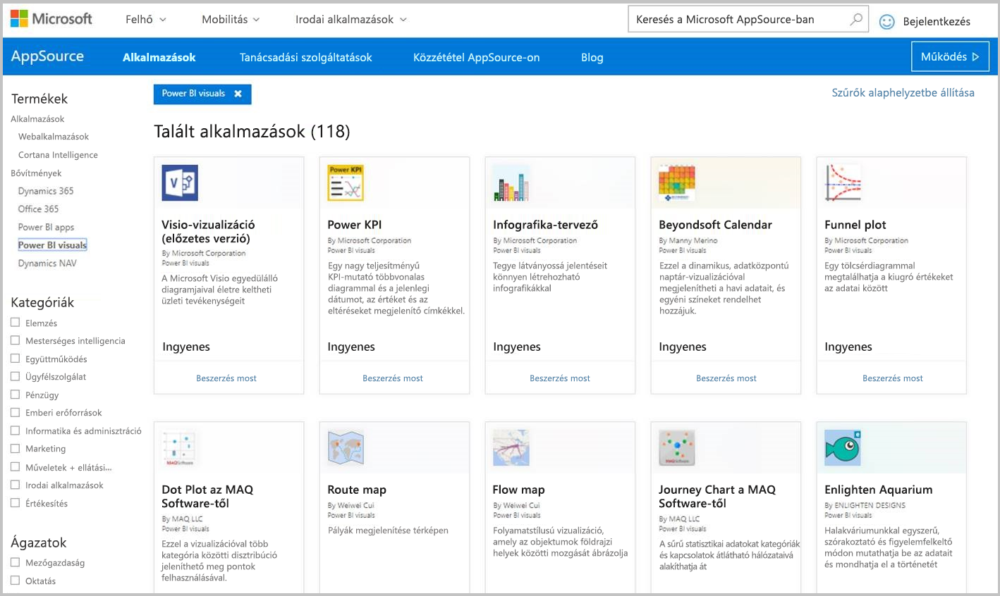
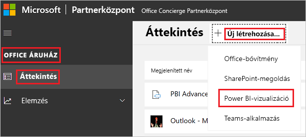

# Power BI-vizualizációk közzététele a Partnerközpontban

Miután létrehozta a saját Power BI-vizualizációját, közzéteheti az AppSource-ban, hogy mások is megismerhessék és használhassák. A Power BI-vizualizációk létrehozásával kapcsolatos további információkhoz lásd a [Power BI vizualizáció fejlesztése](custom-visual-develop-tutorial.md) című cikket.

## Mi az az AppSource?

Az [AppSource](https://appsource.microsoft.com/marketplace/apps?product=power-bi-visuals) az a hely, ahol SaaS-alkalmazásokat és -bővítményeket találhat Microsoft-termékeihez és -szolgáltatásaihoz.

## A Power BI-vizualizáció beküldésének előkészítése

Mielőtt beküldené a Power BI-vizualizációt az AppSource-ba, olvassa el a [Power BI-vizualizációk útmutatóját](guidelines-powerbi-visuals.md), és [tesztelje az egyéni vizualizációt](./submission-testing.md).

Ha készen áll a Power BI-vizualizáció beküldésére, ellenőrizze, hogy a vizualizáció megfelel-e az alábbi követelményeknek.

| Item | Kötelező | Leírás |
| --- | --- | --- |
| Pbiviz-csomag |Igen |Csomagolja a Power BI-vizualizációt egy Pbiviz-csomagba, amely az összes szükséges metaadatot tartalmazza. Vizualizáció neve Megjelenített név GUID Verzió Leírás Szerző neve és e-mail-címe |
| Minta .pbix jelentésfájl |Igen |A vizualizáció megfelelő bemutatásához érdemes megismertetnie a felhasználókkal a részleteket. Hangsúlyozza ki a vizualizáció felhasználó számára nyújtott értékeit, illusztrálja példákkal a használatot és a formázási lehetőségeket. Végül hozzáadhat egy tippeket, trükköket és elkerülendő lépéseket tartalmazó *„tippek”* oldalt is. A minta .pbix jelentésfájlnak működnie kell offline állapotban, bármilyen külső kapcsolat nélkül. |
| Ikon |Igen |Meg kell adnia az egyéni vizualizáció áruházban megjelenő emblémáját. Ennek formátuma .png, .jpg, .jpeg vagy .gif lehet, Pontosan 300 képpont (szélesség) × 300 képpont (magasság) méretűnek kell lennie. **Fontos!** Az ikon beküldése előtt tekintse át figyelmesen az [AppSource képtárolási útmutatóját](https://docs.microsoft.com/office/dev/store/craft-effective-appsource-store-images). |
| Képernyőképek |Igen |Adjon meg legalább egy képernyőképet. Ennek formátuma .png, .jpg, .jpeg vagy .gif lehet, A mérete csak 1366 px (szélesség) és 768 px (hosszúság) lehet. A fájl nem lehet nagyobb 1024 kb-nál. A hatékonyabb használat érdekében adjon hozzá szövegbuborékokat az egyes képernyőképeken látható fő jellemzők által képviselt érték kihangsúlyozásához. |
| Támogatás letöltési hivatkozása |Igen |Adjon meg egy támogatási URL-címet az ügyfeleknek. Ez a hivatkozás a Partnerközpontlista részeként lett megadva, és akkor látható a felhasználók számára, amikor megtekintik a vizualizációját az AppSource-on lévő listában. Az URL-címnek tartalmaznia kell a https:// vagy a http:// előtagot. |
| Adatvédelmi dokumentum hivatkozása |Igen |Adjon meg egy hivatkozást a vizualizáció adatvédelmi szabályzatához. Ez a hivatkozás a Partnerközpontlista részeként lett megadva, és akkor látható a felhasználók számára, amikor megtekintik a vizualizációját az AppSource-on lévő listában. A hivatkozásnak tartalmaznia kell a https:// vagy a http:// előtagot. |
| Végfelhasználói licencszerződés (EULA) |Igen |Meg kell adnia a licencfeltételeket tartalmazó fájlt a Power BI-vizualizációhoz. Használhatja a [standard szerződést](https://go.microsoft.com/fwlink/?linkid=2041178), a [Power BI-vizualizációk szerződését](https://visuals.azureedge.net/app-store/Power%20BI%20-%20Default%20Custom%20Visual%20EULA.pdf), vagy saját végfelhasználói licencszerződését. |
| Videó hivatkozása |Nem |Tovább növelheti a felhasználók érdeklődését az egyéni vizualizáció iránt, ha videóhivatkozást ad meg a vizualizáció témájában. Az URL-címnek tartalmaznia kell a https:// vagy a http:// előtagot. |
| GitHub-adattár |Nem |Osszon meg nyilvános hivatkozást egy [GitHub](https://www.github.com)-adattárban a Power BI-vizualizáció és az adatminták forrásaival. Ez lehetővé teszi más fejlesztők számára a visszajelzést és a javaslattételt a kód javítására. |

## Az alkalmazáscsomag XML-fájljának beszerzése

A Power BI-vizualizáció beküldéséhez be kell szereznie az alkalmazáscsomag XML-fájlját a Power BI csapatától. Az alkalmazáscsomag XML-fájljának beszerzéséhez küldjön e-mailt a Power BI-vizualizációk beküldését intéző csapatnak ([pbivizsubmit@microsoft.com](mailto:pbivizsubmit@microsoft.com)).

A **pbiviz** csomag létrehozása előtt ki kell töltenie a következő mezőket a **pbiviz.json** fájlban:
* leírás
* supportUrl
* szerző
* name
* e-mail

Mellékelje a **pbiviz fájlt** és a **mintajelentés pbix fájlját** az e-mailhez. A Power BI-csapattól egy választ fog kapni, amely tartalmazza a feltöltésre vonatkozó utasításokat és a feltöltendő alkalmazáscsomag XML-fájlját. Erre az XML-alkalmazáscsomagra szükség van ahhoz, hogy be tudja küldeni a vizualizációt az Office fejlesztői központján keresztül.

> [!NOTE]
> A minőség javítása és annak biztosítása érdekében, hogy a meglévő jelentések ne sérüljenek, az áruházban való jóváhagyás után további 2 hétbe telik, amíg a meglévő vizualizációk frissítései életbe lépnek az éles környezetben.

## Beküldés az AppSource-ba

A Power BI-vizualizáció AppSource-ba küldéséhez be kell szereznie egy alkalmazáscsomagot a Power BI csapatától, majd be kell küldenie a Partnerközpontba. 

### Az alkalmazáscsomag beszerzése

Mielőtt beküldené a vizualizációt az AppSource-ba, el kell küldenie egy e-mailt a **pbiviz-** és a **pbix-** fájllal a Power BI csapatának. A Power BI csapata így feltöltheti a fájlokat a nyilvános megosztási kiszolgálóra. Ha ezt nem teszi meg, az AppSource nem tudja lekérni a fájlokat. 

A Power BI csapatának ellenőriznie kell az új Power BI-vizualizációk beküldésére vonatkozó fájlokat, a meglévő Power BI-vizualizációk frissítéseit, és a visszautasított beküldések javításait.

### Beküldés a Partnerközpontba

Ahhoz, hogy a Power BI-vizualizációt beküldhesse a Partnerközpontba, regisztrálnia kell a Partnerközpontban. Ha még nem regisztrált, [nyisson meg egy fejlesztői számlát a Partnerközpontban](https://docs.microsoft.com/office/dev/store/open-a-developer-account).

Kövesse az alábbi lépéseket a Power BI-vizualizáció Partnerközpontba való beküldéséhez. A beküldési folyamattal kapcsolatos további információkért lásd: [Fejlesztői számla nyitása a Partnerközpontban](https://docs.microsoft.com/office/dev/store/use-partner-center-to-submit-to-appsource).

1. Jelentkezzen be a **Partnerközpontba**.

2. A baloldali ablaktáblán válassza az **OFFICE ÁRUHÁZ** lehetőséget.

3. Válassza az **Áttekintés** lehetőséget.

4. Válassza az **Új létrehozása** elemet, majd a legördülő menüből válassza a **Power BI-vizualizáció** lehetőséget.

    

5. Az **Új Power BI-vizualizáció létrehozása** ablakban adjon nevet a Power BI-vizualizációnak, és válassza a **Létrehozás** lehetőséget.

6. Kattintson a **Csomagok** elemre, és töltse fel a Power BI-vizualizáció alkalmazáscsomag XML-fájlját.

7. Kattintson a **Tulajdonságok** elemre, és adja meg a kért információkat.

8. Ha a termékhez további vásárlásra van szükség, válassza a **Termék beállítása** lehetőséget, és jelölje be a **Társított szolgáltatás vásárlása** jelölőnégyzetet.

9. (Választható) Ha [tanúsítványt](power-bi-custom-visuals-certified.md) kíván beszerezni a vizualizációhoz, válassza a **Termék beállítása** lehetőséget, és jelölje be a **Power BI-tanúsítvány** jelölőnégyzetet.
    >[!TIP]
    >A Power BI hitelesítési folyamata időt vehet igénybe. Új Power BI-vizualizáció létrehozása esetén a Power BI-tanúsítvány igénylése előtt javasoljuk a Power BI-vizualizáció Partnerközponton keresztüli közzétételét. Így gondoskodhat a vizualizáció késedelem nélküli közzétételéről.

10. Válassza a **Termék beállítása** lehetőséget, és kattintson az **Áttekintés és közzététel** lehetőségre.

## A beküldési állapot és a használat nyomon követése

Áttekintheti az [érvényesítési szabályzatokat](https://docs.microsoft.com/legal/marketplace/certification-policies#1180-power-bi-visuals).

* A beküldés után az [alkalmazás irányítópultján](https://sellerdashboard.microsoft.com/Application/Summary/) tekintheti meg a beküldés állapotát.

* Ha meg szeretné tudni, hogy a Power BI-vizualizáció mikor tud letöltéseket indítani az AppSource-ból, tekintse át a Power BI-vizualizációk [közzétételi idővonalát](power-bi-custom-visuals-certified.md#publication-timeline).

## A vizualizáció tanúsítása

Létrehozás után igény szerint [tanúsítványt](power-bi-custom-visuals-certified.md) szerezhet be a vizualizációhoz.

## Következő lépések

* [Egyéni Power BI-vizualizáció fejlesztése](custom-visual-develop-tutorial.md)

* [Vizualizációk a Power BI-ban](../../visuals/power-bi-report-visualizations.md)  

* [Vizualizációk a Power BI-ban](power-bi-custom-visuals.md)  

* [Tanúsítvány beszerzése Power BI-vizualizációhoz](power-bi-custom-visuals-certified.md)

* További kérdései vannak? [Kérdezze meg a Power BI közösségét](https://community.powerbi.com/)
