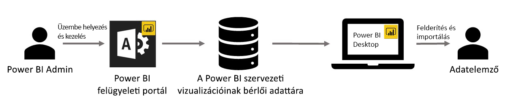

# Vállalati vizualizációk a Power BI-ban

A Power BI-ban a Power BI-vizualizációkkal személyre szabott, egyedi stílusú vizualizációkat hozhat létre. A Power BI-vizualizációkat a fejlesztők hozzák létre, és gyakran akkor, ha a Power BI-ban elérhető vizualizációk között nem találnak megfelelőt az aktuális igényeiknek.

Egyes szervezeteknél a Power BI-vizualizációk még ennél is fontosabbak – szükségesek lehetnek a szervezet bizonyos egyedi adatainak vagy elemzéseinek átadásához, speciális adatkövetelményeik lehetnek, vagy privát üzleti eljárásokat emelhetnek ki. Az ilyen szervezeteknek Power BI-vizualizációkat kell fejleszteniük, azokat meg kell osztaniuk az egész szervezetben, és gondoskodniuk kell azok megfelelő karbantartásáról. A Power BI vizualizációival a szervezetek pont ezt tehetik.

A következő képen az a folyamat látható, mely alapján a Power BI szervezeti Power BI-vizualizációi a rendszergazdától a fejlesztésen és a karbantartáson át végül eljutnak az adatelemzőkhöz.

A szervezeti vizualizációkat a Power BI rendszergazdája helyezi üzembe és kezeli a felügyeleti portálon. A szervezeti adattárban való üzembe helyezésük után a szervezet felhasználói könnyedén felderíthetik őket, és közvetlenül a Power BI Desktopból importálhatják a szervezeti Power BI-vizualizációkat.

A szervezeti Power BI-vizualizációk létrehozott jelentésekben való használatával kapcsolatban a következő cikkben találhat további információt: [További tudnivalók a szervezeti vizualizációk jelentésekbe importálásáról](power-bi-custom-visuals.md).

## A szervezeti Power BI-vizualizációk felügyelete

A szervezeti Power BI-vizualizációknak a szervezetben való felügyeletével, üzembe helyezésével és kezelésével kapcsolatban a következő cikkben találhat további információt: [További információk a szervezeti Power BI-vizualizációk üzembe helyezésével és kezelésével kapcsolatban](https://go.microsoft.com/fwlink/?linkid=866790).

> [!WARNING]
> A fájlból telepített Power BI-vizualizációk biztonsági és adatvédelmi kockázatokat tartalmazó kódot is tartalmazhatnak. Győződjön meg arról, hogy a Power BI-vizualizáció fájljának szerzője és forrása megbízható, mielőtt üzembe helyezné azt a szervezet adattárában.

## Megfontolandó szempontok és korlátozások

Több szempontot és korlátozást is figyelembe kell venni.

Rendszergazdák:

* Ha az AppSource-ból vagy fájlból származó Power BI-vizualizációt törölnek az adattárból, minden olyan meglévő jelentés megjelenítése leáll, mely a törölt vizualizációt használja. Az adattárból való törlés nem vonható vissza. Egy AppSource-ból vagy fájlból származó Power BI-vizualizáció ideiglenes letiltására a „Letiltás” funkció használható.

* A Power BI jelentéskészítő kiszolgálóban nem támogatottak a vállalati Power BI-vizualizációk.

Végfelhasználók:

* A szervezeti Power BI-vizualizációk a szervezeti adattárból importált privát vizualizációk. Ahogy a többi privát vizualizáció, ezek sem [exportálhatók a PowerPointba](https://docs.microsoft.com/power-bi/consumer/end-user-powerpoint), és nem jeleníthetők meg olyan e-mailekben, amelyek akkor érkeznek, amikor egy felhasználó [feliratkozik jelentésoldalakra](https://docs.microsoft.com/power-bi/consumer/end-user-subscribe). Ezeket a funkciókat csak a közvetlenül a piactérről importált, [minősített Power BI-vizualizációk](power-bi-custom-visuals-certified.md) támogatják.

* Az AppSource piactérről származó Visio-vizualizáció, PowerApps-vizualizáció és GlobeMap-vizualizáció nem jelenik meg, ha a szervezet adattárának használatával lett üzembe helyezve.

## Hibaelhárítás

A hibaelhárítással kapcsolatban a [Power BI-vizualizációk hibáinak elhárítását](power-bi-custom-visuals-troubleshoot.md) ismertető cikkből tájékozódhat.

## Gyakori kérdések

További információt és válaszokat [a Power BI-vizualizációkkal kapcsolatos gyakori kérdések](power-bi-custom-visuals-faq.md#organizational-power-bi-visuals) között talál.

További kérdései vannak? [Kérdezze meg a Power BI közösségét](https://community.powerbi.com/).
