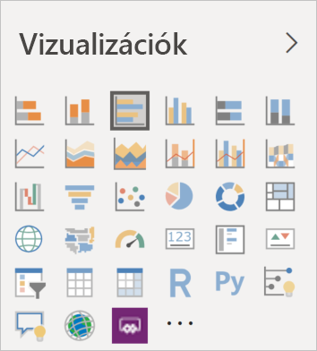

# Vizualizációk a Power BI-ban

A Power BI számos használatra kész Power BI-vizualizációt tartalmaz. Ezek a [Power BI Desktop](https://powerbi.microsoft.com/desktop/) és a [Power BI szolgáltatás](https://app.powerbi.com) vizualizációinak paneljén érhetők el, és segítségükkel Power BI-tartalmak hozhatók létre és szerkeszthetők.

A Microsoft [AppSource](https://nam06.safelinks.protection.outlook.com/?url=https%3A%2F%2Fappsource.microsoft.com%2Fen-us%2Fmarketplace%2Fapps%3Fpage%3D1%26product%3Dpower-bi-visuals&data=02%7C01%7CKesem.Sharabi%40microsoft.com%7C6d9286afacb3468d4cde08d740b76694%7C72f988bf86f141af91ab2d7cd011db47%7C1%7C0%7C637049028749147718&sdata=igWm0e1vXdgGcbyvngQBrHQVAkahPnxPC1ZhUPntGI8%3D&reserved=0) vagy a Power BI szolgáltatáson keresztül számos további Power BI-vizualizációt elérhet. Ezeket a Microsoft és a Microsoft partnerei hozzák létre, majd az AppSource ellenőrzési csapata teszteli és ellenőrzi.

Saját Power BI-vizualizációt is fejleszthet, amelyet Ön, szervezete vagy a teljes- Power BI-közösség használhat.

## Alapértelmezett Power BI-vizualizációk

Ezek a *Power BI Desktop* és *Power BI szolgáltatás* vizualizációs paneljén elérhető, használatra kész Power BI-vizualizációk.

Ha meg szeretné szüntetni egy Power BI-vizualizáció rögzítését a vizualizációs panelen, kattintson a jobb gombbal, majd válassza a **rögzítés feloldása** lehetőséget.

A vizualizációs panel alapértelmezett Power BI-vizualizációinak helyreállításához kattintson az **Egyéni vizualizáció importálása**, majd az **Alapértelmezett vizualizációk visszaállítása** lehetőségre. 

## Az AppSource Power BI-vizualizációi

A Microsoft, valamint a közösség tagjai is nyilvánosan megosztották Power BI-vizualizációikat az [AppSource](https://appsource.microsoft.com/marketplace/apps?product=power-bi-visuals) felületén. Ezeket a vizualizációkat Ön is letöltheti, és hozzáadhatja Power BI-jelentéseihez. Ezeket a Power BI-vizualizációkat a Microsoft tesztelte, és működés és minőség szempontjából is jóváhagyta.

### Mi az az AppSource?

Az [AppSource](https://appsource.microsoft.com/marketplace/apps?product=power-bi-visuals) az a hely, ahol a Microsoft-szoftverekhez alkalmazásokat, beépülő modulokat és bővítményeket találhat. Az AppSource többek között az Office 365, az Azure, a Dynamics 365, Cortana és a Power BI több millió felhasználóját köti össze olyan megoldásokkal, amelyekkel minden eddiginél hatékonyabban, mélyebb betekintéssel és látványosabban dolgozhatnak.

### Minősített Power BI-vizualizációk

A minősített Power BI-vizualizációk azok az [AppSource-on](https://nam06.safelinks.protection.outlook.com/?url=https%3A%2F%2Fappsource.microsoft.com%2Fen-us%2Fmarketplace%2Fapps%3Fpage%3D1%26product%3Dpower-bi-visuals&data=02%7C01%7CKesem.Sharabi%40microsoft.com%7C6d9286afacb3468d4cde08d740b76694%7C72f988bf86f141af91ab2d7cd011db47%7C1%7C0%7C637049028749147718&sdata=igWm0e1vXdgGcbyvngQBrHQVAkahPnxPC1ZhUPntGI8%3D&reserved=0) lévő vizualizációk, amelyek megfelelnek bizonyos, a Microsoft Power BI csapata által jóváhagyott és tesztelt kódolási előírásoknak. A tesztek rendeltetése annak ellenőrzése, hogy a vizualizáció nem kapcsolódik külső szolgáltatásokhoz vagy erőforrásokhoz.

A minősített Power BI-vizualizációk listájának megtekintéséhez vagy saját vizualizáció közzétételéhez lásd a [minősített Power BI-vizualizációkat](power-bi-custom-visuals-certified.md) ismertető szakaszt.

### Minták a Power BI-vizualizációkhoz

Az AppSource minden Power BI-vizualizációjához tartozik egy adatminta, amely bemutatja a vizualizáció működését. A mint letöltéséhez az [AppSource-ban](https://nam06.safelinks.protection.outlook.com/?url=https%3A%2F%2Fappsource.microsoft.com%2Fen-us%2Fmarketplace%2Fapps%3Fpage%3D1%26product%3Dpower-bi-visuals&data=02%7C01%7CKesem.Sharabi%40microsoft.com%7C6d9286afacb3468d4cde08d740b76694%7C72f988bf86f141af91ab2d7cd011db47%7C1%7C0%7C637049028749147718&sdata=igWm0e1vXdgGcbyvngQBrHQVAkahPnxPC1ZhUPntGI8%3D&reserved=0) válasszon ki egy Power BI-vizualizációt, majd a *Minta kipróbálása* szakaszban kattintson a **mintajelentés** hivatkozásra.

## Szervezeti tároló

A Power BI-rendszergazdák hagyják jóvá és helyezik üzembe a Power BI-vizualizációkat szervezetükben. A jelentéskészítők így könnyen felfedezhetik, frissíthetik és használhatják ezeket a Power BI-vizualizációkat. A rendszergazdák könnyen kezelhetik ezeket a vizualizációkat olyan műveletekkel, mint a verziófrissítés, vagy a Power BI-vizualizációk ki- és bekapcsolása.

A szervezeti tároló eléréséhez a *Vizualizáció* panelen kattintson az **Egyéni vizualizáció importálása** lehetőségre, válassza az **Importálás a piactérről** elemet, majd a *Power BI-vizualizációk* ablak tetején válassza ki a **Saját szervezet** lapot.

[További információk a vállalati vizualizációkról](power-bi-custom-visuals-organization.md).

## Vizualizációfájlok

A Power BI-vizualizációk olyan csomagok, amelyek a nekik szolgáltatott adatok rendereléséhez szükséges kódot tartalmazzák. Egyéni vizualizációt bárki létrehozhat, valamint becsomagolhatja azt `.pbiviz`-fájlként, amelyet aztán egy Power BI-jelentésbe importálhat.

Power BI-vizualizáció importálásához a *Vizualizáció* panelen kattintson az **Egyéni vizualizáció importálása** lehetőségre, majd válassza az **Importálás fájlból** elemet.

Ha Ön webfejlesztő, és saját vizualizációt szeretne létrehozni, majd az AppSource-hoz adni, megtanulhatja, hogyan [fejleszthet Power BI-vizualizációt](custom-visual-develop-tutorial.md) és [tehet közzé Power BI-vizualizációkat az AppSource-on](office-store.md).

> [!WARNING]
> A Power BI-vizualizációk biztonsági és adatvédelmi kockázatokat tartalmazó kódot is tartalmazhatnak. Fontolja meg, hogy megbízik-e a szerzőben és a Power BI-vizualizációban, mielőtt importálná azt a jelentésébe.

## További lépések

* Ha Ön fejlesztő, elsőként tekintse meg a [Power BI-vizualizációk fejlesztésének](custom-visual-develop-tutorial.md) útmutatóját.

* Megtudhatja, [hogyan vannak strukturálva a Power BI-vizualizációk](visual-project-structure.md).

* A [Power BI-vizualizációk útmutatójának](guidelines-powerbi-visuals.md) feltárása.

Több kérdése van? További információt [a Power BI-vizualizációkkal kapcsolatos gyakori kérdések](power-bi-custom-visuals-faq.md) oldalán vagy a [Power BI-közösségben](https://community.powerbi.com/) találhat.