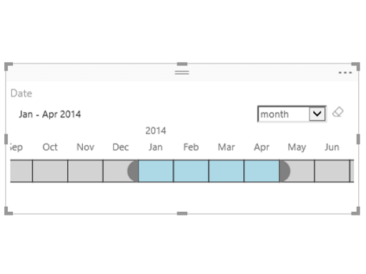

# Minták a Power BI-vizualizációkhoz

A Power BI-vizualizációkat a GitHubról töltheti le, illetve azon keresztül használhatja és módosíthatja őket. A minták azt mutatják be, hogy miként kezelheti a gyakran előforduló helyzeteket a Power BI használatával történő fejlesztés során.

## Szeletelők

A szeletelőkkel az adatok a jelentés más vizualizációiban szereplő részükre szűkíthetők. A szeletelők használata az egyik lehetséges módja az adatok a Power BI-ban történő szűrésének.

|   |  | |
| ------------- | ------------- | -------------|
| [Gombsorszeletelő](https://github.com/Microsoft/powerbi-visuals-chicletslicer/)   Képes és/vagy szöveges gombok megjelenítése, amelyek vásznon belüli szűrőként használhatók más vizualizációkhoz | [Idővonal-szeletelő](https://github.com/Microsoft/powerbi-visuals-timeline/)  Dátum szerint szűrő grafikus dátumtartomány-választó | [Szeletelőminta](https://github.com/Microsoft/powerbi-visuals-sampleslicer/)  Az Advanced Filtering API használatát szemlélteti

## Diagramok

Ihletet meríthet az oszlopdiagramokat, tortadiagramokat, szófelhőket és egyebeket tartalmazó galériánkból.

|   |  | |
| ------------- | ------------- | -------------|
| [Őszirózsa diagram](https://github.com/Microsoft/powerbi-visuals-asterplot/)   A hagyományos fánkdiagram variációja, amely egy második érték használatával vezérli a szögtartományokat | [Skáladiagram](https://github.com/Microsoft/powerbi-visuals-bulletchart/)  Sávdiagram további vizuális elemekkel, amelyek a célok nyomon követéséhez hasznos kontextust biztosítanak | [Húr](https://github.com/Microsoft/powerbi-visuals-chord/)  Egy grafikus módszer, amely egy mátrixban jeleníti meg az adatok közötti kapcsolatokat
|  | |  
| [Pöttydiagram](https://github.com/Microsoft/powerbi-visuals-dotplot/)  Szemléletes módon jeleníti meg a gyakoriságok eloszlását | [Kettős KPI](https://github.com/Microsoft/powerbi-visuals-dualkpi/)  Hatékonyan megjelenít két mértéket az időben, együttes idővonalon mutatva a trendeket | [Bővített pont](https://github.com/Microsoft/powerbi-visuals-enhancedscatter/)  A már meglévő pontdiagram fejlesztése
| | | 
| [Erőegyensúlyos gráf](https://github.com/Microsoft/powerbi-visuals-forcegraph/)  Ívelt vonalas, erőegyensúlyos elrendezésű diagram, amely az entitások közötti kapcsolatok megjelenítésekor hasznos | [Gantt](https://github.com/Microsoft/powerbi-visuals-gantt/)  Olyan sávdiagram, amely egy projekt idővonalát vagy ütemezését jeleníti meg erőforrásokkal együtt | [Hőtérképtábla](https://github.com/Microsoft/powerbi-visuals-heatmap/)  Adatok egyszerű és intuitív összehasonlítása egy táblázatban, színek használatával
|  |  |  
| [Hisztogram](https://github.com/Microsoft/powerbi-visuals-histogram/)  Az adatok eloszlását jeleníti meg folyamatosan vagy egy adott időtartamra vonatkozóan | [Vonalpontos diagram](https://github.com/Microsoft/powerbi-visuals-linedotchart/)  Egy animált pontokkal rendelkező animált vonaldiagram, amely adatok segítségével ragadja meg a közönség figyelmét | [Mekko diagram](https://github.com/Microsoft/powerbi-visuals-mekkochart/)  Egy 100%-ig halmozott oszlopdiagram és egy 100%-ig halmozott sávdiagram egyetlen nézetben
|  |  |  
| [Több KPI](https://github.com/microsoft/PowerBI-visuals-MultiKPI/)   Egy hatékony, több KPI-s vizualizáció, amelyben egy központi KPI mellett több, alátámasztó adatok alapján létrehozott értékgörbe található | [Nagy teljesítményű KPI](https://github.com/microsoft/PowerBI-visuals-PowerKPI/)  Egy nagy teljesítményű KPI-mutató többvonalas diagrammal és a jelenlegi dátumot, az értéket és a varianciákat megjelenítő címkékkel | [Power KPI Matrix](https://github.com/microsoft/PowerBI-visuals-PowerKPIMatrix/)  Egy kompakt, könnyedén értelmezhető listában teszi lehetővé a kiegyensúlyozott mutatószámok, KPI-k és korlátlan számú metrika monitorozását
| |  |  
| [Pulzusdiagram](https://github.com/Microsoft/powerbi-visuals-pulsechart/)  Egy olyan kulcsfontosságú eseményekkel kiegészített vonaldiagram, amely ideális az adatok segítségével való történetmeséléshez| [Sugárdiagram](https://github.com/Microsoft/powerbi-visuals-radarchart/)  Több mértéket jelenít meg egyszerre egy kategorikus tengelyen, amely a különféle attribútumok összehasonlításához hasznos | [Sankey diagram](https://github.com/Microsoft/powerbi-visuals-sankey/)  Folyamatábra, amelyben a sorozat szélessége arányos a folyamat mennyiségével
|  | | 
| [Adatfolyam-grafikon](https://github.com/Microsoft/powerbi-visuals-streamgraph/)  Egy olyan egyenletes interpolálású halmozott területdiagram, amelyet gyakran használnak értékek időbeli alakulásának megjelenítésére | [Többszintű gyűrű diagram](https://github.com/Microsoft/powerbi-visuals-sunburst/)  Egy többszintű fánkdiagram a hierarchikus adatok hatékony megjelenítéséhez| [Tornádó diagram](https://github.com/Microsoft/powerbi-visuals-tornado/)  Összehasonlítja két csoport változóinak relatív fontosságát
 | 
 | [Szófelhő](https://github.com/Microsoft/powerbi-visuals-wordcloud/)  Érdekes vizualizáció létrehozása az adatokban gyakran előforduló szövegek alapján

## WebGL

A WebGL lehetővé teszi, hogy a webes tartalom OpenGL ES 2.0-alapú API-t használjon a HTML-vásznon történő 2D és 3D rendereléshez.

| |
| ------------- |
| [Földgömb térkép](https://github.com/Microsoft/powerbi-visuals-globemap/)  Helyek ábrázolása egy interaktív 3D térképen

## R vizualizációk

Ezek a minták azt mutatják meg, miként lehet kihasználni az R-vizualizációk és R-szkriptek elemzési és vizuális sokoldalúságát.

| | | |
|------------- |------------- |------------- |------------- |
| [Társítási szabályok](https://github.com/Microsoft/powerbi-visuals-assorules/)  A látszólag nem kapcsolódó adatok közti kapcsolatok felfedése ha-akkor utasítások használatával | [Fürtözés](https://github.com/Microsoft/powerbi-visuals-clustering-kmeans/)  K-közép algoritmusok segítségével azonosítja az adathalmazban fellelhető hasonlósági csoportokat | [Fürtözés kiugró adatokkal](https://github.com/microsoft/PowerBI-visuals-dbscan/)  Segít megtalálni az adathalmaz kiugró értékeit és hasonlósági csoportjait
|  |  |  
| [Korrelációs rajz](https://github.com/Microsoft/powerbi-visuals-corrplot/)  Kiemeli az adattábla legerősebb korrelációt mutató változóit | [Döntésifa-diagram](https://github.com/Microsoft/powerbi-visuals-decision-tree/)  Egy sematikus, fa alakú diagram, amelyen rekurzív particionálással állapítható meg a statisztikai valószínűség | [Előrejelzési TBATS](https://github.com/Microsoft/powerbi-visuals-forcasting-tbats/)  Egy idősorozat-előrejelzés olyan sorozatokhoz, amelyek több, a TBATS-modellt használó szezonalitással rendelkeznek
|  |  |  
| [Előrejelzés az ARIMA-tól](https://github.com/Microsoft/powerbi-visuals-forcastingarima/)  Integrált autoregressziós mozgóátlag (ARIMA) használatával jósolja meg a jövőbeli értékeket a korábbi adatok alapján | [Tölcsérdiagram](https://github.com/Microsoft/powerbi-visuals-funnel/)  A tölcsérdiagrammal megtalálhatja a kiugró értékeket az adatai között | [Kiugró adatok észlelése](https://github.com/Microsoft/powerbi-visuals-outliers-det/)  Az arra legalkalmasabb módszert és ábrát használva találhatja meg az adathalmaz kiugró értékeit
|  |  | 
| [Görbe diagram](https://github.com/Microsoft/powerbi-visuals-spline/)  Vizualizálhatja és értelmezheti a zavaros adatokat | [Idősorfelbontási diagram](https://github.com/Microsoft/powerbi-visuals-timeseriesdecomposition/)  „Szezonális és trendalapú dekompozíció LOESS használatával” módszer használata az idősor komponenseinek értelmezéséhez | [Idősor-előrejelzési diagram](https://github.com/Microsoft/powerbi-visuals-forcasting-exp/)  Exponenciális simítási modell használata a jövőbeli értékek megjósolásához a múltban megfigyelt értékek alapján

## Következő lépések

Ha szeretné kipróbálni, hogyan lehet létrehozni Power BI-vizualizációkat, tekintse meg a következőt: [Oktatóanyagot: Power BI-vizualizáció fejlesztése](custom-visual-develop-tutorial.md).
