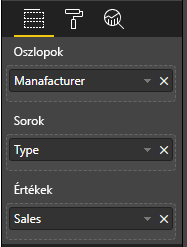

# <a name="add-interactivity-into-visual-by-power-bi-visuals-selections"></a>Vizualizációk interaktívvá tétele Power BI-vizualizációkban végzett kijelölésekkel

A Power BI két módot biztosít a vizualizációk közötti együttműködésre – a kijelölést és a szűrést. Az alábbi példa azt szemlélteti, hogy hogyan jelölhető ki egy vizualizáció bármely eleme, és hogyan értesíthető a jelentés egy másik vizualizációja az új kijelölési állapotról.

`Selection` objektum felel meg az interfésznek:

```typescript
export interface ISelectionId {
    equals(other: ISelectionId): boolean;
    includes(other: ISelectionId, ignoreHighlight?: boolean): boolean;
    getKey(): string;
    getSelector(): Selector;
    getSelectorsByColumn(): SelectorsByColumn;
    hasIdentity(): boolean;
}
```

## <a name="how-to-use-selectionmanager-to-select-data-points"></a>Adatpontok kijelölése a selectionManager használatával

A vizualizáció gazdaobjektuma biztosítja a kijelöléskezelő-példány létrehozására szolgáló metódust. A kijelöléskezelő végzi a kijelölést, a kijelölés megszüntetését, a helyi menü megjelenítését, az aktuális kijelölések tárolását és a kijelölési állapot ellenőrzését. A kijelöléskezelő rendelkezik az ezeknek a műveleteknek megfelelő metódusokkal.

### <a name="create-an-instance-of-the-selection-manager"></a>A kijelöléskezelő-példány létrehozása

A kijelöléskezelő használatához létre kell hoznia annak egy példányát. A vizualizációk általában a vizualizációs objektum `constructor`-ában hoznak létre kijelöléskezelő-példányt.

```typescript
export class Visual implements IVisual {
    private target: HTMLElement;
    private host: IVisualHost;
    private selectionManager: ISelectionManager;
    // ...
    constructor(options: VisualConstructorOptions) {
        this.host = options.host;
        // ...
        this.selectionManager = this.host.createSelectionManager();
    }
    // ...
}
```

### <a name="create-an-instance-of-the-selection-builder"></a>A kijelöléskészítő-példány létrehozása

A kijelöléskezelő-példány létrehozása után a vizualizáció minden adatpontjához létre kel hoznia egy `selections` elemet. A vizualizáció gazdaobjektuma biztosítja az egyes adatpontokhoz kijelölést generáló `createSelectionIdBuilder` metódust. Ez a metódus a `powerbi.visuals.ISelectionIdBuilder` interfésszel adja vissza az objektum példányát:

```typescript
export interface ISelectionIdBuilder {
    withCategory(categoryColumn: DataViewCategoryColumn, index: number): this;
    withSeries(seriesColumn: DataViewValueColumns, valueColumn: DataViewValueColumn | DataViewValueColumnGroup): this;
    withMeasure(measureId: string): this;
    withMatrixNode(matrixNode: DataViewMatrixNode, levels: DataViewHierarchyLevel[]): this;
    withTable(table: DataViewTable, rowIndex: number): this;
    createSelectionId(): ISelectionId;
}
```

Ez az objektum a megfelelő metódusokkal hoz létre a különböző típusú adatnézet-leképezésekhez tartozó `selections` elemeket.

> [!NOTE]
> A `withTable` és a `withMatrixNode` metódus a Power BI-vizualizációk 2.5.0-ás verziójú API-jában lett bevezetve.
> Ha táblázat vagy mátrix adatnézet-leképezésekhez kell kijelöléseket használnia, akkor az API 2.5.0 vagy újabb verziójára kell frissítenie.

### <a name="create-selections-for-categorical-data-view-mapping"></a>Kijelölések létrehozása kategorikus adatnézet-leképezéshez

Vizsgáljuk meg, hogyan jelennek meg a kijelölések a mintaadathalmaz kategorikus adatnézet-leképezésén:

| Gyártó | Típus | Érték |
| - | - | - |
| Chrysler | Családi autó | 28883 |
| Chrysler | Furgon | 117131 |
| Chrysler | Importált autó | 0 |
| Chrysler | Importált kisteherautó | 6362 |
| Ford | Családi autó | 50032 |
| Ford | Furgon | 122446 |
| Ford | Importált autó | 0 |
| Ford | Importált kisteherautó | 0 |
| GM | Családi autó | 65426 |
| GM | Furgon | 138122 |
| GM | Importált autó | 197 |
| GM | Importált kisteherautó | 0 |
| Honda | Családi autó | 51450 |
| Honda | Furgon | 46115 |
| Honda | Importált autó | 2932 |
| Honda | Importált kisteherautó | 0 |
| Nissan | Családi autó | 51476 |
| Nissan | Furgon | 47343 |
| Nissan | Importált autó | 5485 |
| Nissan | Importált kisteherautó | 1430 |
| Toyota | Családi autó | 55643 |
| Toyota | Furgon | 61227 |
| Toyota | Importált autó | 20799 |
| Toyota | Importált kisteherautó | 23614 |

A vizualizáció pedig a következő adatnézet-leképezést használja:

```json
{
    "dataRoles": [
        {
            "displayName": "Columns",
            "name": "columns",
            "kind": "Grouping"
        },
        {
            "displayName": "Rows",
            "name": "rows",
            "kind": "Grouping"
        },
        {
            "displayName": "Values",
            "name": "values",
            "kind": "Measure"
        }
    ],
    "dataViewMappings": [
        {
            "categorical": {
                "categories": {
                    "for": {
                        "in": "columns"
                    }
                },
                "values": {
                    "group": {
                        "by": "rows",
                        "select": [
                            {
                                "for": {
                                    "in": "values"
                                }
                            }
                        ]
                    }
                }
            }
        }
    ]
}
```

A mintában a `Manufacturer` a `columns`, a `Type` pedig a `rows`. Az adatsorozatok az értékek `rows` (`Type`) szerinti csoportosításával lettek létrehozva.

A vizualizációnak alkalmasnak kell lennie az adatok `Manufacturer` és `Type` szerinti szeletelésére is.

Ha a felhasználó például a `Chrysler`-t jelöli ki a `Manufacturer` értékeként, a többi vizualizációban az alábbi adatoknak kell megjelenniük:

| Gyártó | Típus | Érték |
| - | - | - |
| **Chrysler** | Családi autó | 28883 |
| **Chrysler** | Furgon | 117131 |
| **Chrysler** | Importált autó | 0 |
| **Chrysler** | Importált kisteherautó | 6362 |

Ha a felhasználó az `Import Car`-t választja a `Type` értékeként (adatsorozatok szerint jelöl ki adatokat), a többi vizualizáción az alábbi adatoknak kell megjelenniük:

| Gyártó | Típus | Érték |
| - | - | - |
| Chrysler | **Importált autó** | 0 |
| Ford | **Importált autó** | 0 |
| GM | **Importált autó** | 197 |
| Honda | **Importált autó** | 2932 |
| Nissan | **Importált autó** | 5485 |
| Toyota | **Importált autó** | 20799 |


A vizualizáció adatgyűjtőit ki kell tölteni.



Itt a `Manufacturer` kategória (oszlopok), a `Type` adatsorozat (sorok), a `Value` pedig az adatsorozathoz tartozó `Values` érték.

> [!NOTE]
> Az adatsorozatokhoz kötelező a `Values` megadása, mert az adatnézet-leképezés szerint a vizualizáció azt várja, hogy a `Values` a `Rows` adatai szerint lesz csoportosítva.

#### <a name="create-selections-for-categories"></a>Kijelölések létrehozása kategóriákhoz

```typescript
// categories
const categories = dataView.categorical.categories;

// create label for 'Manufacturer' column
const p = document.createElement("p") as HTMLParagraphElement;
p.innerText = categories[0].source.displayName.toString();
this.target.appendChild(p);

// get count of category elements
const categoriesCount = categories[0].values.length;

// iterate all categories to generate selection and create button elements to use selections
for (let categoryIndex = 0; categoryIndex < categoriesCount; categoryIndex++) {
    const categoryValue: powerbi.PrimitiveValue = categories[0].values[categoryIndex];

    const categorySelectionId = this.host.createSelectionIdBuilder()
        .withCategory(categories[0], categoryIndex) // we have only one category (only one `Manufacturer` column)
        .createSelectionId();
    this.dataPoints.push({
        value: categoryValue,
        selection: categorySelectionId
    });
    console.log(categorySelectionId);

    // create button element to apply selection on click
    const button = document.createElement("button") as HTMLButtonElement;
    button.value = categoryValue.toString();
    button.innerText = categoryValue.toString();
    button.addEventListener("click", () => {
        // handle click event to apply correspond selection
        this.selectionManager.select(categorySelectionId);
    });
    this.target.appendChild(button);
}
```

A mintakódban láthatja, hogy az összes kategóriát iteráljuk. Minden iterációban meghívjuk a `createSelectionIdBuilder` metódust, hogy hozza létre az adott kategória következő kijelölését a kijelöléskészítő `withCategory` metódusának meghívásával. Az utolsóként használt `createSelectionId` metódus adja vissza a generált `selection` objektumot.

A `withCategory` metódusban a `category` oszlopot (a példában ez a `Manufacturer`) és a kategóriaelem indexét adjuk át.

#### <a name="create-selections-for-series"></a>Kijelölések létrehozása adatsorozatokhoz

```typescript
// get groupped values for series
const series: powerbi.DataViewValueColumnGroup[] = dataView.categorical.values.grouped();

// create label for 'Type' column
const p2 = document.createElement("p") as HTMLParagraphElement;
p2.innerText = dataView.categorical.values.source.displayName;
this.target.appendChild(p2);

// iterate all series to generate selection and create button elements to use selections
series.forEach( (ser: powerbi.DataViewValueColumnGroup) => {
    // create selection id for series
    const seriesSelectionId = this.host.createSelectionIdBuilder()
        .withSeries(dataView.categorical.values, ser)
        .createSelectionId();

    this.dataPoints.push({
        value: ser.name,
        selection: seriesSelectionId
    });

    // create button element to apply selection on click
    const button = document.createElement("button") as HTMLButtonElement;
    button.value =ser.name.toString();
    button.innerText = ser.name.toString();
    button.addEventListener("click", () => {
        // handle click event to apply correspond selection
        this.selectionManager.select(seriesSelectionId);
    });
    this.target.appendChild(button);
});
```

### <a name="create-selections-for-table-data-view-mapping"></a>Kijelölések létrehozása táblázatos adatnézet-leképezéshez

Táblázatos adatnézet-leképezés minta

```json
{
    "dataRoles": [
        {
            "displayName": "Values",
            "name": "values",
            "kind": "GroupingOrMeasure"
        }
    ],
    "dataViewMappings": [
        {
            "table": {
                "rows": {
                    "for": {
                        "in": "values"
                    }
                }
            }
        }
    ]
}
```

Ahhoz, hogy a táblázatos adatnézet-leképezés összes sorához kijelölést hozzon létre, a kijelöléskészítő `withTable` metódusát kell meghívnia.

```typescript
public update(options: VisualUpdateOptions) {
    const dataView = options.dataViews[0];
    dataView.table.rows.forEach((row: DataViewTableRow, rowIndex: number) => {
        this.target.appendChild(rowDiv);
        const selection: ISelectionId = this.host.createSelectionIdBuilder()
            .withTable(dataView.table, rowIndex)
            .createSelectionId();
    }
}
```

A vizualizáció kódja a táblázat sorain lépkedve minden sorra meghívja a táblázat `withTable` metódusát. A `withTable` metódus két paramétere a `table` objektum és a táblázatsor indexe.

### <a name="create-selections-for-matrix-data-view-mapping"></a>Kijelölések létrehozása mátrixos adatnézet-leképezéshez

```typescript
public update(options: VisualUpdateOptions) {
    const host = this.host;
    const rowLevels: powerbi.DataViewHierarchyLevel[] = dataView.matrix.rows.levels;
    const columnLevels: powerbi.DataViewHierarchyLevel[] = dataView.matrix.rows.levels;

    // iterate rows hierarchy
    nodeWalker(dataView.matrix.rows.root, rowLevels);
    // iterate columns hierarchy
    nodeWalker(dataView.matrix.columns.root, columnLevels);

    function nodeWalker(node: powerbi.DataViewMatrixNode, levels: powerbi.DataViewHierarchyLevel[]) {
        const nodeSelection = host.createSelectionIdBuilder().withMatrixNode(node, levels);

        if (node.children && node.children.length) {
            node.children.forEach(child => {
                nodeWalker(child, levels);
            });
        }
    }
}
```

A mintában a `nodeWalker` rekurzívan van meghívva minden csomópontra és gyermekcsomópontra.

A `nodeWalker` minden hívásakor létrehoz egy `nodeSelection` objektumot. Minden `nodeSelection` a hozzá tartozó csomópont `selection` objektumának felel meg.

## <a name="select-datapoints-to-slice-other-visuals"></a>Adatpontok kijelölése más vizualizációk szeleteléséhez

A kategorikus adatnézet-leképezés kijelöléseinek mintakódjában láthatta a gomb elemekhez létrehozott kattintáskezelőt. A kezelő a kijelöléskezelő `select` metódusát hívja meg, és átadja a kijelölési objektumot.

```typescript
button.addEventListener("click", () => {
    // handle click event to apply correspond selection
    this.selectionManager.select(categorySelectionId);
});
```

A `select` metódus interfésze a következő

```typescript
interface ISelectionManager {
    // ...
    select(selectionId: ISelectionId | ISelectionId[], multiSelect?: boolean): IPromise<ISelectionId[]>;
    // ...
}
```

Látható, hogy a `select` kijelölések tömbjét fogadja el. Ez azt jelenti, hogy a vizualizáció több adatpontot is kijelölhet. A második, `multiSelect` paraméter végzi a többszörös kijelölést. Ha az értéke true (igaz), a Power BI az előző kijelölési állapot megszüntetése nélkül alkalmazza az aktuális kijelölést, ellenkező esetben a kijelölés alaphelyzetbe áll.

A `multiSelect` jellemző felhasználása a CTRL billentyű állapotának kezelése kattintási eseménynél.

```typescript
button.addEventListener("click", (mouseEvent) => {
    const multiSelect = (mouseEvent as MouseEvent).ctrlKey;
    this.selectionManager.select(seriesSelectionId, multiSelect);
});
```

## <a name="next-steps"></a>Következő lépések

* [Tudnivalók kijelölések használatáról vizualizáció tulajdonságainak adatpontokhoz kötésére](objects-properties.md#objects-selector)

* [Hogyan kezelhetők a kijelölések könyvjelzőváltáskor](bookmarks-support.md#visuals-with-selection)

* [Hogyan adható helyi menü a vizualizációk adatpontjaihoz](context-menu.md)

* [Hogyan használható az InteractivityUtils a kijelölések Power BI-vizualizációkhoz való hozzáadására](utils-interactivity-selections.md)
