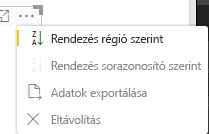

# <a name="sorting-options"></a>Rendezési beállítások

A `Sorting` szabja meg a vizualizációk alapértelmezett rendezési viselkedését.
A funkcióhoz az alábbiakban ismertetett paraméterek egyike szükséges:

## <a name="default-sorting"></a>Alapértelmezett rendezés

Az `default` lehetőség a rendezés legegyszerűbb formája. Ezzel rendezhetők a „DataMappings” szakasz adatai.
Ezzel a beállítással a felhasználó rendezheti a „DataMappings” adatait, és megadhatja a rendezés irányát.

```json
    "sorting": {
        "default": {   }
    }
```



## <a name="implicit-sorting"></a>Implicit rendezés

Az `implicit` mód tömbparaméterekkel rendez – `clauses`, amelyek az egyes adatszerepkörök rendezését ismertetik.
Az `implicit` azt jelenti, hogy a vizualizáció felhasználója nem módosíthatja a rendezési sorrendet.
A Power BI nem jelenít meg rendezési beállításokat a vizualizáció menüjében. Az adatokat azonban megadott beállítások szerint rendezi.

A `clauses` paraméterek több objektumot tartalmazhatnak, két paraméterrel:

- A `role` a rendezendő `DataMapping` elemet határozza meg.

- A `direction` a rendezés irányát szabja meg (1=növekvő, 2=csökkenő).

```json
    "sorting": {
        "implicit": {
            "clauses": [
                {
                    "role": "category",
                    "direction": 1
                },
                {
                    "role": "measure",
                    "direction": 2
                }
            ]
        }
    }
```

## <a name="custom-sorting"></a>Egyéni rendezés

A `custom` azt jelenti, hogy a rendezést a fejlesztő felügyeli a vizualizáció kódjában.
