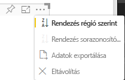

# <a name="sorting-options-for-power-bi-visuals"></a>A Power BI-vizualizációk rendezési beállításai

Ez a cikk azt mutatja be, hogy a *rendezési* beállítások hogyan határozzák meg a Power BI-vizualizációk rendezési viselkedését. 

A rendezés funkcióhoz az alábbiakban ismertetett paraméterek egyike szükséges.

## <a name="default-sorting"></a>Alapértelmezett rendezés

Az `default` lehetőség a rendezés legegyszerűbb formája. Ezzel rendezhetők a „DataMappings” szakasz adatai. Ezzel a beállítással a felhasználó rendezheti az adatleképezéseket, és megadhatja a rendezés irányát.

```json
    "sorting": {
        "default": {   }
    }
```



## <a name="implicit-sorting"></a>Implicit rendezés

Az implicit rendezés a `clauses` tömbparaméterrel rendez, amely az egyes adatszerepkörök rendezését ismerteti. Az `implicit` azt jelenti, hogy a vizualizáció felhasználója nem módosíthatja a rendezési sorrendet. A Power BI nem jelenít meg rendezési beállításokat a vizualizáció menüjében. Az adatokat azonban megadott beállítások szerint rendezi.

A `clauses` paraméterek több objektumot tartalmazhatnak, két paraméterrel:

- `role`: A rendezendő `DataMapping` elemet határozza meg
- `direction`: A rendezés irányát szabja meg (1=növekvő, 2=csökkenő)

```json
    "sorting": {
        "implicit": {
            "clauses": [
                {
                    "role": "category",
                    "direction": 1
                },
                {
                    "role": "measure",
                    "direction": 2
                }
            ]
        }
    }
```

## <a name="custom-sorting"></a>Egyéni rendezés

Az egyéni rendezés azt jelenti, hogy a rendezést a fejlesztő felügyeli a vizualizáció kódjában.
