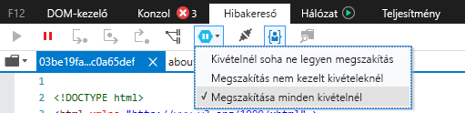
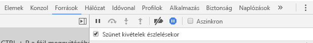

# <a name="how-to-debug-power-bi-visuals"></a>Power BI-vizualizációk hibáinak elhárítása

Ez az oldal a vizualizációk készítése során végzett hibakereséshez kínál néhány tippet. Tartalmazza az alapvető lépéseket, és bemutatja a szabványos előtér-alkalmazások és a Power BI-vizualizációk hibakeresése közötti különbségeket.
A cikk elolvasása után képes lesz hibát keresni Power BI-vizualizációkban töréspontok használatával, kivételeket naplózni, valamint kivételeket rögzíteni a Chrome-ban és az Edge-ben.

## <a name="using-breakpoints"></a>Töréspontok használata

Mivel a vizualizáció JavaScriptje teljes egészében újra be van töltve a vizualizáció minden frissítésekor, a felvett töréspontok elvesznek, amikor a vizsgált vizualizáció frissül. Ennek áthidalására `debugger` utasításokat használhat a kódban. Amíg a kódban `debugger` utasításokat használ, ajánlott kikapcsolni az automatikus újratöltést.

```typescript
public update(options: VisualUpdateOptions) {
    console.log('Visual update', options);
    debugger;
    this.target.innerHTML = `<p>Update count: <em>${(this.updateCount</em></p>`;
}
```


## <a name="showing-exceptions"></a>Kivételek megjelenítése

A vizualizációval végzett munka során tapasztalni fogja, hogy a Power BI szolgáltatás az összes hibát „elnyeli”. Ez a Power BI szándékos viselkedése, amely megakadályozza, hogy a hibásan működő vizualizációk miatt az egész alkalmazás instabillá váljon.

Ennek áthidalására beszúrhat a kivételeket elfogó és naplózó kódot, vagy beállíthatja a hibakeresőt úgy, hogy az észlelt kivételeknél állítsa le a futtatást.


## <a name="log-exceptions"></a>Kivételek naplózása

A Power BI-vizualizációkban keletkező kivételek naplózására szúrja be a vizualizációba az alábbi kódot, amely egy kivételnaplózó dekorátort definiál.

```typescript
export function logExceptions(): MethodDecorator {
    return function (target: Object, propertyKey: string, descriptor: TypedPropertyDescriptor<any>): TypedPropertyDescriptor<any> {
        return {
            value: function () {
                try {
                    return descriptor.value.apply(this, arguments);
                } catch (e) {
                    console.error(e);
                    throw e;
                }
            }
        }
    }
}
```
Ezt követően ezt a dekorátort bármelyik függvény hibanaplójának megjelenítésére használhatja.

```typescript
@logExceptions()
public update(options: VisualUpdateOptions) {
```

## <a name="break-on-exceptions"></a>Futtatás megszakítása kivétel esetén

A böngészőt is beállíthatja úgy, hogy kivétel észlelése esetén szakítsa meg a futtatást. Ezáltal hiba esetén a kód végrehajtása megszakad, és Ön megkezdheti a hiba keresését.

### <a name="edge"></a>Edge

1. Nyissa meg a fejlesztői eszközöket (F12).
2. Lépjen a **Hibakereső** lapra.
3. Kattintson a **futtatás megszakítása kivétel esetén** ikonra (hatszög alakú ikon szüneteltetési jellel).
4. Válassza a **Futtatás megszakítása minden kivétel esetén**.



## <a name="chrome"></a>Chrome

1. Nyissa meg a fejlesztői eszközöket (F12).
2. Váltson a **Források** lapra.
3. Kattintson a **futtatás megszakítása kivétel esetén** ikonra (Stoptábla szüneteltetési jellel).
4. Jelölje be a **Szüneteltetés kivétel észlelése esetén** jelölőnégyzetet.



## <a name="next-steps"></a>További lépések
* [Power BI-vizualizációk hibáinak elhárítása](power-bi-custom-visuals-troubleshoot.md)
* További információt és válaszokat [a Power BI-vizualizációkkal kapcsolatos gyakori kérdések](power-bi-custom-visuals-faq.md#organizational-power-bi-visuals) között talál.
