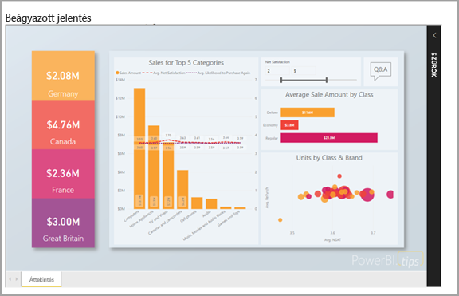
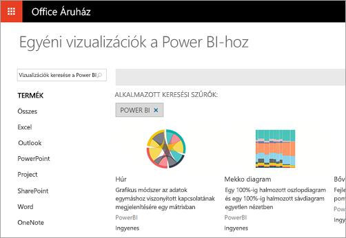

# Mire használhatják a fejlesztők a Power BI-t?

A fejlesztőknek több módszer is rendelkezésére áll ahhoz, hogy a Power BI-tartalmat alkalmazásokban használjanak. Fejlesztőként ezekkel a lehetőségekkel a következő szolgáltatásokat építheti be: **beágyazás a Power BI-jal**, **egyéni vizualizációk** és **adatok leküldése a Power BI-ba**.

## Power BI-tartalom beágyazása

A Power BI szolgáltatás (SaaS) és a Power BI Embedded szolgáltatás az Azure-ban (PaaS) API-kkal is rendelkezik az irányítópultok és jelentések beágyazásához. Ez azt jelenti, hogy a tartalmak beágyazásakor rendelkezésére állnak a Power BI legújabb szolgáltatásai (például irányítópultok, átjárók és munkaterületek).

A [beágyazást előkészítő eszközzel](https://aka.ms/embedsetup) gyorsan megteheti az első lépéseket és letölthet egy mintaalkalmazást.

Válassza ki az Ön számára megfelelő megoldást:

* Amennyiben az [ügyfelei számára végez beágyazást](embedding.md#embedding-for-your-customers), irányítópultokat és jelentéseket ágyazhat be olyan felhasználók számára, akik nem rendelkeznek Power BI-fiókkal. Futtassa a [Beágyazás az ügyfelek számára](https://aka.ms/embedsetup/AppOwnsData) megoldást.

* A [Beágyazás a cég számra](embedding.md#embedding-for-your-organization) használatával kiterjesztheti a Power BI szolgáltatást. Futtassa a [Beágyazás a cég számára](https://aka.ms/embedsetup/UserOwnsData) megoldást.

További információ a Power BI-ba való beágyazásról a [Power BI-ba történő beágyazást](embedding.md) ismertető cikkben található.

## Egyéni vizualizációk létrehozása

A Power BI-ban létrehozhat egyéni vizualizációkat, amelyek a vállalatára jellemző egyedi stílusban készülnek. Az egyéni vizualizációkat sok esetben fejlesztők hozzák létre. Akkor van rájuk szükség, amikor a Power BI-ban megtalálható vizualizációk nem felelnek meg tökéletesen egy feladathoz.

Az egyéni vizualizációk révén saját vizualizációkat hozhat létre, amelyeket a Power BI-jelentésekben használhat. Az egyéni vizualizációk a JavaScript egy bővített változatában, a TypeScriptben készülnek. A TypeScript néhány speciális funkciót is támogat, és korai hozzáférést biztosít az ES6/ES7-funkciókhoz. A vizualizációk stílusa CSS-stíluslapokkal alakítható ki. A kényelem érdekében a Less előfordítót alkalmazzuk, amely támogat bizonyos különleges funkciókat, mint például: beágyazás, változók, feltételek, ciklusok stb. Ha nem szeretné használni ezeket a funkciókat, egyszerű CSS-kódot is írhat a Less-fájlba.

Az egyéni vizualizációk fejlesztéséről az [Egyéni Power BI-vizualizáció fejlesztése](visuals/custom-visual-develop-tutorial.md) című cikkben találhatók további információk.

## API-automatizálás használata

A Power BI interaktív irányítópultokat jelenít meg, amelyek valós időben hozhatók létre és frissíthetők számos különböző adatforrásból. Bármilyen, REST-hívásokat támogató programnyelv használatával létrehozhat olyan alkalmazásokat, amelyek valós időben integrálhatók a Power BI-irányítópultokkal. Az alkalmazásokba Power BI-csempéket és jelentéseket is integrálhat.

A fejlesztők létrehozhatnak saját adatmegjelenítéseket is, amelyek az interaktív jelentésekben és irányítópultokon használhatók.

A [Mire használhatják a fejlesztők a Power BI API-t?](overview-of-power-bi-rest-api.md) című rész több, a Power BI API-k használatával elvégezhető feladatot mutat be.

## Következő lépések

[Beágyazás a Power BI szolgáltatással](embedding.md)  

[Egyéni Power BI-vizualizáció fejlesztése](https://microsoft.github.io/PowerBI-visuals/docs/step-by-step-lab/developing-a-power-bi-custom-visual/)

[Mire használhatják a fejlesztők a Power BI API-t?](overview-of-power-bi-rest-api.md)

[Power BI Fejlesztői központ](https://powerbi.microsoft.com/developers/)