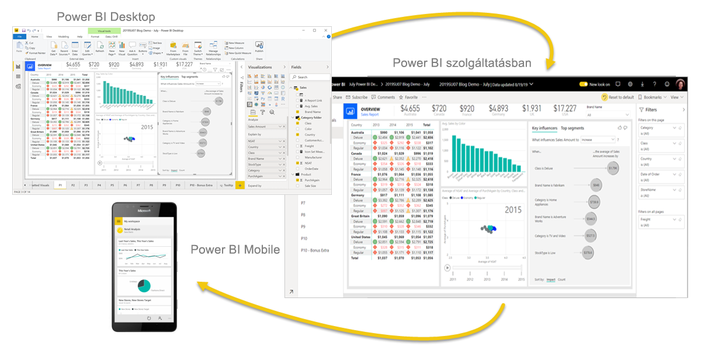
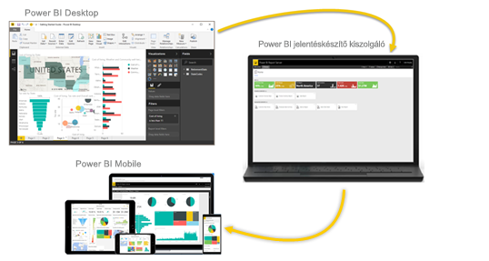

# A Power BI bemutatása
A **Power BI** olyan szoftverszolgáltatások, alkalmazások és összekötők gyűjteménye, amellyel az egymástól független adatforrásokat egymással együttműködő, vizuálisan megragadó, interaktív elemzésekké alakítja. Az adatok lehetnek akár egy Excel-táblában, vagy felhőalapú és helyszíni hibrid adattárházak gyűjteményében is. A Power BI-jal egyszerűen csatlakozhat az adatforrásokhoz, vizuálisan megjelenítheti és feltárhatja a fontos részeket, és ezt bárkivel meg is oszthatja.

## A Power BI részei
Power BI a következőkből áll: 
- Egy **Power BI Desktop** nevű asztali Windows-alkalmazás.
- Egy online SaaS-szolgáltatás (más néven *szolgáltatott szoftver*), melynek **Power BI szolgáltatás** a neve. 
- Power BI **mobilalkalmazások** Windows, iOS és Android rendszerű eszközökre.

Ez a három elem &mdash; a Power BI Desktop, a szolgáltatás és a mobilalkalmazások &mdash; úgy lett tervezve, hogy a szerepkörük szerinti leghatékonyabb módon segítse Önt és szerepkörét az üzleti elemzések létrehozásában, megosztásában és felhasználásában.

A **Power BI jelentéskészítő kiszolgáló** a negyedik elem. Ezzel a Power BI Desktopban létrehozott Power BI-jelentéseket lehet közzétenni helyszíni jelentéskészítő kiszolgálón. További információ: [Power BI jelentéskészítő kiszolgáló](#on-premises-reporting-with-power-bi-report-server).

## A Power BI illeszkedése az Ön szerepköréhez
A Power BI szolgáltatás használata függhet attól, hogy Ön milyen szerepkört tölt be egy projektben vagy egy csapatban. A Power BI-t mindenki saját szerepkörének megfelelően különbözőképpen használja.

Lehetséges például, hogy Ön elsősorban a **Power BI szolgáltatást** használja jelentések és irányítópultok megtekintésére. A számításokat végző és üzleti jelentéseket létrehozó munkatársa esetleg nagy mértékben támaszkodik a **Power BI Desktop** alkalmazásra, és a jelentéseket közzéteszi a Power BI szolgáltatásban, ahol Ön aztán megtekinti azokat. Elképzelhető, hogy egy másik, értékesítési osztályon dolgozó munkatárs a **Power BI mobilalkalmazást** használja az értékesítési kvóták előrehaladásának figyeléséhez, illetve az új értékesítések részleteinek vizsgálatához.

Fejlesztőként használhatja a Power BI API-jait arra, hogy az adatokat adatkészletekbe töltse be, vagy hogy irányítópultokat és jelentéseket ágyazzon be egyéni alkalmazásaiba. Javaslata van új vizualizációra? Hozza létre, és ossza meg másokkal is.  

A Power BI egyes elemeit használhatja emellett felváltva is attól függően, hogy épp milyen céljai vannak, illetve milyen szerepkörben dolgozik egy adott projekten.

A Power BI használatát az határozza meg, hogy e Power BI melyik funkciója vagy szolgáltatása a legmegfelelőbb az adott helyzetben. Például a Power BI Desktop alkalmazással jelentéseket hozhat létre a saját csapatának az ügyfélkapcsolati statisztikákról, és megtekintheti a leltárat és a gyártási folyamat állapotát a szolgáltatás egy valós idejű irányítópultján. A Power BI minden elemét elérheti, ami nagy mértékű rugalmasságot jelent.

A szerepköréhez kapcsolódó dokumentumok elemzése:
- Power BI Desktop [*tervezők*](desktop-what-is-desktop.md) számára
- Power BI [*felhasználók*](../consumer/end-user-consumer.md) számára
- Power BI [*rendszergazdák*](../admin/service-admin-administering-power-bi-in-your-organization.md) számára
- Power BI *fejlesztők* számára
    * [Beágyazott analitika a Power BI-jal](../developer/embedded/embedding.md)
    * [A Power BI Embedded az Azure-ban ismertetése](../developer/embedded/azure-pbie-what-is-power-bi-embedded.md)
    * [Vizualizációk a Power BI-ban](../developer/visuals/power-bi-custom-visuals.md)
    * [Mire használhatják a fejlesztők a Power BI API-t?](../developer/automation/overview-of-power-bi-rest-api.md)

## A Power BI-ban való munka folyamata
A Power BI-ban a leggyakoribb munkafolyamat első lépése az adatforrásokhoz való csatlakozás, majd pedig jelentések létrehozása a Power BI Desktopban. A jelentést ezt követően közzéteheti a Power BI Desktopból a Power BI szolgáltatásba és megoszthatja azt, így a végfelhasználók megtekinthetik azt a szolgáltatásban és a mobileszközökön is.
Ez egy nagyon gyakori munkafolyamat, és jól látszik benne, hogy hogyan egészíti ki egymást a Power BI három összetevője.

Az alábbiakban [a Power BI Desktop és a Power BI szolgáltatás részletes összehasonlítását](../fundamentals/service-service-vs-desktop.md) találja.

## Helyszíni jelentéskészítés a Power BI jelentéskészítő kiszolgálóval

De mi történik, ha Ön nem áll még készen arra, hogy a felhőbe települjön át, és jelentéseit egy vállalati tűzfal mögött kell tartania?  Olvasson tovább.

Mobil és többoldalas Power BI-jelentéseket hozhat létre, telepíthet és felügyelhet a helyszínen a Power BI jelentéskészítő kiszolgáló által biztosított, használatra kész eszközökkel.

A Power BI jelentéskészítő kiszolgálót tűzfal mögött lehet üzembe helyezni, és ezt követően különféle módokon lehet a jelentéseket a megfelelő felhasználókhoz eljuttatni, akik megtekinthetik őket webböngészőben, mobileszközön vagy e-mailben is. Mivel a Power BI jelentéskészítő kiszolgálója kompatibilis a felhőalapú Power BI-jal, bármikor dönthet úgy, hogy áttelepül a felhőbe, ha készen áll rá. 

További információ: [Power BI jelentéskészítő kiszolgáló](../report-server/get-started.md).

## Következő lépések
- [Rövid útmutató:: Eligazodás a Power BI szolgáltatásban](../consumer/end-user-experience.md)   
- [Oktatóanyag: Első lépések a Power BI szolgáltatással](service-get-started.md)
- [Rövid útmutató:: Csatlakozás adatokhoz a Power BI Desktopban](../connect-data/desktop-quickstart-connect-to-data.md)
