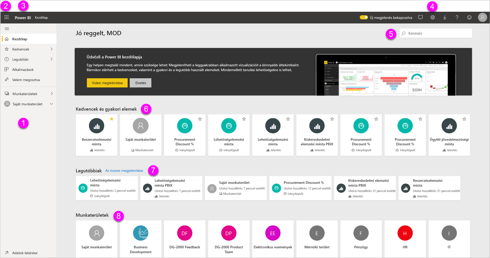
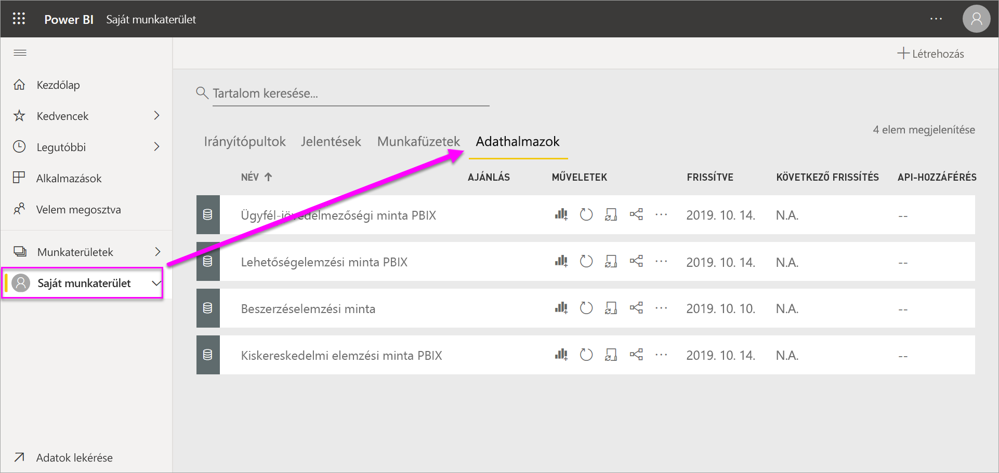
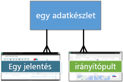
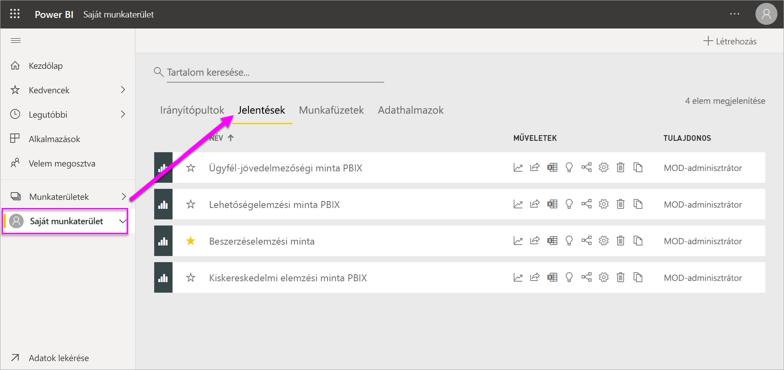
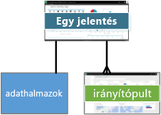
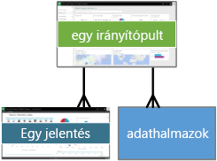
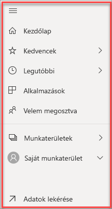

# A Power BI szolgáltatás alapfogalmai tervezők számára

Ez a cikk bevezetést nyújt a Power BI szolgáltatásba. Bemutatja a különböző összetevőket és azok együttműködését, és hogy ezek hogyan használhatók. A cikket a legjobban úgy használhatja, ha [regisztrál a Power BI szolgáltatásra](service-self-service-signup-for-power-bi.md), és [hozzáad néhány adatot](../connect-data/service-get-data.md). Tervezők esetén a munkafolyamat leggyakrabban azzal kezdődik, hogy jelentéseket hoznak létre a Power BI Desktopban. Ezt követően a jelentéseket közzéteheti a Power BI szolgáltatásban, ahol további módosításokat is végezhet rajtuk. A jelentéseken alapuló irányítópultokat ugyancsak a Power BI szolgáltatásban hozhatja létre. 

Ha még nincsenek saját jelentései, a cikk használatához próbálja meg telepíteni a [Power BI-minták](../create-reports/sample-datasets.md) egyikét.

Ha a Power BI szolgáltatást egy böngészőben nyitja meg, először egy Kezdőlap fogadja. Az alábbi összetevők jelennek meg:

1. Navigációs panel
2. Az Office 365 appindítója
3. A Power BI kezdőlapjának gombja
4. Ikongombok, beleértve a beállításokat, a súgót és a visszajelzést is
5. Keresőmező
6. Kedvenc és gyakran használt irányítópultok, jelentések és munkaterületek
7. Legutóbb használt irányítópultok, jelentések és munkaterületek
8. Saját munkaterületek

Ön és a jelentések és az irányítópultok végfelhasználói ugyanezzel a kezdő képernyővel találkoznak a Power BI szolgáltatás böngészőben való megnyitásakor.

Ezeket a funkciókat később részletesen is ismertetjük, de először vegyük sorra a Power BI néhány alapfogalmát. De érdemes lehet megnézni először ezt a videót.  A videóban Will ismerteti az alapfogalmakat, és végigvezeti a Power BI szolgáltatáson.

<iframe width="560" height="315" src="https://www.youtube.com/embed/B2vd4MQrz4M" frameborder="0" allowfullscreen></iframe>

## A Power BI alapfogalmai
A Power BI öt legfontosabb építőeleme a következő: *irányítópultok*, *jelentések*, *munkafüzetek*, *adatkészletek* és *adatfolyamok*. Ezek mindegyike *munkaterületekbe* van szervezve, és *kapacitásokon* van létrehozva.  Az öt építőelem részletes megismeréséhez fontos tisztában lenni a kapacitások és a munkaterületek működésével, ezért először ezekkel foglalkozunk.

## Kapacitások
A kapacitás egy alapvető Power BI-fogalom, amely a Power BI-tartalmak üzemeltetéséhez és elérhetővé tételéhez használt erőforrások (tárolás, processzor és memória) egy adott készletét jelöli. A kapacitások lehetnek _megosztottak_ vagy _dedikáltak_. A megosztott kapacitás más Microsoft-ügyfelekkel is meg van osztva, míg a dedikált kapacitás teljes mértékben egyetlen ügyfél számára van fenntartva. A dedikált kapacitáshoz [előfizetés](../admin/service-premium-what-is.md) szükséges. Ezeket részletesen ismerteti a [Prémium szintű kapacitások kezelése](../admin/service-premium-capacity-manage.md) című cikk.

Alapértelmezés szerint a munkaterületek megosztott kapacitásban vannak létrehozva. Megosztott kapacitással munkafolyamatai más ügyfelekkel megosztott számítási erőforrásokon futnak. Mivel a kapacitásnak meg kell osztania az erőforrásokat, korlátozásokat kell bevezetni a „tisztességes játék” érdekében, például hogy a maximális modellméretet (1 GB) és a maximális napi frissítési gyakoriságot (naponta nyolc alkalommal) lehessen használni.

## Munkaterületek
A munkaterületek a kapacitásokban hozhatók létre. Ezek gyakorlatilag a Power BI irányítópultjainak, jelentéseinek, munkafüzeteinek és adathalmazainak tárolói.

A munkaterületeknek két típusa van: *Saját munkaterület* és *munkaterületek*.

- A *Saját munkaterület* az egyes Power BI-ügyfelek személyes munkaterülete, melyen saját tartalmaikat használhatják. A Saját munkaterületéhez csak Ön fér hozzá. A Saját munkaterületről meg is oszthatja az irányítópultokat és a jelentéseket. Ha viszont másokkal együttműködve szeretne irányítópultokkal és jelentésekkel dolgozni, vagy ha alkalmazást szeretne létrehozni, akkor a munkaterületet érdemes választania.      
-  A *munkaterületeken* együtt lehet működni, és tartalmakat lehet megosztani a munkatársakkal. A munkaterületekhez hozzáadhat munkatársakat, és közösen dolgozhatnak irányítópultokon, jelentéseken, munkafüzeteken és adathalmazokon. Egy kivétellel a munkaterület összes tagjának Power BI Pro-licenccel kell rendelkeznie. További információ az [új munkaterületekről](../collaborate-share/service-create-the-new-workspaces.md). 

    A munkaterületeken lehet a szervezet számára *alkalmazásokat* létrehozni, közzétenni és kezelni. A munkaterületekre olyan tartalmak átmeneti területeiként és tárolóiként tekinthet, melyek Power BI-alkalmazásokat alkotnak majd. Mi tehát egy *alkalmazás*? Az irányítópultok és jelentések egy olyan gyűjteménye, amely arra szolgál, hogy alapvető metrikákat bocsásson a szervezet Power BI-felhasználói rendelkezésére. Az alkalmazások interaktívak, de a végfelhasználók nem szerkeszthetik őket. Az alkalmazások felhasználóinak (az alkalmazásokhoz hozzáféréssel rendelkező munkatársaknak) azonban nem feltétlenül van szükségük Pro-licencre.  

A megosztásról általában az [Irányítópultok megosztásának módjai](../collaborate-share/service-how-to-collaborate-distribute-dashboards-reports.md) című témakörben talál további információt.

Most pedig lépjünk tovább a Power BI öt építőelemére.

## Adatfolyamok
Az *adatfolyam* abban segít a szervezeteknek, hogy egyesíthessék a különböző forrásokból származó adataikat. Használatuk nem kötelező, de gyakran alkalmazzák az összetett vagy a nagyobb méretű projektekben. Olyan adatokat képviselnek, amelyeket előkészítettek az adatkészletekben való felhasználásra. Jelentéskészítés forrásaként azonban közvetlenül nem lehet felhasználni őket. Kihasználják a Microsoft adatösszekötők széles választékát, így lehetővé válik a helyszíni és a felhőalapú adatforrásokból származó adatok betöltése is.

Az adatfolyamok csak munkaterületeken (de nem a *Saját munkaterületen*) hozhatók létre és kezelhetők, és entitásként vannak tárolva az Azure Data Lake Storage Gen2 Common Data Modeljében (CDM-jében). Általában rendszeres időközönként frissülnek, hogy mindig naprakész adatok legyenek tárolva. Nagyszerűen használhatók arra, hogy előkészítsük az adatokat az adatkészletek általi használatra (vagy újrahasználatra). További információt az [Önkiszolgáló adat-előkészítés a Power BI-ban](../transform-model/service-dataflows-overview.md) című cikkben talál.

Adatok nélkül nem lehetnek sem irányítópultjai, sem jelentései (illetve lehetnek üres irányítópultjai és jelentései, de amíg adatok nem kerülnek beléjük, nincs sok hasznuk), tehát ismerje meg először az **adatkészleteket**.

## Adathalmazok
Az *adatkészlet* olyan adatok gyűjteménye, amelyeket *importál*, vagy amelyekhez *csatlakozik*. A Power BI sokféle adatkészlet importálását, csatlakoztatását és egy helyen történő megjelenítését teszi lehetővé. Az adatkészletek adatforrásként az adatfolyamokat is használhatják.

Az adathalmazok *munkaterületekhez* vannak társítva, és egy adott adathalmaz számos munkaterületnek része lehet. Amikor megnyit egy munkaterületet, az ahhoz társított adatkészletek az **Adatkészletek** lapon vannak felsorolva. Mindegyik itt megnevezett adatkészlet egyetlen adatforrásnak felel meg, például egy OneDrive-beli Excel-munkafüzetnek, egy helyszíni táblázatos SSAS-adatkészletnek vagy egy Salesforce-adatkészletnek. Sok különböző adatforrást támogatunk, a számuk egyre növekszik. Itt megtekintheti [a Power BI-jal használható adathalmaztípusok](../connect-data/service-get-data.md) listáját.

Az alábbi példában a „Sales and marketing” („Értékesítési és marketing”) munkaterület van kijelölve, és rákattintottak az **Adathalmazok** fülre.

**EGY** adatkészlet:

* használható újra és újra, egy vagy több munkaterületen.
* Több jelentésben is felhasználható.
* Az ebből az egy adatkészletből származó vizualizációkat több irányítópulton is megtekintheti.

  

[Adathalmazhoz való csatlakozáshoz vagy annak importálásához](../connect-data/service-get-data.md) kattintson az **Adatok beolvasása** lehetőségre a navigációs panel alján. Kövesse az utasításokat az adott forráshoz való csatlakozáshoz vagy annak importálásához, majd adja hozzá az adathalmazt az aktív munkaterülethez. Az új adathalmazokat sárga csillag jelöli. A Power BI-ban végzett munka nem változtatja meg az alapjául szolgáló adatkészletet.

A munkaterület bármelyik tagja által hozzáadott adathalmazok a *rendszergazda*, *tag* vagy *közreműködő* szerepkörrel rendelkező többi tag számára is láthatók.

Az adathalmazok frissíthetők, átnevezhetők, elemezhetők és eltávolíthatók. Adathalmazok alapján létrehozhat jelentéseket újonnan, vagy [gyors elemzések](../create-reports/service-insights.md) futtatásával.  A **Kapcsolódó megtekintése** lehetőséget választva megtekintheti, hogy melyek azok a jelentések és irányítópultok, melyek már használnak adathalmazt. Ha elemezni szeretne egy adatkészletet, kattintson rá. Ilyenkor az adatkészletet a jelentésszerkesztőben nyitja meg, ahol részletesen feltárhatja az adatokat, és vizualizációkat hozhat létre belőlük.

Most lépjünk tovább a következő témára: a jelentésekhez.

### További ismeretek
* [Adatkészletek a Power BI szolgáltatásban](../connect-data/service-datasets-understand.md)
* [Adatkészletek módjai a Power BI szolgáltatásban](../connect-data/service-dataset-modes-understand.md)
* [Mi a Power BI Premium?](../admin/service-premium-what-is.md)
* [Adatbeolvasás a Power BI szolgáltatásban](../connect-data/service-get-data.md)
* [A Power BI-hoz használható mintaadathalmazok](../create-reports/sample-datasets.md)

## Jelentések
Egy Power BI-jelentés egy vagy több oldalnyi vizualizációból, például vonaldiagramokból, térképekből és fatérképekből áll. A vizualizációk másik elnevezése **_vizualizációs elem_** . Egyetlen jelentés vizualizációi csak egy adatkészleten alapulhatnak. Jelentéseket létrehozhat újonnan a Power BI szolgáltatásban, importálhat a munkatársak által megosztott irányítópultokból, vagy létrehozhatja őket a Power BI, amikor olyan adathalmazokhoz csatlakozik, amelyek az Excelből, a Power BI Desktopból, adatbázisokból vagy SaaS-alkalmazásokból származnak.  Ha például csatlakozik egy Power View-lapokat tartalmazó Excel-munkafüzethez, akkor a Power BI elkészít egy jelentést a lapok alapján. Ha pedig SaaS-alkalmazáshoz csatlakozik, a Power BI egy előre elkészített jelentést importál.

A jelentések megtekintésének és használatának két módja van: *Olvasás nézetben* vagy *Szerkesztés nézetben*. Amikor megnyit egy jelentést, az Olvasás nézetben nyílik meg. Ha rendelkezik szerkesztési engedéllyel, akkor a jobb felső sarokban láthatja a **Jelentés szerkesztése** lehetőséget, és megnyithatja a jelentést Szerkesztés nézetben.  Ha a jelentés egy munkaterületen van, mindenki szerkesztheti, aki *rendszergazda*, *tag* vagy *közreműködő* szerepkörrel rendelkezik. Ők hozzáférnek a jelentés Szerkesztés nézetének összes tallózási, tervezési, készítési és megosztási képességéhez. Azok, akikkel ők megosztják a jelentést, Olvasó nézetben tanulmányozhatják és használhatják.   

Amikor megnyit egy munkaterületet, az ahhoz társított jelentések a **Jelentések** lapon vannak felsorolva. A listán szereplő jelentések mind olyan vizualizációkat tartalmaznak egy vagy több oldalon, amelyek kizárólag a mögöttes adathalmazok egyikén alapulnak. Jelentés megnyitásához válassza ki.

Amikor megnyit egy alkalmazást, egy irányítópult jelenik meg.  Az alapul szolgáló jelentések megnyitásához válasszon egy jelentésből rögzített irányítópult-csempét (melyekről lentebb olvashat bővebben). Ne feledje, hogy nem minden csempe van jelentésből rögzítve, ezért előfordulhat, hogy több csempére is rá kell kattintania, mire talál egy jelentést.

Alapértelmezés szerint a jelentés Olvasó nézetben nyílik meg.  A Szerkesztési nézet megnyitásához egyszerűen kattintson a **Jelentés szerkesztése** lehetőségre (ha rendelkezik a szükséges engedélyekkel).

Az alábbi példában a „Sales and marketing” („Értékesítés és marketing”) munkaterület van kijelölve, és rákattintottak a **Jelentések** fülre.

**EGY** jelentés:

* egyetlen munkaterületen szerepel.
* ezen a munkaterületen belül több irányítópulthoz is hozzárendelhető. Az adott jelentésről rögzített csempék több irányítópulton is megjelenhetnek.
* Egy adatkészletből származó adatokból készíthető el. A Power BI Desktop képes több adatforrást kombinálni egyetlen adathalmazban egy jelentésen belül, azt pedig importálni lehet a Power BI-ba.

  

### További ismeretek
- [Jelentés létrehozása a Power BI szolgáltatásban adathalmaz importálásával](../create-reports/service-report-create-new.md)
- [Jelentések optimalizálása a Power BI-mobilalkalmazásokhoz](../create-reports/desktop-create-phone-report.md)

## Irányítópultok
*Irányítópultokat* Ön hozhat létre **a Power BI szolgáltatásban**, vagy egy munkatársa hozhatja létre **a Power BI szolgáltatásban** és oszthatja meg Önnel. Egyetlen vászonból áll, amely csempéket és widgeteket tartalmazhat. Minden jelentésből vagy a [Q&A-ból](../consumer/end-user-q-and-a.md) rögzített csempe egyetlen, az irányítópultra rögzített [vizualizációt](../visuals/power-bi-report-visualizations.md) jelenít meg, amely egy adathalmazon alapul. Teljes jelentésoldalak is rögzíthetők az irányítópultokon egyetlen csempeként. Sokféleképpen adhat csempét az irányítópulthoz, de ebben az áttekintő témakörben nincs lehetőség ennek bemutatására. További információkért tekintse meg [Az irányítópult csempéi a Power BI szolgáltatásban](../create-reports/service-dashboard-tiles.md) című oldalt.

Miért hoznak létre a felhasználók irányítópultokat?  Csak néhány ok a sok közül:

* Azért, hogy egy pillantással átláthassák a döntéshozatalhoz szükséges összes információt.
* Azért, hogy figyelhessék a munkájukkal kapcsolatos leglényegesebb információkat.
* Azért, hogy minden munkatárs naprakész információkkal rendelkezzen, és ugyanazokat az adatokat lássa és használja.
* Azért, hogy figyelhessék az üzleti folyamat, termék, vállalati egység, marketingkampány stb. állapotát.
* Azért, hogy egy nagyobb irányítópult személyre szabott nézetét hozzák létre – a számukra fontos összes metrikával.

Amikor megnyit egy munkaterületet, az ahhoz társított irányítópultok az **Irányítópultok** lapon vannak felsorolva. Ha meg szeretne nyitni egy irányítópultot, kattintson vagy koppintson rá. Amikor megnyit egy alkalmazást, egy irányítópult jelenik meg.  Minden irányítópult az alapjául szolgáló adathalmaz(ok) valamely részhalmazának egyedi nézetét jeleníti meg.  Ha tulajdonosa az irányítópultnak, szerkesztési hozzáféréssel rendelkezik az alapjául szolgáló adathalmaz(ok)hoz és jelentésekhez is.  Ha az irányítópultot megosztották Önnel, használhatja az irányítópultot és az alapjául szolgáló jelentéseket, de nem fogja tudni menteni a módosításokat.

Ön vagy a munkatársak számos különböző módon [oszthatnak meg irányítópultokat](../collaborate-share/service-share-dashboards.md). Az irányítópultok megosztásához Power BI Pro szükséges, és a megosztott irányítópultok megtekintéséhez is szükséges lehet.

**EGY** irányítópult:

* Egy adott munkaterülethez van társítva.
* Több adatkészletből jeleníthet meg vizualizációkat.
* Több jelentésből jeleníthet meg vizualizációkat.
* Más eszközökből (például. Excelből) rögzített vizualizációkat is megjeleníthet.

  

### További ismeretek
* [Üres irányítópult létrehozása, majd adatok beolvasása](../create-reports/service-dashboard-create.md).
* [Irányítópult megkettőzése](../create-reports/service-dashboard-copy.md)
* [Irányítópult telefonos nézetének létrehozása](../create-reports/service-create-dashboard-mobile-phone-view.md)

## Munkafüzetek
A munkafüzetek speciális típusú adathalmazok. Ha elolvasta a fenti **Adathalmazok** című szakaszt, már szinte mindent tud a munkafüzetekről, amit tudnia kell. Lehet azonban, hogy szeretné megtudni, hogy a Power BI miért sorolja be az Excel-munkafüzeteket egyes esetekben **adathalmazként**, máskor pedig **munkafüzetként**.

Ha Excel-fájlokhoz használja az **Adatok beolvasása** parancsot, lehetősége van *importálni* a fájlt, vagy pedig *csatlakozni* hozzá. Ha a Csatlakozás lehetőséget választja, a munkafüzet ugyanúgy jelenik meg a Power BI-ban, mint az Excel Online-ban. Az Excel Online-nal ellentétben azonban ebben az esetben néhány kiváló funkció segítségével rögzítheti a munkalapok egyes elemeit közvetlenül az irányítópulton.

A Power BI-ban nincs lehetőség a munkafüzet szerkesztésére. Ha azonban módosításokat kell elvégeznie, a Szerkesztés elemre kattintva kiválaszthatja, hogy az Excel Online-ban szeretné szerkeszteni a munkafüzetet, vagy megnyitja azt a számítógépen, az Excelben. A rendszer menti az összes módosítást a OneDrive-on található munkafüzetbe.

### További ismeretek
* [Adatok lekérdezése Excel-munkafüzetből](../connect-data/service-excel-workbook-files.md)
* [Közzététel a Power BI-ban az Excelből](../connect-data/service-publish-from-excel.md)

## Irányítópult a Saját munkaterületen
A munkaterületekről és építőelemekről már szó esett. Foglaljuk össze és ismételjük át a Power BI szolgáltatásbeli irányítópultok felületét alkotó elemeket.

### 1. **Navigációs panel**
A navigációs ablakban keresheti meg a munkaterületeket és a Power BI építőelemeit – az irányítópultokat, a jelentéseket, a munkafüzeteket és az adathalmazokat –, és mozoghat azok között.  

  

* Az **Adatok beolvasása** elemre kattintva [adatkészleteket, jelentéseket és irányítópultokat vehet fel a Power BI-ba](../connect-data/service-get-data.md).
* A navigációs panelt a következő ikonnal bonthatja ki vagy csukhatja össze .
* A **Kedvencek** lehetőséget választva megnyithatja és kezelheti kedvenc tartalmait.
* A **Legutóbbiak** lehetőséget választva megtekintheti és megnyithatja a legutóbb megtekintett tartalmakat
* Az **Alkalmazások** lehetőséget választva megtekinthet, megnyithat vagy törölhet alkalmazásokat.
* Egy munkatárs tartalmakat osztott meg Önnel? A **Velem megosztva** lehetőséget választva kereshet a tartalmak között és rendezheti azokat, hogy megtalálja, amit keres.
* A **Munkaterületek** lehetőséget választva megjelenítheti és megnyithatja a munkaterületeket.

Kattintson az alábbi elemek egyikére:

* egy ikonra vagy fejlécre kattintva megnyithatja az elemet a Tartalom nézetben
* a jobbra mutató nyílra (>) kattintva megnyithatja a Kedvencek, a Legutóbbiak vagy a Munkaterületek úszó menüjét.
* a sávnyíl ikonra () kattintva megjelenítheti a **Saját munkaterület** irányítópultokat, jelentéseket, munkafüzeteket és adathalmazokat tartalmazó görgethető listáját.

### 2. **Vászon**
Mivel meg van nyitva egy irányítópult, a vászonterületen vizualizációs csempék jelennek meg. Ha például a jelentésszerkesztő lenne megnyitva, a vászonterületen egy jelentésoldal jelenne meg.

Az irányítópultokat [csempék](../create-reports/service-dashboard-tiles.md) alkotják.  A csempéket a jelentések Szerkesztési nézetében, a Q&A funkcióval és más irányítópultokon hozhatja létre, továbbá rögzítheti őket az Excel, az SSRS és más szolgáltatásokból is. A [widget](../create-reports/service-dashboard-add-widget.md) egy speciális csempe, amely magához az irányítópulthoz tartozik. A megjelenő csempéket a jelentés létrehozója/tulajdonosa helyezte el az irányítópulton.  A csempét a *rögzítés* műveletével kell hozzáadni az irányítópulthoz.

További információkért tekintse meg az [Irányítópultok](#dashboards) részt (feljebb).

### 3. **Q&A kérdésmező**
Az adatelemzés egyik módja, hogy feltesz egy kérdést a Power BI Q&A funkciójának. Erre az egy vizualizáció formájában válaszol. A Q&A szolgáltatással tartalmak adhatók hozzá irányítópultokhoz vagy jelentésekhez.

A Q&A az irányítópulthoz csatlakozó adatkészlet(ek)ben keresi a választ.  Csatlakozó adatkészlet az, amelynek legalább egy csempéje rögzítve van az irányítópulton.

A Q&A már a kérdés beírásának elején átirányítja Önt a Q&A lapra. A kérdés beírása közben a Q&A többek között átfogalmazással, automatikus kitöltéssel, valamint javaslatokkal segít a legjobb kérdés feltevésében és a helyes válasz megtalálásában. Ha megfelelőnek találja a kapott vizualizációt (választ), rögzítse az irányítópulton. További információkért tekintse meg a [Q&A a Power BI-ban](../consumer/end-user-q-and-a.md) című részt.

### 4. **Ikonok a fekete fejléc sávján**
A jobb felső sarokban látható ikonokkal érhetők el a beállítások, az értesítések, a letöltések, a súgó, az **Új megjelenés** ki- és bekapcsolása és a Power BI-csapatnak történő visszajelzés.  

### 5. **Irányítópult címe** (navigációs útvonal vagy útkövetés)
Nem lehet minden esetben könnyen meghatározni, hogy melyik munkaterület és irányítópult aktív, ezért a Power BI létrehoz egy navigációs útvonalat.  Ebben a példában a munkaterület (a Saját munkaterület) és az irányítópult címe (Kiskereskedelmi elemzési minta) látható.  Ha meg lenne nyitva egy jelentés, a rendszer a jelentés nevét hozzáfűzné a navigációs útvonal végéhez.  Az útvonal minden szakasza egy aktív hivatkozás.  

Figyelje meg az irányítópult címe után álló „C” ikont. Az irányítópult „bizalmas” („confidential”) [adatbesorolási címkével](../create-reports/service-data-classification.md) rendelkezik. A címke az adatok tartalmi és biztonsági szintjét határozza meg. Ha a rendszergazda bekapcsolta az adatok besorolását, minden irányítópulthoz be lesz állítva egy alapértelmezett címke. Az irányítópultok tulajdonosainak az irányítópult tényleges biztonsági szintjének megfelelően kell módosítaniuk a címkét.

### 6. **Az Office 365 appindítója**
Az appindítóban minden Office 365-alkalmazás könnyedén elérhető egyetlen kattintással. Itt gyorsan megnyithatja az e-maileket, a dokumentumokat, a naptárat és egyebeket.

### 7. **A Power BI kezdőlapja**
A **Power BI** kiválasztásával visszatér a Power BI kezdőlapjára.

   

### 8. **Címkézett ikonok a szürke menüsorban**
A képernyő ezen területén további lehetőségek találhatók a tartalom (ebben az esetben az irányítópult) használatához.  A címkézett ikonok mellett látható a **További lehetőségek (...)** ikon, melyet választva egyebek mellett olyan lehetőségeket jeleníthet meg, mint például az irányítópult megkettőzése, nyomtatása és frissítése.

   

## Következő lépések
- [Mi az a Power BI?](power-bi-overview.md)  
- [Power BI-videók.](videos.md)  
- [A jelentésszerkesztő – bemutató](../create-reports/service-the-report-editor-take-a-tour.md)
- További kérdései vannak? [Kérdezze meg a Power BI közösségét](https://community.powerbi.com/)
