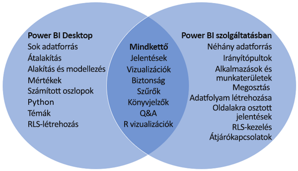

# A Power BI Desktop és a Power BI szolgáltatás összehasonlítása

A Power BI Desktopot és a Power BI szolgáltatást összehasonlító Venn-diagramban a középső terület mutatja a kettő átfedését. Néhány feladatot a Power BI Desktopban vagy a szolgáltatásban is elvégezhet. A Venn-diagram két oldalán az alkalmazás és a szolgáltatás egyedi funkciói vannak feltüntetve.  

A **Power BI Desktop** teljes értékű adatelemző és jelentéskészítő eszköz, amelyet ingyenes alkalmazásként telepíthet helyszíni számítógépére. Ennek része a Lekérdezésszerkesztő, amellyel több különböző adatforráshoz csatlakozhat, és adatmodellé kombinálhatja ezeket (ezt gyakran modellezésnek nevezik). Ezt követően az adatmodellre alapozott jelentést tervezhet. A [Power BI Desktop Első lépések útmutatója](../desktop-getting-started.md) végigvezeti a lépéseken.

A **Power BI szolgáltatás** felhőalapú szolgáltatás. Támogatja az egyszerű jelentésszerkesztést, valamint a csoportok és a vállalatok együttműködését. A Power BI szolgáltatásban is csatlakozhat adatforrásokhoz, de a modellezés korlátozott. 

Az üzleti intelligenciát alkalmazó projekteken dolgozó legtöbb jelentéstervező a **Power BI Desktop** használatával hoz létre jelentéseket, amelyeket a **Power BI szolgáltatással** terjeszt.

## Jelentésszerkesztés

Az alkalmazásban és a szolgáltatásban is létrehozhat és szerkeszthet *jelentéseket*. A jelentés állhat egy vagy több oldalból vizualizációkkal vagy vizualizációk gyűjteményeivel. Könyvjelzők, gombok, szűrők és részletezés felvételével javíthatja a navigációt a jelentésekben.

A Power BI Desktopban és a szolgáltatásban a jelentésszerkesztők hasonlóak. Három szakaszból állnak:  

1. A felső navigációs ablaktáblák, amelyek eltérnek a Power BI Desktopban és a szolgáltatásban    
2. A jelentésvászon     
3. A **Mezők**, a **Megjelenítések** és a **Szűrők** panel

Ez a videó bemutatja a jelentésszerkesztőt a Power BI Desktopban. 

<iframe width="560" height="315" src="https://www.youtube.com/embed/IkJda4O7oGs" frameborder="0" allowfullscreen></iframe>

## A Power BI szolgáltatás használata

### Együttműködés

Miután létrehozta a jelentéseket, mentheti őket egy *munkaterületre* a **Power BI szolgáltatásban**, ahol együttműködhet a munkatársaival. Ezekhez a jelentésekhez létrehozhat *irányítópultokat*. Majd ezeket az irányítópultokat és jelentések megoszthatja a szervezeten belüli és kívüli jelentésfogyasztókkal. A jelentésfogyasztók a Power BI szolgáltatásban *Olvasó nézetben*, tekinthetik meg ezeket, nem Szerkesztési nézetben. Ők nem férhetnek hozzá a jelentés létrehozói számára elérhető összes funkcióhoz.  Adathalmazokat is megoszthat, és lehetővé teheti, hogy mások azokra építsék jelentéseiket. További információ a [Power BI szolgáltatásbeli együttműködésről](../service-new-workspaces.md).

### Önkiszolgáló adatelőkészítés adatfolyamokkal

Az adatfolyamok segítenek a vállalatoknak egységesíteni a különféle forrásokból származó adatokat, valamint előkészíteni azokat modellezésre. Az elemzők könnyen, jól ismert és önkiszolgáló eszközökkel hozhatnak létre adatfolyamokat. Az elemzők az adatfolyamok használatával big data típusú adatokat tölthetnek be, alakíthatnak át, integrálhatnak és egészíthetnek ki. Ehhez adatforrás-kapcsolatokat, ETL logikát, frissítésütemezést és egyéb funkciókat definiálhatnak. További információ az [adatfolyamokkal végzett önkiszolgáló adat-előkészítésről](../service-dataflows-overview.md).

## Következő lépések

[Mi az a Power BI Desktop?](../desktop-what-is-desktop.md)

[Jelentés létrehozása](../service-report-create-new.md) a Power BI szolgáltatásban

[Alapfogalmak jelentéstervezőknek](../service-basic-concepts.md)

További kérdései vannak? [Kérdezze meg a Power BI közösségét](https://community.powerbi.com/)

