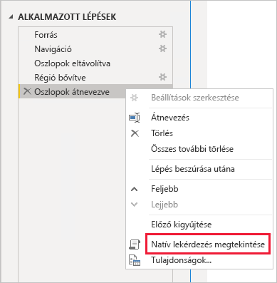
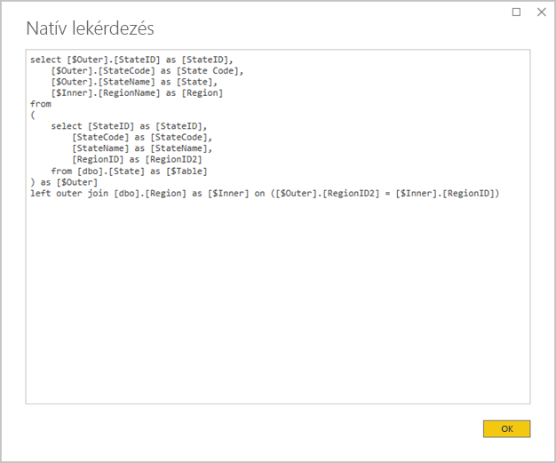
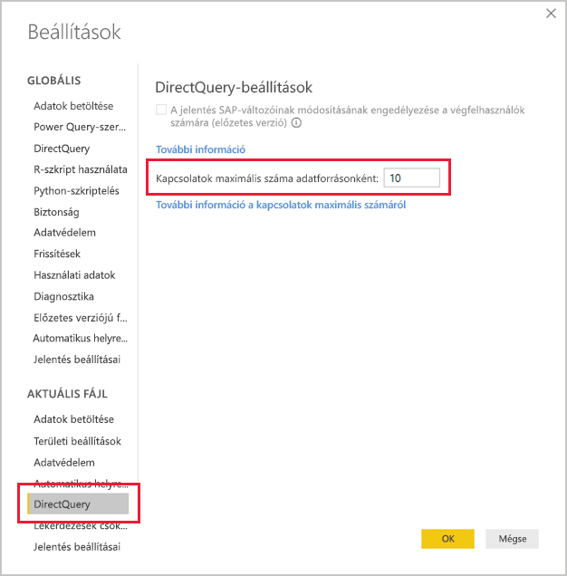

# <a name="directquery-model-guidance-in-power-bi-desktop"></a>Útmutató a DirectQuery-modellhez a Power BI Desktopban

Ez a cikk a Power BI Desktopban vagy a Power BI szolgáltatásban Power BI DirectQuery-modelleket fejlesztő adatmodellezőknek készült. Ismerteti a DirectQuery felhasználási területeit és korlátait, és útmutatást nyújt. Az útmutató célja, hogy segítsen eldönteni, vajon a DirectQuery-e a modellhez megfelelő mód, és javítani a DirectQuery-modellre épülő jelentések teljesítményét. Ez a cikk a Power BI szolgáltatásban vagy a Power BI jelentéskészítő kiszolgálón üzemeltetett DirectQuery-modellekre vonatkozik.

A cikknek nem célja a DirectQuery-modellek tervezésének teljes körű leírása. Bevezetésként elolvashatja a [DirectQuery-modellek a Power BI Desktopban](../connect-data/desktop-directquery-about.md) című cikket. A téma alaposabb tárgyalását közvetlenül a [DirectQuery az SQL Server 2016 Analysis Services szolgáltatásban](https://download.microsoft.com/download/F/6/F/F6FBC1FC-F956-49A1-80CD-2941C3B6E417/DirectQuery%20in%20Analysis%20Services%20-%20Whitepaper.pdf) című tanulmányban találhatja meg. Vegye figyelembe, hogy a tanulmány a DirectQuery SQL Server Analysis Services szolgáltatásban való használatát írja le. A tartalom nagy része azonban a Power BI DirectQuery-modelljeire is érvényes.

Ez a cikk nem foglalkozik közvetlenül az összetett modellekkel. Egy összetett modell legalább egy, de akár több DirectQuery-forrást is tartalmaz. Az ebben a cikkben nyújtott útmutatás ennek ellenére felhasználható – legalábbis részben – az összetett modellek tervezése során. Az importálási táblák DirectQuery-táblákkal történő kombinálásának következményei e cikk hatókörén kívül esnek. További információ: [Összetett modellek használata a Power BI Desktopban](../transform-model/desktop-composite-models.md).

Fontos tisztában lennie azzal, hogy a DirectQuery-modellek különböző számítási terhelést jelentenek a Power BI-környezet (a Power BI szolgáltatás vagy a Power BI jelentéskészítő kiszolgáló) és az alapul szolgáló adatforrások számára. Ha úgy ítéli, hogy a DirectQuery a megfelelő tervezési alap, ajánlott a megfelelő személyeket bevonni a projektbe. Gyakori tapasztalat, hogy egy DirectQuery-modell sikeres üzembe helyezése egy informatikai szakemberekből álló csapat szoros együttműködésének eredménye. A csapat általában modellfejlesztőkből és a forrásadatbázis rendszergazdáiból áll. A tagjai között lehetnek adattervezők, valamint adattárház- és ETL-fejlesztők is. A jó teljesítmény eléréséhez gyakran közvetlenül az adatforrásban kell optimalizálást végezni.

## <a name="design-in-power-bi-desktop"></a>Tervezés a Power BI Desktopban

Azure SQL Data Warehouse- és Azure HDInsight Spark-adatforráshoz is lehet közvetlenül csatlakozni anélkül, hogy használni kellene a Power BI Desktopot. Ez az Adatok lekérése területen az Adatbázisok csempe kiválasztásával történik a Power BI szolgáltatásban. További információ: [Az Azure SQL Data Warehouse használata a DirectQueryvel](../connect-data/service-azure-sql-data-warehouse-with-direct-connect.md).

Bár a közvetlen kapcsolat kényelmes, nem ajánlott ezt a módszert használni. Ennek fő indoka az, hogy a mögöttes adatforrás sémaváltozása esetén nem lehet frissíteni a modellstruktúrát.

Javasolt az összes DirectQuery-modell létrehozásához és kezeléséhez a Power BI Desktopot használni. Ezen a módon kézben tartható a szükséges modell definiálása, beleértve az olyan támogatott funkciók használatát, mint sok más mellett a hierarchiák, a számított oszlopok és a mértékek. Így a modell kialakítása is módosítható a mögöttes adatforrás sémaváltozása esetén.

## <a name="optimize-data-source-performance"></a>Adatforrások teljesítményének optimalizálása

A forrás relációs adatbázis több módon is optimalizálható, az alábbi felsorolásban leírtak szerint.

> [!NOTE]
> Nyilván nem minden modellkészítő rendelkezik a relációs adatbázis optimalizálásához szükséges engedélyekkel vagy szakértelemmel. Habár nem ez a DirectQuery-modellek optimalizálásának ajánlott rétege, bizonyos mértékű optimalizálás a modell tervezésével, a forrásadatbázis módosítása nélkül is elérhető. A legjobb optimalizálási eredmények többnyire mégis úgy érhetők el, hogy azokat a forrásadatbázison alkalmazzák.

- **Teljes adatintegritás biztosítása:** Különösen fontos, hogy a dimenzió-típusú táblák tartalmazzanak egy egyedi értékekből (dimenziókulcsokból) álló oszlopot, amely a ténytáblá(k)ra van leképezve. Az is lényeges, hogy a tény-típusú dimenzióoszlopok érvényes dimenziókulcs-értékeket tartalmazzanak. Hatékonyabb modellkapcsolatok konfigurálását teszik lehetővé, amelyek a kapcsolatok mindkét oldalán egyező értékeket várnak. Ha a forrásadatok integritása nem áll fenn, ajánlott egy „ismeretlen” dimenziórekordot felvenni a hatékony adatjavításhoz. Felvehet például egy sort a **Termék** táblába, amely egy ismeretlen terméknek felel meg, és ezt egy tartományon kívüli kulcshoz, például a -1 értékhez rendelheti. Ha a **Sales** tábla soraiból hiányoznak a termékkulcsértékek, helyettesítse őket a -1 értékkel. Ez biztosítja, hogy a **Sales** tábla minden termékkulcsértéke rendelkezzen egy megfelelő sorral a **Product** táblában.
- **Indexek hozzáadása:** Definiáljon megfelelő indexeket – a táblákban és nézetekben is – a jelentésbeli vizualizációkban várhatóan végzett szűrés és csoportosítás hatékony adatlekérdezésének érdekében. SQL Server-, Azure SQL Database- és Azure SQL Data Warehouse-források használata esetén az [SQL Server indexelési architektúráját és tervezési útmutatóját](/sql/relational-databases/sql-server-index-design-guide?view=sql-server-2017) ismertető dokumentumban talál hasznos információt az indexeléstervezésről. Az SQL Server és Azure SQL Database környezetfüggő forrásairól lásd: [A Columnstore használata valós idejű működési elemzésekre – Bevezetés](/sql/relational-databases/indexes/get-started-with-columnstore-for-real-time-operational-analytics?view=sql-server-2017).
- **Elosztott táblák tervezése:** A nagymértékben párhuzamos feldolgozási (MPP) architektúrát hasznosító Azure SQL Data Warehouse-forrásokhoz ajánlott kivonat alapján elosztott nagy ténytáblákat, és az összes számítási csomóponton replikált dimenzió-típusú táblákat konfigurálni. További információ: [Útmutatás elosztott táblák Azure SQL Data Warehouse-ban történő tervezéséhez](/azure/sql-data-warehouse/sql-data-warehouse-tables-distribute#what-is-a-distributed-table).
- **A szükséges adatátalakítások materializálásának biztosítása:** Relációs SQL Server-forrásadatbázisok (és más relációs adatbázisforrások) esetén számított oszlopok vehetők fel a táblákba. Ezek a táblák olyan képletekre épülhetnek, mint a **Mennyiség** és az **Egységár** szorzata. A számított oszlopok a hagyományos oszlopokhoz hasonlóan megőrizhetők (materializálhatók), és bizonyos esetekben indexelhetők. További információ: [Számított oszlopok indexei](/sql/relational-databases/indexes/indexes-on-computed-columns?view=sql-server-2017).

    Megfontolandó az indexelt nézetek használata, amelyek a ténytáblák adatainak kevésbé részletes előzetes összesítését végezhetik el. Ha az **Értékesítések** tábla például rendelésenként egy sorban tárolja az adatokat, létrehozható egy nézet, amely ezeket összesíti. Ez a nézet alapulhat egy SELECT utasításon, amely a **Sales** tábla adatait dátum (havi szinten), ügyfél vagy termék alapján csoportosítja, és összegzi a mértékértékeket, például az értékesítést, a mennyiséget stb. Ez a nézet ezután indexelhető. Az SQL Server- vagy Azure SQL Database-forrásokért lásd: [Indexelt nézetek létrehozása](/sql/relational-databases/views/create-indexed-views?view=sql-server-2017).
- **Dátumtábla materializálása:** Gyakori modellezési követelmény egy olyan dátumtábla felvétele, amely támogatja az időalapú szűrést. A vállalat ismert időalapú szűrőinek támogatásához hozzon létre egy táblát a forrásadatbázisban, és gondoskodjon róla, hogy az a ténytáblában szereplő dátumokat felölelő dátumtartományokkal legyen feltöltve. Az is lényeges, hogy tartalmazza az olyan jól használható időtartományok oszlopait, mint az év, negyedév, hónap, hét stb.

## <a name="optimize-model-design"></a>Modelltervek optimalizálása

Egy DirectQuery-modell több módon is optimalizálható, az alábbi felsorolásban leírtak szerint.

- **Összetett Power Query-lekérdezések kerülése:** Hatékony kialakítású modell valósítható meg, ha nincs szükség Power Query-lekérdezésekre az átalakítások végrehajtásához. Ez azt jelenti, hogy minden lekérdezés egy relációs adatbázis egyetlen forrástáblájára vagy -nézetére képezhető le. A Power Queryben alkalmazott lépés tényleges SQL-lekérdezési utasításának előnézete a **Natív lekérdezés megtekintése** lehetőséggel jeleníthető meg.

    
    
    

- **A számított oszlopok és az adattípus-módosítások felhasználásának felülvizsgálata:** A DirectQuery-modellek támogatják az adattípusokat konvertáló számítások és Power Query-lépések felvételét. Jobb teljesítmény érhető el azonban azzal, ha az átalakítások eredményei a relációs forrásadatbázisban vannak materializálva.
- **Relatív Power Query-dátumszűrés használatának kerülése:** Power Query-lekérdezésekben relatív dátumszűrés is meghatározható. Ez szolgálhat például (a mai dátumhoz viszonyítva) előző évi értékesítési megrendelések lekérésére. Az ilyen típusú szűrőt a rendszer egy nem hatékony natív lekérdezésre fordítja le az alábbiak szerint:

    ```SQL
    …
    from [dbo].[Sales] as [_]
    where [_].[OrderDate] >= convert(datetime2, '2018-01-01 00:00:00') and [_].[OrderDate] < convert(datetime2, '2019-01-01 00:00:00'))  
    ```
    
    Jobb tervezési elv a relatív időoszlopok beépítése a dátumtáblába. Ezek az oszlopok az aktuális dátumhoz képest eltolt értékeket tartalmaznak. Például egy **RelativeYear** oszlopban a nulla érték az aktuális évet, a -1 az előző évet jelöli stb. A **RelatívÉv** oszlopot legjobb a dátumtáblában létrehozni. Ugyan kevésbé hatékony, de a modell számított oszlopaként is felvehető a [TODAY](/dax/today-function-dax) és a [DATE](/dax/date-function-dax) DAX-függvényt használó kifejezés alapján.

- **Egyszerű mértékek használata:** Ajánlott a mértékeket egyszerű összesítésekre korlátozni, kezdetben legalábbis. Az összesítő függvények közé tartozik a SUM, a COUNT, a MIN, a MAX és az AVERAGE. Ha a mértékek így a kellő gyorsasággal működnek, kísérletezhet összetettebb mértékekkel is, de mindig figyeljen ezek teljesítményére. Bár a [CALCULATE](/dax/calculate-function-dax) DAX-függvény használható olyan kifinomult mértékkifejezések létrehozásához, amelyek manipulálják a szűrőkörnyezetet, költséges natív lekérdezéseket is létrehozhatnak, amelyek nem teljesítenek megfelelően.
- **Kapcsolatok kerülése a számított oszlopokban:** Modellbeli kapcsolatok csak egy tábla egyetlen oszlopa, és egy másik tábla egyetlen oszlopa között használhatók. Előfordul azonban, hogy két táblát több oszlop alapján is kapcsolatba kell hozni. Az **Értékesítések** és a **Hely** tábla például két oszlop alapján is összekapcsolható: **Ország** és **Város**. A táblák közötti kapcsolat létrehozásához egyetlen oszlopra van szükség, és a **Hely** táblában ennek az oszlopnak egyedi értékeket kell tartalmaznia. Ehhez az eredményhez vezethet az ország és a város kötőjel elválasztóval történő összefűzése.

    A kombinált oszlop a Power Query számított oszlopaként, vagy a modell számított oszlopaként is létrehozható. Ez azonban kerülendő, mivel a rendszer beágyazza a számítási kifejezést a forrásként szolgáló lekérdezésekbe. Ez egyrészt nem hatékony, másrészt általában megakadályozza az indexek használatát. A materializált oszlopokat vegye fel inkább a relációs forrásadatbázisba, és mérlegelje az indexelésüket. Fontolóra veheti azt is, hogy helyetteskulcs-oszlopokat vesz fel a dimenziótáblákhoz. Ezt a fogást gyakran alkalmazzák relációs adattárházbeli tervekhez.
    
    Ez alól az irányelv alól egyedül a [COMBINEVALUES](/dax/combinevalues-function-dax) DAX-függvény használata képez kivételt. Ennek a függvénynek a rendeltetése a többoszlopos modellkapcsolatok támogatása. A kapcsolatban használandó kifejezés helyett ez egy többoszlopos illesztési SQL-predikátumot generál.
- **Az „egyedi azonosító” típusú oszlopokra épülő kapcsolatok kerülése:** A Power BI nem támogatja natív módon az egyedi azonosító (GUID) adattípust. Ilyen típusú oszlopok közötti kapcsolat definiálásakor a Power BI egy explicit típuskonverziót tartalmazó forráslekérdezést generál. Az a lekérdezés során végzett adatkonverzió általában alacsony teljesítményt eredményez. Amíg nem kerül sor ennek az esetnek az optimalizálására, az egyetlen megkerülő megoldás az lesz, ha az alapul szolgáló adatbázisban más adattípust adunk meg az oszlopokhoz.
- **A kapcsolatok egy-oldalához tartozó oszlop elrejtése:** A kapcsolatok egy-oldalához tartozó oszlopot érdemes elrejteni. (Ez általában a dimenziótáblák elsődleges kulcsoszlopa.) Ha ez el van rejtve, akkor nem érhető el a **Mezők** panelen, így nem használható vizualizációk konfigurálásához. A több-oldali oszlop látható maradhat, ha hasznos a jelentéseknek az oszlop értékei alapján történő csoportosítása vagy szűrése. Tegyük fel például, hogy egy modellben kapcsolat áll fenn az **Értékesítések** és a **Termék** tábla között. A kapcsolat oszlopai SKU (termékváltozat) értékeket tartalmaznak. Ha termékváltozatot is fel kell venni a vizualizációkhoz, annak csak az **Értékesítések** táblában szabad látszania. Ha ennek az oszlopnak a használatával szűr vagy csoportosít egy vizualizációt, a Power BI olyan lekérdezést generál, amelynek nem kell összekapcsolnia az **Értékesítések** és a **Termék** táblát.
- **A kapcsolatok beállítása az integritás biztosításához:** A DirectQuery-kapcsolatok **Hivatkozási integritás feltételezése** tulajdonsága határozza meg, hogy a Power BI külső illesztés helyett belső illesztéssel generálja a forráslekérdezéseket. Ez rendszerint javítja a lekérdezések teljesítményét, bár ez a relációs adatbázis forrásának pontos jellemzőitől is függ. További információ: [Hivatkozási integritás feltételezésének beállításai a Power BI Desktopban](../connect-data/desktop-assume-referential-integrity.md).
- **Kapcsolatok kétirányú szűrésének elkerülése:** A kapcsolatok kétirányú szűrése olyan lekérdezési utasításokhoz vezethet, melyek teljesítménye nem megfelelő. Ezt a kapcsolati funkciót csak szükség esetén használja, ami általában akkor fordul elő, ha több-a-többhöz kapcsolatot implementál egy áthidaló táblában. További információ: [Több-a-többhöz számosságú kapcsolatok a Power BI Desktopban](../transform-model/desktop-many-to-many-relationships.md).
- **Párhuzamos lekérdezések korlátozása:** Beállíthatja a DirectQuery által az egyes mögöttes adatforrások felé megnyitott kapcsolatok maximális számát. Ez az adatforrásba egyidejűleg küldött lekérdezések számát szabályozza.

    
    
    Ez a beállítás csak akkor van engedélyezve, ha a modell tartalmaz legalább egy DirectQuery-forrást. Az értéke minden DirectQuery-forrásra, valamint a modellbe felvett összes új DirectQuery-forrásra is vonatkozik.

    A **Kapcsolatok maximális száma adatforrásonként** tulajdonságnak (a megadott mennyiségig történő) növelésével több lekérdezés küldését teheti lehetővé a mögöttes adatforrásnak, ami hasznos lehet, ha számos vizualizáció található egyetlen lapon, vagy sok felhasználó szeretne egyszerre hozzáférni egy jelentéshez. A kapcsolatok maximális számának elérése után a lekérdezések üzenetsorba kerülnek, amíg egy kapcsolat elérhetővé nem válik. A korlát növelése nagyobb terhelést eredményez a mögöttes adatforráson, a beállítás használata így nem garantál jobb teljesítményt.
    
    Ha a modell közzé van téve a Power BI-ban, a mögöttes adatforráshoz egyidejűleg küldött lekérdezések maximális száma a környezettől is függ. Különböző környezetek (például a Power BI, a Power BI Premium vagy a Power BI jelentéskészítő kiszolgáló) különböző átviteli korlátokat szabhatnak. További információ a Power BI Premium-kapacitások erőforrásokra vonatkozó korlátozásairól: [Power BI Premium-kapacitások üzembe helyezése és kezelése](https://docs.microsoft.com/power-bi/whitepaper-powerbi-premium-deployment).

## <a name="optimize-report-designs"></a>Jelentéstervek optimalizálása

A DirectQuery-adathalmazra épülő jelentések több módon is optimalizálhatók, az alábbi felsorolásban leírtak szerint.

- **Lekérdezéscsökkentési technikák engedélyezése:** A Power BI Desktop _Lehetőségek és beállítások_ területe tartalmaz egy Lekérdezések csökkentése lapot. Ez az oldal három hasznos lehetőséget tartalmaz. A keresztkiemelés és a keresztszűrés letiltható alapértelmezés szerint, bár a szerkesztési műveletek felülbírálhatják ezt. Az is megoldható, hogy egy Alkalmaz gomb jelenjen meg a szeletelőkön és a szűrőkön. A szeletelő vagy szűrő beállításai csak akkor lesznek alkalmazva, amikor a jelentés felhasználója a gombra kattint. Ezeket a lehetőségeket ajánlott a jelentés első létrehozásakor beállítani.

    
    
- **Először alkalmazza a szűrőket:** Amikor először tervez jelentéseket, azt javasoljuk, hogy a mezők vizualizációs mezőkre történő leképezése előtt minden vonatkozó szűrőt alkalmazzon (jelentés, oldal vagy vizualizáció szintjén). Ahelyett például, hogy az **Ország** és az **Értékesítések** mértékeket áthúzza, majd szűrést végez egy adott évre, először alkalmazza a szűrőt az **Év** mezőre. Ez azért fontos, mert a vizualizációk létrehozásának minden lépése elküld egy lekérdezést, és lehet ugyan módosításokat végezni az első lekérdezés teljesítése után is, de ez csak feleslegesen terheli az alapul szolgáló adatforrást. Ha először a szűrőket alkalmazza, azzal általában kevésbé költségessé és gyorsabbá teszi ezeket a közbeeső lekérdezéseket. Emellett a szűrők korai alkalmazásának elmulasztása esetén átlépheti a fentebb ismertetett egymillió soros határértéket.
- **Korlátozza az egy oldalon található vizualizációk számát:** Egy jelentésoldal megnyitásakor (ha oldalszűrők vannak alkalmazva) az oldal összes vizualizációja frissítve lesz. A párhuzamosan elküldhető lekérdezések számára azonban a Power BI-környezet és a **Kapcsolatok maximális száma adatforrásonként** beállítás által meghatározott korlátozás van érvényben a korábban leírtak szerint. Az oldalon lévő vizualizációk számának növelésével egyre növekszik annak kockázata, hogy ezek egymás után lesznek frissítve. Ezáltal megnő a teljes oldal frissítéséhez szükséges idő és annak az esélye is, hogy a vizualizációk inkonzisztens eredményeket jelenítenek meg (a környezetfüggő adatforrások esetében). A fentiek miatt ajánlott korlátozni az oldalakon elhelyezett vizualizációk számát, és ehelyett több, egyszerűbb oldalt készíteni. Több kártyavizualizáció egyetlen többsoros kártyavizualizációval történő cseréje hasonló oldalelrendezéshez vezethet.
- **A vizualizációk közötti interakció kikapcsolása:** A keresztkiemelési és keresztszűrési interakciókhoz lekérdezéseket kell küldeni a mögöttes adatforráshoz. Ha az interakciók nem feltétlenül szükségesek, ajánlott ezeket kikapcsolni, ha a felhasználó által végzett kijelölésekre adott reakció indokolatlanul lassú. Ez az interakció ki is kapcsolható akár a teljes jelentésre vonatkozóan (lásd fentebb a lekérdezések csökkentésének beállításánál), vagy külön-külön is. További információt a [Vizualizációk közötti keresztszűrés Power BI-jelentésben](../consumer/end-user-interactions.md) című cikkben talál.

A fenti optimalizálási technikák mellett a következő jelentéskészítési funkciók is hozzájárulhatnak a teljesítményproblémákhoz:

- **Mértékszűrők:** A mértékeket (vagy oszlopok összesítéseit) tartalmazó vizualizációk az ezekre a mértékekre alkalmazott szűrőket is tartalmazhatnak. Például az alábbi vizualizáció a **Sales** összegeit mutatja **Category** szerint, de csak a 15 milliós értékesítés feletti kategóriákat tartalmazza.

    
    
    
    Ehhez két lekérdezést kell elküldeni az alapul szolgáló forrás felé:
    
    - Az első lekérdezés lekéri a feltételnek (15 millió fölötti értékesítés) megfelelő kategóriákat
    - Ez után a második lekérdezés lekéri a vizualizációhoz szükséges adatokat, és azokat a kategóriákat veszi fel, amelyek megfeleltek a WHERE utasításban szereplő feltételeknek
    
    Ez a módszer általában jól működik, ha néhány száz vagy ezer kategória van, mint ebben a példában. Ha azonban a kategóriák száma sokkal több, a teljesítmény csökken (ráadásul ha egymilliónál több kategória felel meg a feltételnek, akkor a lekérdezés sikertelen lesz, a fentebb említett egymillió soros korlátozás miatt).
- **Legjobb N szűrők:** Speciális szűrők definiálhatók a mérték szerinti rangsorban legmagasabb (vagy legalacsonyabb) N darab érték szűrésére. Így jeleníthető meg például a fenti vizualizációban a legjobb öt kategória. A mértékszűrőkhöz hasonlóan ehhez is két lekérdezést kell elküldeni az alapul szolgáló adatforrás felé. Az első lekérdezésre azonban a mögöttes forrás az összes kategóriát visszaadja, majd a legjobb N értéket a visszaadott eredmények alapján választja ki a rendszer. Ez az érintett oszlop számosságától függően teljesítményproblémákat okozhat (vagy a lekérdezés sikertelenségét az egymilliós határérték miatt).
- **Medián:** Általában a rendszer minden összesítést (Összeg, Eltérők darabszáma stb.) elküld a mögöttes forrásnak. Ez azonban nem igaz a Median (Középérték) esetében, mivel ezt az összesítést az alapul szolgáló források nem támogatják. Ilyen esetben részletadatok vannak lekérdezve a mögöttes forrástól, és a Power BI ezek visszaadott eredményei alapján számítja ki a mediánt. Ez nem probléma, ha viszonylag kis számú eredmény középértékét kell kiszámolni, de teljesítményproblémákat okozhat, ha a számosság nagy (vagy sikertelen lekérdezéseket az 1 milliós határérték miatt). Például a megyék lakosságának mediánját jól ki lehet számolni, de az értékesítési árak mediánját már nem biztos.
- **Többszörös kijelölésű szeletelők:** A szeletelőkben és szűrőkben engedélyezett többszörös kijelölés teljesítményproblémákat okozhat. Ezért azért van, mivel ahogy a felhasználó további szeletelőelemeket választ ki (például tíz terméket, ami érdekli), minden egyes új kijelöléssel új lekérdezések történnek az alapul szolgáló forrás felé. A felhasználó még a lekérdezés teljesítése előtt kijelölheti a következő elemet, de ez felesleges terhelést okoz az alapul szolgáló forráson. Ez a helyzet az Alkalmaz gomb megjelenítésével kerülhető el, a lekérdezéscsökkentési technikáknál ismertetett módon.
- **Megjelenített összegzőértékek:** A táblázatok és mátrixok alapértelmezés szerint összegeket és részösszegeket is megjelenítenek. Az összegek lekérdezéséhez sok esetben további lekérdezéseket kell küldeni a mögöttes forráshoz. Ez érvényes a Count Distinct (Eltérők darabszáma) és a Median (Középérték) összesítések minden használatára, valamint minden esetben, amikor a DirectQueryt használja az SAP HANA vagy az SAP Business Warehouse helyett. Az ilyen összegzéseket ajánlott kikapcsolni (a Formázás panel használatával), ha nem szükségesek.

## <a name="convert-to-a-composite-model"></a>Összetett modellre konvertálás

Az Importálás és a DirectQuery modell előnyei egyetlen modellben egyesíthetők a modelltáblák tárolási módjának konfigurálásával. A tábla tárolási módja lehet Importálás, DirectQuery vagy mindkettő, az úgynevezett Kettős módban. Az eltérő tárolási módú táblákat tartalmazó modelleket összetett modellnek nevezzük. További információ: [Összetett modellek használata a Power BI Desktopban](../transform-model/desktop-composite-models.md).

Sokféle funkcionális és teljesítménybeli javítás érhető el egy DirectQuery-modell összetett modellé konvertálásával. Az összetett modellek több DirectQuery-forrást is integrálhatnak, és összesítéseket is tartalmazhatnak. Felvehetők a DirectQuery-táblák összesítő táblái a tábla összesített megfelelőjének importálásához. Ezekkel jelentősen javítható a teljesítmény, ha a vizualizációk magasabb szintű összesítéseket kérdeznek le. További információ: [Összesítések a Power BI Desktopban](../transform-model/desktop-aggregations.md).

## <a name="educate-users"></a>Felhasználók oktatása

Fontos a felhasználóknak is megtanítani a DirectQuery-adathalmazokra épülő jelentésekkel végzett hatékony munkára. A jelentéskészítőknek érdemes elsajátítaniuk a [Jelentéstervek optimalizálása](#optimize-report-designs section) című témakör tartalmát.

Ajánlott a jelentések felhasználóival is megismertetni a DirectQuery-adathalmazokra épülő jelentéseket. Számukra is hasznos lehet, ha tisztában vannak az általános adatarchitektúrával, beleértve az ebben a cikkben is ismertetett korlátozásokat is. Jobb, ha tisztában vannak azzal, hogy a frissítések és az interaktív szűrések esetenként lassúak lehetnek. Ha a jelentések ismerik a teljesítményromlás okát, kevésbé valószínű, hogy elveszik a jelentésekbe és az adatokba vetett bizalmuk.

Ha gyakran változó adatforrásokra épülő jelentéseket ad át, mindenképpen tájékoztassa a felhasználókat a Frissítés gomb használatáról. Azt is tudniuk kell, hogy ellentmondó eredmények is megjelenhetnek, és hogy a jelentésoldal következetlenségei a jelentés frissítésével szüntethetők meg.

## <a name="next-steps"></a>Következő lépések

Ha többet szeretne megtudni a DirectQueryről, tekintse át a következő forrásanyagokat:

- [DirectQuery-modellek a Power BI Desktopban](../connect-data/desktop-directquery-about.md)
- [A DirectQuery használata a Power BI Desktopban](../connect-data/desktop-use-directquery.md)
- [DirectQuery-modell hibaelhárítása a Power BI Desktopban](../connect-data/desktop-directquery-troubleshoot.md)
- Kérdése van? [Kérdezze meg a Power BI közösségét](https://community.powerbi.com/)
