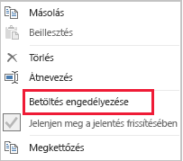

# Adatmennyiség-csökkentési technikák importálási modellek készítéséhez

Ez a cikk a Power BI Desktopot használó, importálási modelleket fejlesztő adatmodellezőknek szól. Az importálási modellekbe betöltött adatmennyiség csökkentését elősegítő különböző technikákat ismerteti.

Az importálási modellekbe töltött tömörített és optimalizált adatok, a VertiPaq tárolási összetevő használatával vannak lemezen tárolva. A forrásadatok memóriába töltésekor akár tízszeres tömörítés is tapasztalható, ezért reális elvárás, hogy 10 GB forrásadat körülbelül 1 GB méretre tömöríthető. A lemezen való megőrzéskor további 20% méretcsökkenés érhető el.

A VertiPaq tárolási összetevő által elért hatékonyság mellett is fontos a modellbe betöltött adatmennyiség minimalizálására törekedni. Ez különösen így van nagy modellek, vagy olyan modellek esetén, amelyek idővel várhatóan nagyra növekednek. Emellett szól egyebek mellett as következő négy meggyőző érv:

- A kapacitás esetleg nem támogatja a nagyobb méretű modelleket. A megosztott kapacitások legfeljebb 1 GB, a prémium szintű kapacitások legfeljebb 13 GB méretű modellt képesek üzemeltetni. További információt a [Nagyméretű adathalmazok Power BI Premium-támogatása](../service-premium-large-datasets.md) című cikk kínál.
- A kisebb modellek csökkentik a kapacitás erőforrásai, elsősorban a memória iránti igényt. Így több modell hosszabb időtartamra tölthető be egyidejűleg, csökkentve a kiürítések számát. Erről [A Power BI Premium üzembe helyezése](../whitepaper-powerbi-premium-deployment.md) című tanulmány [A kapacitások működése](../whitepaper-powerbi-premium-deployment.md#how-capacities-function) témaköre nyújt további információt.
- Kisebb modellekkel gyorsabb adatfrissítés érhető el, ez pedig a jelentéskészítés kisebb késését és az adathalmaz gyorsabb frissítését eredményezi, valamint kevésbé terheli a forrásrendszer és a kapacitás erőforrásait.
- A táblák sorainak alacsonyabb száma a számítások gyorsabb kiértékelését eredményezi, ez pedig a teljesítmény általános javulásában mutatkozhat meg.

Ez a cikk hét különböző adatmennyiség-csökkentési technikát mutat be. Ezek a következők:

- [A szükségtelen oszlopok eltávolítása](#remove-unnecessary-columns)
- [A szükségtelen sorok eltávolítása](#remove-unnecessary-rows)
- [Csoportosítás és összesítés](#group-by-and-summarize)
- [Oszlopok adattípusainak optimalizálása](#optimize-column-data-types)
- [Egyéni oszlopok előnyben részesítése](#preference-for-custom-columns)
- [Power Query-lekérdezések betöltésének letiltása](#disable-power-query-query-load)
- [Váltás Vegyes módra](#switch-to-mixed-mode)

## A szükségtelen oszlopok eltávolítása

A modelltáblák oszlopai két fő célt szolgálnak:

- A **jelentéskészítést**, olyan jelentések kialakításához, amelyek megfelelően szűrik, csoportosítják és összesítik a modell adatait
- A **modellstruktúrát** a modellbeli kapcsolatok, számítások, biztonsági szerepkörök és akár az adatszínek formázása támogatásával

Az ezeket a célokat nem szolgáló oszlopok feltehetően eltávolíthatók. Az oszlopok eltávolítása az úgynevezett _vertikális szűrés_.

A modelleket ajánlott pontosan az ismert jelentéskészítési követelmények alapján meghatározott oszlopszámmal megtervezni. Ezek a követelmények természetesen időben változhatnak, de szem előtt kell tartani, hogy oszlopokat később hozzáadni egyszerűbb, mint később eltávolítani azokat. Az oszlopok eltávolítása tönkreteheti a jelentéseket vagy a modell struktúráját.

## A szükségtelen sorok eltávolítása

A modelltáblákat a lehető legkevesebb sorral kell betölteni. Ez úgy érhető el, hogy a modelltáblákba két különböző okból, entitás vagy idő szerinti szűrés miatt szűrt sorhalmazok vannak betöltve. A sorok eltávolítása az úgynevezett _horizontális szűrés_.

Az **entitás szerinti szűrés** azzal jár, hogy csak a forrásadatok egy részhalmaza lesz betöltve a modellbe. Az összes értékesítési régió értékesítési tényeinek betöltése helyett például csak egy régió tényei lesznek betöltve. Ez a tervezési mód sok kisebb modellt eredményez, és sorszintű biztonság definiálását is szükségtelenné teszi (megköveteli viszont célzott adathalmaz-engedélyek megadását a Power BI szolgáltatásban, és az egyes adathalmazokhoz csatlakozó „duplikált” jelentések létrehozását). A felügyelet és a közzététel egyszerűbbé tétele érdekében kihasználhatja a Power Query-paraméterek és a Power BI-sablonfájlok használatával járó előnyöket. További információt [A lekérdezési paraméterek és a Power BI-sablonok részletes bemutatása](https://powerbi.microsoft.com/blog/deep-dive-into-query-parameters-and-power-bi-templates/) című blogbejegyzésben találhat.

Az **idő szerinti szűrés** lényege a tény típusú táblákba betöltött _adatelőzmények_ mennyiségének (és a modell adattábláiba betöltött adatsorok számának) korlátozása. Az összes rendelkezésre álló előzményt csak akkor érdemes betölteni, ha ez ismert jelentéskészítési követelmény. Hasznos lehet tudni, hogy a Power Query-szűrők paraméterezhetők, és akár relatív időszakok használatára is beállíthatók (a frissítés időpontjához viszonyítva, például az elmúlt öt évre). Azzal is érdemes tisztában lenni, hogy az időalapú szűrők utólagos módosítása nem teszi tönkre a jelentéseket, csak azt eredményezi, hogy a jelentésekben kevesebb (vagy több) adatelőzmény fog rendelkezésre állni.

## Csoportosítás és összesítés

A modell méretét csökkentő leghatékonyabb technika talán az előre összesített adatok betöltése. Ezzel a technikával módosítható a tény típusú táblák részletessége. Ennek egyértelmű velejárója, hogy egyes részletek viszont elvesznek.

Tegyük fel például, hogy a forrásban egy értékesítési ténytábla megrendelésenként egy sort tartalmaz. Az adatmennyiség jelentősen csökkenthető az összes értékesítési metrika összesítésével, valamint a dátum, az ügyfél és a termék szerinti csoportosítással. Felvetődhet, hogy az adatmennyiség még tovább csökkenthető az adatok _havi_ csoportosításával. Ez akár 99%-kal is csökkentheti a modell méretét, de természetesen többé nem lesz lehetséges jelentést készíteni napi szinten, vagy az egyes megrendelések szintjén. A tény típusú adatok összesítése melletti döntés mindig hátrányokkal is jár. Ezek a hátrányok vegyes modell tervezésével mérsékelhetők, amelyet később, a [Váltás Vegyes módra](#switch-to-mixed-mode) című témakörben ismertetünk.

## Oszlopok adattípusainak optimalizálása

A VertiPaq tárolási összetevő minden oszlophoz külön adatstruktúrát használ. Ezek az adatstruktúrák az értékkódolást használó numerikus oszlopadatok esetén érik el a legjobb optimalizálást. A szöveges és más nem numerikus adatok viszont kivonatoló kódolást használnak. Ehhez az szükséges, hogy a tárolási összetevő az oszlopban tárolt minden egyedi szöveges értékhez numerikus azonosítót rendeljen. Ez a numerikus azonosító lesz aztán az adatstruktúrában tárolva, ezért a tároláshoz és a lekérdezéshez a kivonat keresése szükséges.

Bizonyos esetekben a szöveges forrásadatok numerikus értékekké konvertálhatók. lehetséges például, hogy a rendelésszámok előtagja mindig ugyanaz a szöveges érték (például „SO123456”). Az előtag eltávolításával a rendelésszám értéke egész számmá konvertálható. Nagy tábláknál ez az adatmennyiség jelentős csökkenését eredményezheti, főleg akkor, ha az oszlop egyedi vagy nagy számban ismétlődő értékeket tartalmaz.

Ebben a példában az oszlop Alapértelmezett összesítés tulajdonságát érdemes a „Nincs összesítés” értékre beállítani. Így könnyebb kizárni a rendelésszám-értékek nem megfelelő összesítését.

## Egyéni oszlopok előnyben részesítése

A VertiPaq tárolási összetevő a modell számított (DAX-ban definiált) oszlopait ugyanúgy tárolja, mint a hagyományos, Power Queryből származó oszlopokat. Az adatstruktúrák azonban kissé eltérően vannak tárolva, és általában kevésbé hatékony tömörítést érnek el. Ráadásul az összes Power Query-tábla betöltése után vannak elkészítve, ez pedig hosszabb adatfrissítési időt eredményez. Ez az oka, hogy a tábla oszlopait kevésbé hatékony _számított_ oszlopokként felvenni, mint Power Queryben _számított_ (M-ben definiált) oszlopokként.

Az egyéni oszlopok létrehozását érdemesebb a Power Queryben végezni. Ha a forrás egy adatbázis, két módon is elérhető nagyobb betöltési hatékonyság. A számítás definiálható az SQL-utasításban (a szolgáltató natív lekérdezési nyelvének használatával), vagy megvalósítható oszlopként az adatforrásban.

Egyes esetekben mégis érdemesebb a modellbeli számított oszlopok mellett dönteni. Ilyen eset lehet az, amikor a képlet egy része mértékeket értékel ki, vagy ha adott, csak DAX-függvényekben támogatott modellezési funkciókat igényel. Ilyen példával mutat be a [Szülő-gyermek hierarchiákat kiszolgáló DAX-függvények ismertetése](/dax/understanding-functions-for-parent-child-hierarchies-in-dax) című cikk.

## Power Query-lekérdezések betöltésének letiltása

A más lekérdezésekkel való adatintegráció támogatására szánt Power Query-lekérdezéseket nem érdemes betölteni a modellbe. A lekérdezés modellbe való betöltésének elkerüléséhez ilyen esetekben gondoskodni kell a lekérdezésbetöltés letiltásáról.

## Váltás Vegyes módra

A Power BI Desktopban a Vegyes módú tervezés összetett modellt állít elő. Ez lényegében _minden egyes tábla_ tárolási módjának meghatározását teszi lehetővé. Ennek köszönhetően minden tábla Tárolási mód tulajdonsága beállítható Importálás vagy DirectQuery értékre (egy további lehetőség a Kettős).

A modell méretét hatékonyan csökkentő technika a nagyobb tény típusú táblák Tárolási módjának DirectQuery értékre állítása. Megfontolandó, hogy ez a tervezési elv jól használható a korábbi [Csoportosítás és összesítés](#group-by-and-summarize) témakörben bemutatottal együtt. Az összesített értékesítési adatok például felhasználhatók „összegző” jelentések nagy teljesítményű készítéséhez. Egy részletező oldal úgy mutathatja be részletesen a megadott (szűk) szűrőkörnyezethez tartozó értékesítéseket, hogy a környezeten belüli összes értékesítési megrendelést megjeleníti. Ebben a példában a részletező oldal egy DirectQuery-táblán alapuló vizualizációkat tartalmazna az értékesítési megrendelések adatainak lekéréséhez.

Az összetett modellek használatának azonban számos biztonsági és a teljesítményt érintő velejárója van. Erről az [Összetett modellek használata a Power BI Desktopban](../desktop-composite-models.md) című cikkben talál további tájékoztatást.

## Következő lépések

Power BI-beli importálási modell tervezéséről a következő cikkekből tájékozódhat bővebben:

- [Összetett modellek használata a Power BI Desktopban](../desktop-composite-models.md)
- [Tárolási mód a Power BI Desktopban](../desktop-storage-mode.md)
