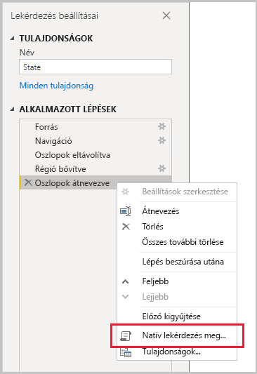
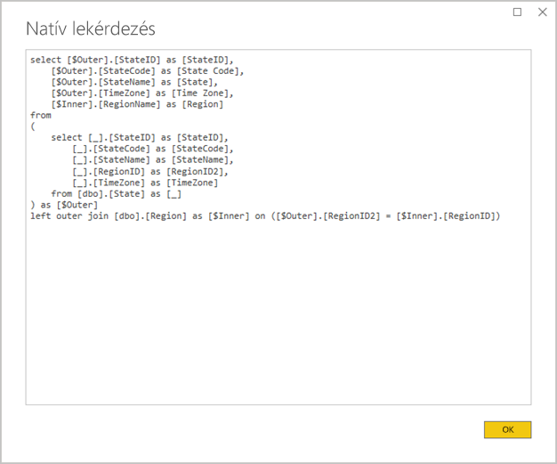
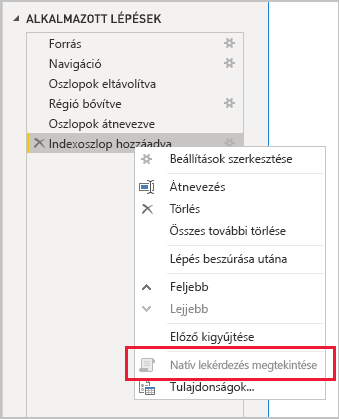

# <a name="the-importance-of-query-folding"></a>A lekérdezésdelegálás fontossága

Ez a cikk azoknak az adatmodellezőknek szól, akik modelleket fejlesztenek a Power BI Desktopban. A lekérdezésátadást és annak jelentőségét ismerteti. Leírja azokat az adatforrásokat és -átalakításokat is, amelyekkel a lekérdezésátadás elérhető, valamint hogy hogyan állapítható meg a Power Query-lekérdezések teljes vagy részleges átadhatósága. Végül útmutatást is nyújt arról, hogy mikor és hogyan valósítható meg a lekérdezésátadás.

A lekérdezésátadás a Power Query-lekérdezéseknek az a képessége, hogy egyetlen lekérdezési utasítást generál a forrásadatok lekéréséhez és átalakításához. A Power Query adategyesítési motorja mindig törekszik a lekérdezésátadásra, ha az lehetséges, ugyanis ez eredményezi a leghatékonyabb kapcsolódási útvonalat a Power BI-modelltábla és a mögöttes adatforrás között.

A lekérdezésátadás több szempontból is lényeges fogalom az adatmodellezés szempontjából:

- **Importált modelltáblák:** Az adatfrissítés az erőforrás-felhasználás és a frissítés időtartama szempontjából hatékonyan megy végbe az Importálás típusú modelltábláknál
- **DirectQuery és Kettős tárolási módú táblák:** Minden DirectQuery és Kettős tárolási módú táblának átadható Power Query-lekérdezésre kell épülnie
- **Növekményes frissítés:** A növekményes adatfrissítés az erőforrás-felhasználás és a frissítés időtartama szempontjából is hatékony lesz. A növekményes frissítés konfigurációs ablaka figyelmeztetést is küld, ha azt észleli, hogy az táblához nem érhető el lekérdezésátadás. Ha ez nem érhető el, akkor a növekményes frissítés célkitűzése meghiúsul. Ilyenkor az adategyesítő motornak kellene lekérnie a forrás összes sorát, majd szűrők alkalmazásával felismernie a növekményes módosításokat.

Lekérdezésátadás egy teljes Power Query-lekérdezésen vagy a lépések egy részhalmazán is történhet. Ha a lekérdezésátadás nem valósítható meg – részlegesen vagy teljesen –, akkor azt a Power Query adategyesítő motornak kell helyettesítenie a Power BI-ban az adatátalakítások feldolgozásával. Ennek része lehet a forráslekérdezések eredményeinek lekérése, ez pedig rendkívül erőforrásigényes és lassú a nagy adathalmazok esetén.

Az adatmodellezőknek ajánlott a hatékonyságra törekedni az Importálás módú modellek tervezése során azzal, hogy biztosítják a lekérdezésátadást, ahol csak lehetséges.

## <a name="sources-that-support-query-folding"></a>Lekérdezésátadást támogató források

A lekérdezési nyelvvel rendelkező adatforrások többsége támogatja a lekérdezésátadást. Ezen adatforrások közé tartoznak a relációs adatbázisok, az OData-csatornák (köztük a SharePoint-listák), az Exchange és az Active Directory. Bizonyos adatforrások, például az egybesimított fájlok, a blobok és a webes források viszont általában nem támogatják a használatát.

## <a name="transformations-that-can-achieve-query-folding"></a>Lekérdezésátadás megvalósítására alkalmas átalakítások

A relációs adatforrások lekérdezésátadásra alkalmas átalakításai azok, amelyek megírhatók egyetlen SELECT utasításként. Egy SELECT utasítás a megfelelő WHERE, GROUP BY és JOIN záradékokkal szerkeszthető meg. Tartalmazhat még olyan oszlopkifejezéseket (számításokat), amelyek az SQL-adatbázisok által támogatott közönséges beépített függvényeket használják.

Általánosságban az alábbi felsorolás írja le a lekérdezésátadáshoz alkalmas átalakításokat.

- Oszlopok eltávolítása
- Oszlopok átnevezése (SELECT oszlopaliasok)
- Sorok szűrése statikus értékekkel vagy Power Query-paraméterekkel (WHERE záradékpredikátumok)
- Csoportosítás és összegzés (GROUP BY záradék)
- Rekordoszlopok kiterjesztése (forrás külső kulcsoszlopai) két forrástábla összekapcsolásához (JOIN záradék)
- Átadható lekérdezések nem fuzzy egyesítése azonos forrás alapján (JOIN záradék)
- Átadható lekérdezések összefűzése azonos forrás alapján (UNION ALL operátor)
- Egyéni oszlopok felvétele _egyszerű logikával_ (SELECT oszlopkifejezések). Az egyszerű logika kevéssé összetett műveleteket jelent, esetleg olyan M-függvények használatával, amelyekkel egyenértékű műveletek vannak az SQL-adatforrásban. Ilyenek például a matematikai vagy szövegkezelő függvények. Az alábbi kifejezés például az **OrderDate** oszlop értékének év összetevőjét adja vissza (hogy számértéket adjon vissza).

    ```powerquery-m
    Date.Year([OrderDate])
    ```

- Kimutatások és kifejtések (PIVOT és UNPIVOT operátorok)

## <a name="transformations-that-prevent-query-folding"></a>A lekérdezésátadást megakadályozó átalakítások

Általánosságban az alábbi felsorolás írja le a lekérdezésátadást megakadályozó átalakításokat. A fenti lista nem tekintendő teljesnek.

- Lekérdezések egyesítése különböző források alapján
- Lekérdezések összefűzése (unióképzés) különböző források alapján
- Egyéni oszlopok felvétele _összetett logikával_. Összetett logika az olyan M-függvények használata, amelyekkel ekvivalens függvény nincs az adatforrásban. Az alábbi kifejezés például az **OrderDate** oszlopot formázza (hogy szöveges értéket adjon vissza).

    ```powerquery-m
    Date.ToText([OrderDate], "yyyy")
    ```

- Indexoszlopok felvétele
- Oszlop adattípusának módosítása

Lényeges, hogy ha egy Power Query-lekérdezés több adatforrásra terjed ki, az adatforrások adatvédelmi szintjeinek inkompatibilitása megakadályozhatja, hogy megtörténjen a lekérdezésátadás. További információt talál [A Power BI Desktop adatvédelmi szintjei](../desktop-privacy-levels.md) című cikkben.

## <a name="determine-when-a-query-can-be-folded"></a>Egy lekérdezés átadhatóságának megállapítása

A Power Query-szerkesztő ablakában megállapítható, hogy egy Power Query-lekérdezés átadható-e. Ha **Lekérdezés beállításai** panelen a jobb gombbal az utolsó alkalmazott lépésre kattintva a **Natív lekérdezés megtekintése** lehetőség engedélyezve van (nem szürke), akkor a lekérdezés átadható.



Az átadott lekérdezés megtekintéséhez válassza a **Natív lekérdezés megtekintése** lehetőséget. Ekkor megjelenik az a natív lekérdezés, amelyet a Power Query fog használni a forrásadatokon.



Ha a **Natív lekérdezés megtekintése** lehetőség nem érhető el (ki van szürkítve), az azt jelzi, hogy a lekérdezés lépései nem adhatók át. Ugyanakkor lehetséges, hogy a lépések egy része még így is átadható. Az utolsó lépéstől visszafelé haladva minden lépésnél ellenőrizheti, hogy engedélyezve van-e a **Natív lekérdezés megtekintése** lehetőség. Ha így tesz, megtudhatja, hogy a lépések sorozatában mikor vált megvalósíthatatlanná a lekérdezésátadás.



## <a name="best-practice-guidance"></a>Útmutatás az ajánlott eljárásokhoz

Tömören összefoglalva a Power Query-lekérdezésnek DirectQuery vagy Kettős tárolási módú táblák esetén meg kell valósítania a lekérdezésátadást. Relációs forráson alapuló Importálás módú tábla esetén, vagy ha egyetlen SELECT utasítás írható, a _legjobb adatfrissítési teljesítmény_ a lekérdezésátadás megvalósulásának biztosításával érhető el. Ha az adategyesítő motor továbbra is szükséges az átalakítások feldolgozásához, akkor az általa elvégzendő munka minimálisra csökkentés a cél, főleg nagy adathalmazok esetében.

Az alábbi felsorolás az ajánlott eljárásokhoz ad útmutatást.

- **A lehető legtöbb feldolgozási feladat adatforráshoz delegálása:** Ha egy Power Query-lekérdezés összes lépése nem adható át, keresse meg a lekérdezésátadást megakadályozó lépést. Ha lehetséges, helyezze át az ezt követő lépéseket a sor korábbi szakaszába, hogy be lehessen foglalni a lekérdezésátadásba. A Power Query adategyesítési motorja elég intelligens lehet a lekérdezési lépések átrendezéséhez a forráslekérdezés létrehozásakor.

Relációs adatforrás esetén, ha a lekérdezésátadást megakadályozó lépések megvalósíthatók egyetlen SELECT utasítással vagy egy tárolt eljárás belső logikájával, érdemes megfontolni az alábbiakban ismertetett natív lekérdezési utasítás használatát.

- **Natív SQL-lekérdezés használata:** Ha egy Power Query-lekérdezés egy relációs forrásból fogad adatokat, natív SQL-lekérdezés is használható. A lekérdezés bármilyen érvényes utasítás, akár egy tárolt eljárás végrehajtása is lehet. Ha az utasítás több eredményhalmazt állít elő, csak az első lesz visszaadva. Paraméterek deklarálhatók az utasításon belül, a paraméterértékek biztonságos és kényelmes átadásához pedig ajánlott a [Value.NativeQuery](/powerquery-m/value-nativequery) M-függvényt használni. Fontos tisztában lenni azzal, hogy a Power Query adategyesítő motorja nem tud egymást követő lekérdezési lépéseket átadni, ezért fontos az összes (vagy a lehető legtöbb) átalakítási logikát belefoglalni a natív lekérdezési utasításba.

    Natív SQL-lekérdezések használatakor két lényeges szempontot kell szem előtt tartani:

    - DirectQuery módú modelltábla esetén a lekérdezésnek egy SELECT utasításnak kell lennie, és nem használhat közös táblakifejezéseket (CTE-ket) vagy tárolt eljárásokat
    - A növekményes frissítés nem használhat natív SQL-lekérdezést, így arra kényszeríti a Power Query adategyesítő motorját, hogy kérje le a forrás összes sorát, majd szűrők alkalmazásával találja meg a növekményes módosításokat

    > [!IMPORTANT]
    > Egy natív lekérdezéssel az adatok lekérésénél több is végrehajtható. Bármely érvényes utasítást (többször is) végrehajthat, akár olyanokat is, amelyek adatokat módosítanak vagy törölnek. Fontos a legalacsonyabb jogosultság elvének alkalmazásával biztosítani, hogy az adatbázis eléréséhez használt fiók csak olvasási engedéllyel rendelkezzen a szükséges adatokhoz.

- **Az adatok előkészítése és átalakítása a forrásban:** Ha megállapította, hogy egy Power Query-lekérdezés bizonyos lépései nem adhatók át, az átalakítások végrehajthatók lehetnek az adatforrásban. Ez egy olyan adatbázisnézet megírásával érhető el, amely logikailag alakítja át a forrásadatokat, vagy pedig az adatok fizikai előkészítésével és materializálásával, mielőtt a Power BI lekérdezné azokat. Az általában vállalati adatok előre integrált forrásaiból álló relációs adattárházak kitűnő példái az előkészített adatoknak.

## <a name="next-steps"></a>Következő lépések

A lekérdezésátadással és a kapcsolódó témakörökkel kapcsolatos további információkért tekintse meg az alábbi forrásanyagokat:

- [Összetett modellek használata a Power BI Desktopban](../desktop-composite-models.md)
- [Növekményes frissítés a Power BI Premium szolgáltatásban](../service-premium-incremental-refresh.md)
- [Lekérdezésátadás megvalósítása a Table.View használatával](/power-query/handlingqueryfolding)
- Kérdése van? [Kérdezze meg a Power BI közösségét](https://community.powerbi.com/)
