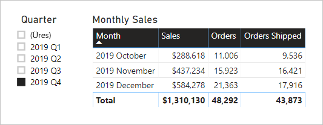

# <a name="active-vs-inactive-relationship-guidance"></a>Útmutató aktív vagy inaktív kapcsolatokhoz

Ez a cikk a Power BI Desktopot használó adatmodellezőknek szól. Ahhoz nyújt útmutatást, hogy mikor érdemes aktív, és mikor inaktív modellkapcsolatot létrehozni. Az aktív kapcsolatok alapértelmezés szerint továbbítják a szűrőket a többi táblába. Az inaktív kapcsolatok viszont csak akkor adják tovább a szűrőket, ha egy DAX-kifejezés aktiválja (használja) a kapcsolatot.

[!INCLUDE [relationships-prerequisite-reading](includes/relationships-prerequisite-reading.md)]

## <a name="active-relationships"></a>Aktív kapcsolatok

Általában mindig ajánlott aktív kapcsolatokat definiálni, ha lehetséges. Ezek által bővül a modell felhasználási lehetőségeinek köre a jelentéskészítők és a Q&A-val dolgozó felhasználók számára.

Vegyünk például egy Importálás típusú modellt, amelyet repülőgép-járatok időteljesítményének (OTP) elemzésére terveztek. A modellben van egy **Flight** (Járat) nevű ténytáblája, amely járatonként egy sort tárol. Minden sorban rögzíti a járat dátumát, a járat számát, az indulási és érkezési repülőteret és az esetleges késést (percekben). Van egy **Airport** (Repülőtér) tábla is, amely egy repülőterenként egy sort tartalmazó dimenziótábla. Minden sor megadja a repülőtér kódját, nevét és országát.

Az alábbi ábrán a két tábla részleges modelldiagramja látható.


A **Flight** és az **Airport** tábla között két modellkapcsolat van. A **Flight** tábla **DepartureAirport** (Indulási repülőtér) és **ArrivalAirport** (Érkezési repülőtér) oszlopa kapcsolódik az **Airport** tábla **Airport** oszlopához. Csillagsémában az **Airport** tábla [többszerepű dimenziónak](star-schema.md#role-playing-dimensions) számít. Ebben a modellben a két szerepe az _indulási repülőtér_ és az _érkezési repülőtér_.

Bár ez a megoldás relációs csillagséma-tervekhez jól megfelel, Power BI-modellekhez nem a legalkalmasabb. A modellkapcsolatok ugyanis a szűrők továbbadásának útvonalai, ezeknek az útvonalaknak pedig determinisztikusaknak kell lenniük. A modell emiatt nem tartalmazhat több aktív kapcsolatot két tábla között. Ennek következtében – ahogyan a példa leírja – a kapcsolatok egyike aktív, a másik pedig inaktív (ezt szaggatott vonal jelzi). Ebben az esetben az **ArrivalAirport** oszlop kapcsolata aktív. Ez azt jelenti, hogy az **Airport** táblára alkalmazott szűrők automatikusan propagálva lesznek a **Flight** tábla **ArrivalAirport** oszlopára.

Ez a modellterv erősen korlátozza az adatokról készíthető jelentéseket. Ebben az esetben ez azt jelenti, hogy az **Airport** tábla szűrésével nem szűrhetők ki automatikusan az egy indulási repülőtérre vonatkozó járatadatok. Mivel a jelentéskészítéshez az indulási és érkezési repülőtér alapján _egyszerre_ végzett szűrés (vagy csoportosítás) is szükséges, két aktív kapcsolatra van szükség. Ez a követelmény egy Power BI-modellre nézve azt jelenti, hogy a modellnek két repülőtér-táblát kell tartalmaznia.

Az így továbbfejlesztett modellterv a következő.


A modellben most két tábla tartalmazza a repülőtereket: **Departure Airport** (Indulási repülőtér) és **Arrival Airport** (Érkezési repülőtér). Az e táblák és a **Flight** tábla közötti modellkapcsolatok mindegyike aktív. Azt is megfigyelheti, hogy a **Departure Airport** és az **Arrival Airport** táblákban az oszlopnevek a _Departure_ illetve az _Arrival_ előtaggal vannak ellátva.

A módosított modellterv már támogatja az alábbi jelentéskivitel előállítását.


A jelentésoldal a Melbourne indulási repülőtérre szűr, a táblázatos vizualizáció pedig az érkezési repülőterek szerint csoportosít.

> [!NOTE]
> Importálási modellek esetén az újabb tábla megnöveli a modell méretét és a frissítéshez szükséges időt. Ezzel ellentmond az [Adatmennyiség-csökkentési technikák importálási modellek készítéséhez](import-modeling-data-reduction.md) című cikk ajánlásainak. A példában azonban az egyetlen aktív kapcsolatra vonatkozó követelmény felülbírálja ezeket az ajánlásokat.
>
> Emellett a dimenziótáblák gyakran kevés sort tartalmaznak a ténytáblák sorainak számához viszonyítva. A modell méretének és a frissítés időtartamának növekedése tehát feltehetően nem túl jelentős.

### <a name="refactoring-methodology"></a>Újrabontási módszertan

Bemutatunk egy módszert, amellyel az egyetlen többszerepű dimenziótáblát tartalmazó modell újrabontással olyan tervvé alakítható, amely _szerepenként egy táblát tartalmaz_.

1. Távolítsa el az összes inaktív kapcsolatot.
2. A többszerepű dimenziótáblának érdemes olyan nevet adni, amely jobban leírja annak szerepét. Ebben a példában az **Airport** tábla a **Flight** tábla **ArrivalAirport** oszlopához kapcsolódik, ezért **Arrival Airport** névre van átnevezve.
3. Készítsen másolatot a többszerepű tábláról, és adjon neki a szerepét tükröző nevet. Ha ez egy Importálás módú tábla, ajánlott számított táblát definiálni. Ha DirectQuery módú tábla, akkor duplikálhatja a Power Query-lekérdezést.

    Ebben a példában a **Departure Airport** tábla a számított tábla alábbi definíciójával lett létrehozva.

    ```dax
    Departure Airport = 'Arrival Airport'
    ```

4. Hozzon létre aktív kapcsolatot az új táblához.
5. A táblák oszlopait érdemes az azok szerepét pontosan tükröző módon átnevezni. Ebben a példában minden oszlop neve a _Departure_ (Indulás) illetve _Arrival_ (Érkezés) előtaggal van ellátva. Ezek az elnevezések biztosítják, hogy a jelentésvizualizációk alapértelmezetten jól értelmezhető, félreérthetetlen címkékkel rendelkezzenek. Ezáltal a Q&A-felület is használhatóbbá válik, és a felhasználók egyszerűbben írhatják meg kérdéseiket.
6. A többszerepű táblákhoz érdemes leírást is megadni. (A **Mezők** panelen a leírások elemleírásban jelennek meg, ha a jelentéskészítő a táblára viszi a kurzort.) Ezen a módon ismertetheti a szűrők továbbításának részleteit a jelentéskészítőkkel.

## <a name="inactive-relationships"></a>Inaktív kapcsolatok

Bizonyos körülmények között az inaktív kapcsolatokkal speciális jelentéskészítési igényeknek tehetnek eleget.

Vizsgáljunk meg egy más jelentéskészítési követelményekkel rendelkező másik modellt:

- Egy értékesítési modell tartalmaz egy **Sales** (Értékesítések) táblát, amelynek két dátumoszlopa van: **OrderDate** (Megrendelés dátuma) és **ShipDate** (Kiszállítás dátuma)
- A **Sales** tábla minden sora egyetlen megrendelést rögzít
- Dátumszűrők szinte mindig az **OrderDate** oszlopra vannak alkalmazva, amely mindig érvényes dátumot tartalmaz
- Csak egyetlen mértékhez szükséges a dátumszűrőt a **ShipDate** oszlopra továbbadni, az azonban BLANK (üres) értékeket is tartalmazhat (a megrendelés kiszállítása előtt)
- Nem követelmény, hogy a megrendelési _és_ a kiszállítási dátum alapján egyszerre lehessen szűrni (vagy csoportosítani)

Az alábbi ábrán a két tábla részleges modelldiagramja látható.


A **Sales** és a **Date** tábla között két modellkapcsolat van. A **Sales** tábla **OrderDate** és **ShipDate** oszlopa kapcsolódik a **Date** tábla **Date** oszlopához. Ebben a modellben a **Date** tábla két szerepe a _megrendelés dátuma_ és a _kiszállítás dátuma_. Az **OrderDate** oszloppal való kapcsolata aktív.

Mind a hat mértéknek – egyet kivéve – az **OrderDate** oszlop alapján kell szűrnie. Az **Orders Shipped** (Kiszállított megrendelések) mértéknek azonban a **ShipDate** oszlop alapján kell szűrnie.

Az **Orders** mérték definíciója a következő. Egyszerűen megszámolja a **Sales** tábla sorait a szűrési környezetben. A **Date** táblára alkalmazott összes szűrő továbbítva lesz az **OrderDate** oszlopba.

```dax
Orders = COUNTROWS(Sales)
```

Az **Orders Shipped** mérték definíciója a következő. Ez a [USERELATIONSHIP](/dax/userelationship-function-dax) DAX-függvényt használja, amely egy megadott kapcsolaton aktiválja a szűrőpropagálást, csak a kifejezés kiértékelésének időtartamára. Ebben a példában a **ShipDate** oszloppal való kapcsolatot használja.

```dax
Orders Shipped =
CALCULATE(
    COUNTROWS(Sales)
    ,USERELATIONSHIP('Date'[Date], Sales[ShipDate])
)
```

Ez a modellterv támogatja az alábbi jelentéskivitel előállítását.



A jelentésoldal 2019. negyedik negyedévére szűr. A táblázatos vizualizáció havonként csoportosít, és különböző értékesítési statisztikákat jelenít meg. Az **Orders** és az **Orders Shipped** mérték különböző eredményt ad. Mindkettő ugyanazt az összesítési logikát használja (megszámlálja a **Sales** tábla sorait), de a **Date** tábla szűrésének más propagálásával.

Megfigyelheti, hogy a negyedéves szeletelő egy BLANK (üres) elemet is tartalmaz. Ez a szeletelőelem a [táblakiterjesztés](../transform-model/desktop-relationships-understand.md#strong-relationships) eredményeként jelenik meg. Bár a **Sales** tábla minden sorában szerepel megrendelési dátum, egyes sorokban a kiszállítási dátum BLANK – ezek a még kiszállításra váró rendelések. A tábla kiterjesztése az inaktív kapcsolatokat is figyelembe veszi, ezért BLANK értékek is megjelenhetnek a kapcsolat több-oldalán lévő üres értékek, vagy adatintegritási problémák miatt.

## <a name="recommendations"></a>Javaslatok

Összegezve, mindig ajánlott aktív kapcsolatokat definiálni, ha lehetséges. Ezek által bővül a modell felhasználási lehetőségeinek köre a jelentéskészítők és a Q&A-val dolgozó felhasználók számára. Ez azt jelenti, hogy a modellben duplikálni kell a többszerepű dimenziótáblákat.

Bizonyos körülmények között azonban egy vagy több inaktív kapcsolat is definiálható a többszerepű dimenziótálákhoz. Ezt a kivitelt az alábbi esetekben érdemes megfontolni:

- Nem követelmény, hogy a jelentésvizualizációk egyszerre szűrjenek a különböző szerepekre
- A USERELATIONSHIP DAX-függvénnyel aktiválja az adott kapcsolatot a modell érintett számításaihoz

## <a name="next-steps"></a>Következő lépések

Ezzel a cikkel kapcsolatosan a következő forrásanyagokban talál további információt:

- [Modellbeli kapcsolatok a Power BI Desktopban](../transform-model/desktop-relationships-understand.md)
- [A csillagséma és a Power BI-ban játszott szerepének a bemutatása](star-schema.md)
- [Kapcsolatok hibaelhárítási útmutatója](relationships-troubleshoot.md)
- Kérdése van? [Kérdezze meg a Power BI közösségét](https://community.powerbi.com/)
- Javaslatai vannak? [A Power BI javítására vonatkozó ötletek beküldése](https://ideas.powerbi.com/)
