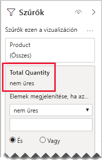

# <a name="bi-directional-relationship-guidance"></a>Útmutatás kétirányú kapcsolatokhoz

Ez a cikk a Power BI Desktopot használó adatmodellezőknek szól. Ahhoz nyújt útmutatást, hogy mikor érdemes kétirányú modellkapcsolatot létrehozni. Kétirányú kapcsolat az, amely _mindkét irányban_ szűr.

[!INCLUDE [relationships-prerequisite-reading](includes/relationships-prerequisite-reading.md)]

Általában ajánlott minél kevesebb kétirányú kapcsolatot használni. Ezek károsan befolyásolhatják a modell lekérdezési teljesítményét, és akár megtévesztő eredményeket is megjeleníthetnek a jelentés felhasználói számára.

Három olyan helyzet van, ahol a kétirányú szűrés megoldás lehet bizonyos követelményekre:

- [Speciális modellkapcsolatok](#special-model-relationships)
- [Szeletelőelemek „adatokkal”](#slicer-items-with-data)
- [Dimenziók közötti elemzés](#dimension-to-dimension-analysis)

## <a name="special-model-relationships"></a>Speciális modellkapcsolatok

A kétirányú kapcsolatok fontos szerepet játszanak az alábbi két speciális modellkapcsolat-típus létrehozásakor:

- **Egy-az-egyhez**: Minden egy-az-egyhez kapcsolatnak kétirányúnak kell lennie – másként nem konfigurálható. Ilyen típusú kapcsolatokat általában nem ajánlott létrehozni. Ennek teljes leírását és a helyette alkalmazható kiviteli módokat az [Útmutató egy-az-egyhez kapcsolatokhoz](relationships-one-to-one.md) című cikk tartalmazza.
- **Több-a-többhöz**: Két dimenzió típusú tábla illesztéséhez egy köztes táblára van szükség. Kétirányú szűrő szükséges annak biztosításához, hogy a szűrők tovább legyenek adva a köztes táblán keresztül. További információ: [Útmutató a több-a-többhöz kapcsolatokhoz (Több-a-többhöz dimenziók összekapcsolása)](relationships-many-to-many.md#relate-many-to-many-dimensions).

## <a name="slicer-items-with-data"></a>Szeletelőelemek „adatokkal”

Kétirányú kapcsolatokkal olyan szűrők állíthatók elő, amelyek az adatok tárolási helyén korlátozzák az elemeket. (Ha jól ismeri az Excel-kimutatásokat és -szeletelőket, ez az alapértelmezett viselkedés, ha az adatok forrása egy Power BI-adathalmaz vagy egy Analysis Services-modell.) Hogy ez mit jelent, annak magyarázatához először vizsgáljuk meg a következő modelldiagramot.


Az első tábla neve **Customer**, és három oszlopból áll: **Country-Region** (Ország-Régió), **Customer** (Ügyfél) és **CustomerCode** (Ügyfélkód). A második tábla neve **Product**, és három oszlopból áll: **Color** (Szín), **Product** (Termék) és **SKU** (Termékváltozat). A harmadik tábla neve **Sales**, és négy oszlopból áll: **CustomerCode** (Ügyfélkód), **OrderDate** (Rendelés dátuma), **Quantity** (Mennyiség) és **SKU** (Termékváltozat). A **Customer** és a **Product** tábla dimenzió típusú, és mindkettő egy-az-egyhez kapcsolatban áll a **Sales** táblával. Mindegyik kapcsolat egy irányban szűr.

A kétirányú szűrés működésének bemutatása érdekében a modelldiagramot úgy módosítottuk, hogy láthatók legyenek benne a tábla sorai. A cikkben szereplő összes példa ezekre az adatokra épül.

> [!NOTE]
> A táblázatsorok nem jeleníthetők meg a Power BI Desktop modelldiagramjában. Ebben a cikkben az egyértelmű példák jegyében jelenítettük meg őket.


A három tábla sorainak adatai a következő listában találhatók:

- A **Customer** táblázat két sort tartalmaz:
  - **CustomerCode** CUST-01, **Customer** Customer-1, **Country-Region** United States
  - **CustomerCode** CUST-02, **Customer** Customer-2, **Country-Region** Australia
- A **Product** táblának három sora van:
  - **SKU** CL-01, **Product** T-shirt (póló), **Color** Green (zöld)
  - **SKU** CL-02, **Product** Jeans (farmer), **Color** Blue (kék)
  - **SKU** AC-01, **Product** Hat (sapka), **Color** Blue (kék)
- A **Sales** táblának három sora van:
  - **OrderDate** 2019.01.01., **CustomerCode** CUST-01, **SKU** CL-01, **Quantity** 10
  - **OrderDate** 2019.02.02., **CustomerCode** CUST-01, **SKU** CL-02, **Quantity** 20
  - **OrderDate** 2019.03.03., **CustomerCode** CUST-02, **SKU** CL-01, **Quantity** 30

Vizsgáljuk meg a következő jelentésoldalt.


Az oldal két szeletelőből és egy kártyavizualizációból áll. Ez első szeletelő a **Country-Region** mezőre vonatkozik, és két eleme van: Australia (Ausztrália) és United States (USA). Jelenleg Ausztrália szerint szeletel. A második szeletelő a **Product** mezőre vonatkozik, és három eleme van: Hat (sapka), Jeans (farmer) és T-shirt (póló). Egy elem sincs kijelölve (tehát nincs _termék_ szerinti szűrés). A kártyavizualizáción leolvasható mennyiség 30.

Amikor a jelentés felhasználója Ausztrália szerint szeletel, a **Product** szeletelőt érdemes az olyan elemek megjelenítésére korlátozni, amelyeknél az adatok _kapcsolódnak_ az ausztráliai értékesítésekhez. Ezt jelenti az „adatokkal rendelkező” szeletelőelemek mutatása. Ez a viselkedés úgy idézhető elő, hogy a **Product** és a **Sales** tábla közötti kapcsolatot kétirányú szűrésre konfigurálja.


A **Product** szeletelőn csak egyetlen elem látható: T-shirt. Ez az elem felel meg az egyetlen olyan terméknek, amelyet ausztrál ügyfélnek adtak el.


Ajánlott először gondosan mérlegelni, hogy ez a kivitel megfelel-e a jelentés felhasználóinak. Néhány felhasználó következetlennek találhatja a felületet. Nem értik, hogy miért jelennek meg és tűnnek el szeletelőelemek dinamikusan, amíg ők a másik szeletelőt kezelik.

Ha úgy dönt, hogy az „adatokkal rendelkező” szeletelőelemeket jeleníti meg, nem javasolt a kétirányú kapcsolatok konfigurálása. A kétirányú kapcsolatok számításigénye nagyobb, ezért hátrányosan befolyásolhatják a lekérdezési teljesítményt – különösen akkor, h a modellen belüli kétirányú kapcsolatok száma tovább nő.

Ugyanez az eredmény jobb módszerrel is elérhető: Kétirányú szűrők használata helyett vizualizációszintű szűrőt alkalmazhat magára a **Product** szeletelőre.

Most tegyük fel, hogy **Product** és a **Sales** tábla közötti kapcsolat már nem szűr mindkét irányban. A **Sales** táblához ugyanakkor felvettük az alábbi mértéket.

```dax
Total Quantity = SUM(Sales[Quantity])
```

A **Product** szeletelő „adatokkal rendelkező” elemeinek megjelenítéséhez elég a **Total Quantity** mértékre szűrni az „is not blank” (nem üres) feltétellel.



## <a name="dimension-to-dimension-analysis"></a>Dimenziók közötti elemzés

A kétirányú kapcsolatokat szerepeltető másik helyzet köztes táblaként kezel egy ténytáblát. Ezen a módon támogatja egy dimenziótábla adatainak elemzését egy másik dimenziótábla szűrőkörnyezetében.

A cikk példamodellje alapján gondolja át, hogy válaszolhatók meg a következő kérdések:

- Hányféle színt értékesítettek ausztráliai ügyfeleknek?
- Hány országban vásároltak farmert?

Mindkét kérdés megválaszolható a köztes ténytábla adatainak összesítése _nélkül_. Arra azonban szükség van, hogy a szűrők tovább legyenek adva az egyik dimenziótáblából a másikba. Ha a szűrők a ténytáblán keresztül tovább vannak adva, a dimenziótáblák oszlopainak összesítése megvalósítható a [DISTINCTCOUNT](/dax/distinctcount-function-dax) DAX-függvénnyel – és akár a [MIN](/dax/min-function-dax) és a [MAX](/dax/max-function-dax) DAX-függvénnyel is.

Mivel a ténytábla köztes táblaként szerepel, a két dimenziótábla illesztésekor eljárhat a több-a-többhöz kapcsolatokhoz nyújtott útmutatás alapján. Ehhez legalább egy kapcsolatot úgy kell konfigurálni, hogy mindkét irányba szűrjön. További információ: [Útmutató a több-a-többhöz kapcsolatokhoz (Több-a-többhöz dimenziók összekapcsolása)](relationships-many-to-many.md#relate-many-to-many-dimensions).

Ez a megoldás azonban a cikkben korábban leírtak alapján feltehetően károsan befolyásolja a teljesítményt, és a felhasználó a [szeletelőelemek „adatokkal”](#slicer-items-with-data) esettel járó következményeket tapasztalja. Ezért ajánlott a kétirányú szűrést inkább _egy mértékdefinícióban_ aktiválni a [CROSSFILTER](/dax/crossfilter-function) DAX-függvénnyel. A CROSSFILTER felhasználható a szűrési irány módosítására – vagy akár a kapcsolat letiltására – egy kifejezés kiértékelése során.

Figyelje meg a **Sales** táblához felvett alábbi mértékdefiníciót. Ebben a példában a **Customer** és a **Sales** tábla közötti modellkapcsolat _egyirányú_ szűrésre van konfigurálva.

```dax
Different Countries Sold =
CALCULATE(
    DISTINCTCOUNT(Customer[Country-Region]),
    CROSSFILTER(
        Customer[CustomerCode],
        Sales[CustomerCode],
        BOTH
    )
)
```

A **Different Countries Sold** mértékkifejezés kiértékelése során a **Customer** és a **Sales** tábla közötti kapcsolat mindkét irányban szűr.

Az alábbi táblázatos vizualizáció az egyes értékesített termékek statisztikáit mutatja be. A **Quantity** oszlop egyszerűen a mennyiségek összege. A **Different Countries Sold** oszlop a terméket megvásároló összes ügyfél eltérő ország-régió értékeinek a darabszáma.


## <a name="next-steps"></a>Következő lépések

Ezzel a cikkel kapcsolatosan a következő forrásanyagokban talál további információt:

- [Modellbeli kapcsolatok a Power BI Desktopban](../desktop-relationships-understand.md)
- [A csillagséma és a Power BI-ban játszott szerepének a bemutatása](star-schema.md)
- [Útmutató egy-az-egyhez kapcsolatokhoz](relationships-one-to-one.md)
- [Útmutató a több-a-többhöz kapcsolatokhoz](relationships-many-to-many.md)
- [Kapcsolatok hibaelhárítási útmutatója](relationships-troubleshoot.md)
- Kérdése van? [Kérdezze meg a Power BI közösségét](https://community.powerbi.com/)
- Javaslatai vannak? [A Power BI javítására vonatkozó ötletek beküldése](https://ideas.powerbi.com/)
