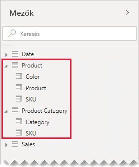
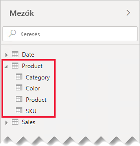
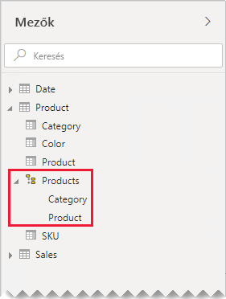
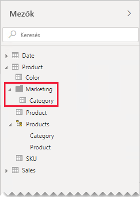

# Útmutató egy-az-egyhez kapcsolatokhoz

Ez a cikk a Power BI Desktopot használó adatmodellezőknek szól. Az egy-az-egyhez típusú modellkapcsolatokkal végzett munkához nyújt útmutatást. Egy-az-egyhez kapcsolat akkor hozható létre, ha mindkét tábla tartalmaz közös egyéni értékekből álló oszlopot.

[!INCLUDE [relationships-prerequisite-reading](includes/relationships-prerequisite-reading.md)]

Egy-az-egyhez kapcsolat kétféle használati helyzetben szerepelhet:

- [Ténybe ágyazott dimenziók](#degenerate-dimensions): [Ténybe ágyazott dimenzió](star-schema.md#degenerate-dimensions) ténytáblából származtatható.
- [Több táblára kiterjedő soradatok](#row-data-spans-across-tables): Egyetlen üzleti entitás vagy tárgy kettő (vagy több) modelltáblaként van betöltve, például azért, mert az adatai különböző adattárakból származnak. Ez gyakran előfordulhat dimenziótáblák esetében. Lehetséges például, hogy a fő termékadatok az éles értékesítési rendszerben vannak tárolva, a kiegészítő termékadatokat viszont más forrás tárolja.

    Két ténytábla között azonban nem szokás egy-az-egyhez kapcsolatot kialakítani. Ennek az az oka, hogy a két ténytábla dimenziószámának és részletességének meg kell egyeznie. Emellett ahhoz, hogy a modellkapcsolat létrehozható legyen, mindkét ténytáblának egyedi oszlopokat kell tartalmaznia.

## Ténybe ágyazott dimenziók

Ha egy ténytábla oszlopai alapján végez szűrést vagy csoportosítást, érdemes lehet azokat külön táblákként elérhetővé tenni. Így elkülönítheti a szűréshez vagy csoportosításhoz használt oszlopokat azoktól, amelyeket ténysorok összesítéséhez használ. Az elkülönítés előnyei:

- Kisebb tárigény
- Egyszerűbb modellbeli számítások
- A jobb lekérdezési teljesítmény elősegítése
- Szemléletesebb **Mezők** panel a jelentéskészítők számára

Vegyünk például egy értékesítési táblát, amely két oszlopban tárolja az értékesítési rendelések adatait.

Az **OrderNumber** oszlop a rendelésszámot tartalmazza, az **OrderLineNumber** oszlop pedig a rendelésen belüli sor sorszámát.

Figyelje meg az alábbi modelldiagramon, hogy a rendelésszám és a sorszám nem lett betöltve a **Sales** táblába. Ehelyett az ezek értékéből létrehozott [helyettes kulcs](star-schema.md#surrogate-keys) szerepel a **SalesOrderLineID** oszlopban. (A kulcs értéke úgy lett kiszámítva, hogy a rendelésszám 1000-szereséhez hozzáadjuk a sor számát.)

A **Sales Order** tábla jól használható felületet kínál a jelentéskészítőknek három oszlopával: **Sales Order** (Értékesítési rendelés), **Sales Order Line** (Értékesítési megrendelés sora) és **Line Number** (Sor száma). Hierarchiát is tartalmaz. Az ilyen táblák támogatják az olyan jelentések tervezését, amelyekhez a rendelések és a rendelések sorai alapján kell szűrni, csoportosítani vagy részletezni.

Mivel a **Sales Order** tábla az értékesítési adatokból van származtatva, mindkét táblának pontosan ugyanannyi sorból kell állnia. Emellett a **SalesOrderLineID** oszlopokban biztosan vannak egyező értékek.

## Több táblára kiterjedő soradatok

Vegyünk egy példát, amelyben két egy-az-egyhez kapcsolatban álló dimenziótábla szerepel: **Product** (Termék) és **Product Category** (Termékkategória). Mindkét tábla importált adatokat jelenít meg, és tartalmaz egy egyedi értékekből álló **SKU** (Termékváltozat) oszlopot.

Az alábbi ábrán a két tábla modelldiagramja látható.

Az első tábla neve **Product**, és három oszlopból áll: **Color** (Szín), **Product** (Termék) és **SKU** (Termékváltozat). A második tábla neve **Product Category**, és két oszlopból áll: **Category** (Kategória) és **SKU** (Termékváltozat). Az egy-az-egyhez kapcsolat a két **SKU** oszlopot kapcsolja össze. A kapcsolat mindkét irányba szűr, ami egy-az-egyhez kapcsolatok esetén mindig így van.

A kapcsolati szűrőpropagálás működésének bemutatása érdekében a modelldiagramot úgy módosítottuk, hogy láthatók legyenek benne a táblázat sorai. A cikkben szereplő összes példa ezekre az adatokra épül.

> [!NOTE]
> A táblázatsorok nem jeleníthetők meg a Power BI Desktop modelldiagramjában. Ebben a cikkben az egyértelmű példák jegyében jelenítettük meg őket.

A két táblázat sorainak adatai a következő listában találhatók:

- A **Product** táblának három sora van:
  - **SKU** CL-01, **Product** T-shirt (póló), **Color** Green (zöld)
  - **SKU** CL-02, **Product** Jeans (farmer), **Color** Blue (kék)
  - **SKU** AC-01, **Product** Hat (sapka), **Color** Blue (kék)
- A **Product Category** táblának két sora van:
  - **SKU** CL-01, **Category** Clothing (ruházat)
  - **SKU** AC-01, **Category** Accessories (kiegészítők)

Megfigyelheti, hogy a **Product Category** tábla nem tartalmaz a CL-02 SKU-hoz tartozó sort. A sor hiányának következményeit a cikk egy későbbi szakasza ismerteti.

A jelentéskészítők a két tábla termékekkel kapcsolatos mezőit találják meg a **Mezők** panelen: **Product** (Termék) és **Product Category** (Termékkategória).

Lássuk, mi történik, ha a két tábla mezőit egy táblázatos vizualizációhoz adjuk. Ebben a példában az **SKU** oszlop forrása a **Product** tábla.

Figyelje meg, hogy a CL-02 SKU-hoz tartozó termék **Category** értéke BLANK (üres). Ez azért van így, mert a **Product Category** tábla nem tartalmaz erre a termékre vonatkozó sort.

### Javaslatok

Ha csak lehetséges, ajánlott kerülni az egy-az-egyhez kapcsolatok létrehozását, ha a soradatok több modelltáblára terjednek ki. Ezt az indokolja, hogy ez a kivitel a következőkhöz vezethet:

- A **Mezők** panel zsúfoltsága, a szükségesnél több tábla megjelenítésével
- A jelentéskészítők nehezen találják meg a kapcsolódó mezőket, mert azok több táblában vannak elosztva
- A hierarchiák létrehozásának lehetősége korlátozott, mert azok szintjei _egyazon tábla_ oszlopain alapulnak
- Váratlan eredmények előállítása, ha a táblák sorai között nem teljes az egyezés

A pontos javaslatok eltérőek aszerint, hogy az egy-az-egyhez kapcsolat _szigeten belüli_ vagy _szigetek közötti_. A kapcsolatok kiértékeléséről a [Modellkapcsolatok a Power BI Desktopban (Kapcsolatok kiértékelése)](../desktop-relationships-understand.md#relationship-evaluation) című cikk nyújt bővebb információt.

### Szigeten belüli egy-az-egyhez kapcsolat

Ha _szigeten belüli_ egy-az-egyhez kapcsolat áll fenn a táblák között, ajánlott az adatokat egyetlen modelltáblában egyesíteni. Ez a Power Query-lekérdezések egyesítésével valósítható meg.

Az alábbi lépések az egy-az-egyhez kapcsolatú adatok egyesítésére és modellezésére kínálnak módot:

1. **Lekérdezések egyesítése**: [A két lekérdezés egyesítésekor](../desktop-shape-and-combine-data.md#combine-queries) vegye figyelembe az egyes lekérdezésekben szereplő adatok teljességét. Ha az egyik lekérdezés a sorok teljes halmazát tartalmazza (például egy fő lista), egyesítse ezzel a másik lekérdezést. Az egyesítési átalakítást konfigurálja úgy, hogy _bal oldali külső illesztést_ használjon, amely az alapértelmezett illesztési típus. Ez az illesztési típus biztosítja, hogy az első lekérdezés összes sora megmarad, kiegészítve a második lekérdezés egyező soraival. A második lekérdezés összes szükséges oszlopát bontsa ki az első lekérdezésbe.
2. **Lekérdezések betöltésének letiltása**: Mindig [tiltsa le](import-modeling-data-reduction.md#disable-power-query-query-load) a második lekérdezés betöltését. Így az nem tölti be az eredményét modelltáblaként. Ez a konfiguráció csökkenti az adatmodell tárolási méretét, és hozzájárul a **Mezők** panel zsúfoltságának csökkentéséhez.

    Példánkban a jelentéskészítők már csak egyetlen, **Product** nevű táblát látnak a **Mezők** panelen. Ez tartalmazza a termékekkel kapcsolatos összes mezőt.

    
3. **Hiányzó értékek pótlása**: Ha a második lekérdezésben nem egyező sorok szerepelnek, NULL értékek jelennek meg az azokból származó oszlopokban. Ha mód van rá, a NULL értékeket ajánlott egységes értékre cserélni. A hiányzó értékek pótlása különösen akkor lényeges, ha a jelentéskészítők az oszlopértékek alapján végeznek szűrést vagy csoportosítást, ilyenkor ugyanis BLANK (üres) értékek jelenhetnek meg a jelentésvizualizációkon.

    Figyelje meg, hogy az alábbi táblázatos vizualizációban a CL-02 termékváltozatú termék kategóriája _[Undefined]_ (Nincs meghatározva). A lekérdezésben a NULL értékeket erre az egységes szöveges értékre cserélték.

    

4. **Hierarchiák létrehozása**: Ha a már egyesített tábla _oszlopai között_ kapcsolatok állnak fenn, érdemes hierarchiákat létrehozni. Így a jelentéskészítők könnyen felismerhetik a jelentésvizualizációk részletezési lehetőségeit.

    Ebben a példában a jelentéskészítők egy kétszintű hierarchiát használhatnak: **Category** (Kategória) és **Product** (Termék).

    

Az egy táblában való egyesítés akkor is ajánlott, ha a mezőket szívesen rendszerezi külön táblák segítségével. A mezők ugyanúgy rendszerezhetők a _megjelenítési mappák_ használatával.

Ebben a példában a jelentéskészítők a **Category** mezőt a **Marketing** megjelenítési mappában találhatják meg.

Ha ennek ellenére úgy dönt, hogy szigeten belüli egy-az-egyhez kapcsolatokat definiál a modellben, lehetőség szerint ellenőrizze, hogy a kapcsolódó táblákban egyező sorok vannak. Mivel az szigeten belüli egy-az-egyhez kapcsolatok [erős kapcsolatokként](../desktop-relationships-understand.md#strong-relationships) vannak kiértékelve, az adatintegritási problémák a jelentésvizualizációkban megjelenő BLANK értékekhez vezethetnek. (A BLANK csoportosításra a cikkben elsőként bemutatott táblázatos vizualizációban láthat példát.)

### Szigetek közötti egy-az-egyhez kapcsolat

Ha a táblák között _szigetek közötti_ egy-az-egyhez kapcsolat áll fenn, akkor a modell csak abban az esetben építhető fel másként, ha az adatokat előre egyesítette az adatforrásokban. A Power BI [gyenge kapcsolatként](../desktop-relationships-understand.md#weak-relationships) értékeli ki az egy-az-egyhez modellkapcsolatot. Emiatt fontos ellenőrizni, hogy a kapcsolódó táblák illeszkedő sorokat tartalmaznak, a párosítatlan sorok ugyanis nem jelennek meg a lekérdezés eredményében.

Az alábbi ábrán annak eredménye látható, hogy a táblázatos vizualizációhoz mindkét táblából vettünk fel mezőket, a táblák között pedig gyenge kapcsolat áll fenn.

A táblázatban csak két sor jelenik meg. A CL-02 termékváltozat hiányzik, annak ugyanis nem felel meg sor a **Product Category** táblában.

## Következő lépések

Ezzel a cikkel kapcsolatosan a következő forrásanyagokban talál további információt:

- [Modellbeli kapcsolatok a Power BI Desktopban](../desktop-relationships-understand.md)
- [A csillagséma és a Power BI-ban játszott szerepének a bemutatása](star-schema.md)
- [Kapcsolatok hibaelhárítási útmutatója](relationships-troubleshoot.md)
- Kérdése van? [Kérdezze meg a Power BI közösségét](https://community.powerbi.com/)
- Javaslatai vannak? [A Power BI javítására vonatkozó ötletek beküldése](https://ideas.powerbi.com/)
