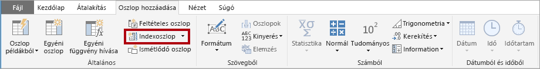

# A csillagséma és a Power BI-ban játszott szerepének a bemutatása

Ez a cikk a Power BI Desktopot használó adatmodellezőknek szól. Ismerteti a csillagséma tervezését és annak jelentőségét a teljesítményre és használhatóságra optimalizált Power BI-adatmodellek fejlesztésében.

A cikknek nem célja a csillagséma tervezésének teljes körű leírása. Részletesebb tudnivalókat olyan nyilvánosan közzétett tartalmakban találhat, mint az **Adattárház eszközkészlet: Részletes útmutató a dimenzionális modellezéshez** (2. kiadás, 2002) [Ralph Kimball et al.]

## A csillagséma áttekintése

A **csillagséma** a relációs adattárházakhoz gyakran használt, fejlett modellezési megközelítés. Használatához a modellezőknek a _dimenzió_ vagy a _tény_ kategóriába kell besorolniuk a modelltáblákat.

A **dimenziótáblák** üzleti entitásokat – a modellben lévő „dolgokat” – írják le. Az entitások lehetnek termékek, személyek, helyek és fogalmak, akár maga az idő is. Egy csillagséma legkonzisztensebb táblája egy dátum-dimenziótábla lehet. A dimenziótáblák egyedi azonosítóként szolgáló kulcsoszlopot (vagy kulcsoszlopokat), valamint leíró oszlopokat tartalmaznak.

A **ténytáblák** megfigyeléseket vagy eseményeket tárolnak. Ezek lehetnek értékesítési rendelések, tőzsdei egyenlegek, árfolyamok, hőmérsékletek stb. A ténytáblák a dimenziótáblákhoz kapcsolódó dimenziókulcs-oszlopokat, valamint numerikus mértékoszlopokat tartalmaznak. A dimenziós kulcsoszlopok határozzák meg egy ténytábla _dimenziószámát_ a dimenziókulcs értékek pedig egy ténytábla _részletességét_. Tekintsünk például egy értékesítési célok tárolására tervezett ténytáblát, amelynek két dimenziókulcs-oszlopa a **Date** (dátum) és a **ProductKey** (termékazonosító). Nyilvánvaló, hogy a tábla kétdimenziós. A részletessége azonban nem határozható meg a dimenziókulcs értékek figyelembe vétele nélkül. Tekintsük úgy, hogy a példánkban a **Date** oszlopban tárolt értékek az egyes hónapok első napjának felelnek meg. Ebben az esetben a részletesség hónap-termék szintű.

A dimenziótáblák általában viszonylag kevés sorból állnak. A ténytáblák viszont rengeteg sort tartalmazhatnak, és idővel egyre növekedhetnek.

## A csillagséma jelentősége a Power BI-modellek számára

A csillagséma szerinti tervezés és az ebben a cikkben bemutatott számos kapcsolódó fogalom kitűnően alkalmazható a teljesítményre és használhatóságra optimalizált Power BI-adatmodellek fejlesztésében.

Figyelembe kell venni, hogy minden Power BI-jelentésbeli vizualizáció lekérdezést generál, amely (a Power BI szolgáltatásban adathalmaznak nevezett) Power BI-modellhez van továbbítva. Ezek a lekérdezések használhatók a modell adatainak szűrésére, csoportosítására és összegzésére. A jól megtervezett modellek tehát azok, amelyek biztosítanak szűrésre, csoportosításra és összegzésre szolgáló táblákat is. Ez összhangban van a csillagséma tervezési alapelveivel:

- A dimenziótáblák a _szűrést_ és a _csoportosítást_ támogatják
- A ténytáblák az _összegzést_ támogatják

A táblának nincs a modellező által megadható beállítása, amellyel a tábla típusa (dimenzió vagy tény) konfigurálható, ezt a modellen belüli kapcsolatok határozzák meg. Egy modellbeli kapcsolat szűrőátadási útvonalat hoz létre két tábla között, a tábla típusát pedig ennek a kapcsolatnak a **Számosság** tulajdonsága határozza meg. Gyakori kapcsolatszámosság az „egy-a-többhöz”, vagy a „több-az-egyhez”. Az „egy” oldal mindig dimenzió típusú tábla, a „több” oldal pedig mindig tény típusú tábla.

Egy jól felépített modellnek olyan táblákból kell állnia, amelyek mindegyike vagy dimenzió típusú, vagy tény típusú. A két típus egy táblán belüli keverése kerülendő. Ugyanakkor arra is ajánlott törekedni, hogy a megfelelő számú táblát biztosítsa a megfelelő kapcsolatokkal. Az is lényeges, hogy a tény típusú táblákban következetes részletességgel legyenek betöltve az adatok.

Végül azzal is fontos tisztában lenni, hogy az optimális modell megtervezése félig tudomány, és félig művészet. Olykor, ha a józan ész ezt diktálja, az amúgy jó irányelvekkel is szabad szakítani.

Egy Power BI-modellben a csillagséma-kialakítással kapcsolatos sok további fogalom is hasznosítható. Ezek a következők:

- [Mértékek](#measures)
- [Helyettes kulcsok](#surrogate-keys)
- [Hópehely dimenziók](#snowflake-dimensions)
- [Többszerepű dimenziók](#role-playing-dimensions)
- [Lassan változó dimenziók](#slowly-changing-dimensions)
- [Vegyes dimenziók](#junk-dimensions)
- [Ténybe ágyazott dimenziók](#degenerate-dimensions)
- [Tények nélküli ténytáblák](#factless-fact-tables)

## Mértékek

Csillagséma kialakításánál a **mérték** egy táblabeli oszlopot jelent, amely összesítendő adatokat tartalmaz.

A Power BI-modellekben a **mérték** definíciója más, de ehhez hasonló. Egy [adatelemzési kifejezésként (DAX)](https://docs.microsoft.com/dax/data-analysis-expressions-dax-reference) megírt képlet, amely elvégzi az összesítést. A mértékkifejezések gyakran hasznosítanak olyan összesítési DAX-függvényeket, mint a SUM, MIN, MAX, AVERAGE stb., így skaláris értéket állítva elő a lekérdezés idejére (az értékek soha nincsenek a modellben tárolva). A mértékkifejezések egy oszlop egyszerű összegzésétől olyan kidolgozott képletekig terjedhetnek, amelyek felülírják a szűrési környezetet és/vagy a kapcsolatok továbbítását. További információt [A DAX alapjai a Power BI Desktopban](https://docs.microsoft.com/power-bi/desktop-quickstart-learn-dax-basics) című cikkben találhat. További információ hivatkozás?

Fontos tudnivaló, hogy a Power BI-modellek egy másféle összegzési módot is támogatnak. Bármely – általában numerikus – oszlop összegezhető jelentésbeli vizualizáció vagy Q&A használatával. Ez kényelmes megoldás a modellfejlesztők számára, hiszen sokszor szükségtelenné teszi a mértékek létrehozását. Az Adventure Works viszonteladói értékesítéseinek **Értékesítési összeg** oszlopa például többféleképpen összesíthető (összeg, darabszám, átlag, medián, minimum, maximum stb.) anélkül, hogy minden lehetséges összesítési típushoz külön mértéket kellene létrehozni.

A mértékek létrehozása mellett azonban még egyszerű, oszlopszintű összegzések esetén is két meggyőző érv szól:

- Ha tudja, hogy a jelentéskészítők [többdimenziós kifejezések (MDX)](https://docs.microsoft.com/sql/analysis-services/multidimensional-models/mdx/mdx-query-the-basic-query?view=sql-server-2017) használatával fogják lekérdezni a modellt, akkor a modellnek mértékeket kell tartalmaznia. Az MDX nem alkalmas oszlopértékek összegzésére. Ez különösen fontos akkor, ha egy Power BI-adathalmazt MDX használatával kérdeznek le, és ez történik az [Elemzés az Excelben](https://docs.microsoft.com/power-bi/service-analyze-in-excel) használatakor (a kimutatások MDX-lekérdezéseket adnak ki).
- Ha meg kell oldania, hogy a jelentéskészítők csak bizonyos módokon összegezhessenek oszlopokat. A viszonteladói értékesítések **Egységár** oszlopa (amely az egységenkénti árat jelenti) összesíthető, de csak meghatározott összesítő függvényekkel. Összeadni értelmetlen, más összesítő függvényekkel (minimum, maximum, átlag stb.) viszont összesíthető. Ebben az esetben a modellező elrejtheti az **Egységár** oszlopot, és mértékeket hozhat létre az összes megfelelő összesítő függvényhez.

Megjegyzendő, hogy ez a kialakítási elv jól megfelel a Power BI szolgáltatásban készített jelentésekhez és a Q&A-hoz. A Power BI Desktop élő kapcsolatai viszont lehetővé teszik, hogy a jelentéskészítők felfedjék a rejtett mezőket a **Mezők** panelen, ezáltal megkerüljék a tervező szándékát.

## Helyettes kulcsok

A **helyettes kulcs** egyedi azonosító, amelyet a csillagséma-modell támogatása érdekében vehet fel egy táblához. Definíció szerint nem a forrásadatokban van meghatározva vagy tárolva. A helyettes kulcsok általában a relációs adattárházak dimenziótábláihoz vannak felvéve, hogy a dimenziótábla minden sorának egyedi azonosítót biztosítsanak.

A Power BI-modell kapcsolatai egy tábla egyetlen egyedi oszlopán alapulnak, amely egy másik tábla egy oszlopára viszi át a szűrőket. Ha a modell egy dimenzió típusú táblája nem tartalmaz egy egyedi oszlopot, akkor Önnek kell egyedi azonosítót hozzáadnia, hogy az egy kapcsolat „egy” oldala lehessen. A Power BI Desktopban ezt egyszerűen megvalósíthatja egy [Power Query-indexoszlop](https://docs.microsoft.com/powerquery-m/table-addindexcolumn) létrehozásával.

Ezt a lekérdezést a „több”-oldali lekérdezéssel kell egyesítenie, hogy ahhoz is hozzáadhassa az indexoszlopot. Miután ezeket a lekérdezéseket betölti a modellbe, egy-a-többhöz kapcsolatot hozhat létre a modellbeli táblák között.

## Hópehely dimenziók

Egy **hópehely dimenzió** egyetlen üzleti entitáshoz tartozó normalizált táblák halmaza. Az Adventure Works például kategóriákba és alkategóriákba sorolja a termékeket. Az alkategóriák kategóriákhoz vannak rendelve, a termékek pedig alkategóriákhoz. Az Adventure Works relációs adattárházban a termékdimenzió normalizálva van, és három kapcsolódó táblában van tárolva: **DimProductCategory** , **DimProductSubcategory** és **DimProduct**.

Egy kis képzelőerővel a normalizált táblák elhelyezhetők a ténytáblától kifelé haladva egy hópihe ágaihoz hasonlóan.

A Power BI Desktopban választhat, hogy utánozza a hópehely dimenzió kialakítását (esetleg azért, mert a forrásadatok ilyenek), vagy egyetlen modelltáblába integrálja (denormalizálja) a forrástáblákat. Az egyetlen modelltábla általában több előnnyel jár, mint a több modelltábla használata. Az optimális választás az adattömeg méretétől és a modellel szembeni használhatósági követelményektől függhet.

Ha a hópehely dimenzió kialakítás másolása mellett dönt:

- A Power BI több táblát tölt be, ez pedig kevésbé hatékony a tárolás és a teljesítmény szempontjából. Ezeknek a tábláknak tartalmazniuk kell a modellbeli kapcsolatokat támogató oszlopokat, emiatt a modell mérete nagyobb lehet.
- A szűrőket hosszabb kapcsolati láncokon kell továbbadni, ez pedig feltehetően kevésbé hatékony az egyetlen táblára alkalmazott szűrőknél.
- A **Mezők** panel több modellbeli táblát kínál fel a jelentéskészítőknek, ez pedig kevésbé áttekinthető felületet eredményezhet, különösen akkor, ha a hópehely dimenziótáblák csak egy vagy két oszlopból állnak.
- Nem lehet az összes táblára kiterjedő hierarchiát létrehozni.

Ha az egyetlen modelltáblába integrálása mellett dönt, meghatározhat egy hierarchiát is, amely a dimenzió legnagyobb és legkisebb részletességét is magában foglalja. A redundáns denormalizált adatok tárolása a modell megnövekedett tárigényéhez vezethet, főleg nagyon nagy dimenziótáblák esetén.

## Lassan változó dimenziók

**Lassan változó dimenzió** (SCD) az, amely megfelelően kezeli a dimenziótagok időbeli változását. Akkor használatos, amikor az üzleti entitások értékei időben, alkalmi jelleggel változnak. _Lassan_ változó dimenzióra jó példa az ügyféldimenzió, különösen az olyan kapcsolattartási adatok oszlopai, mint az e-mail-cím és a telefonszám. Ezzel ellentétben egyes dimenziókat _gyorsan_ változónak nevezünk, ha egy dimenzióattribútum gyakran változik. Ilyen például egy tőzsdepiaci ár. Az általános tervezési irányelv ilyen esetekben az, hogy a gyorsan változó attribútumértékeket egy ténytáblabeli mértékben tárolnak.

A csillagséma-tervezés elmélete a lassan változó dimenzió két gyakori típusát különbözteti meg: 1. típust és 2. típust. Egy dimenzió típusú tábla lehet 1. típusú, 2. típusú, vagy támogathatja mindkét típust egyszerre különböző oszlopoknál.

### 1\. típusú lassan változó dimenzió (SCD)

Egy **1. típusú** **lassan változó dimenzió** a legutóbbi értékeket tükrözi, és a forrásadatok változásának észlelésekor a dimenziótábla adatai egyszerűen felül vannak írva. Ez a tervezési megközelítés kiegészítő adatokat, például egy ügyfél e-mail-címét vagy telefonszámát tartalmazó oszlopoknál gyakori. Amikor egy ügyfél e-mail-címe vagy telefonszáma megváltozik, a dimenziótábla az új értékekkel frissíti az ügyfél sorát. Mintha az ügyfél kapcsolattartási adatai mindig ezek lettek volna.

A Power BI-modell dimenzió típusú tábláinak nem növekményes frissítése 1. típusú lassan változó dimenziót eredményez. A táblabeli adatok frissítésével biztosítja a legújabb értékek betöltését.

### 2\. típusú lassan változó dimenzió (SCD)

A **2. típusú** **lassan változó dimenzió** támogatja a dimenziótagok verziószámozását. Ha a forrásrendszer nem tárol verziókat, akkor általában az adattárház betöltési folyamata észleli a változásokat, és kezeli ennek megfelelően a változást a dimenziótáblában. Ilyen esetben a dimenziótáblának helyettes kulcs használatával kell egyedi hivatkozást biztosítania a dimenziótag egy _verziójára_. Olyan oszlopokat is tartalmaz, amelyek meghatározzák a verzió érvényességi időtartományát (például **KezdoDatum** és **LejaratDatum**), és esetleg egy jelzőoszlopot (például **Aktuális**), amellyel egyszerűbb az aktuális dimenziótagok szűrése.

Az Adventure Works például értékesítőket rendel ki egy értékesítési régióba. Amikor egy értékesítő régiót változtat, ennek az értékesítőnek egy új verzióját kell létrehozni, hogy a tényelőzmények továbbra is megmaradjanak a korábbi régióval társítva. Egy értékesítő értékesítéseinek pontos, előzményeket is felölelő elemzésének támogatásához a dimenziótáblának az értékesítők és a hozzájuk társított régiók több verzióját kell tartalmaznia. A táblának kezdő- és záródátum-értékeket is tartalmaznia kell az érvényességi idő meghatározásához. Az aktuális verziókhoz meghatározhat üres záródátum (például 9999.12.31.), ezzel jelezve, hogy ez a sor az aktuális verzió. A táblának helyettes kulcsot is definiálnia kell, hiszen az üzleti kulcs (ebben az esetben az alkalmazott-azonosító) nem lesz egyedi.

Fontos szem előtt tartani, hogy ha a forrásadatok nem tárolnak verziókat, köztes rendszert (például adattárházat) kell használni a változások észleléséhez és tárolásához. A táblabetöltés folyamatának a meglévő adatok megőrzése mellett kell észlelnie a változásokat. Változás észlelésekor a táblabetöltési folyamat lejárttá kell tennie az aktuális verziót. Ezt úgy teszi meg, hogy frissíti a **ZaroDatum** értékét, és új verziót szúr be a korábbi **ZaroDatum** értékéből származtatott **KezdoDatum** értékkel. A kapcsolódó tényeknek ugyanakkor időalapú kereséssel kell lekérniük a tény dátuma szempontjából lényeges dimenzió kulcsértékét. Egy Power Queryt használó Power BI-modell erre nem alkalmas. Képes viszont adatokat betölteni egy előre betöltött 2. típusú lassan változó dimenziótáblából.

A Power BI-modellnek támogatnia kell egy tag előzményadatainak változástól független lekérdezését, valamint a tag egy verziójának lekérdezését, amely a tag abban az időpontban aktuális állapotát adja meg. Az Adventure Works példájával élve így a hozzárendelt értékesítési régiótól függetlenül lekérdezhető egy értékesítő, vagy az értékesítő egy adott verziója.

Ennek feltétele, hogy a Power BI-modell dimenzió típusú táblája tartalmazzon egy oszlopot az értékesítő szűréséhez, valamint egy további oszlopot az értékesítő adott verziójának szűréséhez. Lényeges, hogy a verzióoszlop egyértelmű leírást adjon, például „Kiss Antal (2008.12.15.-2019.06.26.)”, vagy „Kiss Antal (aktuális)”. Az is fontos, hogy a jelentések készítői és felhasználói elsajátítsák a 2. típusú lassan változó dimenzió alapelveit, és hogy hogyan állíthatnak elő megfelelő jelentésterveket a helyes szűrők alkalmazásával.

Ajánlott tervezési eljárás egy olyan hierarchia beépítése, amellyel a vizualizációk verziószintű részletezést végezhetnek.

## Többszerepű dimenziók

**Többszerepű** az a dimenzió, amely képes eltérő módon szűrni a kapcsolódó tényeket. Az Adventure Worksnél például a dátumdimenzió-táblának három kapcsolata vagy a viszonteladói értékesítési tényekkel. Ugyanaz a dimenziótábla használható a tények megrendelési dátum, szállítási dátum vagy teljesítési dátum szerinti szűréséhez.

Egy adattárházban a bevett tervezési módszer egyetlen dátumdimenzió-tábla definiálása. Lekérdezéskor a dátumdimenzió „szerepét” az határozza meg, hogy melyik tényoszlop van a táblák összekapcsolására használva. Ha az értékesítéseket például a megrendelés dátuma alapján elemzik, a tábla kapcsolata a viszonteladói értékesítések megrendelési dátum oszlopával áll kapcsolatban.

Power BI-modellben ez a kivitel úgy utánozható, hogy két tábla között több kapcsolatot hoznak létre. Az Adventure Works példájában a dátum és a viszonteladói értékesítés tábla között három kapcsolat volna. Bár ez lehetséges, fontos tisztában lenni azzal, hogy a Power BI-modell két táblája között csak egy kapcsolat lehet aktív. A többi kapcsolatot inaktívra kell beállítani. Az, hogy csak egyetlen aktív kapcsolat van, azzal jár, hogy alapértelmezett szűrőtovábbítás áll fenn a dátum és a viszonteladói értékesítések között. Ebben a esetben az aktív kapcsolat a jelentések által leggyakrabban használt szűrőre van beállítva, amely az Adventure Worksnél a megrendelés dátuma szerinti kapcsolat.

Inaktív kapcsolat csak a [USERELATIONSHIP függvényt](https://docs.microsoft.com/dax/userelationship-function-dax) használó DAX-kifejezés definiálásával használható. Példánkban a modell fejlesztőjének mértékeket kell létrehoznia, hogy lehetővé tegye a viszonteladói értékesítések szállítási dátum és teljesítési dátum szerinti elemzését. Ez körülményes lehet, különösen akkor, ha a viszonteladói tábla sok mértéket definiál. Ezáltal a **Mezők** panel is zsúfolttá válik a rengeteg mérték miatt. Más korlátozások is érvényben vannak:

- Ha a jelentéskészítők mértékek definiálása helyett az oszlopok összesítésére alapoznak, akkor jelentésszintű mérték megírása nélkül nem érhetnek el az inaktív kapcsolatokra épülő összesítést. Jelentésszintű mértékek csak akkor definiálhatók, ha a jelentéseket a Power BI Desktopban készítik.
- Mivel a dátum és a viszonteladói értékesítések között csak egy aktív kapcsolat van, a viszonteladói értékesítéseket nem lehet egyidejűleg különböző típusú dátumok szerint szűrni. Nem állítható elő például olyan vizualizáció, amely a megrendelési dátumokat ábrázol kiszállítási dátum szerint.

Ezeknek a korlátozásoknak a leküzdésére gyakori Power BI-modellezési technika, hogy minden egyes szerephez külön dimenzió típusú táblát hoznak létre. A további dimenziótáblákat általában [számított táblákként](https://docs.microsoft.com/dax/calculatetable-function-dax) hozzák létre, DAX használatával. Számított táblák használatával a modell tartalmazhat egy **Dátum** táblát, egy **Kiszállítási dátum** táblát és egy **Teljesítési dátum** táblát, amelyek mindegyikének egyetlen és aktív kapcsolata van a viszonteladói értékesítés tábla megfelelő oszlopával.

Ez a tervezési megközelítés nem igényli több mérték definiálását a különböző szerepű dátumokhoz, és lehetővé teszi a különböző szerepű dátumok szerinti egyidejű szűrést. Ez azonban azzal a csekély áldozattal jár, hogy a dátum dimenziótábla több példánya miatt nő a tárolandó modell mérete. Mivel a dimenziótáblák többnyire kevesebb sorból állnak, mint a tény típusú táblák, ez ritkán okoz gondot.

Ha minden szerephez külön dimenzió típusú táblát hoz létre, kövesse az alábbi ajánlott eljárásokat:

- Gondoskodjon róla, hogy az oszlopok neve érthető legyen. Bár megengedett, hogy mindegyik dátumtábla tartalmazzon egy **Év** oszlopot (az oszlopnevek a táblán belül egyediek), ez a vizualizációk alapértelmezett címeiben nem lesz egyértelmű. Érdemes minden külön dimenziótábla oszlopait átnevezni, így például a **Szállítási dátum** táblázat év oszlopának neve lehet **Szállítási év** stb.
- Ahol alkalmazható, ott gondoskodjon a táblák érthető (a **Mezők** panel elemleírásaiban elérhető) leírásáról, amely a szűrők továbbadásának konfigurálásáról tájékoztatja a jelentéskészítőket. Ez az egyértelműség akkor lényeges, ha a modell általános elnevezésű táblát (például **Dátum**) tartalmaz, amely több tény típusú tábla szűrésére is használatos. Ha ez a tábla például a viszonteladói értékesítések megrendelési dátum oszlopával áll aktív kapcsolatban, ajánlott a következőhöz hasonló leírást megadni: „Megrendelési dátum szerint szűri a viszonteladói értékesítéseket”.

## Vegyes dimenziók

A **vegyes dimenziók** kevés dimenzió esetén hasznosak, főleg akkor, ha ezek kevés (esetleg egy) attribútumból állnak, és ezeknek az attribútumoknak kevés értéke van. Erre jó jelölt a rendelés állapota oszlop, vagy az ügyfelek demográfiai oszlopai (nem, korcsoport stb.).

Egy vegyes dimenzió tervezési célja sok „kis” dimenzió egyetlen dimenzióba egyesítése, ezzel csökkentve a modell tárolási méretét, és kevesebb modelltábla előállításával a **Mezők** panel zsúfoltságát is.

Egy vegyes dimenziótábla általában az összes dimenzióattribútum-tag keresztszorzata egy helyettes kulcs oszloppal kiegészítve. A helyettes kulcs biztosít egyedi hivatkozást a tábla egyes soraira. A dimenzió felépíthető egy adattárházban, vagy egy Power Query használatával létrehozott lekérdezéssel, amely [teljes külső lekérdezési összekapcsolást](https://docs.microsoft.com/powerquery-m/table-join) végez, majd beszúr egy helyettes kulcsot (indexoszlopot).

Ezt a lekérdezést kell dimenzió típusú táblaként betölteni a modellbe. A lekérdezést a ténylekérdezéssel is egyesíteni kell, hogy az indexoszlop be legyen töltve a modellbe és támogassa egy „egy-a-többhöz” modellkapcsolat létrehozását.

## Ténybe ágyazott dimenziók

Egy **ténybe ágyazott dimenzió** a ténytábla olyan attribútumára hivatkozik, amely szűréshez szükséges. Az Adventure Works esetében erre jó példa az értékesítési rendelésszám. Ilyen helyzetben tervezési szempontból nincs értelme ebből az egy oszlopból álló független táblát létrehozni, mert az növelné a modell tárolási méretét, és zsúfolttá tenné a **Mezők** panelt.

A Power BI-modellben az értékesítési rendelésszám oszlopát érdemesebb lehet a tény típusú táblába felvenni, hogy szűrni és csoportosítani lehessen az értékesítési rendelésszám szerint. Ez a kivétel a korábban ismertetett szabály alól, amely szerint a táblatípusok nem keverendők (tehát a modell tábláinak általában vagy dimenzió, vagy tény típusúnak kell lenniük).

## Tények nélküli ténytáblák

A **tények nélküli tény** típusú táblák nem tartalmaznak mértékoszlopot. Csak dimenziókulcsokat tartalmaznak.

Egy tények nélküli ténytáblában dimenziókulcsok által meghatározott megfigyelések tárolhatók. Ilyen például, hogy egy adott dátum egy adott időpontjában egy adott ügyfél bejelentkezett a webhelyre. Definiálható egy mérték, amely a tény nélküli ténytábla sorait számolja meg annak elemzéséhez, hogy mikor hány ügyfél jelentkezett be.

A tény nélküli ténytáblák felhasználásának egy érdekesebb módja a dimenziók közötti kapcsolatok tárolása. Ezt a megközelítést javasoljuk Power BI-modell tervezésekor a több-a-többhöz kapcsolatok definiálására. Több-a-többhöz kapcsolat tervezésekor a tény nélküli ténytáblát _áthidaló táblának_ nevezzük.

Tegyük fel például, hogy az értékesítők egy _vagy több_ értékesítési régióhoz is hozzárendelhetők. Az áthidaló tábla tények nélküli ténytáblaként volna megtervezve, amely két oszlopot tartalmaz: értékesítőazonosító és régióazonosító. Mindkét oszlopban tárolhatók ismétlődő értékek.

A több-a-többhöz kapcsolat tervezésének ez a módja jól dokumentált, és áthidaló tábla nélkül is megvalósítható. Két dimenzió kapcsolata esetén mégis az áthidaló tábla használata ajánlott. További információ: [Több-a-többhöz számosságú kapcsolatok a Power BI Desktopban](https://docs.microsoft.com/power-bi/desktop-many-to-many-relationships).

## Következő lépések

Csillagséma vagy Power BI-modell tervezéséről a következő cikkekből tájékozódhat bővebben:

- [Wikipedia-cikk a dimenzionális modellezésről](https://go.microsoft.com/fwlink/p/?linkid=246459)
- [Kapcsolatok létrehozása és kezelése a Power BI Desktopban](https://docs.microsoft.com/power-bi/desktop-create-and-manage-relationships)
- [Több-a-többhöz számosságú kapcsolatok a Power BI Desktopban](https://docs.microsoft.com/power-bi/desktop-many-to-many-relationships)
- [Interaktív modellezési oktatóanyag](https://docs.microsoft.com/power-bi/guided-learning/modeling)