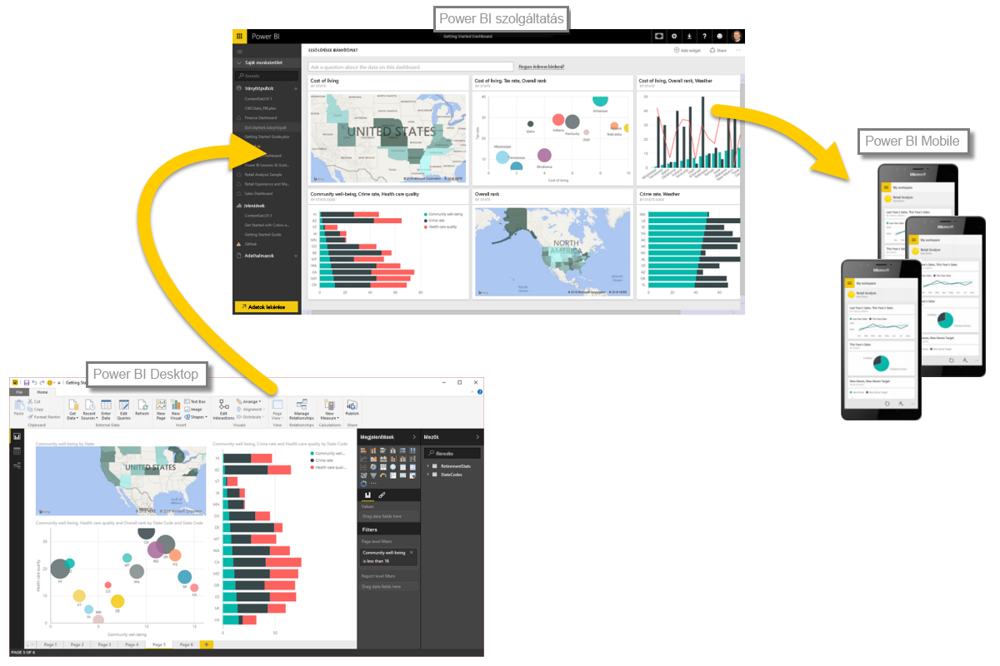

Most, hogy már ismeri a Power BI használatának alapjait, ideje megtekintenie interaktív bemutatónkat, és gyakorlati tapasztalatokat szereznie. A videótúrán **Will Thompson**, a Microsoft Power BI csapatának programigazgatója fogja Önt kalauzolni. A kurzusban vendégelőadók is szerepelnek majd.

Miközben Will ismerteti mennyi mindenre használhatja a Power BI-t, jusson eszébe, hogy mindegyik tevékenység és az összes elemzés, amelyet a Power BI használatával elvégezhet, legtöbbször egy általános munkafolyamatot követ. A Power BI **általános munkafolyamata** a következő:

* Adatokat olvas be a Power BI Desktopba, és jelentést készít belőlük.
* A jelentést közzéteszi a Power BI szolgáltatásba, ahol új vizualizációkat hoz létre, vagy irányítópultokat készít hozzá
* Az irányítópultokat megosztja másokkal, legfőképp azokkal a személyekkel, akik gyakran úton vannak
* Megtekinti és kezeli az Önnel megosztott irányítópultokat a Power BI-mobilalkalmazásokban

Mint azt korábban említettük, lehet, hogy ideje nagy részét a **Power BI szolgáltatásban** fogja tölteni adatszerzéssel és irányítópultok létrehozásával – ez teljesen rendben van így. Valaki más a előfordulhat, hogy az idő a teljes egészében költségek **Power BI Desktop**, ami szintén rendben túl. Ahhoz, hogy segítsünk Önnek teljes egészében megismerni a Power BI-t és a benne rejlő lehetőségeket, a legjobb, ha bemutatunk mindent, amire képes... Ezután eldöntheti, miként tudja a legjobban kihasználni céljai eléréséhez.

Ugorjunk hát neki, és engedjük, hogy Will végigkalauzoljon minket a teljes felhasználói élményen. Az első dolog, hogy megismerje a Power BI alapvető építőelemeit, amely ismeretek szilárd alapot fognak nyújtani annak megértéséhez, hogy miként alakítja a Power BI az adatokat látványos jelentésekké és vizualizációkká.

