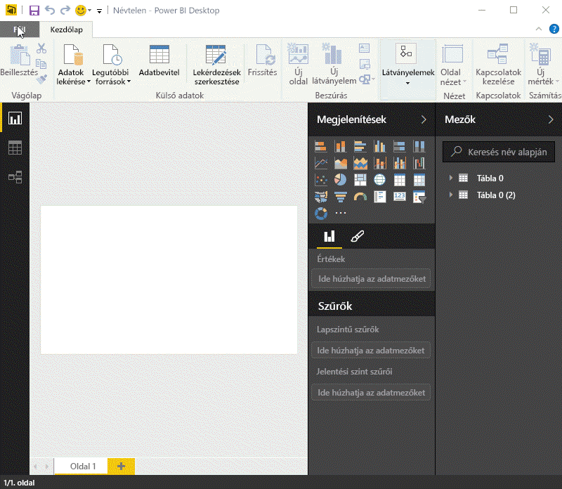
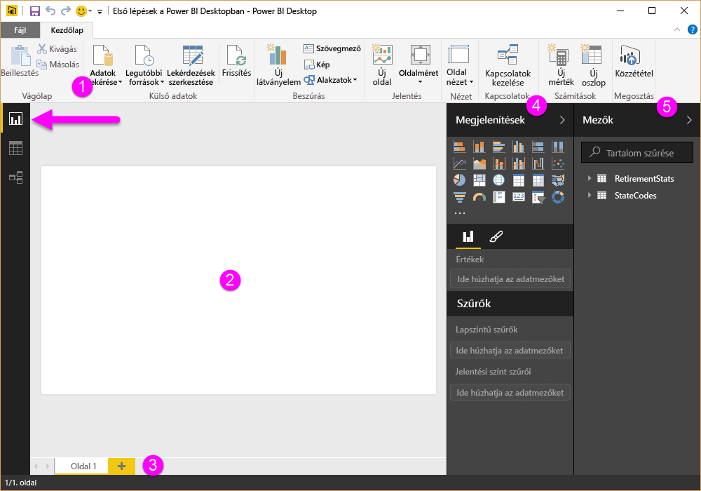
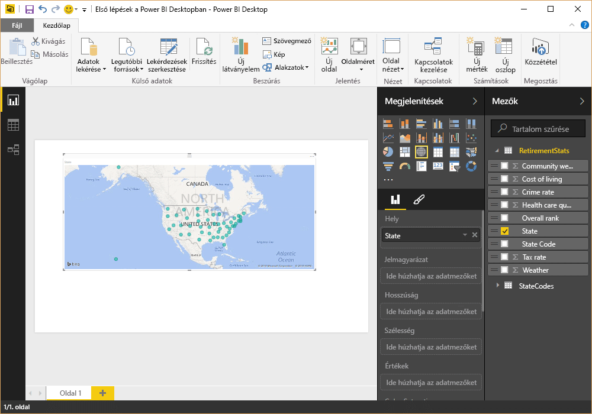
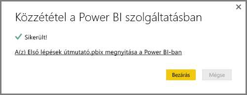
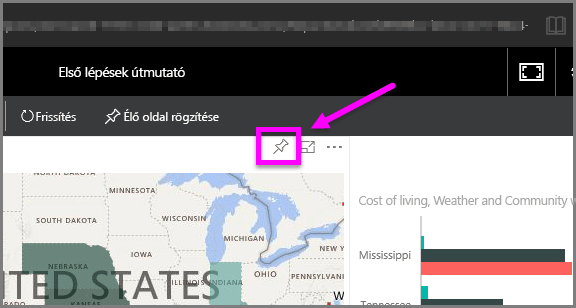
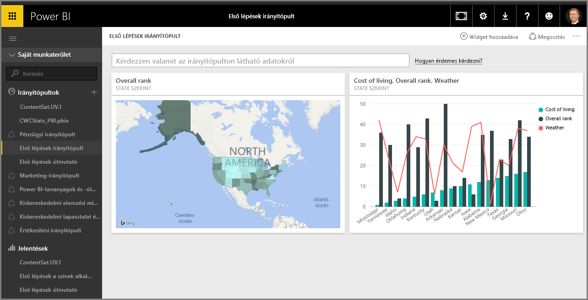

Ebben a témában közelebbről is szemügyre vesszük, hogyan illeszkedik egymáshoz a Power BI első két része.

* Jelentés létrehozása a **Power BI Desktopban**
* Jelentés közzététele a **Power BI szolgáltatásban**

Először indítsa el a Power BI Desktopot, majd válassza az **Adatok beolvasása** lehetőséget. Megjelenik az adatforrások gyűjteménye, ahonnan kiválaszthat egy adatforrást. Az alábbi képen egy weblap forrásként történő kiválasztása látható. A fenti videóban Will egy **Excel**-munkafüzetet választott ki.

Függetlenül attól, hogy melyik adatforrást választja, a Power BI ahhoz az adatforráshoz fog kapcsolódni, és az abból az adatforrásból elérhető adatokat fogja mutatni. Az alábbi képen egy másik példa látható: egy különböző államokat és nyugdíjazási statisztikákat elemző weblap.

A Power BI Desktop **Jelentés** nézetében elkezdhet jelentéseket létrehozni.

A **Jelentés** nézet a következő öt fő területből áll:

1. A menüszalag, amely a jelentésekhez és vizualizációkhoz kapcsolódó általános feladatokat jeleníti meg.
2. A **Jelentés** nézet, vagy más néven vászon. Itt lehet létrehozni és elrendezni a vizualizációkat.
3. Az **Oldalak** lapterület alul, ahol kiválaszthat vagy hozzáadhat jelentésoldalakat.
4. A **Megjelenítések** panel, ahol módosíthatja a vizualizációkat, testreszabhatja a színeket vagy a tengelyeket, szűrőket alkalmazhat, húzással elhelyezheti a mezőket stb.
5. A **Mezők** panel, ahonnan a lekérdezéselemeket és a szűrőket a **Jelentés** nézetbe vagy a **Megjelenítések** panel **Szűrők** területére húzhatja.

A **Megjelenítések** és a **Mezők** panel összezárható a szélén található kis nyíl kiválasztásával, így több hely marad a **Jelentés** nézetben a vizualizációk összeállítására. A vizualizációk módosításakor ezek a nyilak felfelé vagy lefelé mutatnak, ami azt jelzi, hogy az adott szakasz kibontható vagy összezárható.

Vizualizációs elem létrehozásához egyszerűen húzzon egy mezőt a **Mezők** listáról a **Jelentés** nézetre. Ebben a példában húzza át a *RetirementStats* (Nyugdíjstatisztikák) State (Állam) mezőjét, és nézze meg, mi történik.

Nézze... A Power BI Desktop automatikusan létrehozott egy térkép-alapú vizualizációs elemet, mert felismerte, hogy a State (Állam) mező földrajzi helyadatokat tartalmaz.

Most lépjünk előre egy kicsit: néhány vizualizációs elem hozzáadása után a jelentés közzétehető a Power BI szolgáltatásban. A Power BI Desktop **Kezdőlap** menüszalagjáról válassza ki a **Közzététel** lehetőséget.

A rendszer kérni fogja, hogy jelentkezzen be a Power BI-ba.

Amikor bejelentkezik, és befejeződik a közzétételi folyamat, az alábbi párbeszédablak jelenik meg. A **Sikeres!** felirat alatt rákattinthat a Power BI szolgáltatásra mutató hivatkozásra, ahol megtekintheti az éppen most közzétett jelentést.

Amikor bejelentkezik a Power BI szolgáltatásba, látni fogja a szolgáltatásban éppen most közzétett Power BI Desktop-fájlt. Az alábbi képen a Power BI Desktopban létrehozott jelentés a **Jelentések** szakaszban látható.

Ha a jelentésben rákattint a **Rögzítés** ikonra, a vizualizációs elemet rögzítheti az egyik irányítópulton. A következő képen a rögzítés ikon bekeretezve látható, egy rá mutató nyíllal.

Az ikon kiválasztásakor az alábbi párbeszédablak jelenik meg, lehetővé téve, hogy a vizualizációs elemet egy már létező irányítópultra rögzítse, vagy létrehozzon egy új irányítópultot.

Amikor a jelentésből rögzít néhány vizualizációs elemet, azok láthatóvá válnak az irányítópulton.

A fentieken túl természetesen még sok minden másra használhatja a Power BI-t, például a létrehozott irányítópultok megosztására. A megosztásra a képzés során később még visszatérünk.

Most nézzük meg azt a szolgáltatást, amely automatikusan tud irányítópultokat létrehozni már akkor is, ha egyszerűen csatlakozik egy olyan felhőalapú szolgáltatáshoz, mint amilyen például Facebook vagy a Salesforce.

