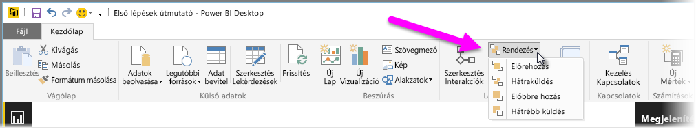

Ha sokféle elem található egy jelentésben, a Power BI lehetővé teszi az egyes elemek átfedési módjának kezelését. Az elemek rétegezése – vagyis azok egymás feletti réteges elhelyezése – gyakran mélységi sorrendként ismert.

A jelentésekben található mélységi sorrend kezeléséhez válasszon egy elemet, majd használja a menüszalag **kezdőlapjának** **Elrendezés** gombját a mélységi sorrend módosításához.

Az **Elrendezés** gombmenüben található beállításokkal tetszés szerint módosíthatja a jelentés elemeinek sorrendjét. A vizualizációt egy réteggel előre vagy hátra, illetve a mélységi sorrend legelejére vagy leghátuljára küldheti.

Az Elrendezés gomb különösen akkor hasznos, ha alakzatokat használ dekoratív háttérként vagy szegélyként, illetve egy egyéni diagram vagy gráf adott szakaszát emelné ki. Az elrendezési lehetőségeket háttér létrehozására is használhatja, mint például az alábbi képen a jelentés címének háttereként szolgáló világoskék téglalap.

