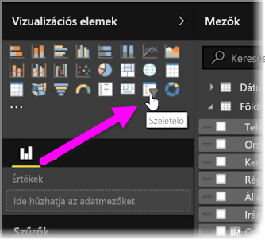
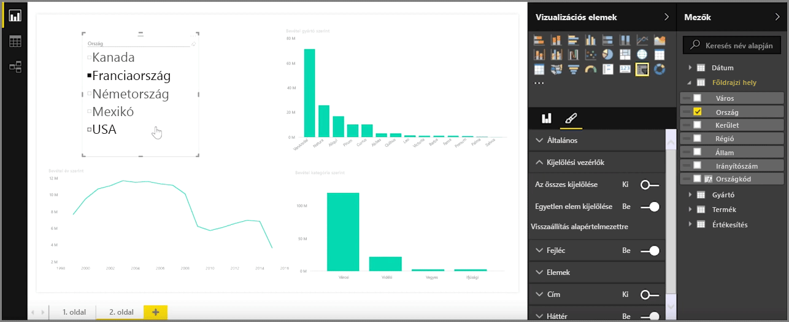
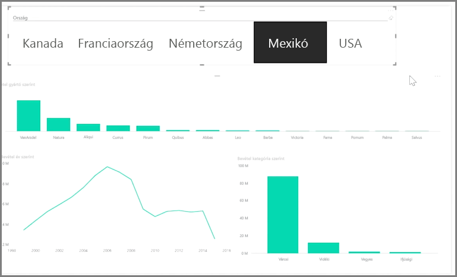

A szeletelő a megjelenítések leghatékonyabb típusai közé tartozik, különösen a részletes jelentések részeként. A **szeletelő** egy vásznon használható vizuális szűrő a **Power BI Desktop** alkalmazásban, amely lehetővé teszi a jelentést megtekintők számára az adatok szegmentálását adott érték szerint (például év vagy földrajzi hely).

A szeletelők jelentéshez való hozzáadásához válassza a **Vizualizációk** ablaktábla **Szeletelő** elemét.

Húzza át a szeleteléshez használandó mezőt a szeletelő helyőrzőjének tetejére. A vizualizáció jelölőnégyzeteket tartalmazó elemlistává változik. Ezekkel az elemekkel lehet szűrni – a szegmentáláshoz válassza ki az adott elem melletti jelölőnégyzetet, és a rendszer a jelentéslapon található összes vizualizációt szűri, vagyis *szeleteli* a megjelölt elem alapján.

Különböző lehetőségek állnak rendelkezésre a szeletelő formázásához. Beállíthatja több bemenet egyszerre történő használatára, vagy az **Egyetlen kiválasztás** mód bekapcsolásával egyszerre csak egy elemet lehet használni. Az **Összes kijelölése** beállítást is felveheti a szeletelői elemek közé – ez akkor hasznos, ha különösen hosszú listáról van szó. Ha módosítja a szeletelő elrendezését az alapértelmezett függőleges állapotról vízszintes állapotra, a jelölőnégyzeteket tartalmazó elemlista kijelölősávvá változik.

