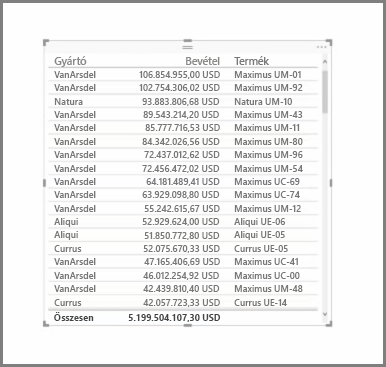
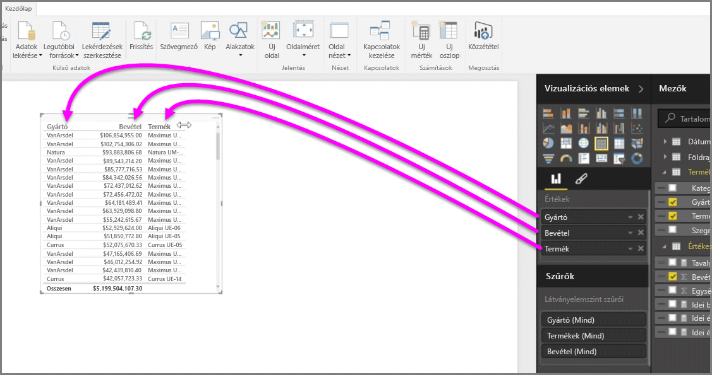
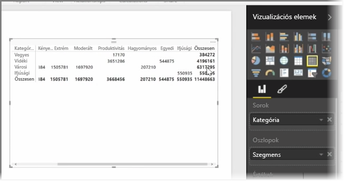

A nagyszámú diagramon túl a Power BI Desktop több táblázatos megjelenítést is támogat. Sőt, ha kijelöl egy kategorikus mezőt vagy szövegmezőt, és a jelentésvászonra húzza azt, alapértelmezés szerint egy táblázatban kapja vissza az eredményt. A táblázat felfelé és lefelé görgethető, és elemei kezdetben ábécésorrendben jelennek meg.

Ha egy táblázat számszerű adatokat tartalmaz, például a bevételt, a végösszeg annak alján jelenik meg. Manuálisan rendezhet az egyes oszlopok fejlécére kattintva, váltva a növekvő és csökkenő sorrend között. Ha egy oszlop nem elég széles ahhoz, hogy annak teljes tartalma kiférjen, a fejlécre kattintva és oldalra húzva megnövelheti azt.

A mezők táblázatbeli megjelenítési sorrendjét a **Vizualizációk** ablaktáblában, az *Értékek* a gyűjtőben látható mezősorrend határozza meg.

A **mátrixok** a táblázatokhoz hasonlók, de az oszlopokban és sorokban a különböző kategóriák fejlécei eltérők. Csakúgy, mint a táblázatoknál, a számszerű adatok automatikusan összesítve vannak a mátrix alján jobboldalt.

A mátrixokhoz számos megjelenítési beállítás érhető el, például automatikus oszlopméretezés, a sor- és oszlopösszegzések közötti váltás, színbeállítások és így tovább. Mátrix létrehozásakor győződjön meg arról, hogy a mátrix bal oldalán találhatók a kategorikus (nem számszerű) adatok, a jobb oldalán pedig a számszerű adatok, megjelenik a vízszintes görgetősáv, és a görgetési viselkedés megfelelően működik.

