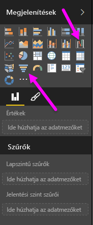
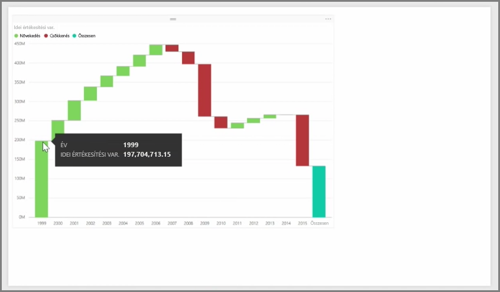
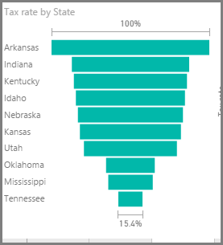

A vízesés- és a tölcsérdiagram két újabb izgalmas (és talán kevésbé ismert) standard vizualizációs elemnek számít, amely megtalálható a Power BI szolgáltatásban. Bármelyik típusú üres diagram létrehozásához válassza annak ikonját a **Vizualizációk** ablaktáblán.

A **vízesésdiagram** jellemzően egy adott érték változásait mutatja az idő függvényben.

Vízesések két gyűjtőbeállítással csak rendelkeznek: *Kategória* és *Y tengely*. Húzza át az időalapú mezőt (például *év*) a *Kategória* gyűjtőjébe, valamint a követendő értéket az *Y tengely* gyűjtőjébe. A rendszer a növekvő értéket tartalmazó időszakokat alapértelmezés szerint zöld színnel, míg a csökkenő értéket tartalmazó időszakokat piros színnel jelöli.

A **tölcsérdiagramok** jellemzően adott folyamatbeli változások megjelenítésére szolgálnak, például értékesítési adatcsatorna vagy webhelyek felhasználómegtartása.

A **vízesés** és a **tölcsér** típusú diagramokat egyaránt lehet szeletelni és vizuálisan személyre szabni.

