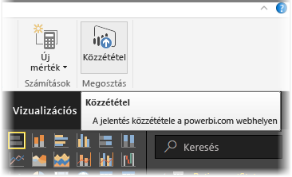
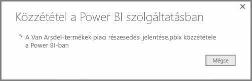
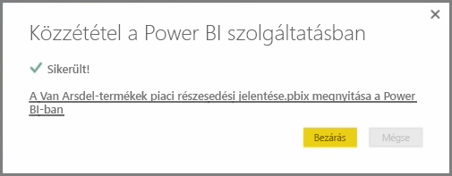
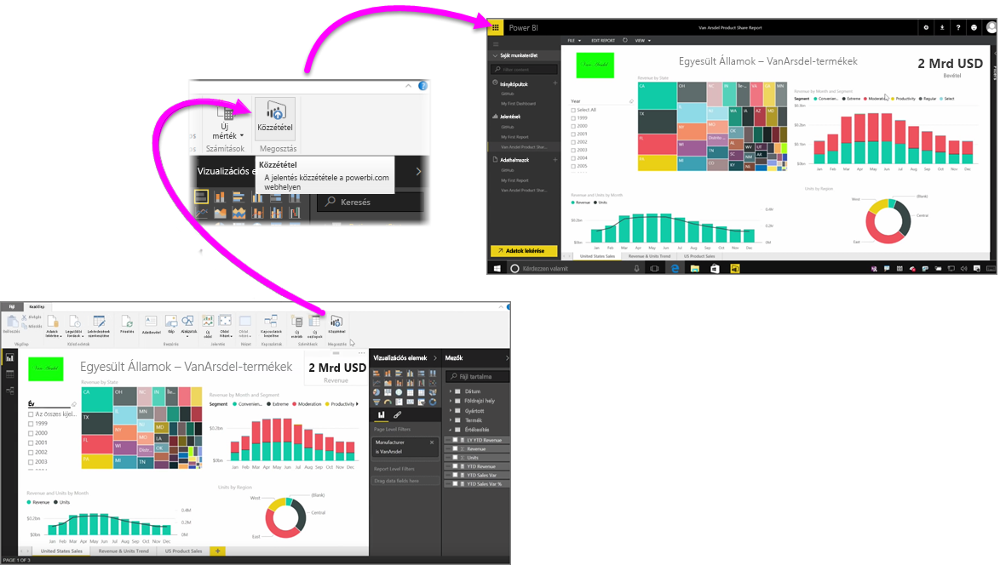

Gyorsan és egyszerűen közzéteheti jelentéseit a Power BI szolgáltatásba.

Miután végzett a jelentés készítésével a **Power BI Desktop** alkalmazásban, válassza a Power BI Desktop **Kezdőlapján** a **Közzététel** gombot a folyamat indításához.

A rendszer becsomagolja jelentését és adatait, beleértve a vizualizációkat, lekérdezéseket és egyéni mértékeket is, majd feltölti a Power BI szolgáltatásba.

> [!NOTE]
> A Power BI Desktop jelentéseire **.pbix**-fájlként is szokás hivatkozni, ugyanis a Windowsban ezt a fájlkiterjesztést kapják.
> 

Ha befejeződött a feltöltés, egy párbeszédpanel tájékoztatja, hogy a közzétételi folyamat sikeres volt, és megjelenít egy hivatkozást, amellyel közvetlenül elérheti a jelentést a Power BI szolgáltatásban egy webböngésző használatával.

Ennyi az egész – Ilyen egyszerűen közzéteheti a Power BI Desktopban létrehozott jelentéseit a Power BI szolgáltatásba.

