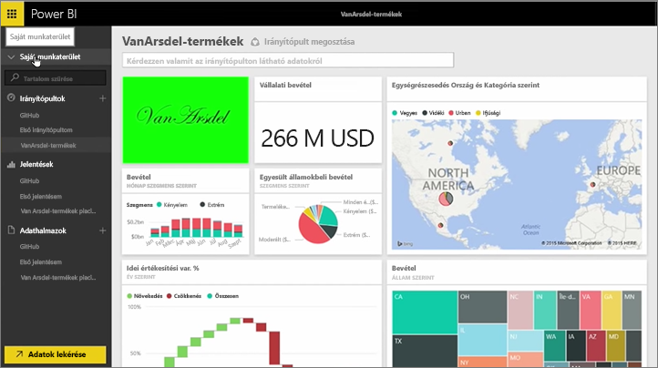
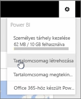
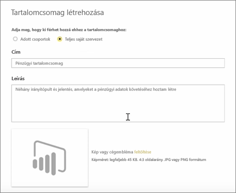
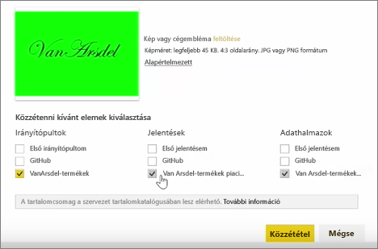
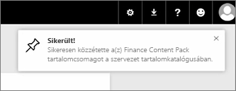

Ebben e leckében egy *tartalomcsomagot* fogunk létrehozni a Power BI-ban már meglévő összetevőkkel, majd pedig megosztjuk a munkatársakkal. 

A **Saját munkaterület** részen található egy irányítópult, az alatta lévő jelentés, és az adatkészlet. Ezeket szeretném a munkatársaimmal egy csomagként megosztani, hogy újra felhasználhassák.

Ha kiválasztom a **beállítások** ikon (a jobb felső sarkában a szolgáltatás található fogaskerék), látható, hogy mennyi tárhelyet használtam fel, és létre tudok hozni egy alkalmazást (korábbi nevén tartalomcsomagok).

A megjelenő párbeszédpanelen kiválaszthatom, hogy az adott személyek vagy adott csoportok között szeretném-e elosztani, és címet is adhatok a csomagnak. Azt is, célszerű a részletes leírást adhat a **leírás** mezőben, hogy személyek alkalmazás tudni, hogy mit tartalmaz, vagy hogy mire használható.

A párbeszédpanel alján hogy értékelhessék az alkalmazást, majd a legfontosabb lépés egy képet van: Kiválasztom az irányítópultot, szeretném felvenni az alkalmazásba, és ha így tesz, I Power bi-ban az irányítópult automatikusan kiválasztja-e a jelentés és adatkészlet használt. Nem távolíthatom a jelentés vagy adatkészlet, mert az irányítópult szeretném felvenni az alkalmazásba megköveteli őket.

Kiválaszthatnék más irányítópultokat, jelentéseket és adatkészleteket is, de most nem teszem.

Amikor közzéteszem az alkalmazás bekerül a szervezet tartalomkatalógusában.

Most pedig lássuk a következő leckét!

