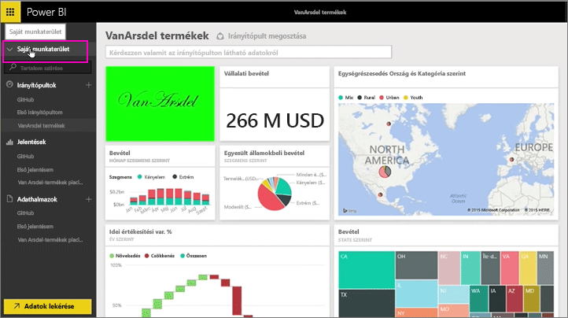
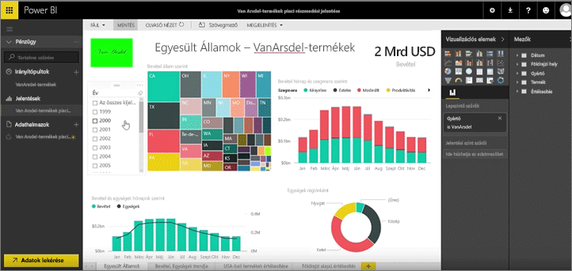

Az eddigi leckékben már létrehozott egy tartalomcsomagot és egy csoportot. Ebben a leckében a tartalomcsomag egy példányát fogja létrehozni a csoport összes tagja számára.

A kiindulópont a Saját munkaterület, ...

... ahonnan visszatér a korábbi leckében létrehozott Üzleti csoporthoz.

A csoportnak egyelőre nincsenek irányítópultjai, jelentései és adatkészletei. Szeretnék használni létrehozott alkalmazást exportálhatom. Alkalmazások tudom tallózni a saját cégünktől külső szolgáltatásokból.

Az egy perce létrehozott alkalmazás található. Látszik, hogy fontos beszédes címet, leírást és képet adni hozzá, hogy az emberek rátaláljanak. Következhet a csatlakozás.

A Power BI importálja az irányítópultokat, jelentéseket és adatkészleteket, amelyek az alkalmazásban.

Az adatkészlet kijelölésekor a Power BI rákérdez az alkalmazás személyre szabásához.

Az alkalmazást, amelyet I módosíthatja a másolatának elkészítése vagyok, és leválasztása a az alkalmazás közzétett verziójának. Ha az alkalmazás létrehozója módosítja a közzétett verzióra, automatikusan nem jelenik meg ezeket a frissítéseket.

Így viszont szerkeszthető az irányítópult, a jelentés és igény esetén akár az adatkészlet is.

Ezért alkalmazás módon egy egyszerű a szervezet más tagjai által létrehozott tartalom újrafelhasználása.

Most pedig lássuk a következő leckét!

