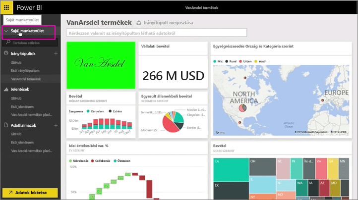
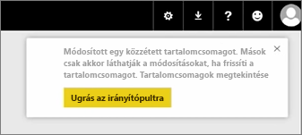
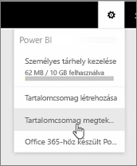
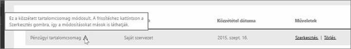

Ebben a leckében azt a korábban létrehozott eredeti alkalmazás szerkesztése következik, és tekintse meg, hogyan, amely frissíti azokat, akik csatlakoztak hozzá.

Az eredeti irányítópult szerkesztése a Saját munkaterületen történik.

Az irányítópulton bármilyen változás meg arról, jelenik meg ezt az emlékeztetőt, hogy megváltozott valami, amely meg van osztva más alkalmazásokban, és kéri, hogy frissíteni kell a megosztott változatot.

I lépjen vissza a beállítások ikonra, és válassza ki **alkalmazás megtekintése** , tekintse meg a korábban közzétett alkalmazásokat.

Az alkalmazás saját készítésű látható. A kis ikon jelzi, hogy megváltozott valami, az alkalmazásban, és van szükség az alkalmazás szerkesztését, így mások is láthatják a módosításokat.

A **Szerkesztés** lehetőség visszavisz arra a képernyőre, ahol a cím és a leírás szerkeszthető, ezúttal azonban egy **Frissítés** gomb is van rajta. Erre kell kattintani.

A Power BI alkalmazza a módosításokat, és közzéteszi a frissített alkalmazást az alkalmazáskatalógusban.

Bárki, aki csatlakozott alkalmazásomnak beolvasása egy üzenet, amely az alkalmazás megváltozott, és választhat, fogadja el a módosításokat, vagy hagyja a korábbi verziót.

Kezelheti az alkalmazás tulajdonosa, így a munkatársai által használt verziók.

