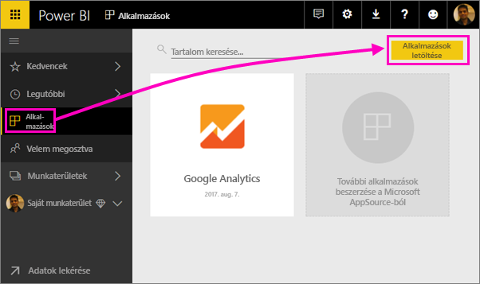
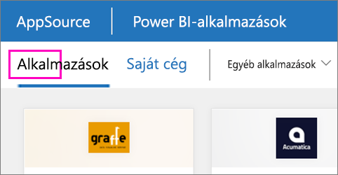

1. A bal oldali navigációs panelen válassza az **Alkalmazások** elemet, majd a jobb felső sarokban az **Alkalmazások letöltése** lehetőséget.
   
     
2. Az AppSource-ban válassza az **Alkalmazások** lapot, és keresse meg a kívánt szolgáltatást.
   
    

