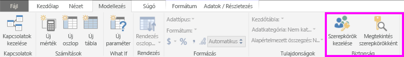
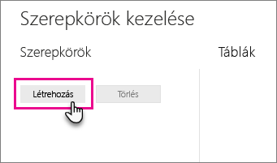
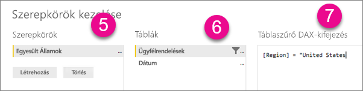
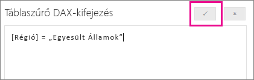

## <a name="define-roles-and-rules-in-power-bi-desktop"></a>Szerepkörök és szabályok definiálása a Power BI Desktopban
A Power BI Desktopban meghatározhat szerepköröket és szabályokat. Amikor közzéteszi a tartalmakat a Power BI-ban, a szerepkör-definíciók is közzé lesznek téve.

Biztonsági szerepkörök definiálásához kövesse az alábbi lépéseket.

1. Importálhatja az adatokat a Power BI Desktop-jelentésbe, vagy konfigurálhat egy DirectQuery-kapcsolatot.
   
   > [!NOTE]
   > A Power BI Desktopon belül nem definiálhat szerepköröket az Analysis Services élő kapcsolataihoz. Ezt az Analysis Services-modellben kell megtennie.
   > 
   > 
2. A **Modellezés** lapon válassza a **Szerepkörök kezelése** lehetőséget.
   
   
3. A **Szerepkörök kezelése** ablakban válassza a **Létrehozás** lehetőséget.
   
   
4. A **Szerepkörök** alatt adja meg a szerepkör nevét. 
5. A **Táblák** alatt válassza ki azt a táblát, amelyre alkalmazni kívánja a DAX-szabályt.
6. A **Táblaszűrő DAX-kifejezés** mezőjébe írja be a DAX-kifejezéseket. Ez a kifejezés igaz vagy hamis értéket ad vissza. Például: ```[Entity ID] = “Value”```.
      
   

   > [!NOTE]
   > A kifejezésben használhatja a *username()* függvényt. Ne feledje, hogy a Power BI Desktopban a *username()* a *TARTOMÁNY\felhasználónév* formátumot követi. A Power BI szolgáltatásban és a Power BI jelentéskészítő kiszolgálóban a felhasználó felhasználói nevének (UPN) formátumában van. Használhatja a *userprincipalname()* függvényt is, amely a felhasználót minden esetben az egyszerű felhasználónevével adja vissza: *felhasználónév\@contoso.com*.
   > 
   > 

7. Miután létrehozta a DAX-kifejezést, a Kifejezés mező fölötti pipára kattintva ellenőrizheti azt.
      
   
   
   > [!NOTE]
   > Ebben a kifejezésmezőben akkor is vesszőkkel kell elválasztania a DAX-függvény argumentumait, ha a területi beállítás (például francia vagy német) egyébként pontosvesszőt használ elválasztóként. 
   >
   >
   
8. Kattintson a **Mentés** gombra.

A Power BI Desktopban nem rendelhet felhasználókat a szerepkörökhöz. Ezt a Power BI szolgáltatásban teheti meg. A dinamikus biztonság engedélyezéséhez használja a Power BI Desktopban a *username()* vagy a *userprincipalname()* DAX-függvényt, és konfigurálja a megfelelő kapcsolatokat. 

