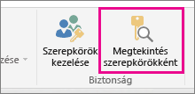
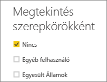
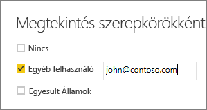

## Szerepkörök érvényesítése a Power BI Desktopban
A szerepkör létrehozása után tesztelheti a szerepkör hatásait a Power BI Desktopban.

1. Válassza a **Megtekintés szerepkörökként** lehetőséget. 

    

    A **Megtekintés szerepkörökként** alatt megjelennek a létrehozott szerepkörök.

    

3. A szerepkör alkalmazásához válassza ki a létrehozott szerepkört > **OK**. A jelentés csak a szerepkör számára releváns adatot jeleníti meg. 

4. Az **Egyéb felhasználó** beállítással egy adott felhasználót is kiválaszthat. Az egyszerű felhasználónevet (UPN) érdemes megadni, mivel a Power BI szolgáltatás és a Power BI jelentéskészítő kiszolgáló azt használja.

    

1. Kattintson az **OK** gombra, és a jelentések csak a felhasználó számára elérhető adatokat fogják megjeleníteni. 

A Power BI Desktopban a **Más felhasználók** alatt csak akkor fognak megjelenni különböző eredmények, ha DAX-kifejezéseken alapuló dinamikus biztonsági megoldást alkalmaz. 

