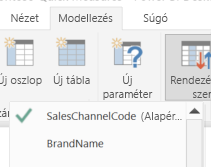

# Ajánlott eljárások a Q&A optimalizálásához a Power BI-ban
Hatékony eszköz a munkához, ha gyakori kifejezéseken és természetes nyelven alapuló kérdéseket tud feltenni az adataival kapcsolatban. És még hatékonyabb, ha a maguk az adatok válaszolnak, ahogy azt a Power BI Q&A szolgáltatásában teszik.

Annak érdekében, hogy a Q&A sikeresen értelmezni tudja azt a nagyszámú kérdést, amelynek a megválaszolására képes, feltételezéseket kell tennie a modellről. Ha a modell struktúrája ezen feltételezések közül egynek vagy többnek nem felel meg, akkor módosítania kell a modellt. A Q&A használatához elvégzendő módosítások olyan általános optimalizálási elveket követnek, amelyeket minden Power BI-modellen érdemes elvégeznie, függetlenül attól, hogy használja-e a Q&A szolgáltatást.

Az alábbi szakaszokból megtudhatja, hogyan módosíthatja a modelljét annak érdekében, hogy azt hatékonyan tudja használni a Power BI Q&A szolgáltatása.

## A Q&A által végzett automatikus módosítások

### Mértéktáblák

A Q&A korábbi verzióiban a mértéktáblák összezavarták a Q&A-t, mert az alaptábla le van választva. A Q&A most már teljesen jól működik mértéktáblákkal.

### Oszlopnevekkel ütköző táblanevek

A Q&A korábbi verzióiban, ha egy tábla és egy oszlop neve megegyezett, a tábla élvezett elsőbbséget. Ezt a problémát megoldottuk, így többé nem kell javítania a problémát a modellekben.

## Manuális lépések a Q&A javítására

### Az új Q&A-eszközök használata a kérdések javításához

A Q&A-eszközökkel megtaníthatja az alapvető üzleti kifejezéseket a Q&A-nek, és javíthatja a végfelhasználók által feltett kérdéseket. Előfordulhat, hogy bizonyos kérdésekre így sem lehet választ adni, mert az adatformátum helytelen, vagy adatok hiányoznak. Ebben az esetben olvassa el a további lenti szakaszokat az optimalizálás elősegítéséhez. További információ a [Q&A-eszközökről](q-and-a-tooling-intro.md).

## Hiányzó kapcsolatok hozzáadása

Ha a modellből hiányoznak táblák közötti kapcsolatok, akkor sem a Power BI-jelentések, sem pedig a Q&A szolgáltatás nem tudja kikövetkeztetni a vonatkozó táblák összekapcsolásának módját. A kapcsolatok a megfelelő modellek legfontosabb elemei. Nem tehet fel például kérdést egy adott városban lévő ügyfelek összes értékesítéséről, ha hiányzik a *rendelések* tábla és az *ügyfelek* tábla közötti kapcsolat. Az alábbi képeken láthat egy olyan modellt, amely módosítást igényel, valamint egy olyan modellt, amely készen áll a Q&A szolgáltatással való használatra. 

**Módosítást igényel**

Az első képen nincsenek kapcsolatok az Ügyfelek, az Értékesítések és a Termékek tábla között.

**Készen áll a Q&A használatára**

Az első képen vannak definiálva kapcsolatok a táblák között.

## Táblák és oszlopok átnevezése

A táblák és oszlopok neveinek megválasztása lényeges a Q&A használatához. Tegyük fel például, hogy egy *CustomerSummary* (Ügyfélösszegzés) nevű tábla az ügyfelei listáját tartalmazza. Ekkor például a „List the customer summaries in Chicago” (Listázd ki a chicagói ügyfélösszegzéseket) kérdést kell feltennie a „List the customers in Chicago” (Listázd ki a chicagói ügyfeleket) helyett. 

Míg a Q&A képes például szavakra felosztani az elnevezéseket, illetve észlelni a többes számot, a Q&A feltételezi, hogy a táblák és az oszlopok neve pontosan tükrözi a tartalmukat.

Lássunk egy újabb példát. Tegyük fel, hogy egy *Headcount* (Létszám) nevű tábla vezeték- és keresztneveket, valamint alkalmazotti azonosítókat tartalmaz. Egy másik, *Employees* (Alkalmazottak) nevű tábla alkalmazott-azonosítókat, feladatazonosítókat és kezdési dátumokat tartalmaz. Ez a struktúra érthető lehet a modellt ismerő személyek számára. Mások azonban feltehetik a „count the employees” (számold meg az alkalmazottakat) kérdést, és az „Employees” tábla sorainak számát kapják válaszul. Bizonyára nem ezt az eredményt várják, hiszen ez az összes alkalmazott összes feladatának darabszáma. Érdemesebb volna a tábláknak olyan nevet adni, amely valóban tükrözi a tartalmukat.

**Módosítást igényel**

Módosítást igényelnek az olyan táblanevek, mint például a *StoreInfo* (Áruházadatok) és a *Product List* (Terméklista).

**Készen áll a Q&A használatára**

A *Store* (Áruház) és a *Termékek* nevű táblák már jobban használhatók.

## Helytelen adattípusok javítása

Az importált adatokhoz helytelen adattípus lehet beállítva. A Q&A a *sztringként* importált *dátum* és *szám* típusú oszlopokat például nem dátumként, illetve számként értelmezi. Ügyeljen rá, hogy a megfelelő adattípust válassza a Power BI-modellben.

## Az évet és az azonosítót tartalmazó oszlopoknál állítsa be az „Összegzés mellőzése” lehetőséget

A Power BI alapértelmezés szerint agresszíven aggregálja a numerikus oszlopokat, ezért néha előfordulhat például, hogy az olyan kérdések esetében, mint például az „összes értékesítés évenként”, az értékesítés végösszegét és az évek végösszegét kapja meg válaszként. Ha meghatározott oszlopok esetében nem szeretné, hogy a Power BI hasonlóan járjon el, állítsa az oszlop **Alapértelmezett összegzés** tulajdonságát az **Összegzés mellőzése** értékre. Fordítson különös figyelmet az **évet**, **hónapot**, **napot** és **azonosítót** tartalmazó oszlopokra, mivel ezek okozzák a legtöbb problémát. Más, összegzésre alkalmatlan oszlopoknál, mint például az *életkor*, szintén célszerű lehet az **Alapértelmezett összegzés** tulajdonságot az **Összegzés mellőzése** vagy az **Átlag** értékre állítani. Ezt a beállítást a **Modellezés** lapon találhatja meg.

## Adatkategória választása a dátumot és földrajzi helyet tartalmazó oszlopokhoz

Az **Adatkategória** beállítással az adattípuson kívül további szemantikai információt is megadhat az oszlopok tartalmával kapcsolatban. Egy egész szám típusú oszlopot megjelölhet például irányítószámként, egy sztring típusú oszlopot pedig Városként, Országként/régióként vagy másként. Ezt az információt a Q&A két lényeges módon használja fel: A vizualizációk kiválasztására, és nyelvi beállításokhoz.

Egyrészt a Q&A az **Adatkategória** információit figyelembe veszi annak megállapításánál, hogy milyen típusú vizualizációt kell használnia. Felismeri például, hogy azok az oszlopok, amelyeknél az **Adatkategória** dátum vagy idő, jellemzően jól alkalmazhatók vonaldiagramok vízszintes tengelyeként, illetve buborékdiagramok lejátszási tengelyeként. Emellett azt is feltételezi, hogy ha egy oszlop **Adatkategóriája** földrajzi, akkor az azt tartalmazó eredmény jól mutathat térképen megjelenítve.

Másrészt a Q&A tesz néhány feltételezést azzal kapcsolatban, hogy a felhasználók vélhetően milyen módon említik a dátumokat és a földrajzi helyeket tartalmazó oszlopokat, ezzel segítve bizonyos típusú kérdések megértését. Ha például a „mikor” szót használja egy alkalmazott felvételéről szóló kérdésben, akkor azt szinte biztosan egy dátumoszlopként azonosítja a szolgáltatás, míg az „ügyfelek száma Hatvanban” lekérdezésben a „Hatvan” szót valószínűleg a várossal azonosítja, nem pedig a számmal.

## „Rendezés más oszlop alapján” tulajdonság választása a kapcsolódó oszlopokban

A **Rendezés más oszlop alapján** tulajdonság lehetővé teszi, hogy egy oszlopot automatikusan egy másik oszlop szerint rendezzen. Ha például az ügyfelek pólóméret szerinti rendezését kéri, akkor a Pólóméret oszlopot valószínűleg az alapul szolgáló méretszám szerint szeretné rendezni (XS, S, M, L és XL), nem pedig betűrend szerint (L, M, S, XL, XS).

## A modell normalizálása

Ne aggódjon, nem fogjuk azt javasolni, hogy alakítsa át a teljes modellt. Egyes struktúrák azonban annyira bonyolultak, hogy a Q&A nem jól kezeli őket. Ha elvégez némi alapvető normalizálást a modell szerkezetén, a Power BI-jelentések felhasználhatósága jelentősen megnő, csakúgy mint a Q&A-eredmények pontossága.

Tartsa be a következő általános szabályt: Minden egyedi „dolognak”, amelyet a felhasználó megemlít, pontosan egyetlen modellbeli objektumnak (táblának vagy oszlopnak) kell megfelelnie. Tehát ha a felhasználók ügyfeleket említenek, akkor egyetlen *ügyfél* objektumnak kell szerepelnie a modellben. Ha pedig a felhasználók értékesítéseket említenek, akkor egyetlen *értékesítés* objektumnak kell szerepelnie. Egyszerűen hangzik, igaz? Az adatok kezdeti elrendezésétől függően valóban az lehet. Ha szüksége van rá, a **Lekérdezésszerkesztőben** rengeteg adatalakítási képességet elérhet, míg az egyszerűbb átalakítások közül sok elvégezhető egyszerűen a Power BI-modellben végzett számításokkal.

Az alábbi szakaszokban ismertetünk néhány olyan gyakori átalakítást, amelyet elképzelhető, hogy végre kell hajtania.

### Új táblák létrehozása a többoszlopos entitásokhoz

Ha több oszlop egyetlen különálló egységet jelképez egy nagyobb táblán belül, akkor ezeket az oszlopokat javasolt különválasztania egy önálló táblába. Tegyük fel például, hogy a *Companies* (Vállalatok) táblában van egy Contact Name (Kapcsolattartó neve), egy Contact Title (Kapcsolattartó beosztása) és egy Contact Phone (Kapcsolattartó telefonszáma) oszlop. Jobb megoldás volna külön egy *Contacts* (Kapcsolattartók) táblában tárolni a neveket, beosztásokat és telefonszámokat, valamint a *Companies* táblára mutató hivatkozásokat. Ha így tesz, azzal megkönnyíti a felhasználók számára, hogy olyan kérdéseket tegyenek fel a kapcsolattartókra vonatkozóan, amelyek függetlenek azoktól a cégektől, melyeknek a kapcsolattartói, illetve a megjelenítést is rugalmasabbá teszi.

**Módosítást igényel**

**Készen áll a Q&A használatára**

### Adatok elforgatása a tulajdonságcsomagok megszüntetéséhez

Ha a modellben *tulajdonságcsomagok* találhatók, azokat át kell strukturálni tulajdonságonként egyetlen oszlop használatára. A tulajdonságcsomagok, még ha kényelmes módot is nyújtanak nagyszámú tulajdonság kezeléséhez, természetüknél fogva számos olyan korlátozást tartalmaznak, amelyek megkerülésére sem a Power BI-jelentések, sem a Q&A nincs felkészítve.

Tegyük fel például, hogy van egy *Ügyféldemográfia* nevű tábla egy Ügyfélazonosító, egy Tulajdonság és egy Érték oszloppal, melyben az egyes sorok az ügyfél különböző tulajdonságait tartalmazzák (például életkor, családi állapot, város és így tovább). Ez esetben az Érték oszlop jelentését túlterheli a Tulajdonság oszlop tartalma, és ez ellehetetleníti a Q&A számára az ezen adatokra vonatkozó legtöbb kérdés értelmezését. Még így is működhetnek az egyszerű kérdések, például ha az egyes ügyfelek életkorának megjelenítését kéri, mert ez a kérdés értelmezhető a következőként: „mutasd meg az ügyfeleket és az ügyfelek demográfiai adatait, ahol a tulajdonság az életkor”. Ez a modellstruktúra azonban nem teszi lehetővé a kissé összetettebb kérdések megválaszolását, ideértve például, ha egy adott városban lévő ügyfelek átlagos életkorára kíváncsi. A Power BI-jelentésekkel közvetlenül dolgozó felhasználók időnként találhatnak ötletes módszereket a keresett adatok elérésére, de a Q&A általánosságban csak akkor működik megfelelően, ha az egyes oszlopoknak egyetlen jelentése van.

**Módosítást igényel**

**Készen áll a Q&A használatára**

### Particionálás megszüntetése egyesítéssel

Ha az adatait több táblára particionálta, vagy ha elforgatta több oszlop értékeit, akkor a felhasználók számos gyakori műveletet nehezen vagy egyáltalán nem tudnak végrehajtani. Vegyük példaként a táblák particionálásának egy gyakori módját: az *Értékesítések2000-2010* táblát és az *Értékesítések2011-2020* táblát. Ha az összes lényeges jelentés egy adott évtizedre korlátozódik, akkor valószínűleg meghagyhatja ezt a struktúrát a Power BI-jelentésekhez. A Q&A rugalmassága miatt azonban a felhasználók megfelelő választ várnak az „összes értékesítés évenként” típusú kérdésekre. Ahhoz, hogy ez a lekérdezés működjön, egyetlen táblában kell egyesítenie az adatokat a Power BI-modellben.

Hasonlóképpen vegyük egy átlagos elforgatott értékoszlop esetét: ilyen a *Könyvturné* tábla, mely a Szerző, a Könyv, illetve a Város1, a Város2 és a Város3 oszlopot tartalmazza. Ilyen struktúra esetén még a „könyvek száma városonként” típusú egyszerű kérdések sem értelmezhetők helyesen. Hogy a lekérdezés működhessen, hozzon létre egy különálló *BookTourCities* (KönyvTurnéVáros) táblát, mely a városok értékeit egyetlen oszlopban egyesíti.

**Módosítást igényel**

**Készen áll a Q&A használatára**

### Formázott oszlopok felosztása

Ha az adatokat olyan forrásból importálja, amely formázott oszlopokat tartalmaz, a Power BI-jelentések (és a Q&A) nem tudják elérni az oszlopok tartalmát annak elemzéséhez. Ha tehát van például egy **Full Address** (Teljes cím) nevű oszlop, mely tartalmazza a címet, a várost és az országot, akkor javasolt ezt felosztani egy Cím, egy Város és egy Ország oszlopra, hogy a felhasználók ezeket külön-külön is lekérdezhessék.

**Módosítást igényel**

**Készen áll a Q&A használatára**

Hasonló módon, ha a személyek nevéhez egy teljes nevet tartalmazó oszlopot használ, adja hozzá az **Utónév** és a **Vezetéknév** oszlopot is arra az esetre, ha egy felhasználó a nevek egy részéről szeretne kérdéseket feltenni. 

### Új táblák létrehozása a többértékes oszlopokhoz

A fentiekhez hasonlóan, ha az adatokat olyan forrásból importálja, amely többértékes oszlopokat tartalmaz, a Power BI-jelentések (és a Q&A) nem tudják elérni az oszlopok tartalmát annak elemzéséhez. Ha például van egy Zeneszerző nevű oszlop, amely egy zeneszám több zeneszerzőjének nevét is tartalmazza, akkor azt fel kell osztania több oszlopra egy különálló *Zeneszerzők* táblában.

**Módosítást igényel**

**Készen áll a Q&A használatára**

### Inaktív kapcsolatok megszüntetése denormalizálással

Az az egyetlen kivétel azon szabály alól, hogy „normalizálni jobb”, amikor egynél több úton is el lehet jutni egyik táblából egy másikba. Tegyük fel például, hogy van egy *Flights* (Repülőjáratok) nevű táblája, mely a SourceCityID (IndulóVárosAzonosítója) és a DestinationCityID (CélvárosAzonosítója) oszlopot egyaránt tartalmazza, és mindkettő a *Cities* (Városok) táblához kapcsolódik. Ilyen esetben ezen kapcsolatok egyikét meg kell jelölnie inaktívként. Mivel a Q&A csak az aktív kapcsolatokat tudja használni, nem tud kérdéseket feltenni vagy az induló városról, vagy pedig a célvárosról, attól függően, hogy melyik kapcsolatát inaktiválja. Ha ehelyett denormalizálja a városnevek oszlopait a *Flights* táblában, akkor tud olyan kérdéseket feltenni, amelyek mind az induló városra, mind pedig a célvárosra utalnak.

**Módosítást igényel**

**Készen áll a Q&A használatára**

### Szinonimák hozzáadása a táblákhoz és az oszlopokhoz

Ez a lépés kifejezetten a Q&A szolgáltatásra vonatkozik (és általánosságban nem szükséges a Power BI-jelentésekhez). A felhasználók gyakran többféleképpen utalnak ugyanarra a dologra. Ilyen például az összes értékesítés, a nettó értékesítés és a teljes nettó értékesítés. Ezeket a szinonimákat hozzáadhatja a Power BI-modell tábláihoz és oszlopaihoz. 

Ez a lépés lényeges lehet. Még ha egyszerű táblaneveket és oszlopneveket is használ, a Q&A szolgáltatásban kérdéseket feltevő felhasználók a számukra logikus szavakat fogják használni. Nem az oszlopok előre megadott listájából választanak. Minél több hasznos szinonimát ad hozzá, annál jobb a felhasználók élménye a jelentés használatakor. Szinonimák hozzáadásához a Power BI Desktopban nyissa meg a Modell nézetet, válassza a Modellezés fület, majd válasszon ki egy mezőt vagy egy táblát. A Tulajdonságok panelen megjelenik a **Szinonimák** mező, amelyben szinonimákat adhat hozzá.

 Legyen körültekintő, amikor szinonimákat ad hozzá. Ha több oszlophoz vagy táblához is hozzáadja ugyanazt a szinonimát, az kétértelműséghez vezet. A Q&A a környezeti adatok felhasználásával megpróbálja a helyes szinonimát választani kétértelműség esetén, de nem mindig áll rendelkezésre elegendő környezeti adat. Ha például egy felhasználó az ügyfelek számáról érdeklődik, és a modelljében három dologhoz is hozzáadta az „ügyfél” szinonimát, akkor elképzelhető, hogy a felhasználó nem a keresett választ fogja kapni. Ilyen esetben mindenképp ügyeljen arra, hogy egyedi elsődleges szinonimát adjon meg, mivel ez a szinonima jelenik meg, amikor a rendszer megjeleníti a kérdést átfogalmazva. Ez segíthet a felhasználóknak észrevenni a kétértelműséget (például ha az átfogalmazás az „archivált ügyfélrekordokat” említi), mely jelezheti számukra, hogy érdemes lehet másként feltenni a kérdést.
